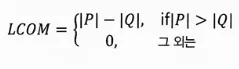
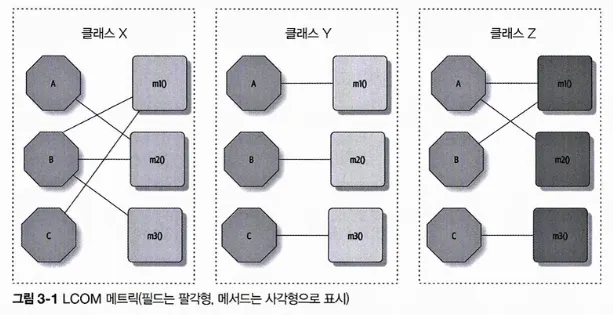
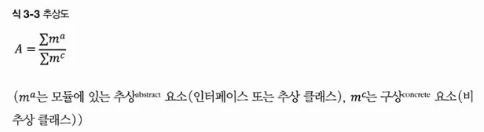
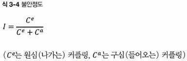
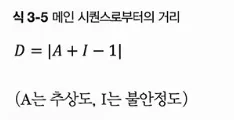
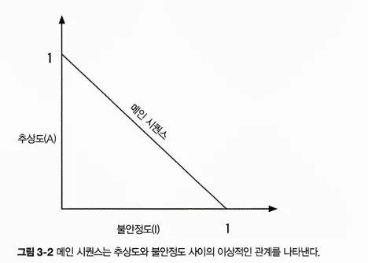
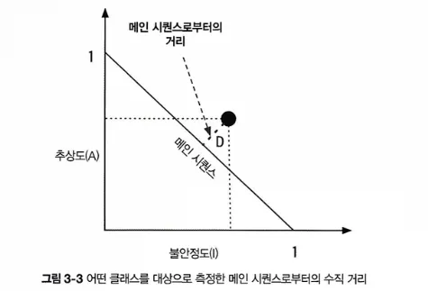
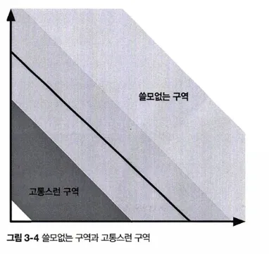
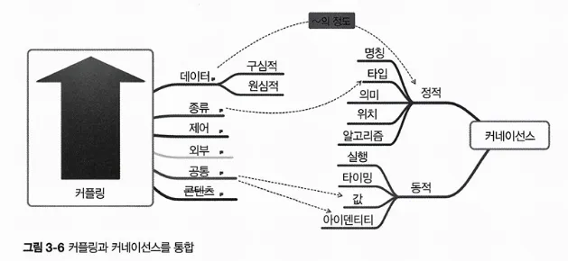

# CHAPTER 3 모듈성

> 모듈성은 사실 재대로 정의하기 쉽지 않은 개념임
> 이 책에서 나름대로 정의를 내려보자
> 모듈성은 일종의 구성 원리임.
> 모듈성을 잘 유지하는 건 우리가 암묵적 아키텍처 특성이라고 정의한 것의 좋은 예가 됨

## 3.1 정의

> 모듈: (사전 정의)
> 복잡한 구조를 만드는 데 쓰이는 각각의 표준화한 부품이나 독립적인 단위

- 모듈성을 이용해 객체 지향 언어의 클래스나 함수형 언어의 함수가 될 만한 서로 연관된 코드를 논리적으로 묶음.
- 프로그래밍 언어는 대부분 모듈성 케커니즘을 제공함. 개발자는 보통 연관된 코드를 함께 묶는 수단으로 모듈을 사용함
  - 아키텍트는 개발자가 코드를 어떻게 패키징하는지 반드시 알아야함. 아키텍처에 중요한 영향을 미치기 때문
  - 여러 패키지가 서로 단단히 커플링되어 있으면 그 중 하나를 다른 작업에 재사용하기가 아주 어려워짐
- 아키텍처를 논할 때 클래스, 함수처럼 코드를 묶어 놓은 덩어리를 모듈성이라는 일반 용어로 나타냄
  - 이는 논리적인 구분. 물리적인 구분 아님.

## 3.2 모듈성 측정

모듈성을 이해할 도구가 필요함

### 3.2.1 응집

: 한 모듈의 파트(구성 요소)가 동일한 모듈 안에 얼마나 포함되어 있는지를 나타냄.
즉, 모듈을 구성하는 파트가 서로 얼마나 연관되어 있는가, 하는 것.

> 응집된 모듈을 나누려고 해봐야 더 커플링되고 가독성은 떨어진다.

**응집도의 측정 범위 (좋은 것~ 나쁜 것 순)**

1. 기능적 응집 : 모듈의 각 파트는 다른 파트와 연관되어 있고 기능상 꼭 필요한 모든 것이 모듈에 들어있음. 모듈 내의 모든 요소들이 **단일 기능을 수행**
2. 순차적 응집: 두 모듈이, **한쪽이 데이터를 출력하면 다른 한쪽이 그것을 입력 받는** 형태로 상호작용함
3. 소통적 응집(교환적 응집): 두 모듈이, 각자 정보에 따라 작동하고(거나) 어떤 출력을 내는 형태로 통신 체인을 형성합니다. 예를 들면, 데이터베이스에 레코드를 추가하면 그 정보에 따라 이메일이 만들어지는 식.
   **모듈 내의 요소들이 동일한 입출력 자료로 서로 다른 기능을 수행**
4. 절차적 응집: 두 모듈은 정해진 **순서대로 실행**되어야 함.
5. 일시적 응집(시간적 응집): 모듈은 시점 의존성에 따라 연관됨. **특정 시간에 실행되는 기능들을 모아 작성된 모듈.**
   예를 들어, 많은 시스템들이 시동할 때 그다지 관련이 없어 보이는 것들을 죽 초기화하는 경우가 많은데, 이런 작업들이 일시적으로 응집됐다고 할 수 있음
6. 논리적 응집: 모듈의 내부 데이터는 기능적이 아니라, 논리적으로 연관되어 있음. 서로 연관된 작업들이지만 하는 일이 전혀 다름
7. 동시적 응집(우연적 응집): 같은 소스 파일에 모듈 구성 요소가 들어 있지만 그 외에는 아무 연관성도 없음. 가장 좋지 않은 형태의 응집. **서로 관련 없는 요소로만 구성**

- 응집은 커플링보다는 덜 정확한 메트릭이므로 아키텍트 재량에 따라 측정된 모듈의 응집도는 다름
- 예시 모듈

  1. 고객 관리
     - 고객 추가
     - 고객 수정
     - 고객 조회
     - 고객 알림
     - **고객 주문 조회**
     - **고객 주문 취소**
       or
  1. 고객 관리
     - 고객 추가
     - 고객 수정
     - 고객 조회
     - 고객 알림
  1. 주문 관리
     - **고객 주문 조회**
     - **고객 주문 취소**
       어느 쪽이 더 정확한 구성? 경우에 따라 다름.
       **트레이드오프 분석**(소프트웨어 아키텍트 업무의 핵심)

  - 주문 관리에 작업이 2개뿐일까요? 만약 그렇다면 두 작업을 고객 관리로 다시 돌려놓는 게 더 합리적일 것 같습니다.
  - 고객 관리 모듈이 앞으로도 계속 확장될 예정이고 개발자가 작업을 추출할 일이 많을까요?
  - 두 모듈이 작동하려면 반드시 주문 관리 모듈이 고객 정보를 많이 알고 있어야 할까요?
    컴퓨터 과학자들은 응집의 주관성을 전제로, 응집도를 가늠할 수 있는 정말 우수한 구조적 메트릭을 개발함.
    **카이뎀버와 케머러의 객체 지향 메트릭 스위트**
    : 객체 지향 소프트웨어 시스템의 특정 부분을 측정하는 유명한 메트릭 세트
  - 메서드의 응집 결여도(LCOM: Lack of Cohesion in Methods): 모듈의 구조적 응집도를 나타냄.

    

    P는 특정 공유 필드에 액세스 하지 않는 메서드 수만큼 수만큼 증가하고, 반대로 Q는 특정 공유 필드를 공유하는 수만큼 감소함
    LCOM96b .. 두 번째 버전 등장

    > **LCOM**
    >
    > : 공유 필드를 통해 공유되지 않는 메서드의 총 개수
    > 예) 프라이빗 필드 a, b가 있는 클래스

    - 이 클래스에는 a만 액세스하는 메서드가 있고 b만 액세스하는 메서드도 있음
    - 공유 필드(a와 b)를 통해 공유되지 않는 메서드는 많기 때문에 이 클래스의 LCOM 점수는 높음
    - 즉, 메서드의 응집 결여도가 높은 것.
      예2)

    

    → 클래스 X는 LCOM 점수가 낮고 구조적 응집이 우수한 반면, 클래스 Y는 응집이 결여되어 있음. 클래스 Z는 응집이 조합된 모양새.
    LCOM 점수가 낮으면 구조적 응집이 높은듯?

    - LCOM 메트릭을 활용하면 어쩔 수 없이 커플링된 클래스, 처음부터 한 클래스가 아니었던 클래스를 발견하는 데 도움이 됨
    - LCOM도 결함이 있음. LCOM의 모든 메트릭이 찾아내는 것은 ‘구조적’ 응집 결여도일 뿐, 이 메트릭만으로 어떤 조각들이 서로 잘 맞는지 논리적으로 판단할 수 없음

### 3.2.2 커플링 - 결합도

코드베이스의 커플링은 그래프 이론에 기반한 좋은 분석 도구들이 많이 있음.

- 구심 커플링: (컴포넌트, 클래스, 함수 등의) 코드 아티팩트로 유입되는 접속 수를 나타냄
- 원심 커플링: 다른 코드 아티팩트로 유출되는 접속 수를 나타냄

### 3.2.3 추상도, 불안정도, 메인 시퀀스로부터의 거리

- 추상도: (추상 클래스, 인터페이스 등의) 추상 아티팩트와 구상 아티팩트(구현체)의 비율, 즉 구현 대비 추상화 정도를 나타냄.

  - 추상도를 구하는 공식

    

    예) 5000라인에 달하는 코드를 전부 main() 메서드에 구현한 어플리케이션
    분자는 1, 분모는 5000 → 추상도는 0에 가까움.

  - 아키텍트는 추상 아티팩트의 총 개수와 구상 아티팩트의 총 개수로 추상도를 계산 함

- 불안정도: 원심 커플링과 (구심 커플링 + 원심 커플링)의 비율임

  

  - 불안정도는 코드베이스의 변동성을 의미하므로 불안정도가 높은 코드베이스는 변경 시 커플링이 높아 더 깨지기 쉬움.
    예) 여러 다른 클래스를 호출해서 작업을 위임하는 클래스는 호출되는 메서드 중 하나라도 변경되면 호출하는 이 클래스 역시 잘못될 공산이 매우 큼. 불안정도 높음.

### 3.2.4 메인 시퀀스로부터의 거리

: 아키텍처 구조를 평가하는 몇 가지 전체적인 메트릭 중 하나로, 불안정도와 추상도를 이용하여 계산함.

- 추상도, 불안정도는 비율이므로 항상 0과 1 사이의 값
- 메인시퀀스로부터의 거리는 추상도와 불안정도 사이의 이상적인 관계를 나타냄
- 이상적인 선에 가까운 클래스는 서로 경쟁적인 두 메트릭의 건전한 조합이라고 볼 수 있음

- 개발자는 후보 클래스를 그래프로 그려보고 이상적인 선에서 얼마나 떨어져있는지 거리르 잼. 이 선에 가까울수록 클래스 균형이 잘 맞다는 방증.

- 오른쪽 위로 치우친 부분을 쓸모없는 구역(너무 추상화를 많이 해서 사용하기 어려운 코드)
- 왼쪽 아래로 치우친 부분을 고통스런 구역(추상화를 거의 안하고 구현 코드만 잔뜩 넣어 취약하고 관리하기 힘든 코드)

### 3.2.5 커네이선스

> 두 컴포넌트 중 한쪽이 변경될 경우 다른 쪽도 변경해야 전체 시스템의 정합성이 맞는다면 이들은 커네이선스를 갖고 있는 것이다.

: 변화 종속성. 어느 한쪽을 바꾸면 다른 쪽도 함께 바꾸어야 전체적으로 정합성이 유지되는 상태

1. **정적 커네이선스**

   : 소스 코드 레벨의 커플링. 구심/원심 커플링을 발전시킨 개념

   아키텍트는 구심적이든, 원심적이든 다음 종류의 정적 커네이선스를 뭔가에 커플링된 정도라고 보는 것

   - **명칭 커네이선스**: 여러 컴포넌트의 엔티티명이 일치해야 한다.
   - **타입 커네이선스**: 여러 컴포넌트의 엔티티 타입이 일치해야 함
   - **의미 커네이선스** 또는 관례 커네이선스: 여러 컴포넌트에 걸쳐 어떤 값의 의미가 일치해야 함
   - **위치 커네이선스**: 여러 컴포넌트는 값의 순서가 일치해야 함
   - **알고리즘 커네이선스**: 여러 컴포넌트는 특정 알고리즘이 일치해야 함

2. **동적 커네이선스**

   : 런타임 호출을 분석하는 커네이선스

   - 실행 커네이선스: 여러 컴포넌트의 실행 순서가 중요함
   - 시점 커네이선스: 여러 컴포넌트의 실행 시점이 중요함
   - 값 커네이선스: 상호 연관된 다수의 값들을 함께 변경할 때 발생
   - 식별 커네이선스: 여러 컴포넌트가 동일한 엔티티를 참조할 때 발생

커네이선스 속성

- 커네티선스는 아키텍트와 개발자에게 유용한 분석 도구이기에 다음 프로퍼티를 잘 활용하면 개발자에게 큰 도움이 될 것
  - 강도: 아키텍트는 개발자가 어떤 유형의 커네이선스를 얼마나 쉽게 리팩터링할 수 있는지에 따라 커네이선스 강도를 결정함
    - 아키텍트와 개발자는 더 나은 유형의 커네이선스를 리팩터링해서 코드베이스의 커플링 특성을 개선할 수 있음.
    - 정적 커네이선스는 개발자가 간단히 소스 코드를 분석하거나 최신 도구를 활용하면 어렵지않게 개선할 수 있기 때문에 아키텍트는 동적 커네이선스보다 정적 커네이선스를 선호함
  - 지역성: 코드베이스의 모듈들이 서로 얼마나 가까이 있는가
    - 근접한 코드는 보통 더 분리된 코드보다 높은 형태의 커네이선스를 가짐.
    - 즉, 모듈을 서로 떨어뜨렸을 때 커플링이 형편없는 형태의 커네이선스는 모듈을 서로 가까이 붙여 놓는 식으로 개선할 수 있음
    - 개발자는 강도와 지역성을 함께 고민해야 함
  - 정도: 커네이선스가 미치는 영향의 규모에 관한 것
    - 이 값이 작을수록 코드베이스 입장에서는 바람직함.

페이지-존스가 제시한 커네이선스를 이용해 시스템의 모듈성을 개선하는 세 가지 방법

1. 시스템을 캡슐화한 요소들을 잘게 나누어 전체 커네이선스를 최소화한다.
2. 캡슐화 경계를 벗어나는 나머지 커네이선스를 모조리 최소화한다.
3. 캡슐화 경계 내부에서 커네이선스를 최대화한다.

### 3.2.6 커플링과 커네이선스 메트릭을 통합

아키텍트 관점에서는 커플링과 커네이선스의 뷰가 서로 중첩됨.

- 정적 커네이션의 경우 유출/유입 커플링 정도를 나타냄.
- 커네이선스는 여러 가지 요소가 서로 어떻게 커플링되는지에 주목함.

## 3.3 모듈에서 컴포넌트로

이 책에서는 연관된 코드의 묶음을 ‘모듈’이라는 일반 용어로 표현하지만,
대부분의 플랫폼은 소프트웨어 아키텍트에게 핵심 구성 요소 중 하나인 ‘컴포넌트’ 형태로 지원함.

문제 영역에서 컴포넌트를 도출하는 방법은 8장..

아키텍처 특성과 그 범위를 다음장..
