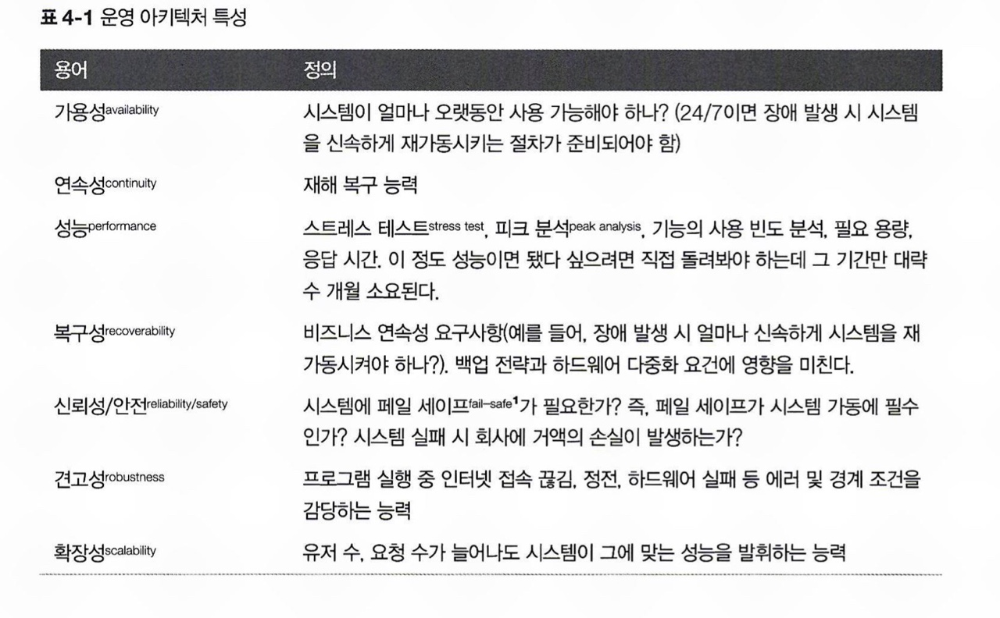
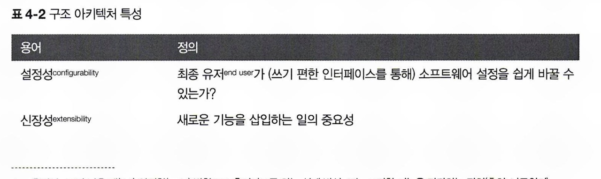

# CHAPTER4 아키텍처 특성 정의

**비도메인 설계 고려 사항을 명시한다**

**설계의 구조적 측면에 영향을 미친다**

**애플리케이션 성공에 절대적으로 중요하다**

## 4.1 아키텍처 특성 (일부) 목록

### 4.1.1 운영 아키텍처 특성

운영 아키텍처 특성은 성능, 확장성, 탄력성, 가용성, 신뢰성 등의 능력을 말합니다.

### 4.1.2 구조 아키텍처 특성

설정성, 신장성, 설치성, 활용성/재사용, 유지보수성, 이식성, 지원성, 업그레이드성 등.

### 4.1.3 아키텍처 공통 특성

