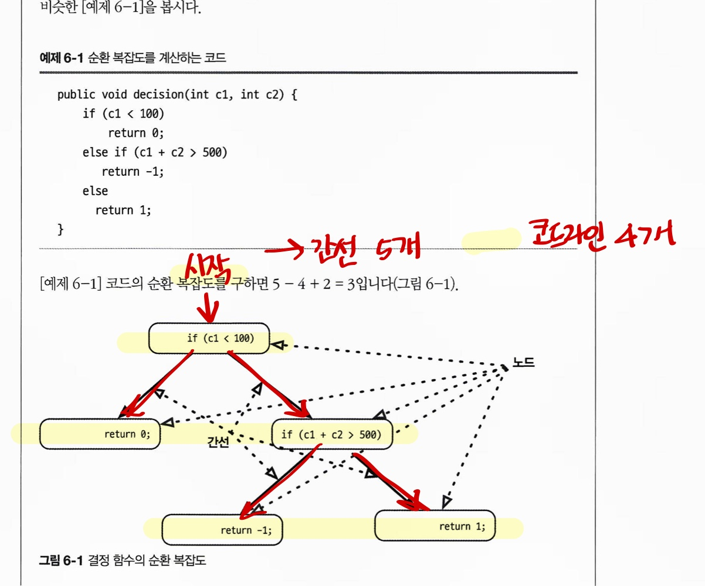

# CHAPTER6 아키텍처 특성의 측정 및 거버넌스

이 장에서는 보다 일반적인 아키텍처 특성을 구체적으로 정의하고 거버넌스 메커니즘(아키텍처의 일관성과 품질을 보장하기 위한 도구)을 구축하는 방법을 집중적으로 살펴보겠습니다.

## 6.1 아키텍처 특성 측정

아키텍처 특성을 정의할 때에는 흔히 다음과 같은 문제들이 발생합니다.

**물리학이 아니다**

아키텍처 특성은 대부분 의미가 모호합니다.

**정의가 너무 다양하다**

성능 같은 중요한 특성에 대한 정의가 같은 조직에서도 부서마다 일치하지 않아 개발자, 아키텍트, 운영자 모두 정의를 통일하기 전까지는 원할하게 소통하기가 어렵습니다.

**너무 복합적이다**

바람직한 아키텍처 특성은 대부분 더 작은 여러 특성들로 구성됩니다. 예를 들어, 개발자는 민첩성을 모듈성, 배포성, 시험성 등의 특성으로 세분화할 수 있습니다.

### 6.1.1 운영적 측정

아키텍처 특성은 성능, 확장성처럼 비교적 정확하게 측정할 수 있는 것도 많지만, 팀 목표에 따라 그에 따른 해석은 미묘하게 갈릴 때가 많습니다. 예를 들어, 특정 요청에 대한 평균 응답 시간을 측정할 경우, 어떤 경계 조건 때문에 1%의 요청이 다른 요청보다 처리 시간이 10배나 오래 걸리면 어떻게 해야 할까요? 사내 네트워크 리소스가 충분하다면 특이점은 나타나지 않을 수 있으니 최대 응답 시간도 함께 측정해야 특이점까지 잡아낼 수 있을 것입니다.

*wynter* 위 문단의 예시는 성능을 측정할 때 평균값만을 지표로 삼으면 10배나 느려지는 1%의 요청을 놓칠 수 있다는 말임.

**성능의 여러가지 맛**

첫 페이지의 렌더링 시간은 0.5초가 최적이라는 결론을 얻었죠. 많은 선도적인 회사들은 페이지 다운로드에 K-가중치 예산(특정 페이지에 허용된 라이브러리와 최대 바이트 수)를 설정합니다.

수준 높은 팀은 달성하기 어려운 성능 수치를 정하는 대신, 통계 분석 결과로 얻은 나름대로의 정의에 기반합니다. 예를 들어, 확장성을 모니터링하는 비디오 스트리임ㅇ 서비스 업체가 있다고 합시다. 엔지니어는 아무 수치나 대충 목표로 삼는 게 아니라, 시간에 따라 어떤 추이를 보이는지 측정하고 통계 모델을 수립합니다. 그리고 실시간 수집한 메트릭이 예측 모델에서 벗어난 경우에 알림 메시지를 보냅니다.

### 6.1.2 구조적 측정

잘 정의된 모듈성처럼 내부 구조에 관한 특성도 목표치가 확실하지 않습니다. 아직 내부 코드 품질에 대한 종합적인 메트릭은 없지만, 아키텍트는 다른 메트릭과 공통 도구를 이용해서 코드 구조에 관한 중요한 부분을 들여다볼 수 있습니다.

코드의 복잡도는 순환 복잡도라는 메트릭을 통해 명쾌하게 측정할 수 있습니다.

*wynter* 이건 소나큐브로 이제 어느정도 측정 가능한 영역인 듯 하다.

**순환 복잡도**

순환 복잡도 구하는법 CC = E(간선, 가능한 결정) - N(노드, 코드 라인) + 2P(연결된 컴포넌트 수, 함수에서는 1로 설정됨)

```c
public void decision(int c1, int c2) {
	if (c1 < 100) return 0;
	else if (c1 + c2 > 500) return -1;
	else return 1;
}
```

*wynter*
기본적으로 CC=1 인데, 위에서는 분기가 두개있으므로 1 + 2 = 3 해서 순환복잡도는 3임.

책에서 나타낸 대로 플로우 다이어그램으로 구하게 된다면, 조금 더 쉽게 봐서 이렇게 볼 수 있음.


아키텍트, 개발자 모두 너무 복잡한 코드는 곧 코드 스멜이라는 사실에 공감합니다. 복잡도가 점점 증가하는지 잘 지켜보세요. 그렇지 않으면 복잡도는 곧 코드베이스를 장악해버리고 말 것입니다.

 **순환 복잡도는 어느 정도가 적당한가?**

 이것도 경우에 따라 다릅니다! 알고리즘이 복잡한 문제는 그 솔루션에도 복잡한 함수가 많이 등장할 것입니다. 함수가 복잡한 이유가 문제 영역 때문인가, 코딩 품질이 낮아서 그런 건가? 아니면 코드 분할이 제대로 안 돼서?

 도메인 자체의 복잡도를 고려하지 않을 경우, 일반적으로 10 이하의 CC는 괜찮다고 보는 것이 업계 기준이지만, 우리는 이 임계치가 너무 높고 5 이하로 나와야 응집도가 괜찮은 짜임새 있는 코드라고 생각합니다.

 TDD 같은 엔지니어링 프랙티스는 주어진 문제 영역에서 대체로 더 작고 덜 복잡한 메서드를 생성하는, 부수적인 효과를 가져옵니다. TDD를 실천하는 개발자는 먼저 간단한 테스트를 작성한 다음, 테스트를 통과시키는 가장 적은 양의 코드를 작성하려고 합니다. 이처럼 구체적인 동작과 명확한 테스트 경계에 집중하면 짜임새 있고 고도로 응집된 메서드를 개발할 수 있으며, 그 결과 CC 값도 낮게 나옵니다.

 ### 6.1.3 프로세스 측정

 소프트웨어 개발 프로세스와 교차하는 아키텍처 특성도 있습니다. 민첩성은 바람직한 특성으로 보일 때가 많은데, 이는 시험성, 배포성 등의 특성으로 나눌 수 있는 복합적인 아키텍처 특성입니다.

 시험성은 거의 모든 플랫폼에서 테스트의 완정성을 평가하는 코드 커버리지 도구로 측정할 수 있습니다. 마찬가지로, 배포성 역시 실패 대비 배포 성공률, 배포 소요 시간, 배포시 발생한 이슈/버그 등 다양한 메트릭으로 측정됩니다.

 *wynter* 민첩성이 개발 프로세스와 자꾸 연관이 있다 하는 부분은, 테스트 자동화, 배포 프로세스 등과 연관이 있기 때문이다.

 민첩성과 이와 관련된 부분은 분명히 소프트웨어 개발 프로세스와 연관이 있지만, 이 프로세스는 아키텍처 구조에도 영향을 미칠 수 있습니다. 예를 들어, 배포 용이성과 시험성이 최우선 항목이라면 아키텍트는 아키텍처 수준에서 모듈성, 격리성을 높이는 데 주력하겠죠.

 ## 6.2 거버넌스와 피트니스 함수

 긴급성을 무시할 수는 없지만 그래도 아키텍트는 거버넌스 메커니즘(아키텍처의 일관성과 품질을 보장하기 위한 도구)을 강구해야 합니다.

 ### 6.2.1 아키텍처 특성 관리

거버넌스는 kubernan(이끌다) 라는 그리스어에서 유래된 말입니다. 아키텍처 거버넌스는 아키텍트가 영향력을 행사하려는 모든 소프트웨어 개발 프로세스를 포괄합니다. *거버넌스 예시- 소프트웨어 품질 보장 업무*

다행히 요즘은 좋은 솔루션들이 많이 등장했습니다. 익스트림 프로그래밍에서 비롯된 소프트웨어 프로젝트의 자동화 움직임은 지속적 통합으로 발전했고, 이제는 운영도 자동화하는 데브옵스 체계까지 이르렀습니다. Building Evolutionary Architectures 에는 아키텍처 거버넌스의 여러 부문을 자동화하기 위해 사용하는 피트니스 함수 기법이 소개되어 있습니다.

### 6.2.2 피트니스 함수

결과가 목표에 얼마나 근접했는지를 나타내는 목표 함수가 바로 피트니스 함수입니다. 예를 들어, 머신 러닝의 기초인 외판원 문제(한 외판원이 방문해야 할 도시 목록과 도시 간 거리가 주어질 경우, 최적의 이동 경로를 찾는 문제)를 풀려는 개발자가 있다고 합시다. 이 문제를 유전자 알고리즘으로 풀면, 거리가 가장 짧은 최적 경로, 이동 경로에 발생하는 비용이 최소화된 것, 여행 시간을 줄이는 방법등으로 최적화하는 피트니스 함수를 생각해볼 수 있습니다.

**아키텍처 피트니스 함수**

어떤 아키텍처 특성의 객관적인 무결성을 평가하는 모든 메커니즘

피트니스 함수는 그냥 다운받아 사용하는 새 프레임워크가 아니라, 수많은 기존 도구들을 바라보는 새로운 시각입니다. 3.2.2 절에서 아키텍트가 모듈성을 평가할 수 있게 해주는 메트릭을 소개했는데, 여기서는 모듈성의 다양한 측면을 테스트하는 피트니스 함수를 몇 가지 예시합니다.

**순환 의존성**

모듈성 관점에서 바라볼 때 클래스나 컴포넌트를 별 생각없이 마구 임포트하는 건 정말 좋지 않습니다.

```java
// JDpend는 메트릭 도구. 순환 참조가 존재하면 테스트 실패.
public class CycleTest {
	private JDpend jdepend;

	@BeforeEach
	void int() {
		jdepend = new JDpend();
		jdepend.addDir("....")
	}

	@Test
	void testAllPackages() {
		Collection packages = jdepend.analyze();
		assertEquals("Cycles exists", false, jdepend.containsCylcles());
	}
}
```

**'메인 시퀀스로부터의 거리' 피트니스 함수**

```java
@Test
void AllPackages() {
	double ideal = 0.0;
	double tolerance = 0.5;
	Collection packages = jdepend.analyze();
	Iterator iter = packages.iterator();
	while (iter.hasNext()) {
		JavaPackage p = (JavaPackage)iter.next();
		assertEquals("Distance exceeded: " + p.getName(), ideal, p.distance(), tolerance)
	}
}
```

다른 피트니스 함수들도 코드 구현체로, 레이어 의존성 확인을 함. (생략)

안전하지 않은 코드를 릴리즈하면 안 된다는 것쯤은 개발자도 알고 있지만, 개발 일정의 압박에 시달리다 보면 다른 수십, 수백 가지와 우선순위 경합이 벌어질 것입니다. 아키텍트가 보안 멍키 같은 구체적인 도구와 피트니스 함수 같은 일반적인 도구를 잘 활용하면 중요한 거버넌스 체크를 아키텍처 하부에 구체화할 수 있습니다.
