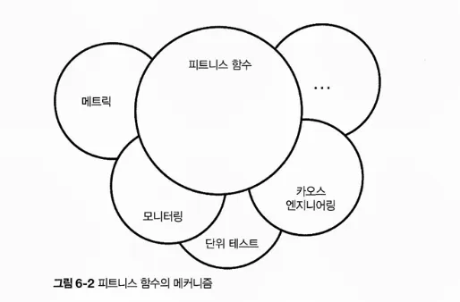

# CHAPTER 6 아키텍처 특성의 측정 및 거버넌스

아키텍처 특성을 구체적으로 정의하고 거버넌스 메커니즘을 구축하는 방법에 대해서

## 6.1 아키텍처 특성 측정

아키텍처 특성을 정의할 때 흔히 다음과 같은 문제들이 발생함

**물리학이 아니다**

아키텍처 특성은 대부분 의미가 모호함

**정의가 너무 다양하다**

**너무 복합적이다**

→ 이 세가지 문제는 아키텍처 특성을 객관적으로 정의하면 모두 해결됨.

### 6.1.1 운영적 측정

- 아키텍처 특성은 성능, 확장성처럼 비교적 정확하게 측정할 수 있는 것도 많지만, 팀 목표에 따라 그에 따른 해석은 미묘하게 갈릴 때가 많음

> **성능의 여러 가지 맛**
>
> 대부분의 프로젝트는 일반적인 성능을 살펴보지만, 아키텍트와 데브옵스 엔지니어는 성능 예산을 책정하는 데 엄청난 작업을 수행함

- 수준 높은 팀은 달성하기 어려운 성능 수치를 정하는 대신, 통계 분석 결과로 얻은 나름대로의 정의에 기반함.
- 도구가 발전하고 이해도가 높아지면서 팀이 측정할 수 있는 아키텍처 특성은 빠르게 진화하고 있음

### 6.1.2 구조적 측정

성능처럼 목표치가 확실하지 않은 메트릭도 있음. 잘 정의된 모듈성처럼 내부 구조에 관한 특성도 그럼. 아직 내부 코드 품질에 대한 종합적인 메트릭은 없지만, 아키텍트는 다른 메트릭과 공통 도구를 이용해서 코드 구조에 관한 중요한 부분을 들여다볼 수 있음

코드의 복잡도는 순환 복잡도라는 메트릭을 통해 명쾌하게 측정할 수 있음

> **순환 복잡도**
> : 함수/메서드, 클래스, 또는 애플리케이션 레벨에서 코드 복잡도를 객관적으로 나타내는 지표
> 상이한 실행 결로를 유발하는 결정점을 이용.
> CC = E - N + 2 (N: 코드 라인, E: 간선. edge)
> 다른 메서드도 호출하는 경우까지 고려한 일반 공식: CC = E - N + 2P (P: 연결된 컴포넌트 수)

아키텍트, 개발자 모두 너무 복잡한 코드는 곧 코드 스멜이라는 사실에 공감함. 그런 코드는 모듈성, 시험성, 배포성 등 거의 모든 바람직한 코드베이스 특성을 저해하는 요소임.

> **순환 복잡도는 어느 정도가 적당한가?**
> 문제 영역의 복잡도에 따라 달라짐
> 도메인 자체의 복잡도를 고려하지 않을 경우, 일반적으로 10 이하의 CC는 괜찮다고 보는 것이 업계 기준이지만, 우리는 이 임계치가 너무 높고 5 이하로 나와야 응집도가 괜찮은 짜임새 있는 코드라고 생각함.
> 테스트 주도 개발(TDD) 같은 엔지니어링 프랙티스는 주어진 문제 영역에서 대체로 더 작고 덜 복잡한 메서드를 생성하는, 부수적인 효과를 가져옴.
> 구체적인 동작과 명확한 테스트 경계에 집중하면 짜임새 있고 고도로 응집된 메서드를 개발할 수 있으며 그 결과 CC 값도 낮게 나옴

### 6.1.3 프로세스 측정

소프트웨어 개발 프로세스와 교차하는 아키텍처 특성도 있음

예를 들어, 민첩성은 바람직한 특성으로 보일 때가 많은데, 이는 시험성, 배포성 등의 특성으로 나눌 수 있는 복합적인 아키텍처 특성임

## 6.2 거버넌스와 피트니스 함수

### 6.2.1 아키텍처 특성 관리

**거버넌스**

: 아키텍트가 담당하는 중요한 업무.

**아키텍처 거버넌스**

: 아키텍트가 영향력을 행사하려는 모든 소프트웨어 개발 프로세스를 포괄함

예를 들어, 조직 내부에서 소프트웨어 품질 보장 업무는 아키텍처 범주 안에 속하므로 아키텍처 거버넌스 항목임

### 6.2.2 피트니스 함수

개발자가 유전자 알고리즘을 설계하여 유익한 결과를 얻으려면 결과의 품질을 객관적으로 측정하면서 이 알고리즘을 통제할 수 있어야 함.
**: 결과가 목표에 얼마나 근접했는지를 나타내는 목표 함수**

예) 머신 러닝의 기초인 외판원 문제를 풀려는 개발자. 이 문제를 유전자 알고리즘으로 풀면, 그냥 이동 경로의 거리를 계산해서 그 거리가 가장 짧은 최적 경로를 표시하는 피트니스 함수를 생각해볼 수 있음

**아키텍처 피트니스 함수**

어떤 아키텍처 특성(또는 그런 특성의 조합)의 객관적인 무결성을 평가하는 모든 메커니즘

- 피트니스 함수는 아키텍트가 그냥 다운로드 받아 사용하는 새로운 프레임워크가 아니라, 수많은 기존 도구들을 바라보는 새로운 시각임.
- 피트니스 함수는 사용하는 방법에 따라 메트릭, 모니터, 단위 테스트 라이브러리, 카오스 엔지니어링 등 기존의 많은 검증 메커니즘과 중첩되는 부분이 있음

- 모듈성의 다양한 측면을 테스트하는 피트니스 함수

  - **순환 의존성**
    모듈성은 대부분의 아키텍트가 관심을 기울이는 암묵적인 특성임
    모듈성이 제대로 유지되지 못하면 코드베이스 구조에 해를 끼치므로 우선 순위를 높게 두어 관리할 수밖에 없음
    하지만 아키텍트가 좋은 의도를 갖고 있더라도 많은 플랫폼에서 그에 반하는 어쩔 수 없는 일들이 벌어짐
    

    각 컴포넌트는 다른 컴포넌트에 있는 코드를 참조함. → 개발자가 어느 한 컴포넌트를 재사용하기 위해 그에 딸린 다른 컴포넌트들도 함께 가져와야 하므로 모듈성이 매우 떨어짐.
    ⇒ 피트니스 함수로 순환 참조 여부를 발견함으로써 해결할 수 있음

**‘메인 시퀀스로부터의 거리’ 피트니스 함수**

‘메인 시퀀스로부터의 거리’라는 다소 난해한 메트릭도 피트니스 함수를 이용해 확인할 수 있음

아키텍트는 개발자에게 피트니스 함수 사용을 권하기 전에 그들이 정확한 목적을 이해할 수 있도록 충분히 설명해야 함.

- ArchUnit: JUnit 체계의 일부를 활용한 자바 테스트 프레임워크. 단위 테스트로 코드화한 사전 정의된 거버넌스 규칙을 풍성하게 제공하므로, 아키텍트는 모듈성에 특화된 테스트를 작성할 수 있음

- 위 그림처럼 레이어드 모놀리스를 설계할 때, 아키텍트는 정당한 사유를 내세워 레이어를 정의하지만 이렇게 정의한 레이어를 개발자들이 잘 지켜서 개발하리라 확신할 수 없음.
  → ArcUnit 로 피트니스 함수를 이용해 해결할 수 잇음.
- NetArchTest: 위랑 비슷한 도구

피트니스 함수는 무거운 거버넌스 메커니즘보다는 아키텍트가 중요한 아키텍처 원칙을 표현하고 자동으로 검증할 수 있는 메커니즘을 제공함.

아키텍트가 보안 멍키 같은 구체적인 도구와 피트니스 함수 같은 일반적인 도구를 잘 활용하면 중요한 거버넌스 체크를 아키텍처 하부에 구체화할 수 있음.
