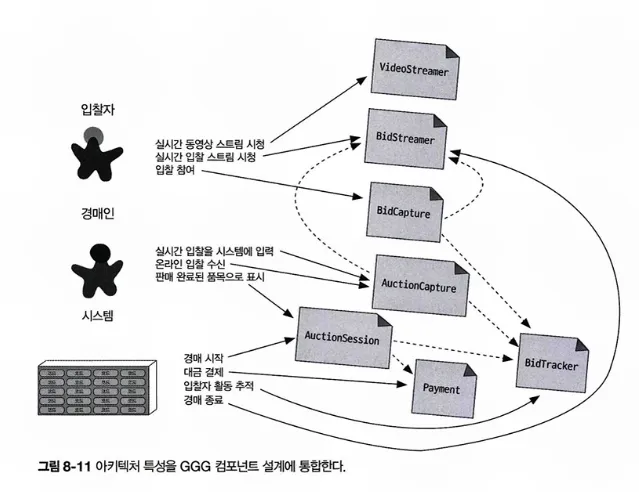

# CHAPTER 8 컴포넌트 기반 사고
> 개발자는 자신의 개발 플랫폼에 따라 여러 가지 방법으로 모듈을 물리적으로 패키징하는데, 이렇게 모듈을 물리적으로 패키징한 것을 컴포넌트라고 하며, 대부분의 언어는 패키징을 지원한다. 
이 장에서는 범위부터 검색에 이르기까지 컴포넌트에 관한 아키텍처 고려 사항을 알아본다. 

## 8.1 컴포넌트 범위
컴포넌트는 아티팩트를 한데 묶어 필요시 중첩시켜 계층화하는, 언어에 특정한 메커니즘을 제공함.

- 가장 단순한 컴포넌트는 클래스보다 한 단계 높은 수준의 모듈로 코드를 래핑한 것. 이 단순한 래퍼를 보통 라이브러리라고 함. 
- 컴포넌트는 아키텍처에서 서브시스템이나 레이어 형태로도 나타나며, 많은 이벤트 프로세서를 위한 배포 가능한 작업 단위임. 
- 아키텍트가 반드시 컴포넌트를 사용해야 하는 것은 아님. 컴포넌트는 언어가 제공하는 저수준이 아닌, 더 높은 수준에서 모듈성을 가지는 것이 더 유용할 때가 많음. 
    - 예) 마이크로서비스 아키텍처에서 단순성은 아키텍처 원칙 중 하나이므로 서비스는 [그림 8-1]처럼 컴포넌트가 될 정도의 충분한 코드로 구성하거나, 적은 양의 코드만 담도록 단순하게 설계하는 것이 좋음
    
- **컴포넌트는 아키텍처의 근본적인 모듈성을 구성하는 요소로서 아키텍트에게 아주 중요한 고려사항임.**
    
    **실제로 아키텍트가 결정하는 중요한 항목 중 하나가 아키텍처 컴포넌트의 최상위 분할과 연관되어 있음**

## 8.2 아키텍트 역할
- 아키텍트는 아키텍처 내부의 컴포넌트를 정의, 개선, 관리, 통제하는 일을 함
    
    아키텍처 특성과 소프트웨어 시스템의 요구사항을 종합하여 비즈니스 분석가, 분야별 전문가, 개발자, QA 엔지니어, 운영자, 엔터프라이즈 아키텍트와 함께 소프트웨어 초기 설계를 함
- 일반적으로 컴포넌트는 아키텍트가 직접 맞닥뜨리는 최하위 소프트웨어 시스템이지만, 전체 코드베이스에 영향을 미치는 코드 품질 메트릭(6장)은 예외임.
    
    컴포넌트는 클래스나 함수로 구성되며, 이들을 설계하는 업무는 기술 리더나 개발자가 담당함
    
    아키텍트는 클래스 설계에 참여해서도 안되고 시스템의 세세한 설계 결정에 간여해서도 안됨
    
    다른 부서 사람들이 중요한 결정을 내리지 못하게 아키텍트가 허용하지 않으면 조직은 다음 세대 아키텍트들에게 자율권을 부여하기가 곤란해질 것
    
- 새 프로젝트를 시작한 아키텍트는 무엇보다 먼저 컴포넌트를 식별해야 하나, 그 전에 아키텍처를 분할하는 방법을 반드시 이해해야 함

### 8.2.1 아키텍처 분할

- 레이어드 아키텍처; 익숙한 형태
- 모듈러 모놀리스: 사이먼 브라운이 널리 보급한 아키텍처 스타일로서, 기술적인 능력이 아닌, 도메인에 따라 분할된 단일 배포 단위임.

→ 두 가지 스타일은 서로 다른 방법으로 아키텍처를 최상위 분할한 결과임

1. 기술 분할
- 아키텍트는 시스템 기능을 기술적인 능력, 즉 프레젠테이션, 비즈니스 규칙, 서비스, 퍼시스턴스 등으로 분할했음.
    
    이렇게 코드를 구성하면 여러 면에서 합리적임
    
    - 모든 퍼시스턴스 코드가 어느 한 레이어레 있으면 개발자가 퍼시스턴스 관련 코드를 쉽게 찾을 수 있음
    
    이미 수십 년 전에 등장한 레이어드 아키텍처의 기본 개념은 모델-뷰-컨트롤러 설계 패턴과 궁합이 잘 맞고 개발자가 이해하기 쉬워서 수많은 조직에서 기본 아키텍처로서 자리 잡음
2. 도메인 분할
- 복잡한 소프트웨어 시스템을 분리하는 모델링 기법을 다룬 에릭 에반스의 [도메인 주도 설계]에서 비롯됨
-  모듈러 모놀리스를 설계하는 아키텍트는 기술적 능력 대신, 도메인이나 워크플로에 따라 아키텍처를 분할함. 

아키텍트가 초기에 어떻게 컴포넌트를 식별해야 할지 결정할 때에도 이 최상위 분할 유형이 매우 큰 영향을 미침

### 8.2.2 분할 사례 연구: 실리콘 샌드위치

- 이 그림에서 도메인/워크플로별로 각각 Purchase, Promotion, MakeOrder, ManageInventory, Recipes, Delivery, Location 컴포넌트를 도출했고, 공통 기능과 로컬 변형을 다루는, 갖가지 유저 정의 코드를 처리하는 서브컴포넌트를 이들 컴포넌트 안에 두었음

- 공통 및 로컬 파트를 각 파티션으로 분리한 설계.
- 최상위 컴포넌트는 Common 과 Local이고 워크플로는 Purchase와 Delivery로 처리
→ 어느 설계가 나은가? 경우에 따라 다름

1. **도메인 분할**: 최상위 컴포넌트를 워크플로 및 도메인에 따라 나눔
    
    장점
    
    - 세부 구현보다 비즈니스 기능에 더 가깝게 모델링됨.
    - 역 콘웨이 전략을 활용하여 도메인별 다목적팀(cross-functional team)을 구성하기 쉬움.
    - 모듈러 모놀리스와 마이크로서비스 아키텍처 스타일에 더 가깝게 맞출 수 있음
    - 메시지 흐름이 문제 영역과 일치함
    - 데이터와 컴포넌트를 분산 아키텍처로 옮기기 쉬움
    
    단점
    
    - 유저 정의 코드가 여기저기 널려 있음
2. **기술 분할**: 최상위 컴포넌트를 개별 워크플로가 아닌, 기술적인 능력에 따라 분리하므로 모델-뷰-컨트롤러(MVC) 또는 상황에 맞게 기술 분할된 레이어로 나타낼 수 있음
    
    장점
    
    - 커스텀 코드가 명확하게 분리됨
    - 레이어드 아키텍처 패턴에 더 가깝게 맞출 수 있음
    
    단점
    
    - 전역 커플링이 더 높음. 따라서 공통 또는 로컬 컴포넌트 중 하나라도 변경되면 다른 모든 컴포넌트가 영향을 받을 가능성이 높음
    - 개발자가 공통 레이어, 로컬 레이어 양쪽에 도메인 개념을 복제해야 할 수 있음
    - 일반적으로 데이터 레벨의 커플링이 높음. 이런 시스템은 대개 애플리케이션 아키텍트, 데이터 아키텍트가 서로 협력하여 단일 데이터베이스를 구성하고 여기에 각종 도메인을 포함시키기 때문에 나중에 아키텍트가 분산 시스템으로 아키텍처를 옮기려고 할 경우 데이터 관계를 파헤치는 작업이 어려움

## 8.3 개발자 역할
개발자는 아키텍트와 공동 설계한 컴포넌트를 바탕으로 클래스, 함수, 서브컴포넌트로 더 잘게 나눔. 일반적으로 클래스, 함수 설계는 아키텍트, 기술 리더, 개발자의 공동 책임이지만 대부분 개발자가 담당함. 

개발자는 아키텍트가 설계한 컴포넌트가 최종판이라고 생각해선안됨. 모든 소프트웨어 설계는 이터레이션을 거쳐 점점 다듬어지므로, 초기 설계는 일단 초안으로 보고 차후 구현을 하며 상세한 것들을 밝히고 하나씩 개선을 하면 됨

## 8.4 컴포넌트 식별 흐름
컴포넌트 식별은 후보를 도출하고 피드백을 통해 다듬어가는 과정을 반복하는 것이 가장 좋음.

### 8.4.1 초기 컴포넌트 식별

아키텍트는 소프트웨어 프로젝트의 소스 코드가 생기기 전에 적용할 최상위 분할의 유형에 따라 최상위 컴포넌트를 어디서부터 시작할지 결정해야 함

추가로, 원하는 컴포넌트를 자유롭게 구성하면서 어느 기능을 어디에 둘지 도메인 기능을 매핑함. 

### 8.4.2 요구사항을 컴포넌트에 할당

컴포넌트 요구사항(또는 유저 스토리)을 대입해서 잘 맞는지 확인함.

이 과정에서 컴포넌트를 새로 만들거나 기존 컴포넌트를 통합하고, 하는 일이 너무 많은 컴포넌트는 분해할 수 있음.

### 8.4.3 역할 및 책임 분석

컴포넌트에 스토리를 대입할 때 아키텍트는 요구사항을 파악하는 단계에서 밝혀진 역할과 책임도 살펴보고 세분도가 적합한지 확인함. 애플리케이션이 지원해야 할 역할과 기능 둘 다 고려해야 컴포넌트와 도메인의 세분도를 서로 맞출 수 있음

### 8.4.4 아키텍처 특성 분석

컴포넌트에 요구사항을 대입할 때 아키텍트는 앞서 식별한 아키텍처 특성들이 컴포넌트 분할 및 세분도에 어떤 영향을 미치는지 살펴봐야 함.

예를 들어, 유저 입력을 처리하는 시스템 파트는, 동시 접속 유저가 수백 명에 달하는 파트와 소수의 유저만 접속하는 파트의 아키텍처 특성이 다를 수밖에 없음. 따라서 순수하게 기능적인 관점에서만 컴포넌트를 설계하면 유저 상호작용을 처리하는 단일 컴포넌트가 도출되지만 아키텍처 특성들을 분석하면 더 하위 컴포넌트로 잘게 나눌 수 있음

### 8.4.5 컴포넌트 재구성

소프트웨어 설계에서 피드백은 항상 중요함. 

아키텍트는 개발자들과 함께 지속적으로 컴포넌트 설계를 반복해야 함. 

컴포넌트를 설계를 반복하는 접근 방식이 정말 중요함

1. 차후 재설계를 하게만들지 모를 모든 발견과 특이 사례(edge case)를 전부 다 고려하기란 사실상 불가능함
2. 아키텍처와 개발자가 애플리케이션 구축에 점점 더 깊이 빠질수록 서로의 기능과 역할을 어떻게 조정하면 좋을지 서로 다른 시각으로 바라보게 됨.

## 8.5 컴포넌트 세분도
컴포넌트에서 가장 적당한 세분도를 찾는 것은 아키텍트의 가장 어려운 작업 중 하나임.

컴포넌트를 너무 잘게 나누어 설계하면 컴포넌트 간 통신이 너무 많아지고, 그렇다고 너무 크게 나누면 내부적으로 커플링이 증가해서 배포, 테스트가 어려워지고 모듈성 관점에서도 부정적인 영향을 미침

## 8.6 컴포넌트 설계
컴포넌트를 발견하는 몇 가지 일반적인 방법과 하지 말아야 할 사항을 알아보자.

### 8.6.1 컴포넌트 발견

아키텍트는 개발자, 비즈니스 분석가, 도메인 전문가와 협력해서 시스템에 관한 일반적인 지식과 시스템을 어떻게 분할할지 결정하고 그에 따라 초기 컴포넌트 설계를 함. 

초기 설계의 목표는 여러 아키텍처 특성을 고려하여 문제 영역을 큼지막한 덩이들로 나누는 것

**엔티티 함정**

- 기본적으로 이 아키텍트는 요구사항에서 식별된 각각의 엔티티를 바탕으로 관리자 컴포넌트를 만들었는데, 이것은 아키텍처가 아님. 프레임워크를 데이터베이스에 컴포넌트 관계형으로 매핑한 것에 불과함.
- 즉, 단순 CRUD 기능만 필요한 시스템은 아키텍트가 프레임워크를 내려 받아 데이터베이스에서 직접 유저 인터페이스를 생성할 수 있음

- 엔티티 함정은 아키텍트가 데이터베이스 관계를 애플리케이션의 워크플로로 오해할 때 벌어짐.
- 엔티티 함정에 빠져 생성된 컴포넌트는 너무 큼지막하게 나뉘어지기 때문에 소스 코드의 전체적인 구조와 패키징 관점에서 개발팀에게 지침이 될 만한 것이 하나도 없음

**액터/액션 접근법**

: 아키텍트가 요구사항을 컴포넌트에 매핑할 때 즐겨 쓰는 방법

- 아키텍트는 애플리케이션에서 뭔가 일을 하는 액터와 그들이 수행하는 액션을 식별하고 시스템의 대표적인 유저와 이들이 시스템에서 어떤 종류의 일을 하는지 찾아내는 기법임.

**이벤트 스토밍**

: 도메인 주도 설계(DDD)에서 사용되는 컴포넌트 발견 기법

이벤트 스토밍을 하는 프로젝트에서는 다양한 컴포넌트가 메시지나 이벤트를 이용해 서로 통신한다고 가정함. 따라서 팀은 요구사항과 식별된 역할에 따라 시스템에서 어떤 이벤트가 일어나는지 파악하고 컴포넌트를 이벤트와 메시지 핸들러 중심으로 구축함.

**워크플로 접근법**

: 이벤트 스토밍의 대안으로서, DDD나 메시징을 사용하지 않는, 더 일반화한 방법임. 

워크플로 기반의 컴포넌트 모델링은 이벤트 스토밍과 비슷하지만 메시지 기반 시스템을 구축하는 데 있어서 명시적인 제약조건은 없음.

→ 위의 기법들 다 일장일단이 있으므로 어느 것이 다른 것보다 우월하다고 할 수 없음

## 8.7 컴포넌트 발굴 사례 연구: GGG
GGG 카타에 액터/액션 접근법을 적용해보자
역할

- 입찰자 - bidder - 라이브 동영상 스트림과 라이브 입찰 스트림을 보고 입찰을 한다.
- 경매인 - auctioneer - 라이브 입찰을 시스템에 입력하고, 온라인 입찰을 수신하며, 아이템을 팔린 것으로 표시한다.
- 시스템 - system - 경매를 시작하고, 결제를 처리하고, 입찰자 활동을 추적한다.

→ 애플리케이션과 상호작용하며 시스템은 애플리케이션이 이벤트를 개시하는 시점을 식별함. 

예) 경매가 완료되면 시스템은 결제 시스템을 트리거하여 결제를 진행함

식별한 컴포넌트

- VideoStreamer: 유저에게 라이브 경매를 스트리밍한다.
- BidStreamer: 입찰일 발생하면 즉시 유저에게 스트리밍한다. VideoStreamer와 BidStreamer는 입찰자에게 읽기 전용 경매 뷰를 제공한다.
- BidCapture: 경매인, 입찰자 양쪽에서 입찰을 캡퍼한다.
- BidTracker: 입찰을 추적하는 기록 시스템 역할을 한다.
- AuctionSession: 경매 세션을 시작/종료한다. 입찰자가 경매를 끝내면 결제를 처리하고 그 결과를 입찰자에게 알려주는 등 후속 조치를 한다.
- Payent: 신용카드 결제를 처리하는 서드파티 결제 프로세서

→ 현재 설계는 BidCapture 컴포넌트가 입찰자, 경매인 양쪽의 입찰을 캡처하는데, 어느 쪽에서 흘러 들어온 입찰이든 동일하게 처리할 수 있으니 기능상 합리적임.

하지만 입찰 캡처에 관한 아키텍처 특성은?

- 경매인은 수천 명 단위로 증가할지 모를 입찰자와 동일한 수준의 확장성, 탄력성이 필요 없음
- 경메인에 관한 신뢰성과 가용성 같은 아키텍처 특성을 다른 시스템 파트보다 높게 보장해야 함.

→ 필요한 아키텍처 특성의 수준이 제각각이므로 아키텍트는 BidCapture를 BidCapture, AcutioneerCapture 두 컴포넌트로 나누어 각각 다른 수준의 아키텍처 특성을 지원하는게 좋음

- AuctioneerCapture 컴포넌트를 신설해서 BidStreamer와 BidTracker 양쪽으로 연결되는 정보를 업데이트함.
- BidTracker는 완전히 다른 두 스트림, 즉 경매인에게서 온 단일 정보 스트림과 입찰자들이 보낸 여러 스트림을 통합할 수 있음

→이도 최종 설계안은 아님. 

각 설계 결정의 트레이드오프를 객관적으로 판단하고 트레이드오프가 나쁜 것 중에서 제일 나은 것을 선택하도록 노력해라.

## 8.8 아키텍처 퀀텀 딜레마: 모놀리식이냐, 분산 아키텍처냐
아키텍처 퀀텀을 활용하면 초기 설계 단계에서 아키텍처의 근본적인 설계 특성을 결정할 수 있으므로 아키텍처 특성의 범위와 커플링을 분석하는 방법으로서 장점이 부각됨