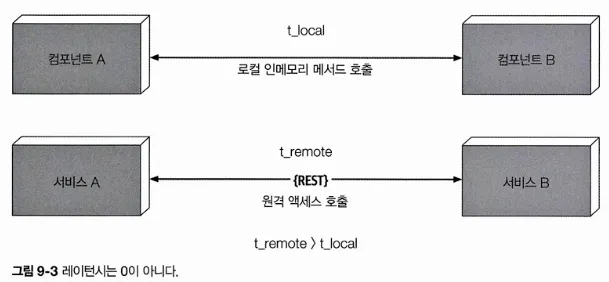
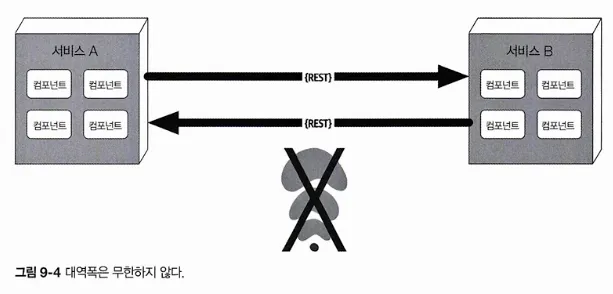
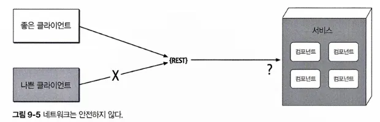
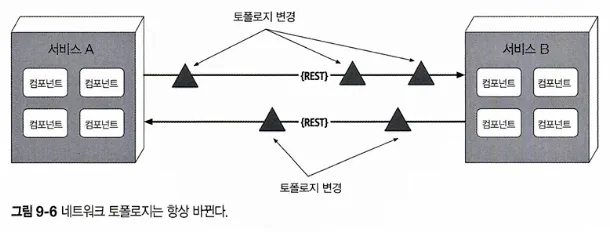
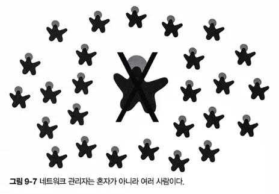
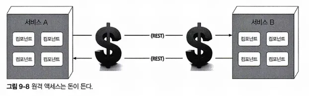
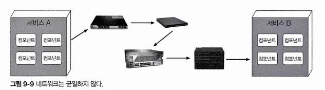

# CHAPTER 9 기초
## 9.1 기초 패턴
소프트웨어 아키텍처의 역사를 통틀어 끊임없이 나타나고 또 나타나는 패턴이 있는데, 이런 패턴들은 코드, 배포, 또는 아키텍처의 다른 부분을 구성하는 시야를 넓혀줌

### 9.1.1 진흙잡탕

; 뭐 하나 뚜렷한 아키텍처 구조가 전무한 상태

> 진흙잡탕은 대충 되는 대로, 아무렇게나 막 지저분하게, 테이프를 덕지덕지 붙여 놓은 스파게티 코드 정글임. 이런 시스템은 거의 반드시 무질서한 성장과 반복적인 땜질식 수리의 징후를 보임. 정보는 멀찍이 떨어져 있는 시스템 파트끼리 난잡하게 공유되고, 거의 모든 중요한 정보는 전역에 흩어져 있거나 중복된 경우도 많음.

전체적인 시스템 구조는 한번도 제대로 정의된 적이 없겠죠.

이 정도면 알아보기 힘들 정도로 손상돼 있을 겁니다. 아키텍처 마인드를 조금이라도 갖고 있는 프로그래머라면 고생길을 자처할 이유가 없지요. 아키텍처에 무심한 사람들, 그리고 어쩌면 이런 실패한 둑의 구멍을 메우는 일상적인 허드렛일을 하면서 관성에 빠진 사람들만이 그럭저럭 만족하며 일하고 있을 것임. 
- 브라이언 푸트와 조지프 요더
> 

### 9.1.2 유니터리 아키텍처

소프트웨어 태동기에는 단 1대의 컴퓨터에서 소프트웨어가 돌아갔음. 이후 하드웨어/소프트웨어는 다양한 진화 세대를 거치면서 처음에는 단일 엔티티로 시작했다가 보다 정교한 기능이 점점 더 많이 필요해지면서 나누었음

### 9.1.3 클라이언트/서버

프론트엔드와 백엔드로 기술적으로 기능을 분리한 2티어 또는 클라이언트/서버 아키텍처는 대표적인 기본 아키텍처 스타일임. 시대와 컴퓨팅 파워에 따라 여러 가지 형태로 존재해왔음

**데스크톱 + 데이터베이스 서버**

; 프레젠테이션 로직은 데스크톱에 두고 계산량이 많은 액션은 사양이 탄탄한 데이터베이스 서버에서 실행했음

**브라우저 + 웹 서버**

; 웹 브라우저가 웹 서버에 접속하는 형태로 분리하는 것이 일반화됨. 

**3티어**

; 고성능 데이터베이스 서버를 사용하는 데이터베이스 티어, 애플리케이션 서버가 관리하는 애플리케이션 티어, 처음에는 HTML로 시작하여 기능이 점점 많아져 온갖 자바스크립트 코드로 가득 찬 프론트엔드 티어

## 9.2 모놀리식 대 분산 아키텍처
아키텍처 스타일

1. 모놀리식: 전체 코드를 단일 단위로 배포
2. 분산형: 원격 액세스 프로토콜을 통해 여러 단위로 배포

- 분산 아키텍처 스타일은 모놀리식 아키텍처 스타일에 비해 성능, 확장성, 가용성 측면에서 훨씬 강력하지만, 이런 파워에도 무시할 수 없는 트레이드오프가 수반됨.

### 9.2.1 오류 #1: 네트워크는 믿을 수 있다

분산 아키텍처는 그 특성상 서비스를 오가는, 또 서비스 간에 이동하는 네트워크에 의존하므로 중요한 문제임. 

시스템이 네트워크에 더 의존할수록 시스템의 신뢰도는 잠재적으로 떨어질 가능성이 있음

### 9.2.2 오류 #2: 레이턴시는 0이다

메서드나 함수를 이용해 다른 컴포넌트를 로컬 호출하면 그 소요 시간(t_local)은 대개 나노 초 내지 밀리초 단위로 측정되지만, 동일한 호출을 원격 액세스 프로토콜을 통해서 수행하면 서비스 액세스 시간(t_remote)이 밀리초 단위로 측정됨. 

따라서 t_remote는 항상 t_local보다 클 수밖에 없고 모든 분산 아키텍처에서 레이턴시는 0이 아님. 

아키텍트는 어떤 분산 아키텍처를 구축하든지 간에 평균 레이턴시는 반드시 알아야 함. 이것이 분산 아키텍처가 실현 가능한지 판단하는 유일한 방법임. 

### 9.2.3 오류 #3: 대역폭은 무한하다

모놀리식 아키텍처는 비즈니스 요청을 처리하는 데 그리 큰 대역폭이 필요하지 않으므로 대역폭이 문제될 일은 별로 없음

하지만, 그림처럼 마이크로서비스 분산 아키텍처에서 시스템이 자잘한 배포 단위(서비스)로 쪼개지면 이 서비스들 간에 주고받는 통신이 대역폭을 상당히 점유하여 네트워크가 느려지고, 결국 레이턴시(오류#2)와 신뢰성(오류#1)에도 영향을 미침

스탬프 커플링은 분산 아키텍처에서 상당히 많은 대역폭을 차지함.

해결 방법

- 프라이빗 REST API 엔드포인트를 둔다.
- 계약에 필드 셀렉터를 사용한다.
- GraphQL로 계약을 분리한다.
- 컨슈머 주도 계약(CDC)와 값 주도 계약(VBC)을 병용한다.
- 내부 메시징 엔드포인트를 사용한다.

→ 어떤 기법을 적용하든, 분산 아키텍처의 서비스 또는 시스템 간에 최소한의 데이터만 주고받도록 하는 것이 이 오류를 바로잡는 최선의 길임

### 9.2.4 오류 #4: 네트워크는 안전하다

아키텍트와 개발자는 대부분 가상사설망(VPN), 신뢰할 수 있는 네트워크, 방화벽에 너무 익숙해진 나머지, 네트워크가 안전하지 않다는 사실을 망각하는 경향이 있음. 

보안은 분산 아키텍처에서 훨씬 더 어려운 문제.

그림처럼 분산 배포된 각 엔드포인트는 알려지지 않은, 또는 악의적인 요청이 해당 서비스로 유입되지 않게 철저한 보안 대책을 강구해야 함. 

### 9.2.5 오류 #5: 토폴로지는 절대 안바뀐다

네트워크를 구성하는 모든 라우터, 허브, 스위치, 방화벽, 네트워크, 어플라이언스 등 전체 네트워크 토폴로지가 불변일 거란 가정은 섣부른 오해임. 

아키텍트는 운영자 네트워크 관리자와 항시 소통을 하면서 무엇이, 언제 변경되는지 알고 있어야 함. 당황스러운 사태가 발생해도 적절히 대응할 수가 있음.

### 9.2.6 오류 #6: 관리자는 한 사람뿐이다

아키텍트는 언제나 한 사람의 관리자와만 협의하고 소통하면 된다는 오류에 빠지곤 함

### 9.2.7 오류 #7: 운송비는 0이다

여기서 운송비는 레이턴시가 아니라, ‘단순한 REST 호출’을 하는 데 소요되는 진짜 비용을 말함. 

분산 아키텍처는 하드웨어, 서버, 게이트웨이, 방화벽, 신규 서브넷, 프록시 등 리소스가 더 많이 동원되므로 모놀리식 아키텍처보다 비용이 훨씬 더 듬. 

분산 아키텍처를 이제 막 시작하려는 아키텍트에게 용량, 대역폭, 레이턴시, 보안 구역 측면에서 현재의 서버와 네트워크 토폴로지를 철저히 분석하여 착각의 늪에 빠지지 않도록 권고함. 

### 9.2.8 오류 #8: 네트워크는 균일하다

실제로 많은 회사의 인프라는 여러 업체의 네트워크 하드웨어 제품들이 얽히고 설켜 있음

### 9.2.9 다른 분산 아키텍처 고려 사항

모놀리식 아키텍처에는 없지만 분산 아키텍처를 설계할 때 맞닥뜨리게 될 이슈 및 해결해야 할 난제들이 있음

**분산 로깅**

분산 아키텍처는 애플리케이션과 시스템 로그가 분산되어 있으므로 어떤 데이터가 누락된 근본 원인을 밝혀내기가 대단히 어렵고 시간도 많이 걸림. 

스펄렁크 같은 로깅 통합 도구를 사용하면 다양한 소스와 시스템에서 통합된 로그 및 콘솔로 데이터를 취합할 수 있지만 복잡하기 그지없는 분산 로그를 확인하기에는 역부족임

**분산 트랜잭션**

모놀리식 아키텍처 세계에서 아키텍트, 개발자는 직관적이고 관리가 편한 트랜잭션을 당연시함. 퍼시스턴스 프레임워크가 대신 실행하는 표준 커밋/롤백 기능은 ACID 트랜잭션을 걸어 업데이트 시 데이터 일관성과 무결성을 강제함. 

분산 아키텍처는 최종 일관성이라는 개념을 바탕으로 별도로 분리된 배포 단위에서 처리된 데이터를 미리 알 수 없는 어느 시점에 모두 일관된 상태로 동기화함. 확장성, 성능, 가용성을 얻는 대가로, 데이터 일관성과 무결성을 희생하는 트레이드오프인 셈.

분산 트랜잭션을 관리하는 한 가지 방법으로 트랜잭셔널 사가가 있음

사가는 보상을 위해 이벤트를 소싱하거나 트랜잭션 상태를 관리하기 위해 유한 상태 기계를 활용함. 

사가 외에 BASE 트랜잭션도 사용함. 

BASE는 (BA)sicavailability(기본 가용성), (S)oft state (소프트 상태), (E)ventual consistency(최종 일관성)의 약자. 소프트웨어 조각이 아니라, 일종의 기법임. 

소프트 상태는 소스 → 타깃으로의 데이터 전달과 데이터 소스 간 비일관성을 말함. 

**계약 관리 및 버저닝**

분산 아키텍처에서는 분리된 서비스와 시스템을 제각기 다른 팀과 부서가 소유하기 때문에 계약 유지보수가 특히 어려움.