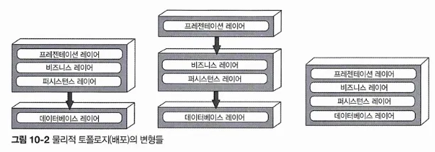
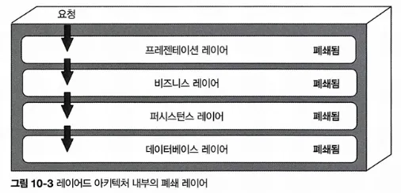
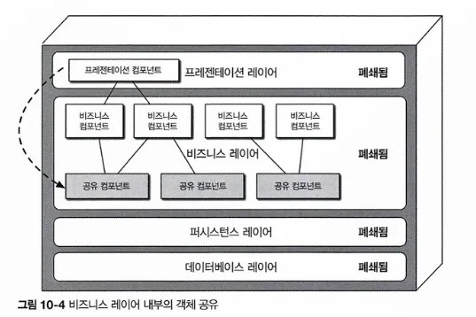
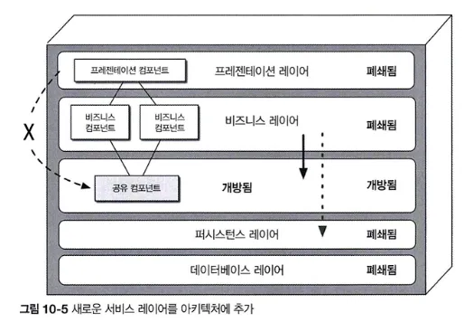
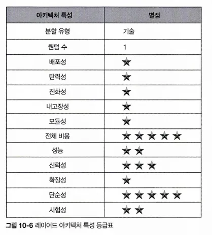

# CHAPTER 10 레이어드 아키텍처 스타일
## 10.1 토폴로지
레이어드 아키텍처에서 내부 컴포넌트는 논리적으로 수평한 레이어들로 구성되며, 각 레이어는 애플리케이션에서 주어진 역할을 수행함. 

레이어의 개수와 유형은 특별한 제한이 없지만, 일반적으로 **프레젠테이션**, **비즈니스**, **퍼시스턴스**, **데이터베이스**의 4개 표준 레이어로 구성함

- 왼쪽은 프레젠테이션, 비즈니스, 퍼시스턴스 레이어를 단일 배포 단위로 합한 것으로, 데이터베이스 레이어는 외부에 별도로 분리된 물리적인 데이터베이스(또는 파일시스템)로 나타냄
- 가운데는 프레젠테이션 레이어를 자체 배포 단위로 떼어내고 비즈니스 레이어와 퍼시스턴스 레이어를 두 번째 배포 단위로 합함. 데이터베이스는 왼쪽과 동일하게 분리
- 오른쪽은 데이터베이스 레이어를 포함한 4개 표준 레이어를 모두 단일 배포 단위로 뭉뚱그린 것. 
애플리케이션에 데이터베이스가 내장돼 있거나 인메모리 데이터베이스를 사용하는 소규모 애플리케이션에 적합한 구성.

레이어드 아키텍처 스타일의 각 레이어는 아키텍처 내부에서 특정한 역할가 임무를 수행함

- 프레젠테이션 레이어 -모든 유저 인터페이스와 브라우저 통신 로직
- 비즈니스 레이어 - 요청을 받아 알맞은 비즈니스 규칙 실행
- ..?

→ 관심사의 분리 개념 덕분에 레이어드 아키텍처 스타일은 아키텍처 내부의 역할 및 책임 모델을 효과적으로 구성할 수 있음

특정 레이어에 소속된 컴포넌트는 역할 범위가 한정되며 그 레이어에 알맞은 로직만을 처리함. 

레이어드 아키텍처는 기술 분할된 아키텍처임. 즉, 컴포넌트를 도메인 단위로 묶는 게 아니라, 아키텍처의 기술 역할에 따라 묶기 때문에 비즈니스 도메인이 각각 모든 아키텍처 레이어에 분산 됨. 

예를 들어, ‘고객’ 도메인은 프레젠테이션, 비즈니스, 규칙, 서비스, 데이터베이스 모든 레이어에 다 포함되므로 이 도메인에 어떤 변경을 가하는 일이 쉽지 않음. 이런 이유로 아키텍처 스타일은 도메인 주도 설계 방식과는 잘 안맞음.

## 10.2 레이어 격리
레이어드 아키텍처의 각 레이어는 폐쇄 또는 개방 상태임

- 폐쇄 레이어: 요청이 상위 레이어에서 하위 레이어로 이동하므로 중간의 어떤 레이어도 건너뛸 수 없고 현재 레이어를 거쳐야 바로 그 다음 레이어로 나아갈 수 있음
    
    

    - 단순 조회 요청이라면 불필요한 레이어를 건너뛰고 프레젠테이션 레이어가 데이터베이스를 직접 액세스하는 편이 더 빠르고 간편할 것임
- 레이어 격리: 어느 아키텍처 레이어에서 변경이 일어나도 다른 레이어에 있는 컴포넌트에 아무런 영향을 끼치지 않기에 레이어 간 계약은 불변임을 의미함.
    
    각 레이어는 서로 독립적으로 작동되므로 다른 레이어의 내부 작동 로직은 거의/전혀 알지 못함.
    
    레이어 격리를 지원하려면 요청의 메인 흐름에 관한 레이어가 반드시 폐쇄되어 있어야 함. 
    

- 레이어를 격리하면 아키텍처의 모든 레이어를 다른 레이어에 영향을 주지 않고 교체할 수 있음.

## 10.3 레이어 추가
아키텍처 내부적으로 폐쇄 레이어를 이용해 변경을 격리할 수 있지만, 어떤 레이어는 개방하는 것이 더 합리적인 경우도 있음. 

- 비즈니스 레이어에 공통 비즈니스 기능이 구현된 객체를 구현하여 공유하고, 프레젠테이션 레이어에서는 이 공유 객체를 직접 사용할 수 없도록 아키텍처를 결정했다고 하자 (프레젠테이션 컴포넌트가 비즈니스 레이어의 공유 비즈니스 객체를 액세스하는 점선으로 표시)
    
    → 프레젠테이션 레이어가 비즈니스 레이어를 액세스할 수 있고 그 내부의 공유 객체 역시 갖다 쓸 수 있는 지배/통제하기 어려운 아키텍처 구조임. 
    
- 이런 제약조건을 아키텍처적으로 강제하려면 공유 비즈니스 객체가 모두 포함된 새로운 서비스 레이어를 아키텍처에 추가하면 됨.
    
    → 비즈니스 레이어는 폐쇄되어 있으니 아키텍처 구조상 프레젠테이션 레이어가 공유 비즈니스 객체를 직접 액세스할 수 없음. 
    
    
    
    → 개방/폐쇄 레이어 개념을 잘 활용하면 아키텍처 레이어 간 관계와 요청 흐름을 정의할 때 유용함.

## 10.4 기타 고려 사항
- 레이어드 아키텍처에서는 **아키텍처 싱크홀 안티패턴**을 조심해야함. 
요청이 한 레이어에서 다른 레이어로 이동할 때 각 레이어가 아무 비즈니스 로직도 처리하지 않고 그냥 통과시키는 안티패턴을 말함.
- 이 안티패턴으로 처리 중인 요청의 전체 비율을 따져보는 것이 중요. 80대 20 법칙을 적용해서 전체 요청의 20%가 싱크홀인 정도면 그런대로 괜찮은 수준.
- 아키텍처의 모든 레이어를 개방하는 것도 방법이 될 수 있음. 
그러나, 아키텍처상 변경 관리의 어려움이 가증되는 트레이드오프가 있음을 분명하게 인식해야 함.

## 10.5 왜 이 아키텍처 스타일을 사용하는가
레이어드 아키텍처는 작고 단순한 애플리케이션이나 웹사이트에 알맞은 아키텍처 스타일임. 

개발자, 아키텍트 모두 익숙하고 그리 복잡하지 않으며 어쩌면 비용도 가장 저렴한 아키텍처 스타일이므로 소규모 애플리케이션을 간편하게 개발할 수 있음. 

레이어드 아키텍처 기반의 애플리케이션은 규모가 커질수록 유지 보수성, 민첩성, 시험성, 배포성 같은 아키텍처 특성이 점점 나빠짐.

## 10.6 아키텍처 특성 등급

- 별점 1개인 특성은 이 아키텍처에서 별로 잘 지원되지 않고, 별점 5개인 특성은 이 아키텍처의 강점 중의 하나라는 뜻
- 전체 비용과 단순성 - 레이어드 아키텍처 스타일의 주요 강점
    - 모놀리식에 가깝기 때문에 분산 아키텍처 스타일에 따른 복잡도가 낮고, 구조가 단순해서 알기 쉬운데다 구축 및 유지보수 비용도 적게 듬.
- 배포성과 시험성이 매우 낮음
    - 배포를 하려면 절차가 까다롭고 리스크가 높으며 자주 배포할 수 없기 때문에 배포성은 떨어짐.
- 확장성 - 모놀리식 내부 기능 중에는 상대적으로 확장이 가능한 것들도 더러 있지만, 확장하려면 대부분 멀티스레딩, 내부 메시징을 비롯해 이 아키텍처와는 안어울리는 갖가지 병렬 처리 프랙티스와 기법이 동원됨.
- 성능 - 병렬 처리가 거의 안 되고, 폐쇄적인 레이어 구조와 싱크홀 아키텍처 안티패턴 때문에 고성능 시스템과 어울리지 않기 때문
- 내고장성 - 모놀리식 배포 탓. 어느 한 작은 파트에 OOM(메모리 부족)이 발생하면 애플리케이션 전체적으로 영향을 받고 충돌이 발생함.