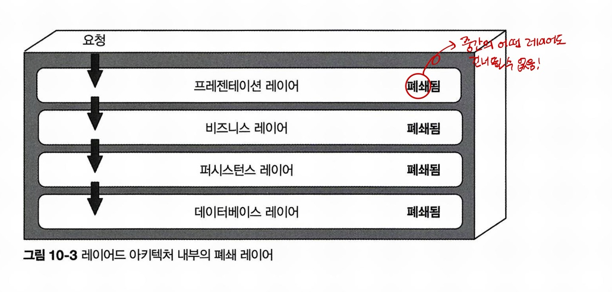
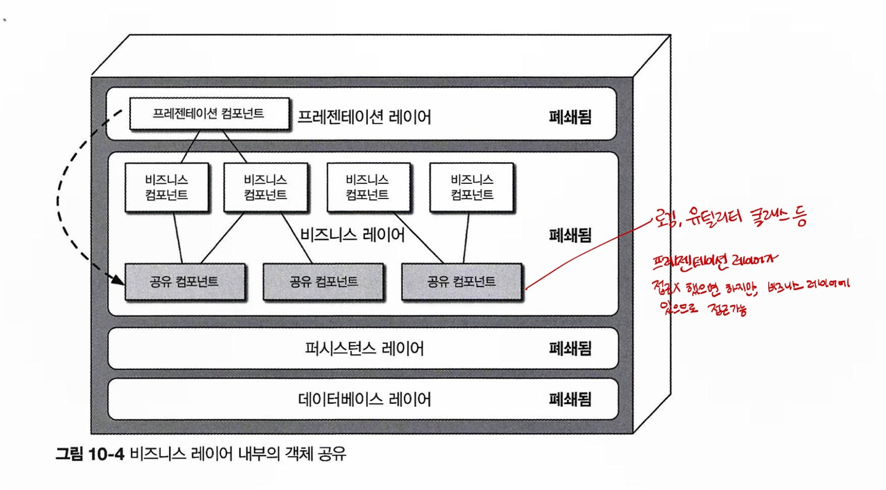
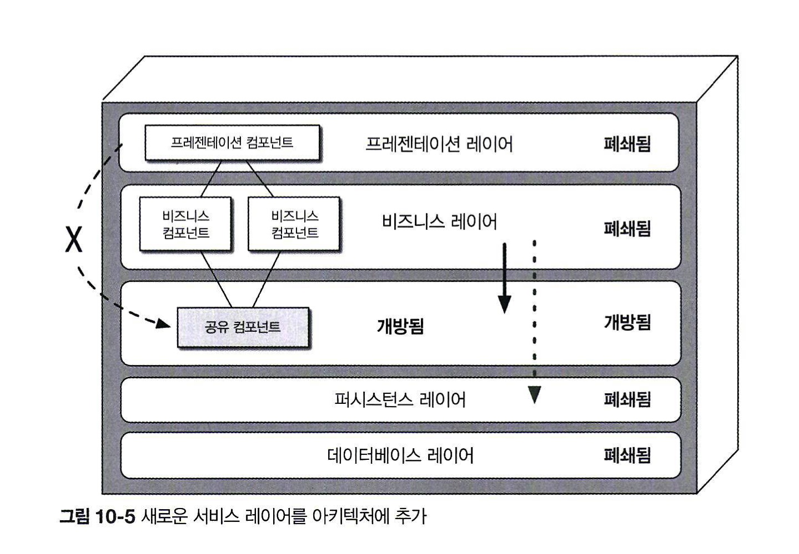
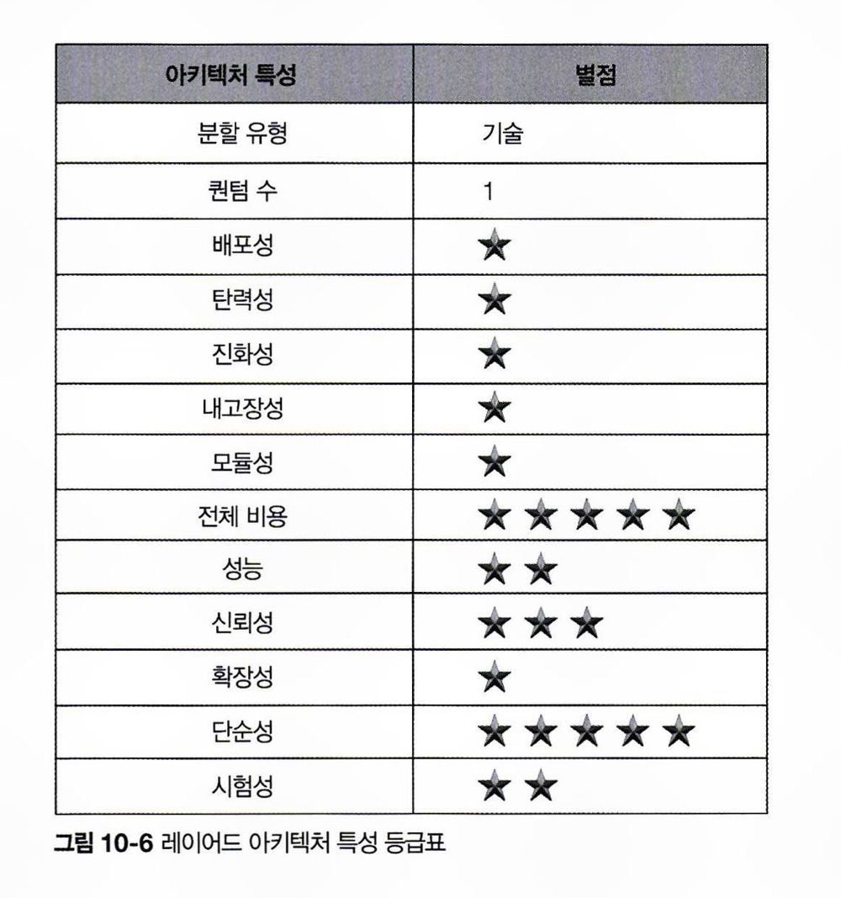

# CHAPTER10 레이어드 아키텍처 스타일

레이어드 아키텍처는 단순하고 대중적이면서 비용도 적게 들어 모든 애플리케이션의 사실상 표준 아키텍처입니다. 그러나 레이어드 아키텍처 스타일은 묵시적 아키텍처 안티패턴, 우발적 아키텍처 안티패턴 등의 몇몇 아키텍처 안티패턴의 범주에 속합니다.

> 묵시적 아키텍처 안티패턴: 개발자들이 머릿속에 암묵적으로 이해하고 있는 아키텍처가 실제 구현에서 드러나지 않아, 새로운 팀원이 이해하거나 유지보수하기가 어려워지는 문제입니다.

> 우발적 아키텍처 안티패턴: 의도치 않게 시스템이 특정한 구조를 형성하게 된 경우

(wynter) https://github.com/goorm-dev/goorm-slack-workflows/blob/main/cs-manager-app/utils/notion.ts 이거 안티패턴이 된 거 아닌가 싶긴 하네요

## 10.1 토폴로지

레이어드 아키텍처에서 내부 컴포넌트는 논리적으로 수평한 레이어들로 구성되며, 각 레이어는 애플리케이션에서 주어진 역할을 수행합니다. 일반적으로 프레젠테이션(라우터), 비즈니스(컨트롤러), 퍼시스턴스(서비스), 데이터베이스(레파지토리)의 4개 표준 레이어로 구성합니다.

10.2 그림
* (프레젠테이션 레이어 / 비즈니스 레이어 / 퍼시스턴스 레이어) => (데이터베이스 레이어)
* (프레젠테이션 레이어) => (비즈니스 레이어 / 퍼시스턴스 레이어) => (데이터베이스 레이어)
* (다 함께)

레이어드 아키텍처 스타일의 각 레이어는 아키텍처 내부에서 특정한 역할과 임무를 수행합니다. 프레젠테이션 레이어는 모든 유저 인터페이스와 브라우저 통신 로직을, 비즈니스 레이어는 요청을 받아 알맞은 비즈니스 규칙을 실행하는 일을 합니다. 각 레이어는 주어진 비즈니스 요청을 충족하는 데 필요한 업무 위주로 추상화되어 있습니다. 예를 들어 프레젠테이션 레이어는 데이터를 조회하는 방법 은 알 필요 없고, 받아온 정보를 잘 보여주기만 하면 됩니다.

이러한 관심사의 분리 개념덕분에 레이어드 아키텍처 스타일은 아키텍처 내부의 역할 및 책임 모델을 효과적으로 구성할 수 있습니다. 개발자 본인의 기술 역량을 도메인의 기술적인 부분에 집중시킬 수 있지만, 그런 장점을 대가로 전체적인 민첩성이 떨어지는 트레이드오프가 있습니다.

레이어드 아키텍처는 (도메인 분할 아키텍처의 반대인) 기술 분할된 아키텍처입니다. 즉, 컴포넌트를 (고객 같은) 도메인 단위로 묶는 게 아니라, 아키텍처의 (프레젠테이션 또는 비즈니스 같은) 기술 역할에 따라 묶기 때문에 비즈니스 도메인이 각각 모든 아키텍처 레이어에 분산됩니다.

## 10.2 레이어 격리

레이어드 아키텍처의 각 레이어는 폐쇄 또는 개방 상태입니다.

단순 조회 요청이라면 불필요한 레이어를 건너뛰고 프레젠테이션 레이어가 데이터베이스를 직접 액세스하는 편이 더 빠르고 간편할 것입니다(2000년대 초반에는 이를 추월 차선 리더 패턴이라고 했습니다). 이렇게 요청이 다른 레이어를 건너뛸 수 있으려면 사이 레이어는 개방 되어 있어야 하는데, 폐쇄와 개방 중 어느 쪽이 나을까요? 이 질문에 답하려면 레이어 격리라는 핵심 개념을 알고 있어야 합니다.

(wynter, 뒷장 읽기전 답) 당연히 폐쇄가 낫다. 간단한 로직 처리를 위해 개방시켜버리면 결국 의도치 않은 레이어 간의 의존성이 생겨버려서 망해버리고 말 것임

레이어 격리는 어느 아키텍처 레이어에서 변경이 일어나도 다른 레이어에 있는 컴포넌트에 아무런 영향을 끼치지 않기에 레이어 간 계약은 불변임을 의미합니다. 프레젠테이션 레이어가 퍼시스턴스 레이어에 직접 액세스할 수 있으면 퍼시스턴스 레이어에서 변경이 발생할 경우, 비즈니스 레이어, 프레젠테이션 레이어 둘 다 영향을 받게 되고, 결국 컴포넌트 간의 레이어 상호 의존도가 높아져서 단단히 커플링된 애플리케이션이 될 것입니다. 이런 아키텍처는 매우 취약하고 변경하기 힘들고 비용도 많이 듭니다.

## 10.3 레이어 추가

어떤 레이어는 개방하는 것이 더 합리적인 경우도 있습니다.

* 공통 비즈니스 로직을 비즈니스 레이어에 구현했으나, 프레젠테이션 레이어는 이 공유 로직을 사용하지 않는다는 결정을 했음
* 그러나 비즈니스 레이어에 구현되면 결국 프레젠테이션 레이어가 접근할 수 있음.

* 이렇게 하면 프레젠테이션 레이어는 액세스하지 못함
* 비즈니스 레이어는 그냥 퍼시스턴스로 갈 수도 있고, 공통 로직을 사용하고 갈 수도 있음!

## 10.4 기타 고려 사항

아직 아키텍처 스타일을 완전히 결정하지 못했다면 대부분의 애플리케이션에서 레이어드 아키텍처는 좋은 출발점이 될 것입니다.

레이어드 아키텍처에서는 아키텍처 싱크홀 안티패턴을 조심해야 합니다. 요청이 한 레이어에서 다른 레이어로 이동할 때 각 레이어가 아무 비즈니스 로직도 처리하지 않고 그냥 통과시키는 안티패턴을 말합니다. 이런 흐름은 불필요한 객체 초기화 및 처리를 빈번하게 유발하고 쓸데없이 메모리를 소비하여 성능에도 부정적인 영향을 끼칩니다.

아키텍처 싱크홀 안티패턴에 해당하는 시나리오가 전무한 레이어드 아키텍처는 아마 하나도 없을 것입니다. 80 대 20(파레토 법칙)을 적용해서 전체 요청의 20%가 싱크홀인 정도면 그런대로 괜찮은 수준입니다. 아니라면 이 문제 도메인에 레이어드 아키텍처는 적합한 아키텍처 스타일이 아니라는 증거입니다.

## 10.5 왜 이 아키텍처 스타일을 사용하는가

레이어드는 모두에게 익숙하고 복잡하지 않고 비용도 가장 저렴한 아키텍처 스타일이므로 꽤괜한 선택입니다.

레이어드 아키텍처 기반의 애플리케이션은 규모가 커질수록 유지 보수성, 민첩성, 시험성, 배포성 같은 아키텍처 특성이 점점 나빠집니다. 대규모 앱이나 시스템은 다른 더 모듈러한 아키텍처 스타일이 더 잘 맞습니다.

점점 나빠지는 이유
* 레이어 간 의존성이 복잡해져 전체 시스템 이해가 어려워집니다.
* 특정 기능 변경 시 여러 레이어에 걸쳐 수정이 필요할 수 있습니다.
* 특정 레이어의 병목 현상이 전체 성능에 영향을 줍니다.
* 전체 시스템을 한 번에 배포해야 하는 경우가 많습니다.
* 부분적 업데이트나 롤백이 어려울 수 있습니다.
* 특정 레이어의 기술 변경이 다른 레이어에 영향을 줄 수 있습니다.

## 10.6 아키텍처 특성 등급

배포성과 시험성 별점이 매우 낮습니다. 클래스 파일 3줄 정도의 간단한 변경을 해도 전체적으로 다시 배포해야 하고, 데이터베이스 변경, 구성 변경도 수반될 수 있으며, 다른 코드도 함께 고쳐야할 수도 있습니다. 이 3줄짜리 단순한 변경은 다른 수십 가지 변경들 속에 파묻혀 배포 리스크가 한층 더 가중됩니다. 같은 이유로 시험성도 낮습니다. 코드 3줄만 고치면 되는데 굳이 전체 회귀 테스트 스위트를 작성해서 실행하지 않거나, 수십 가지 다른 변경을 모놀리식 애플리케이션에 동시 반영하는 경우 문제가 커집니다. 그래도 2개인 이유는 컴포넌트 또는 전체 레이어를 모킹 또는 스터빙할 수 있어 전체 테스트 공수는 덜 들기 때문입니다.

배포와 아키텍처 측면에서 모듈성이 부족하므로 탄력성과 확장성은 낮습니다. 상대적으로 확장이 가능한 것들도 더러 있지만, 그렇게 확장하려면 대부분 멀티스레딩, 내부 메시징을 비롯해 이 아키텍처와는 안 어울리는 갖가지 병렬 처리 프랙티스와 기법이 동원됩니다. 이것도 단일 퀀텀을 기반으로 한 특정 지점까지만 확장이 가능합니다.

이 아키텍처는 병렬 처리가 거의 안 되고, 폐쇄적인 레이어 구조와 싱크홀 아키텍처 안티패턴 때문에 고성능 시스템에 어울리지 않기 때문에 성능도 낮습니다.

모놀리식 배포 탓에, 부족한 모듈성 때문에 내고장성도 별로입니다. 어느 한 작은 파트에 OOM이 발생하면 애플리케이션 전체적으로 영향을 받고 충돌이 발생합니다.

