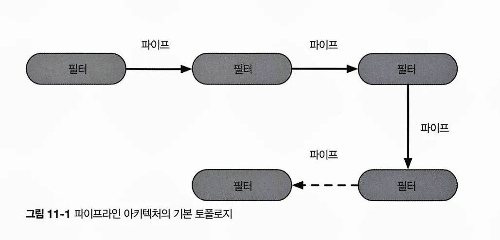
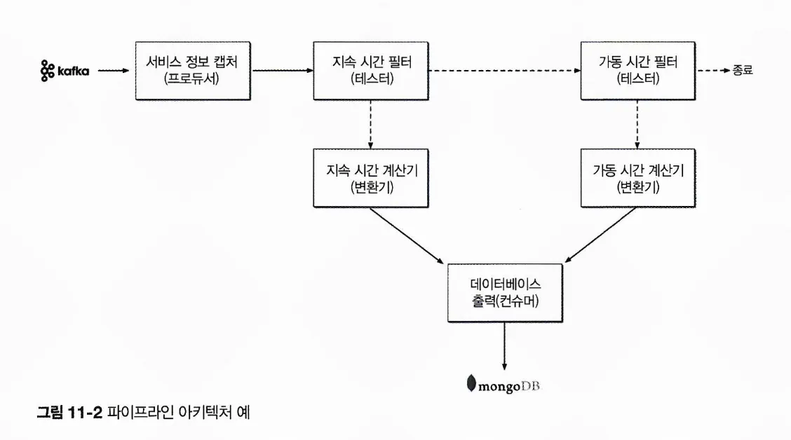
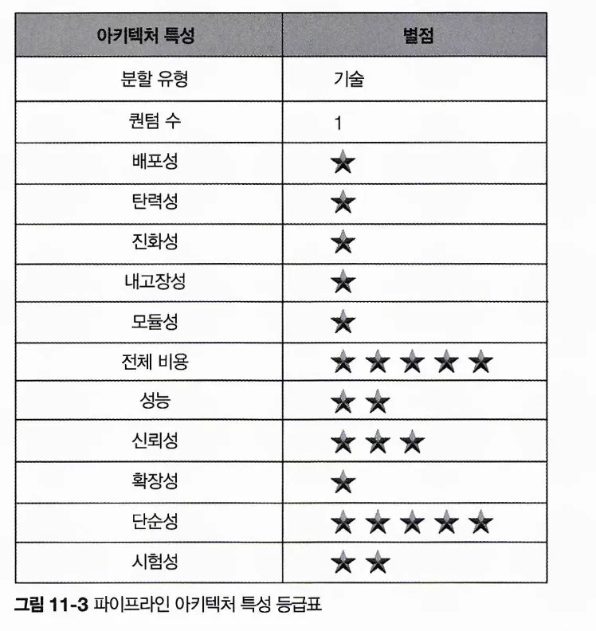

# CHAPTER 11 파이프라인 아키텍처 스타일
> 파이프라인 아키텍처는 소프트웨어 아키텍처에서 끊임없이 등장하는 기본적인 아키텍처 스타일임. 개발자와 아키텍트가 기능을 개별 파트로 분리하기로 결저정하는 순간부터 이 패턴이 수반됨.
대부분의 개발자는 이 아키텍처를 Bash나 Zsh 같은 유직스 터미널 쉘 언어의 기초 원리임을 알고 있음. 
## 11.1 토폴로지
파이프라인 아키텍처는 다수의 파이프와 필터로 구성됨

파이프와 필터는 특정한 방식으로 조정되며, 보통 필터 간 단방향 통신은 점대점 방식으로 구성함

### 11.1.1 파이프

: 한 소스에서 입력을 받아 다른 소스로 출력을 내는, 필터 간 통신 채널

- 성능상 이유로 보통 단방향, 점대점 방식으로 구성함.
- 파이프를 오가는 페이로드의 데이터는 어떤 포맷이라도 가능하지만, 아키텍트는 고성능에 유리한 적은 양의 데이터를 선호함

### 11.1.2 필터

- 자기 완비형(self-contained)이고, 다른 필터와 독립적이며, 일반적으로 무상태성임.
- 한 가지 태스크만 수행하므로 복합 태스크는 여러 필터를 이어 붙여 처리하면 됨
- 네 종류
    1. 프로듀서
        
        : 시작점. 아웃바운드만 있어서 소스라고도 함
        
    2. 변환기
        
        : 입력을 받아 필요시 일부 또는 전체 데이터를 변환한 후, 그 결과를 아웃바운드 파이프로 전달함. 함수형 프로그래밍의 맵.
        
    3. 테스터
        - 입력을 받아 하나 이상의 기준에 대해 테스트를 하고 그 결과에 따라 필요시 결과를 생상함. 함수형 프로그래밍의 리듀스
    4. 컨슈머
        - 파이프라인 흐름의 종착역
        - 파이프라인 프로세스의 최종 결과를 데이터베이스에 저장하거나 유저 인터페이스 화면에 표시함
- 각 파이프와 필터는 단방향이고 단순해서 얼마든지 조합할 수 있음

## 11.2 예제
전자 데이터 교환(EDI) 도구

; 파이프와 필터로 한 종류의 문서를 다른 종류의 문서로 변환함

ETL 도구

; 다른 데이터베이스나 데이터소스로 데이터를 변환하여 플릴 때 파이프라인 아키텍처를 이용함

**다양한 서비스의 텔레메트리(원격 계측) 정보를 아파치 카프카에 스트리밍하는 예제**

- 서비스 정보 캡처(프로듀서) 필터는 카프카 토픽을 구독하여 서비스 정보를 받아 이 데이터를 지속 시간 필터라는 테스터 필터에 보내고, 카프카에서 받아온 데이터가 서비스 요청 지속 시간(밀리초)과 연관되어있는지 판단함
- 서비스 정보 필터 - 토픽에 연결하는 일만 신경 씀
- 지속 시간 필터 - 데이터 검증 후 필요시 다음 파이프에 보내는 작업만 함
    - 서비스 요청 지속 시간과 관련 있으면 지속 시간 계산기(변환기) 필터로 전달
    - 관련이 없으면 가동 시간 필터(테스터)로 전달, 가동 시간 메트릭과 관련 있는지 체크
        - 관련이 없으면, 파이프라인 즉시 종료
        - 관련이 있으면, 가동 시간 계산기(변환기) 필터로 보내 해당 서비스의 가동 시간 메트릭을 계산
    - 두 변환기는 수정된 데이터를 데이터베이스 출력 컨슈머로 보내 몽고DB에 저장함

→ 파이프라인 아키텍처의 확장성을 잘 나타냄. 데이터베이스 접속 대기 시간 처럼 새로 수집된 메트릭을 데이터베이스에 전달해야 할 경우, 간단히 가동 시간 필터 다음에 테스트 필터를 하나 더 추가하면 됨.

## 11.3 아키텍처 특성 등급

- 파이프라인 아키텍처 스타일은 애플리케이션 로직을 필터 타입(프로듀서, 테스터, 변환기, 컨슈머)에 따라 나누는, 기술 분할 아키텍처임.
- 보통 모놀리식 형태로 구현/배포하므로 아키텍처 퀀텀은 언제나 1
- 주요 강점
    - 전체 비용 및 단순성
        
        : 모놀리식에 가깝기 때문에 분산 아키텍처 스타일에 수반되는 복잡도가 없고, 단순해서 알기 쉽고 구축 및 유지보수 비용도 적게 듬. 
        
- 배포성, 시험성
    
    : 필터를 통한 모듈성이 더 우수하므로 레이어드 아키텍처보다 조금 나음
    
- 신뢰성
    
    : 레이어드 아키텍처와 마찬가지로 분산 아키텍처에서 자주 목격되는 네트워크 트래픽, 대역폭 부족, 레이턴시 탓
    
- 탄력성, 확장성
    
    : 모놀리식 배포. 확장을 하려면 대부분 멀티스레딩, 내부 메시징을 비롯해 갖가지 병렬 처리 프랙티스와 기법이 동원됨. 
    
- 내고장성
    
    : 모놀리식 배포 탓에, 또 부족한 아키텍처 모듈성 때문에 내고장성도 별로. 어느 한 작은 파트에 OOM이 발생하면 애플리케이션 전체적으로 영향을 받고 충돌이 발생함