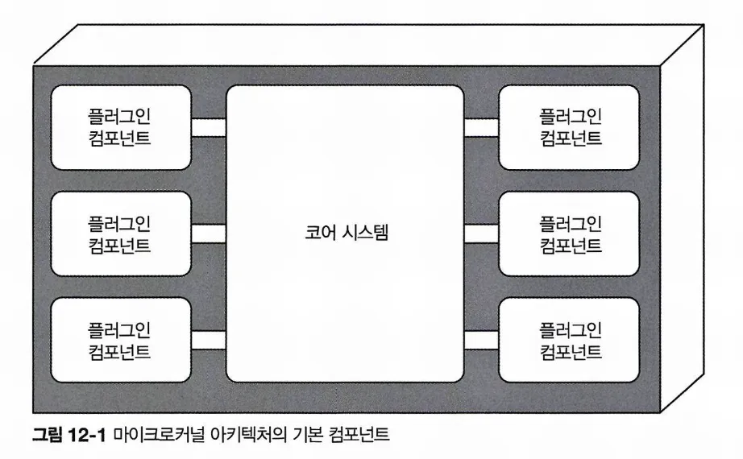
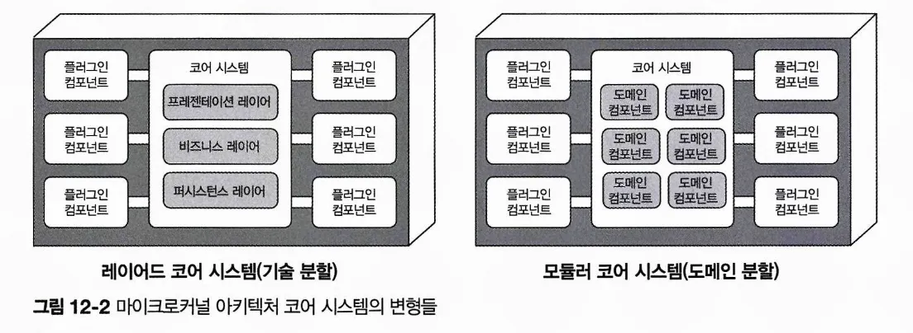
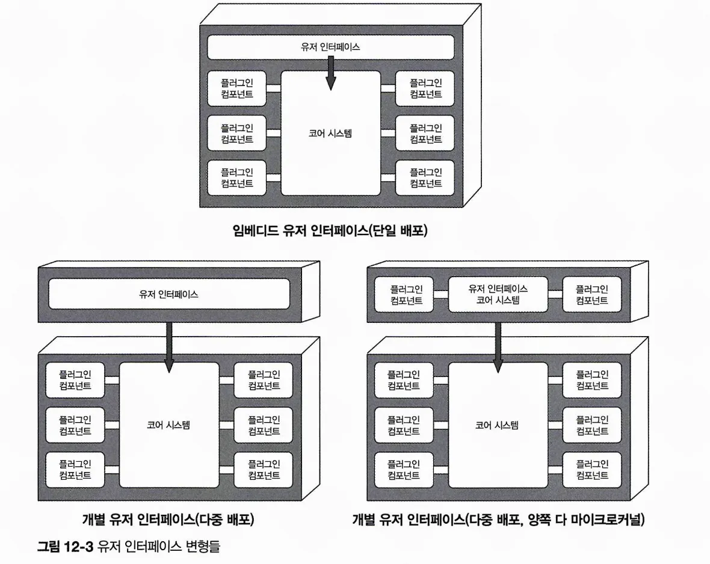
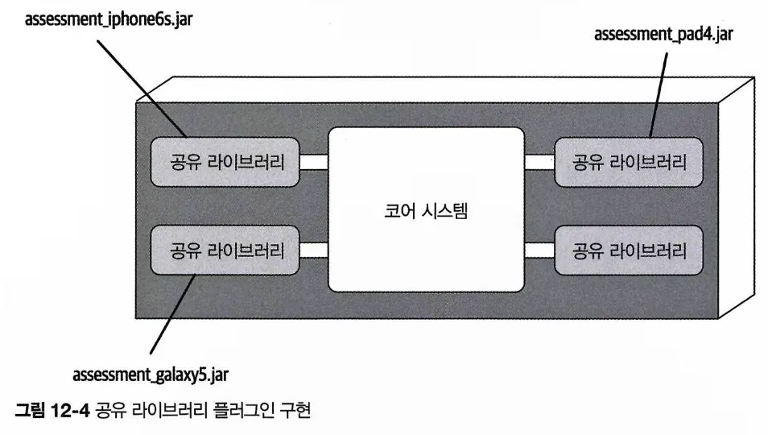
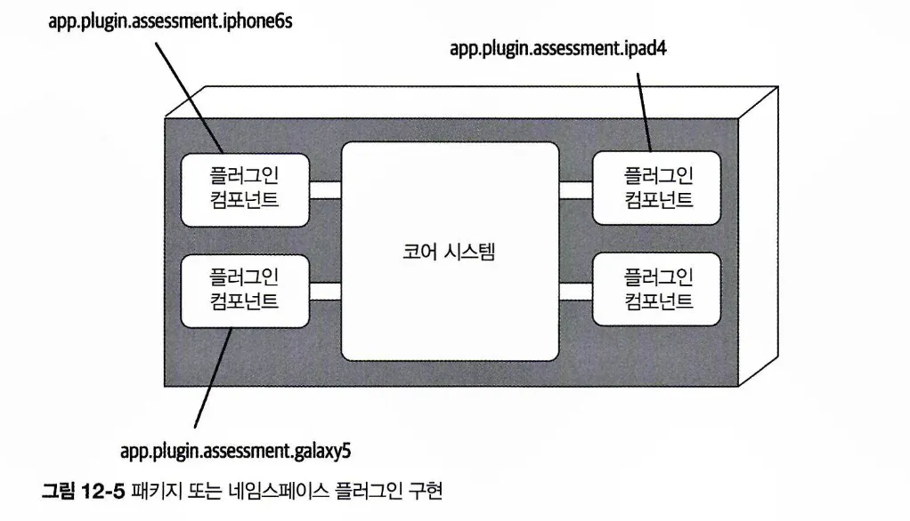
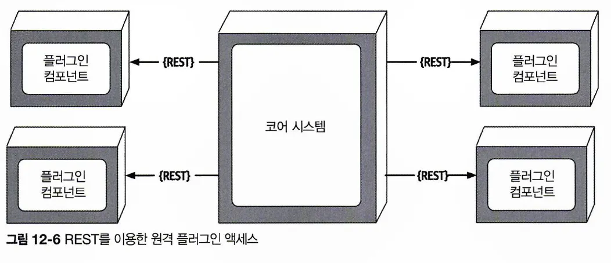
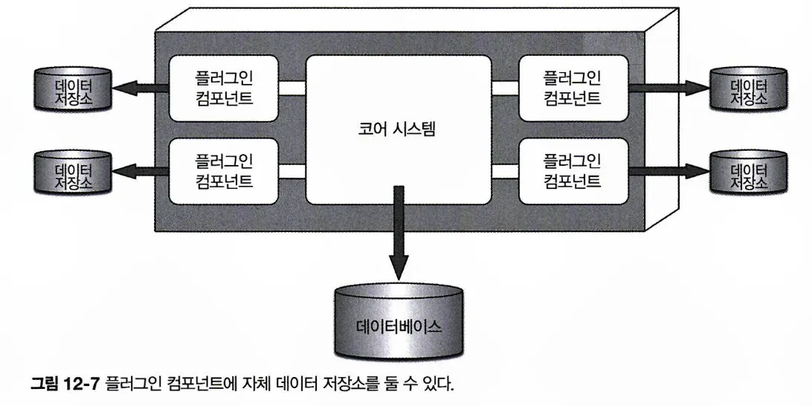
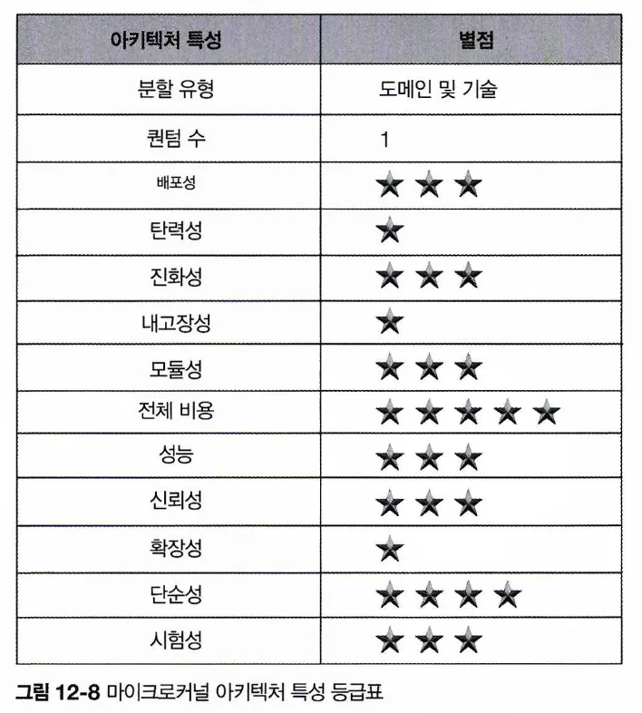

# CHAPTER 12 마이크로커널 아키텍처 스타일
> (단일 모놀리식 배포 단위로 패키징해서 다운로드 및 설치가 가능하며, 보통 고객 사이트에서 서드파티 제품으로 설치되는) 제품 기반 애플리케이션에 적합하며, 비제품 고객 비즈니스 애플리케이션에서도 많이 사용됨.
## 12.1 토폴로지
마이크로커널 아키텍처 스타일은

코어 시스템과 플러그인 컴포넌트라는 두 가지 아키텍처 요소로 구성된 비교적 단순한 모놀리식 아키텍처임. 

- 애플리케이션 로직은 독립적인 플러그인 컴포넌트와 기본 코어 시스템에 골고루 분산되어 확장성, 적응성, 애플리케티션 기능 분리, 커스텀 처리 등을 수행함.

### 12.1.1 코어 시스템

- 시스템을 실행시키는 데 필요한 최소한의 기능으로 정의함
- 이클립스 IDE 가 좋은 예
    - 이클립스 코어 시스템은 파일을 열고, 텍스트를 고치고, 다시 파일을 저장하는 기본적인 텍스트 에디터에 불과
    - 플러그인을 추가해야 비로소 쓸 만한 제품이 됨.
- 다른 관점에서, 커스텀 처리가 거의/전혀 필요 없는, 애플리케이션을 관통하는 정상 경로(일반적인 처리 흐름)라고 정의할 수 있음
- 시스템의 순환 복잡도를 없애고 별도의 플러그인 컴포넌트를 장착하면 확장성, 유지보수성은 물론 시험성도 좋아짐.
- 규모와 복잡도에 따라 레이어드 아키텍처나 모듈러 모놀리스로 구현할 수 있음. 경우에 따라 코어 시스템을 별도 배포하는 도메인 서비스로 나누어 서베스별 도메인에 특정한 플러그인 컴포넌트를 둘 수도 있음
- 어떤 경우에도 전체 모놀리스 애플리케이션은 하나의 데이터베이스를 공유하는 것이 보통임

- 코어 시스템의 프레젠테이션 레이어는 코어 시스템에 내장하거나 별도의 UI로 구현하고 코어 시스템은 백엔드 서비스를 제공함

→ 코어 시스템에 대해 프레젠테이션 레이어를 구성하는 세 가지 변형

### 12.1.2 플러그인 컴포넌트

: 특수한 처리 로직, 부가 기능, 그리고 코어 시스템을 개선/확장하기 위한 커스텀 코드가 구현된 스탠드얼론 컴포넌트임

- 변동성이 매우 큰 코드를 분리하여 애플리케이션 내부의 유지보수성, 시험성을 높이는 것
- 이상적인 플러그인 컴포넌트는 상호 독립적이며 의존성이 없음
- 플러그인 컴포넌트와 코어 시스템은 일반적으로 점대점 통신을 함.
    
    코어 시스템에 플러그인을 연결하는 ‘파이프’는 대부분 플러그인 컴포넌트의 진입점 클래스를 호출하는 메서드나 함수 코드임
    
- 컴파일 기반 또는 런타임 기반으로 만들 수 있음
    - 런타임 플러그인 컴포넌트 - 런타임에 코어 시스템이나 다른 플러그인을 재배포하지 않고도 바로 추가/삭제가 가능하며, 자바 OSGi, 펜초즈, 직소, 프리즘 등의 프레임워크를 통해 관리함
    - 컴파일 기반 컴포넌트 - 관리하기는 편하지만, 변경, 추가, 삭제 시 전체 모놀리식 애플리케이션을 재배포해야 함
- 점대점 플러그인 컴포넌트 - 공유 라이브러리, 패키지명, 네임스페이스로 구현할 수 있음
    
    
    
- 각 플러그인 컴포넌트를 코드베이스나 IDE 프로젝트 내부의 개별 네임스페이스 또는 패키지명으로 구현하면 더 알기 쉬움.
    
    네임스페이스는 app.plugin.<도메인>.<콘텍스트> 포맷으로 명명하는 게 좋음
    
    ex) app.plugin.assessment.iphone6s
    
    - 두번째 노드; 이 컴포넌트가 플러그인이구나
    - 세번째 노드; 도메인. 용도에 맞게 플러그인 컴포넌트 구성 가능
    - 네번째 노드; 플러그인의 특정 콘텍스트를 나타냄. 변경 또는 테스트할 제품 플러그인을 더 쉽게 찾을 수 있음
    
    
- 각 플러그인을 스탠드얼론 서비스로 만들어 REST나 메시징 등 다른 방법으로 호출하는 방법
    
    코어 시스템이 모놀리식이므로 여전히 단일 아키텍처 퀀텀. 
    
    모든 요청이 무조건 코어 시스템을 거쳐 각 플러그인 서비스로 흘러가는 구조
    
    
    
    - 플러그인 컴포넌트를 개별 서비스로 구현해서 원격 액세스하는 방법은 전체 컴포넌트의 커플링이 낮아져 확장성과 처리량이 개선되고, 특수한 프레임워크 없이도 런타임 변경이 가능한 장점이 있음
    - 플러그인과 비동기 통신도 가능한데, 경우에 따라 전체 유저 반응성을 엄청나게 끌어올릴 수 있음
    - 단점) 원격 플러그인에 접속하려면 마이크로커널 아키텍처를 모놀리식 아닌 분산 아키텍처로 바꿔야 하는데, 대부분의 서드파티 온프렘 제품은 그렇게 구현/배포하기가 쉽지않고 전반적으로 복잡도와 비용이 높아져 전체 배포 토폴로지가 상당히 난해해짐
- 데이터베이스를 변경하는 행위는 코어 시스템에만 영향을 미치고 플러그인 컴포넌트에는 아무 영향도 끼치지 않으므로 플러그인은 자기만 액세스 가능한 데이터 저장소를 따로 가질 수 있음
    
    

## 12.2 레지스트리
코어 시스템은 어떤 플러그인을 사용할 수 있는지, 그 플러그인을 가져오려면 어떻게 해야 하는지 알고 있어야 함. 

가장 일반적인 구현 방법. **플러그인 레지스트리를 경유하는 것**

레지스트리에는 플러그인 명칭, 데이터 계약, 세부 원격 액세스 프로토콜 등 각 플러그인 모듈에 관한 정보가 있음

- 코어 시스템이 소유한 내부 맵 구조처럼 단순할 수도 있고, 레지스트리 및 디스커버리 도구가 코어 시스템이나 외부 배포된 시스템에 내장된 복잡한 형태일 수도 있음

## 12.3 계약
플러그인 컴포넌트와 코어 시스템 간의 계약은 보통 플러그인 컴포넌트의 도메인 단위로 표준화되어 있고, 플러그인 컴포넌트가 수행하는 기능 및 입출력 데이터는 계약에 명시되어 있음

서드파티 회사가 개발한 플러그인 컴포넌트의 계약을 마음대로 바꿀 수 없을 때에는 보통 커스텀 계약을 사용하며, 일반적으로 코어 시스템이 각 플러그인별 코드를 필요로 하지 않도록 플러그인 계약과 우리가 정한 표준 계약 간의 어댑터를 만듬

플러그인 계약은 플러그인과 코어 시스템이 서로 주고받는 XML, JSON, 또는 객체로 구현함.

## 12.4 실제 용례
이클립스 IDE, PMD, 지라, 젠킨스 등 많은 소프트웨어 개발/릴리스 도구가 마이크로커널 아키텍처를 사용해서 개발됨

크롬, 파이어폭스 같은 인터넷 웹 브라우저도 마이크로커널 아키텍처를 응용한 제품으로, 각종 뷰어와 플러그인을 장착하면 코어 시스템에 해당하는 기본 브라우저에 없는 부가 기능을 덧붙일 수 있음

대규모 비즈니스 애플리케이션 예제

보험금 청구건 처리하는 보험 회사 시스템

- 차 앞 유리가 바위에 부딪쳐 파손됐을 경우 무료로 유리를 갈아주는 관할 구역도 있지만 그렇지 않은 곳도 있음
    
    표준 청구 프로세스의 가능한 경우의 수는 거의 무한대에 가까움
    
- 보험금 청구 프로세스는 관할 구역마다 보험금 청구 시 허용/금지된 규칙과 규정이 제각각이기때문에 아주 복잡함.
- 관할 구역별 보험금 청구 규칙을 별도의 스탠드얼론 플러그인 컴포넌트에 보관하는 것. → 다른 시스템 파트에 영향을 주지 않고 특정 관할 구역의 규칙을 추가, 삭제, 변경할 수 있음. 관할 구역을 새로 추가하거나 기존 관할 구역을 삭제해도 다른 시스템 파트에는 영향이 없음.
    
    코어 시스템은 바뀔 일이 거의 없는, 청구건을 접수 받아 처리하는 표준 프로세스가 될 것.

## 12.5 아키텍처 특성 등급

- 강점) 단순성, 전체 비용
- 약점) 확장성, 내고장성
- 퀀텀 1; 모든 요청은 코어 시스템을 통해 유입되어 독립적인 플러그인 컴포넌트로 흘러감
- 도메인 분할, 기술 분할이 모두 가능한 유일한 아키텍처 스타일임
- 시험성, 배포성, 신뢰성 3; 기능을 독립적인 플러그인 컴포넌트로 분리할 수 있으므로
- 모듈성, 확장성 ; 독립적인 자기 완비형 플러그인 컴포넌트를 통해 기능을 추가, 삭제, 변경할 수 있고, 덕분에 애플리케이션을 개선/확장하는 작업이 비교적 용이해 팀 차원에서 더욱 신속하게 변경에 대응할 수 있음
- 성능 ; 대부분 규모가 작고 레이어드 아키텍처처럼 갈수록 커지지 않음. 싱크홀 안티패턴 때문에 고생할 일도 없으며, 불필요한 기능은 해제하여 처리 흐름을 간소화할 수 있음