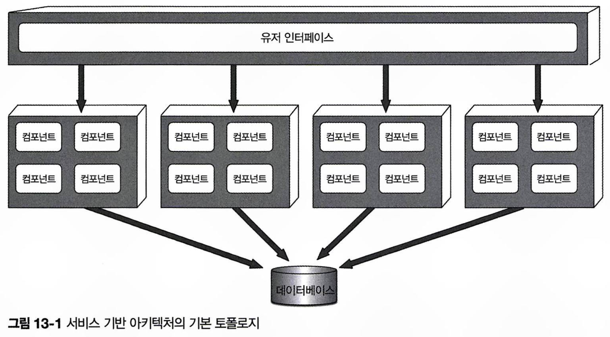

# 서비스 기반 아키텍처스타일

서비스 기반 아키텍처는 마이크로서비스 아키텍처의 일종으로, 유연성과 실용성을 갖춘 아키텍처 스타일입니다.  
마이크로서비스나 이벤트 기반 아키텍처처럼 분산 아키텍처이지만, 복잡성과 비용이 비교적 낮아 비즈니스 애플리케이션에서 널리 사용됩니다.

## 13.1 토폴로지

서비스 기반 아키텍처는 분산 레이어 구조로, 각각의 유저 인터페이스와 원격 서비스, 모놀리식 데이터베이스로 구성됩니다.

서비스는 어플리케이션의 일부로써 하나의 큰 단위로 분리되어 별도로 배포됩니다.  
여러 서비스가 하나의 모놀리식 데이터베이스를 공유하며, 일반적으로 애플리케이션 서비스는 4~12개 정도입니다.  
서비스는 단일 인스턴스로 배포되지만, 확장성 등의 필요에 따라 여러 인스턴스를 둘 수 있습니다.  
따라서 유저 인터페이스로 인입된 사용자 요청을 여러 서비스 인스턴스들에 적절히 전달하기 위해서 부하 분산 기능이 필요합니다.

서비스 기반 아키텍처에서는 유저 인터페이스 외부에서 원격 액세스 프로토콜을 통해 서비스에 접속할 수 있습니다.  
일반적으로 REST를 사용하지만, 메시징, RPC, SOAP도 가능합니다.  
유저 인터페이스는 프록시나 게이트웨이로 구성된 API 레이어를 통해 서비스에 접근하거나, 서비스 로케이터 패턴을 통해 직접 엑세스 합니다.  
이 아키텍처는 모놀리식과 동일하게 중앙 공유 데이터베이스를 사용하기 때문에, SQL 쿼리와 조인만으로도 데이터 처리가 가능합니다.  
서비스의 수가 적기 때문에 데이터베이스 커넥션 문제는 드물지만, 데이터베이스 변경은 중요한 이슈가 될 수 있습니다.

## 13.2 토폴로지 변형

서비스 기반 아키텍처는 유연성이 뛰어나 다양한 변형이 가능합니다.  
단일 모놀리식 유저 인터페이스를 여러 유저 인터페이스 도메인으로 나누거나, 각 도메인 서비스에 맞게 구분할 수도 있습니다.

단일 모놀리식 데이터베이스도 마찬가지로 개별 데이터베이스로 구분하거나, 도메인 서비스에 맞게 구분 구분할 수 있습니다.  
이 때 중요한 점은, 각 데이터베이스의 도메인 데이터를 다른 도메인 서비스에서 필요로 하지 않도록 설계해야 한다는 것입니다.  
이를 통해 도메인 서비스 가이 상호 통신과 데이터 중복을 방지할 수 있습니다.

또한, 리버스 프록시나 게이트웨이로 구성된 API 레이어를 유저 인터페이스와 서비스 사이에 배치하는 것도 가능합니다.  
이를 통해 도메인 서비스의 기능을 외부에서 접근할 수 있게 하거나, 메트릭, 보안, 서비스 디스커버리 등의 공통 관심사를 API 레이어에서 통합해서 관리할 수 있습니다.

## 13.3 서비스 설계 및 세분도

서비스 기반 아키텍처에서 각 도메인 서비스는 대개 큰 단위로 구성되므로, 일반적으로 API 엑세스 퍼사드(access facade) 레이어, 비즈니스 레이어, 퍼시스턴스 레이어로 이루어진 레이어드 아키텍처 스타일로 설계됩니다.  
또한 서브도메인을 활용하여 각 도메인 서비스를 분할하는 방식도 자주 사용됩니다.

도메인 서비스는 유저 인터페이스에서 비즈니스 기능을 호출하기 위해 API 액세스 퍼사드를 필요로 합니다.  
이 퍼사드는 유저 인터페이스에서 들어오는 비즈니스 요청을 조정(오케스트레이트)하는 역할을 합니다.  
예를 들어, 주문 요청이 들어오면 OrderService의 API 액세스 퍼사드가 이를 받아서 주문 처리, 주문 ID 생성, 결제 처리, 재고 정보 업데이트에 이르는 일련의 비즈니스 처리를 조율합니다.  
서비스 기반 아키텍처에서는 내부 클래스 수준으로 오케스트레이션 하는 반면, 마이크로서비스 아키텍처에서는 여러 원격 서비스를 오케스트레이트해야 하는 점이 주요 차이점입니다.

도메인 서비스는 단일 서비스 내에서 데이터 무결성을 보장하기 위해 ACID(원자성, 일관성, 격리성, 지속성) 트랜잭션을 사용합니다.  
그러나 마이크로서비스처럼 분산된 아키텍처에서는 BASE(기본적 가용성basic availability, 소프트 상태soft sate, 최종 일관성eventual consistency) 트랜잭션을 사용하여 최종 일관성을 추구합니다.  
BASE 트랜잭션은 ACID 트랜잭션 수준의 데이터 무결성을 지원하지 않습니다.
예를 들어 서비스 기반 아키텍처에서 주문 처리 중 만료된 신용카드로 결제 시, 동일 서비스 내에서 원자적 트랜잭션을 사용해 데이터 롤백이 가능합니다.  
그러나 마이크로서비스 아키텍처에서는 주문과 결제의 책임이 나뉘어져 있어서, 주문을 OrderPlacement 서비스에서 생성하고 Payment 서비스에서 결제를 진행합니다.  
각 서비스 별로 별도의 DB를 운영하기 때문에 주문 데이터는 삽입되었지만 결제가 완료되지 않은 것으로 처리 되어, 데이터가 일정 시간동안 비일관적 상태가 됩니다.  
이런 경우 재고를 차감해서 결제 실패 고객을 위해 재고를 남겨둘지, 아니면 재고를 차감하지 않아서 다른 고객이 동일 제품을 주문할 수 있도록 할지 등 결정을 해야 합니다.  
이와 같이 분산 아키텍처에서 복잡한 비즈니스 프로세스를 오케스트레이트하기 위해서는 신경써야 할 문제가 많습니다.

도메인 서비스는 단위가 커서 데이터 무결성과 일관성 측면에서 유리하지만, 이로 인한 트레이드오프도 존재합니다.  
서비스 기반 아키텍처에서 OrderPlacement 기능을 수정하려면 전체 서비스를 테스트해야 하는 반면, 마이크로서비스 아키텍처에서는 작은 OrderPlacement 서비스로 영향 범위가 축소되기 때문에 해당 서비스만 테스트하면 됩니다.  
또한 서비스 기반 아키텍처는 코드가 점점 많아지기 때문에 오류 발생 가능성이 점차 높아지지만, 마이크로서비스 아키텍처는 각 서비스가 한 가지 역할만 수행하므로 각 서비스의 코드 규모가 일정 수준으로 유지됩니다.

## 13.4 데이터베이스 분할

서비스 기반 아키텍처에서는 일반적으로 4~12개의 적은 수의 서비스가 단일 모놀리식 데이터베이스를 공유합니다.  
이러한 데이터베이스 커플링으로 인해 테이블 스키마 변경 시 문제가 발생할 수 있으며, 잘못된 변경이 발생하면 모든 서비스에 영향을 미칠 수 있습니다.  
따라서 데이터베이스 변경에는 많은 노력과 조정이 필요합니다.

일반적으로 서비스 기반 아키텍처에서는 데이터베이스 테이블 스키마를 담고 있는 공유 클래스 파일(엔티티 객체)을 커스텀 공유 라이브러리에 저장해서, 도메인 서비스들이 공통으로 import해서 사용합니다.  
하지만 테이블 구조를 조금이라도 변경하면 해당 엔티티 객체를 포함한 공유 라이브러리를 수정해야 하기 때문에, 변경된 테이블을 사용하지 않는 서비스도 모두 업데이트하고 재배포해야 합니다.  
공유 라이브러리 버저닝이 일부 도움을 줄 수 있지만, 테이블 변경이 어떤 서비스에 실제로 영향을 줄지 예측하기는 어렵습니다.

데이터베이스 변경의 영향을 줄이기 위해 데이터베이스를 논리적으로 분할하고, 이를 연합 공유 라이브러리로 관리할 수 있습니다.  
예를 들어, 데이터베이스를 5개의 논리적 도메인(공통, 고객, 청구, 주문, 추적)으로 나누고, 각 도메인 서비스에서는 전용 공유 라이브러리를 사용하는 식으로 구성합니다.  
이렇게 하면 특정 도메인(예: 청구)의 테이블을 변경해도, 해당 라이브러리를 사용하는 서비스(청구 서비스)만 영향을 받으며 다른 서비스에는 영향이 없습니다.

이 때 모든 서비스가 공통 도메인과 이에 대한 공통 엔티티 라이브러리를 사용하는 것이 흔한 패턴입니다.  
공통 테이블을 변경하려면 관련된 모든 서비스를 미리 조율해야 합니다.  
변경의 영향을 줄이기 위해, 공통 엔티티 객체를 버전 관리 시스템에서 락킹하고, 수정 권한을 데이터베이스 팀에게만 부여하는 방식으로 변경을 통제할 수 있습니다.

## 13.5 아키텍처 예시

서비스 기반 아키텍처의 유연함을 전자 제품 재활용 시스템의 예시를 통해 확인할 수 있습니다.  
중고 전자 제품 재활용 과정은 다음과 같습니다:

1. 고객이 보상가를 문의(견적).
2. 고객이 보상가에 동의하면 제품을 회사로 발송(수취).
3. 회사는 제품 상태를 평가(감정).
4. 상태가 좋을 경우, 고객에게 보상가를 지급(회계).
5. 고객은 웹사이트를 통해 진행 상황을 확인할 수 있음(제품 상태 조회).
6. 감정 결과에 따라 제품을 해체하여 재활용하거나 재판매(재활용).
7. 회사는 재활용 성과에 따라 정기적으로 재무 리포트를 확인(리포팅).

전자 제품 재활용 시스템을 서비스 기반 아키텍처로 설계하여 각 도메인(견적, 수취, 재활용, 회계)을 독립적인 서비스로 구현할 수 있습니다.  
높은 처리량이 필요한 서비스(견적, 제품 상태 조회)만 확장하고, 나머지 서비스는 단일 인스턴스로 유지할 수 있어서 효율적입니다.

또한 유저 인터페이스 애플리케이션은 각 도메인(견적, 수취, 재활용 및 회계)과 잘 연합되어 있어, 외부 고객은 내부 기능(수취, 재활용 및 회계)에 접근할 수 없어져서 내고장성, 확장성, 보안이 강화됩니다.  
데이터베이스는 외부 고객 처리용과 내부 처리용으로 물리적으로 분할되어 있으며, 데이터 보안을 위해 내부 데이터와 기능은 별도의 네트워크 영역에 배치했습니다.  
방화벽을 통해 단방향 접근만을 허용하여 내부 서비스는 고객 정보를 조회/수정할 수 있지만, 외부 서비스는 내부 데이터로 접근할 수 없습니다.  
데이터베이스에 따라서 내부 테이블을 미러링하고 동기화할 수 있는 방법도 있습니다.

이 예제는 서비스 기반 아키텍처의 장점인 **민첩성, 시험성, 배포성, 확장성, 내고장성, 보안**을 잘 보여줍니다.  
예를 들어, 감정 서비스는 신제품 출시에 따라 감정 규칙이 자주 변경될 것이므로, 이를 단일 도메인 서비스로 격리하면 다음과 같은 이점을 얻을 수 있습니다:

- **민첩성**: 변화에 빠르게 대응할 수 있음.
- **시험성**: 테스트가 쉽고 완전하게 수행 가능함.
- **배포성**: 배포 난이도와 리스크를 줄이며 빈도를 높일 수 있음.

이러한 특성 덕분에 시스템의 유지보수와 관리가 용이해집니다.

## 13.6 아키텍처 특성 등급

| 아키텍처 특성 | 별점              |
| ------------- | ----------------- |
| 분할 유형     | 도메인            |
| 퀀텀 수       | 하나 또는 여러 개 |
| 배포성        | X X X X           |
| 탄력성        | X X               |
| 진화성        | X X X             |
| 내고장성      | X X X X           |
| 모듈성        | X X X X           |
| 전체 비용     | X X X X           |
| 성능          | X X X             |
| 신뢰성        | X X X X           |
| 확장성        | X X X             |
| 단순성        | X X X             |
| 시험성        | X X X X           |

서비스 기반 아키텍처는 기술적 관심사 대신, 도메인을 중심으로 구성된 아키텍처입니다.  
전자 제품 재활용 애플리케이션 예시에서, 각 서비스는 특정 도메인에 한정된 별도의 배포 소프트웨어 단위를 가집니다.  
따라서 도메인 변경 시, 해당 서비스와 유저 인터페이스에만 영향을 미치며 다른 부분은 수정할 필요가 없습니다.

이 아키텍처는 분산 아키텍처로, 퀀텀은 하나 또는 그 이상일 수 있습니다.  
만약 개별 배포된 서비스가 동일한 데이터베이스나 유저 인터페이스를 공유하면, 전체 시스템의 퀀텀은 1입니다.  
하지만, 유저 인터페이스와 데이터베이스가 분리되고 연합되는 방식에 따라 여러 퀀텀이 생길 수 있습니다.  
예를 들어, 전자 제품 재활용 시스템에서는 퀀텀이 2개로 나뉩니다:

1. **고객 대면 애플리케이션 부문**: 고객 유저 인터페이스, 데이터베이스, 견적 및 품목 상태 서비스 세트 포함.
2. **내부 작업 부문**: 내부 유저 인터페이스, 데이터베이스, 수취, 감정, 재활용 서비스 세트 포함

서비스 기반 아키텍처는 별점 5개짜리 특성은 없지만, 중요한 영역들에서 높은 점수를 받습니다.

- **민첩성**: 신속한 변경이 가능.
- **시험성**: 도메인 범위가 한정되어 테스트 커버리지가 향상.
- **배포성**: 덩치 큰 모놀리스보다 덜 위험하게, 더 자주 배포 가능.

이 세 가지 특성 덕분에 시장 출시를 앞당길 수 있고, 신기능과 버그 수정이 빨라집니다.  
또한, 내고장성과 전체 애플리케이션 가용성도 높습니다.  
서비스는 자기 완비형이며, 서비스 간 통신이 적어 특정 도메인 서비스에 문제가 발생해도 다른 서비스에 영향이 없기 때문에 내고장성에 별점 4개를 받았습니다.

서비스를 크게 나누기 때문에 확장성은 별점 3개, 탄력성은 별점 2개를 받았습니다.  
서비스 기반 아키텍처는 프로그램 방식으로 확장성과 탄력성을 추구할 수 있지만, 마이크로서비스처럼 잘게 나누는 것에 비해서는 서비스 간 중복이 많아, 리소스와 비용 면에서 비교적 비효율적입니다.  
다만 처리량이나 failover 개선이 필요하지 않다면 보통 서비스 인스턴스는 하나만 있어도 충분합니다.  
전자 제품 재활용 애플리케이션의 경우, 다수의 고객을 처리하기 위해 견적 및 품목 상태 서비스는 확장이 필요하지만, 다른 서비스는 단일 인스턴스로 충분합니다.  
이 경우 단일 인메모리 캐시와 데이터베이스 커넥션 풀링을 더 간편하게 적용할 수 있습니다.

서비스 기반 아키텍처는 단순성과 비용 효율성 측면에서 마이크로서비스, 이벤트 기반 아키텍처 등과 같은 복잡한 분산 아키텍처와 차별화됩니다.  
구조가 단순해서 구현이 쉽고 비용이 낮지만, 이로 인해 배포성, 내고장성, 모듈성 등 분산 아키텍처의 강점들이 조금씩 부족해진다는 트레이드오프가 따릅니다.

서비스 기반 아키텍처는 도메인 서비스를 큰 단위로 나누어 관리하기 때문에 네트워크 트래픽과 대역폭을 줄여 신뢰성을 확보할 수 있습니다.  
이로 인해 분산 트랜잭션도 적기 때문에 네트워크 안정성이 상대적으로 우수합니다.

## 13.7 언제 이 아키텍처 스타일을 사용하는가

서비스 기반 아키텍처는 유연성과 비용 효율성 덕분에 실용적인 선택지로 평가받습니다.  
더 강력한 분산 아키텍처 스타일도 있지만, 해당 아키텍처들은 그만큼 비용이 크게 증가하며 실용성이 떨어질 수 있습니다.

이 아키텍처는 도메인 단위로 큰 서비스를 나누어 관리하기 때문에 도메인 주도 설계와 잘 어울립니다.  
서비스는 각 도메인에 맞춰져 있어 단일 소프트웨어 단위로 구분되기 때문에, 도메인의 변경이 용이합니다.

분산 아키텍처에서는 ACID 트랜잭션이 아닌 최종 일관성에 기반한 트랜잭션에 의존하기 때문에, 데이터베이스 트랜잭션 관리가 어렵습니다.  
하지만 서비스 기반 아키텍처는 도메인 서비스가 큰 단위로 구성되기 때문에, 다른 분산 아키텍처에 비해 ACID 트랜잭션이 더 잘 유지됩니다.  
물론 유저 인터페이스나 API 게이트웨이가 여러 도메인 서비스를 오케스트레이션 하는 경우 사가와 BASE 트랜잭션을 사용해야 할 수 있습니다.  
하지만 대부분의 트랜잭션은 특정 도메인 서비스 내에서 처리되므로 전통적인 커밋/롤백 트랜잭션이 가능합니다.

또한 서비스 기반 아키텍처는 복잡하게 세분화되지 않아 적정한 수준의 모듈성을 유지할 수 있습니다.  
서비스가 더 작게 나뉠수록 오케스트레이션과 코레오그래피 이슈가 발생합니다. - 오케스트레이션은 중재자를 통한 조율 방식을 의미하고, 코레오그래피는 서비스 간 자율적 소통 방식을 통한 조율을 의미합니다.  
서비스 기반 아키텍처는 큰 단위로 구성되므로, 다른 분산 아키텍처만큼 정교한 조율이 필요하지 않습니다.
