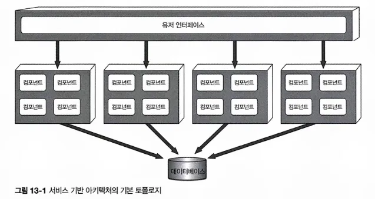

# CHAPTER 13 서비스 기반 아키텍처 스타일
> 마이크로서비스 아키텍처 스타일의 일종
아키텍처가 유연해서 가장 실용적인 아키텍처 스타일 중 하나임. 
마이크로서비스나 이벤트 기반 아키텍처와 마찬가지로 분산 아키텍처지만 비교적 덜 복잡하고 비용이 많이 들지 않아서 많은 비즈니스 관련 애플리케이션에서 널리 채택된 아키텍처임.
## 13.1 토폴로지

기본 토폴로지는 각각 따로 배포된 유저 인터페이스와 원격 서비스, 그리고 모놀리스 데이터베이스로 이루어진 대규모 분산 레이어 구조임

- 서비스(보통 도메인 서비스라고 함) - 큼지막한 단위로 분리해 별도로 배포하는 ‘애플리메이션의 일부’임
- 서비스를 배포하는 방식 자체는 여느 모놀리식 애플리케이션과 동일하므로 컨테이너화가 필수는 아님
- 여거 서비스가 단일 모놀리식 데이터베이스를 공유하므로 애플리케이션 서비스는 다 합해도 4~12개, 평균 7개 정도임.
    - 각각 단일 인스턴스로 배포하지만, 확장성, 내고장성, 처리량 요구사항에 따라 인스턴스를 여럿 둘 수도 있음. 서비스 인스턴스를 다수 생성하여 배포하려면 유저 인터페이스로 유입된 요청이 가용한 서비스 인스턴스로 흘러갈 수 있도록 유저 인터페이스와 도메인 서비스 간의 부하 분산 기능이 필요함.
- 서비스는 원격 액세스 프로토콜로 유저 인터페이스 외부에서 접속할 수 있음
    - 프로토콜은 일반적으로 REST를 많이 쓰지만, 메시징, 원격 프로시저 호출(RPC), SOAP도 사용 가능함.
    - 유저 인터페이스(또는 다른 외부 요청)는 프록시나 게이트웨이로 구성된 API 레이어를 통해 서비스에 접속할 수 있지만, 대개는 서비스 로케이터 패턴(service locator pattern)에 따라 유저 인터페이스, API 게이트웨이, 프록시에 내장된 유저 인터페이스를 직접 액세스 함
- 서비스 기반 아키텍처는 중앙 공유 데이터베이스를 사용한다는 특징이 중요함.
    
    → 서비스는 기존 모놀리식 레이어드 아키텍처와 동일한 방식으로 SQL 쿼리와 조인 기능을 사용하면 됨.
## 13.2 토폴로지 변형
서비스 기반 아키텍처 스타일은 특유의 유연성 때문에 정말 다양한 변형이 존재함. 

- [그림13-1]의 단일 모놀리식 유저 인터페이스는 다시 여러 유저 인터페이스 도메인으로 나눌 수 있고, 각 도메인 서비스에 맞게 나눌 수도 있음.

    

- 단일 모놀리식 데이터베이스 역시 개별 데이터베이스로 분리할 수 있고 각 도메인 서비스 전용 데이터베이스들로 쪼갤 수도 있음.
    
    포인트, 각 데이터베이스에 있는 도메인 데이터를 다른 도메인의 서비스가 필요로 하지 않도록 설계하는 것. → 도메인 서비스 간 상호 통신을 방지하고 데이터베이스 간의 중복 데이터를 방지할 수 있음. 
    
    
    
- 리버스 프록시 또는 게이트웨이로 구성된 API 레이어를 유저 인터페이스와 서비스 사이에 구성할 수도 있음.
    
    도메인 서비스의 기능을 외부 시스템에 표출하거나 공통 관심사를 통합해서 유저 인터페이스 밖으로 떼어낼 경우에도 유용한 방법임. 
    
    
## 13.3 서비스 설계 및 세분도
서비스 기반 아키텍처의 도메인 서비스는 보통 단위가 크기 때문에 도메인 서비스를 API 퍼사드 레이어, 비즈니스 레이어, 퍼시스턴스 레이어로 구성된 레이어드 아키텍처 스타일로 설계하는 것이 일반적임. 

> **facade(퍼사드)?** 
직역: 건물의 정면 외벽 부분.
**퍼사드 패턴;** 어떠한 소프트웨어의 복잡하고 양이 많은 라이브러리를 한 번에 관리하여 간단한 인터페이스를 제공하는 것. 
**facade API;** 이러한 특징을 API 에 적용한 것. API를 사용하는 애플리케이션 개발자로부터 복잡한 백엔드 시스템을 감추고 추상화하여, 애플리케이션 개발자가 백엔드 시스템을 비교적 간단한 API로 사용할 수 있게 하는 인터페이스라고 할 수 있음. 
참조: https://dev.gmarket.com/84
> 

모듈러 모놀리스 아키텍처 스타일처럼 서브도메인을 이용해서 각 도메인 서비스를 분할하는 방법도 많이 쓰임. 

- 서비스를 어떻게 설계하든 도메인 서비스는 유저 인터페이스에서 비즈니스 기능을 호출하기 위해 접속할 일종의 API 액세스 퍼사드(access facade)를 필요로 함. 
API 액세스 퍼사드는 유저 인터페이스를 통해 유입된 비즈니스 요청을 오케스트레이스(조정, 조율)하는 역할을 함.
    
    ex) 유저 인터페이스에서 주문이 접수되면 이 단건 요청은 OrderService 도메인 서비스의 API 액세스 퍼사드가 받아 내부에서 주문 처리, 주문 ID 생성, 결제 처리를 한 후, 주문이 완료된 제품별 재고 정보를 업데이트하는 일련의 비즈니스 요청을 오케스트레이트함. 
    
- 도메인 서비스는 세분도가 큰 까닭에 단일 도메인 서비스에서 데이터 무결성을 보장하기 위해 커밋/롤백이 수반되는 여느 ACID(원자성, 일관성, 격리성, 지속성) 데이터베이스 트랜잭션을 사용하지만, 마이크로서비스처럼 분산도가 높은 아키텍처는 서비스를 더 잘게 나누어 BASE 트랜잭션(기본적 가용성, 소프트 상태, 최종 일관성)이라고 알려진 분산 트랜잭션 기법을 사용함.
이 기법은 그 기반이 최종 일관성이므로 서비스 기반 아키텍처의 ACID 트랜잭션 레벨의 데이터 무결성은 지원하지 않음.
    
    ex) 주문 처리를 하는 서비스 기반 아키텍처 기반의 시스템. 
    어느 고객이 주문을 하고 결제 화면에서 만료된 신용카드를 사용해서 결제. → 동일한 서비스 내부에서 발생한 원자적 트랜잭션이니 데이터베이스에 추가된 데이터는 롤백해서 모두 삭제하고 해당 고객에게 더 이상 결제 진행이 불가함을 알리면 됨. 

    만약 서비스를 더 잘게 나눈 마이크로서비스 아키텍처에서 이와 동일한 처리를 하려면 어떻게 해야 할까?
    가장 먼저 OrderPlacement 서비스는 주문을 접수/생성하고 주문 ID를 채번한 다음 order 테이블에 데이터를 삽입함. 모든 작업이 끝나면 이 서비스는 PaymentService를 원격 호출해서 결제 처리를 진행함. 

    그러나 신용카드 유효 기간이 만료됐으므로 결제는 불가하고 주문 처리를 진행할 수 없어 데이터는 비일관된 상태가 됨. (이미 주문 데이터는 데이터베이스에 삽입되었으마 승인은 이루어지지 않은 상태)

    → 이 상황에서 해당 주문과 관련된 재고 정보는 어떻게 처리해야할지? 주문이 성공한 것으로 보고 재고를 차감해야할지? 

    만약, 재고가 거의 바닥난 상태에서 다른 고객이 동일한 제품을 주문한다면? 새 고객이 구매를 할 수 있게 허용해야 할지, 아니면 신용카드가 만료된 고객이 주문을 마칠 수 있도록 재고를 확보해두어야할지? 

    서비스가 잘게 나뉘어진 아키텍처에서 비즈니스 프로세스를 오케스트레이트하려면 신경 써야 할 문제가 많음
    
- 도메인 서비스는 단위가 커서 데이터 무결성과 일관성 측면에서는 유리하지만 그에 못지않은 트레이드오프도 있음 

    서비스 기반 아키텍처에서 OrderPlacement의 주문 처리 기능을 변경할 일이 생기면 (결제 처리를 포함하여) 전체 서비스를 테스트해야 하지만, 마이크로 서비스 아키텍처에서는 (PaymentService 를 고칠 필요가 없이) 규모가 작은 OrderPlacement 서비스 하나만 변경 영향도가 있을 것임. 
    
    또한 서비스 기반 아키텍처는 코드가 점점 더 많이 배포될수록 (결제 처리를 비롯해) 뭔가 문제를 일으킬 소지가 커지지만, 마이크로서비스 아키텍처는 각 서비스가 한 가지 역할만 수행하므로 변경을 해도 다른 기능이 망가질 일이 거의 없음.
## 13.4 데이터베이스 분할
- 서비스 기반 아키텍처의 서비스는 주로 주어진 애플리케이션 콘텍스트에서 서비스 수(4~12개)가 적은 편이라서 보통 단일 모놀리식 데이터베이스를 공유함.

    그러나, 이러한 데이터베이스 커플링은 테이블 스키마 변경 시 문제가 될 수 있음. 

    테이블 스키마를 올바르게 변경하지 않을 경우 모든 서비스에 악영향을 미치기 때문에 데이터베이스 변경은 여러보로 노력과 조정이 필요한 값비싼 작업임.
- 서비스 기반 아키텍처에서 데이터베이스 테이블 스키마를 나타낸 공유 클래스 파일(엔티티 객체라고 함)은 전체 도메인 서비스가 함께 사용하는 커스텀 공유 라이브러리에 둠. SQL 코드도 이 라이브러리에 있음. 

    엔티티 객체가 공유하는 단일 라이브러리를 생성하는 프랙티스는 서비스 기반 아키텍처 관점에서 가장 비효율적인 구현 방법임. 
    
    테이블 구조를 조금이라도 변경할 일이 생기면 해당 엔티티 객체가 포함된 단일 공유 라이브러리도 같이 변경을 해야 하는데, 변경된 테이블의 사용 여부와 상관 없이 전체 서비스를 일제히 변경 후 재배포할 수밖에 없음. 
    
    공유 라이브러리를 버저닝하면 문제 해결에 약간 도움은 되겠지만, 메뉴얼을 독파해서 단일 공유 라이브러리를 자세히 분석해보지 않는 이상, 어느 서비스가 실제로 테이블 변경에 영향을 받을지 미리 예측하기란 어려움.
    
    
    
- 데이터베이스 변경 영향도와 리스크를 낮추는 방법
    
    ; 데이터베이스를 논리적으로 분할하고 이러한 논리 분할을 연합 공유 라이브러리를 통해 명시하는 것. 
    
    
    
    - 데이터베이스를 5개의 개별 도메인(공통, 고객, 청구, 주문, 추적)으로 논리 분할하고 도메인 서비스마다 논리 분할한 데이터베이스를 바라보는 전용 공유 라이브러리를 5개의 둔 구조.

        → 특정 논리 도메인(청구)에 속한 테이블을 변경해도 해당 엔티티와 객체가 포함된 해당 공유 라이브러리를 사용하는 서비스(즉, 청구 서비스)만 영향을 받을 뿐, 그 밖의 서비스에는 영향이 없음.
    - 모든 서비스는 공통 도메인과 이 도메인이 해당하는 공유 라이브러리 common_entities_lib를 함께 사용함. 모든 서비스의 공통 테이블을 변경하려면 먼저 공유 데이터베이스를 액세스하는 전체 서비스를 미리 조율해야함
    - 테이블(과 해당 엔티티 객체) 변경 영향도를 낮추는 한 가지 방법
        
        : 공통 엔티티 객체를 버전 관리 시스템에서 락킹하고 수정 권한을 오직 데이터베이스 팀에게만 부여하는 것임. 이렇게 해야 변경을 통제할 수 있고 모든 서비스의 공용 테이블을 변경하는 작업의 중요성이 부각됨. 
        
    
    Tip. 서비스 기반 아키텍처에서는 데이터베이스 변경을 통제하기 위해 데이터 도메인을 올바르게 정의/관리하고 데이터베이스는 가급적 논리적으로 잘게 나누는 것이 좋음.

## 13.5 아키텍처 예시 
전자 제품(ex. 아이폰, 갤럭시 스마트폰) 재활용 시스템을 예로 들어 살펴보자. 

중고 전자 제품의 재활용 처리 프로세스

1. 고객이 회사에 연락하여 자신이 소유한 중고 제품을 얼마에 보상받을 수 있는지 문의(견적)
2. 고객이 보상가에 만족하면 회사에 제품을 보내고 회사는 실물을 받음(수취)
3. 재활용 회사는 고객이 보낸 제품의 작동 상태를 꼼꼼히 평가함(감정)
4. 제품 상태가 좋을 경우 회사는 고객에게 약속한 보상가를 지불함(회계)
5. 이 과정 중 언제라도 고객은 회사 웹사이트에 접속해서 진행 상황을 확인할 수 있음(제품 상태)
6. 감정 결과에 따라 제품은 안전하게 해체 후 재활용되거나 재판매됨(재활용)
7. 회사는 재활용 성과에 따른 임시/정기 재무 리포트를 정기적으로 체크함(리포팅)

- 위에서 열거한 각 도메인 영역을 개별 배포되는 독립적인 도메인 서비스로 구현함.
- 높은 처리량이 필요한 서비스(견적, 제품 상태 서비스)만 확장하면 되므로 확장성도 충족되고, 그 밖의 서비스는 굳이 확장할 필요가 없으니 단일 서비스 인스턴스로도 충분함.
- 유저 인터페이스 애플리케이션이 각 도메인(견적, 수취, 재활용, 회계)과 잘 연합되어 있음 → 유저 인터페이스의 내고장성, 확장성, 보안(외부 고객은 내부 기능으로 향하는 네트워크에 접속 불가)이 실현됨
- 데이터베이스를 외부 고객 처리용 데이터베이스와 내부 처리용 데이터베이스로 물리적인 분할을 함
    
    내부 데이터와 기능을 (그림에 수직선으로 표시) 외부 작업과 분리된 별도의 네트워크 영역에 두는 것이 데이터 보안상 바람직함. 
    
    방화벽을 통해 단방향으로 접근하면 내부 서비스는 고객 정보를 조회/수정할 수 있지만 그 반대는 불가능함. 데이터베이스에 따라서 내부 데이터블을 미러링하고 테이블을 동기화하는 방법도 있음
    
- 민첩성, 시험성, 배포성, 확장성, 내고장성, 보안(데이터, 기능 보호, 액세스) 등 서비스 기반 아키텍처의 많은 장점을 실감할 수 있음.
## 13.6 아키텍처 특성 등급

- 서비스 기반 아키텍처는 도메인 분할된 아키텍처, 즉, 기술 관심사보다 도메인을 위주로 구성된 아키텍처임
- 앞에 예시에서 각 서비스는 별도 배포되는 소프트웨어 단위로서 그 범위가 특정 도메인으로 한정됨.
    
    → 나중에 이 도메인을 변경할 일이 생겨도 해당 서비스, 해당 유저 인터페이스만 영향을 받을 뿐 다른 부분은 고칠 필요가 없음
    
- 분산 아키텍처이므로 퀀텀은 하나 또는 그 이상 일 것
    
    개별 배포된 서비스가 4~12개라도 이들 모두가 동일한 데이터베이스나 유저 인터페이스를 공유할 경우 전체 시스템의 퀀텀은 1임. 
    
    13.2절에서 설명했듯이 유저 인터페이스와 데이터베이스는 연합될 수 있으므로 전체 시스템 내부에 여러 퀀텀이 생기게 됨. 
    
    
    
    - 전자 제품 재활용 시스템의 퀀텀은 2임.
        
        내부 작업 퀀텀에 별도로 배포된 서비스와 구 대별 유저 인터페이스가 포함되어 있지만 이들 모두 동일한 데이터베이스를 공유하므로 애플리케이션 부문의 퀀텀은 1임.
        
- 별점 5개짜리 특성은 하나도 없지만 별점을 높게 받은 중요한 영역들이 많음
    - 민첩성 - 애플리케이션을 개별 배포되는 여러 도메인 서비스로 나누면 신속한 변경이 가능
    - 시험성 - 도메인 범위가 한정되므로 테스트 커버리지가 향상됨
    - 배포성 - 덩치 큰 모놀리스보다 덜 위험하게, 더 자주 배포할 수 있음
    
    → 시장 출시를 앞당겨 신기능을 더 빨리 출시하고 신속하게 버그를 조치할 수 있음
    
    - 내고장성, 전체 애플리케이션 가용성도 별점이 높음 - 어느 도메인 서비스가 잘못돼도 다른 6개 서비스는 아무 영향도 받지 않음
    - 확장성 - 서비스를 나누는 단위가 크기 때문 별3 / 탄력성 - 별2
        
        → 서비스를 잘게 나누는 것보다 중복되는 기능이 많아 머신 리소스 및 비용 측면에서 별로 효율적이지는 않음. 그리고 처리량이나 페일오버를 개선해야 하는 요건이 따로 없다면 서비스 인스턴스는 딱 하나만 있음. 
        
- 단순성과 전체 비용 측면에서 마이크로서비스, 이벤트 기반 아키텍처, 공간 기반 아키텍처 등 비교적 비용이 많이 들고 복잡한 분산 아키텍처와는 차별화됨.
- 가장 구현하기 쉽고 비용면에서도 효율적인 분산 아키텍처라는 매력이 있지만, 별점 4개를 받은 모든 아키텍처 특성에서 비용 절감 및 단순함의 트레이드오프가 수반됨.
- 도메인 서비스를 굵직굵직하게 나누기 때문에 다른 분산 아키텍처에 비해 신뢰성이 우수함. 대규모 서비스는 서비스 간 네트워크 트개픽이 적고 대역폭을 덜 사용하며, 분산 트랜잭션이 많지 않기 때문에 전반적으로 네트워크 측면에서 신뢰성이 좋음

## 13.7 언제 이 아키텍처 스타일을 사용하는가
서비스 기반 아키텍처는 별점 서너 개를 받은 아키텍처 특성과 결부된 아키텍처 스타일의 유연성 덕분에 어쩌면 가장 실용적인 아키텍처임. 

- 도메인 주도 설계와 궁합이 잘맞음

    서비스를 큰 단위로 나누고 그 범위를 도메인으로 한정하기 때문에 각 도메인은 개별 배포된 도메인 서비스에 딱 맞아떨어짐.
    
    서비스 기반 아키텍처의 서비스는 각각 지정된 도메인을 포함하므로 그 기능을 단일 소프트웨어 단위로 구분하면 해당 도메인을 더 쉽게 변경할 수 있음. 
    
- 서비스 기반 아키텍처의 도메인 서비스는 큼지막한 단위로 구성되므로 다른 분산 아키텍처에 비해 ACID 트랜잭션이 더 잘 보존됨.
- 복잡하게 뒤얽히거나 세분도의 함정에 빠져 허우적거리지 않고도 아키텍처 모듈성을 괜찮은 수준으로 달성할 수 있음. 

    서비스를 더 잘게 나눌수록 오케스트레이션 및 코레오그래피 관련 이슈가 발생하는데, 여러 서비스를 조율해서 비즈니스 트랜잭션을 완성하려면 오케스트레이션과 코레오그래피 둘 다 필요함.

    오케스트레이션은 트랜잭션의 워크플로를 제어/관리하는 중재자 서비스를 따로 두고 여러 서비스를 조율하는 기법임. 

    반면, 코레오그래피는 각 서비스가 중앙 중재자 없이 서로가 알아서 소통하는 방식
    
    서비스가 더 잘게 쪼개지면 비즈니스 트랜잭션을 완성하기 위해 서비스를 서로 단단히 묶어주는 오케스트레이션과 코레오그래피가 필요함.

    그러나 서비스 기반 아키텍처의 서비스는 더 큰 단위로 나뉘어지는 편이라서 다른 분산 아키텍처만큼 정교한 조율은 필요하지 않음.