# 이벤트 기반 아키텍처 스타일

이벤트 기반 아키텍처는 고성능과 확장성을 갖춘 비동기 분산 아키텍처로, 적응성이 좋아서 소규모부터 대규모 애플리케이션까지 모두 적용 가능합니다.  
이 아키텍처는 이벤트를 비동기로 수신하고 처리하는 별도의 이벤트 처리 컴포넌트들로 구성되며, 독립적으로 사용하거나 다른 아키텍처에 내장할 수 있습니다.

일반적으로 애플리케이션은 요청 기반 모델(request-based model)을 따릅니다.  
요청 오케스트레이터가 유저 인터페이스, API 레이어, 또는 엔터프라이즈 서비스 버스를 통해 요청을 접수하고, 이를 다양한 요청 프로세서에 확정적으로, 동기적으로 전달합니다.  
요청을 전달 받은 요청 프로세서는 데이터베이스 조회/수정 등의 처리 작업을 수행합니다.

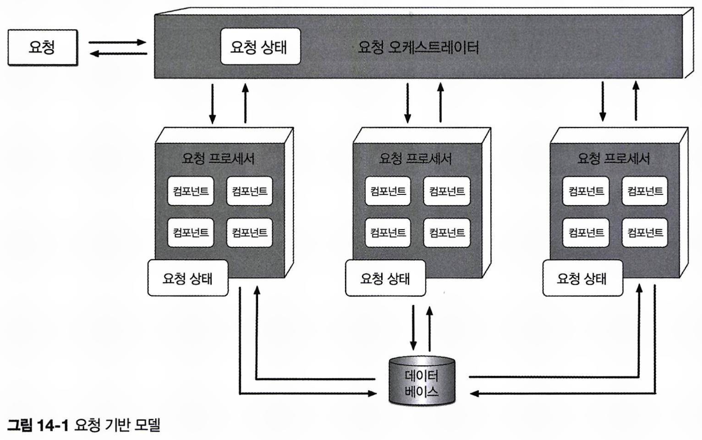

이벤트 기반 모델에서는 특정 상황에 반응하여 적절한 액션을 취하는 식으로 시스템이 동작합니다.  
예를 들어, 유저가 지난 반년치 주문 이력을 검색하는 요청을 한 경우, 이는 시스템이 특정 데이터를 제공해야 하는 확정적인 요청입니다.  
이와 달리, 온라인 경매 사이트에서 입찰자가 입찰을 한다고 했을 때, 이는 시스템이 반응해야 할 이벤트가 발생한 것이라 볼 수 있습니다.  
시스템은 이 이벤트에 반응하여 다른 입찰과 비교해 최고 입찰자를 결정해야 합니다.

## 14.1 토폴로지

이벤트 기반 아키텍처의 주요 토폴로지에는 **중재자 토폴로지**와 **브로커 토폴로지**가 있습니다.  
두 토폴로지의 특성과 구현 전략이 다릅니다.

- 중재자 토폴로지: 이벤트 처리 워크플로 제어에 적합
- 브로커 토폴로지: 신속한 응답과 동적 이벤트 제어에 적합합니다.

## 14.2 브로커 토폴로지

브로커 토폴로지는 중앙 이벤트 중재자가 없다는 것이 주요 특징입니다.  
메시지는 경량 메시지 브로커(RabbitMQ, ActiveMQ, HornetQ 등)를 통해 이벤트 프로세서에 브로드캐스팅됩니다.  
이벤트 처리 흐름이 단순하여 특별한 이벤트 조정이 필요 없을 때 유용합니다.

브로커 토폴로지는 네 가지 기본 컴포넌트로 구성됩니다: **시작 이벤트**, **이벤트 브로커**, **이벤트 프로세서**, **처리 이벤트**
시작 이벤트는 전체 이벤트 흐름을 시작하는 이벤트를 말하며, 이벤트 브로커의 이벤트 채널로 전송됩니다.  
단일 이벤트 프로세서는 시작 이벤트를 받자마자 작업을 처리한 후, 처리 이벤트를 생성하여 자신이 수행한 작업을 시스템에 알립니다.  
이 처리 이벤트는 필요 시 이벤트 브로커에 비동기로 전송되며, 다른 이벤트 프로세서들이 이를 리스닝하여 관련 작업을 수행한 뒤 새로운 처리 이벤트를 발행하는 방식으로 반복됩니다.

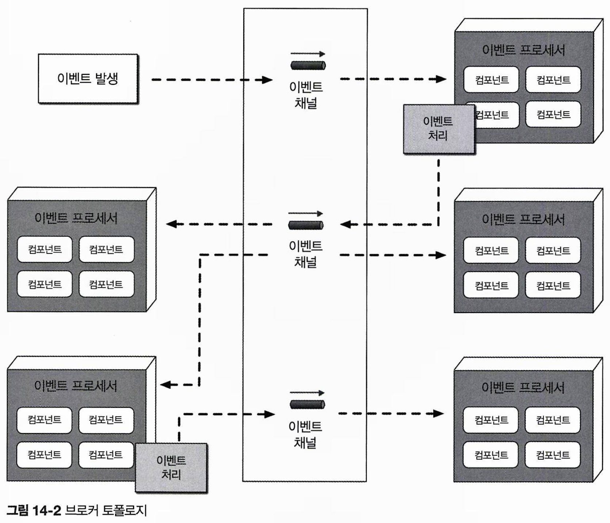

이벤트 브로커는 도메인 기반으로 클러스터링된 인스턴스들로 구성되며, 각 브로커 인스턴스는 해당 도메인의 이벤트 흐름에서 사용되는 모든 이벤트 채널을 포함합니다.  
브로커 토폴로지는 fire-and-forget 방식의 비동기 브로드캐스팅을 사용하며, 이 때 토픽을 통해서 발행-구독이 이루어집니다.

각 이벤트 프로세서는 자신이 수행한 작업을 모든 시스템에 알리는 것이 좋습니다.  
이는 해당 이벤트를 수신하는 프로세스가 없더라도 마찬가지입니다.
이를 통해 추후에 이벤트 처리 과정에 기능을 추가할 때 보다 용이하게 이키텍처를 확장할 수 있습니다.  
예를 들어, Notification 이벤트 프로세서가 이메일을 발송 처리를 완료한 후, 이에 대한 처리 이벤트를 발행해 시스템에 알리는 식입니다.  
해당 메시지를 수신하는 프로세스가 없기 때문에 메시지가 무시되는데, 처음에는 이것이 리소스 낭비처럼 보일 수 있습니다.  
하지만 나중에 이메일 분석 같은 새로운 요구가 생기면, 이미 처리 이벤트가 발생하고 있기 때문에 분석 이벤트 프로세서를 추가하기만 하면 된다는 장점이 있습니다.

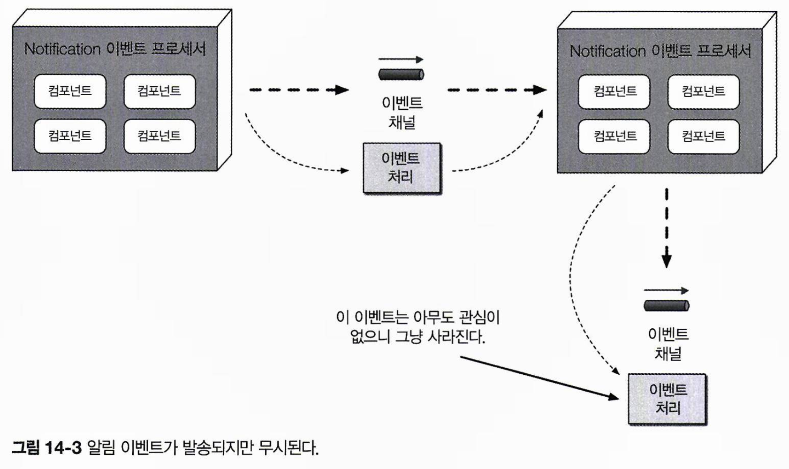

#### 주문 입력 시스템 예제

주문 입력 시스템 예제에서 이벤트가 처리되는 흐름을 살펴봅시다.  
주문이 접수되면 OrderPlacement 이벤트 프로세서가 PlaceOrder 시작 이벤트를 받아, 데이터베이스에 주문을 삽입하고 고객에게 주문 ID를 반환합니다.  
이후 order-created 처리 이벤트를 통해 주문 생성 을 완료했음을 다른 프로세서들에게 알립니다.  
이 처리 이벤트에 반응하는 Notification, Payment, Inventory 프로세서들은 각자의 작업을 병렬로 수행합니다.

Notification 이벤트 프로세서는 order-created 이벤트를 받아 고객에게 이메일을 발송하고, email-sent 처리 이벤트를 생성합니다.  
현재는 이를 수신하는 프로세서가 없지만, 향후 이를 활용할 수 있음을 고려했습니다.  
Inventory 프로세서도 order-created 이벤트를 받아 재고를 차감하고, inventory-updated 이벤트를 발행해 작업 완료를 알립니다.  
Warehouse 프로세서는 이를 수신해 창고 재고를 관리하고, 필요 시 해당 품목을 재주문합니다.

Payment 이벤트 프로세서는 order-created 이벤트를 받아 고객의 신용카드 결제를 처리하고, 결제 성공 시 payment-applied, 거절 시 payment-denied 이벤트를 생성합니다.  
Notification 프로세서는 payment-denied 이벤트에 반응해 고객이 신용 카드 정보나 결제 방식을 업데이트하도록 안내합니다.  
OrderFulfillment 프로세서는 payment-applied 이벤트를 받아 주문 이행 및 배송 준비 작업을 하고, 완료 후 order-fulfilled 처리 이벤트를 발행해 시스템에 알립니다.  
order-fulfilled 이벤트를 받아서 Notification 프로세서는 주문 이행을 고객에게 알리고, Shipping 프로세서는 배송을 이행한 뒤 order-shipped 이벤트를 발행합니다.  
Notification 프로세서는 order-shipped 이벤트를 받아 배송이 완료되었음을 고객에게 알립니다.

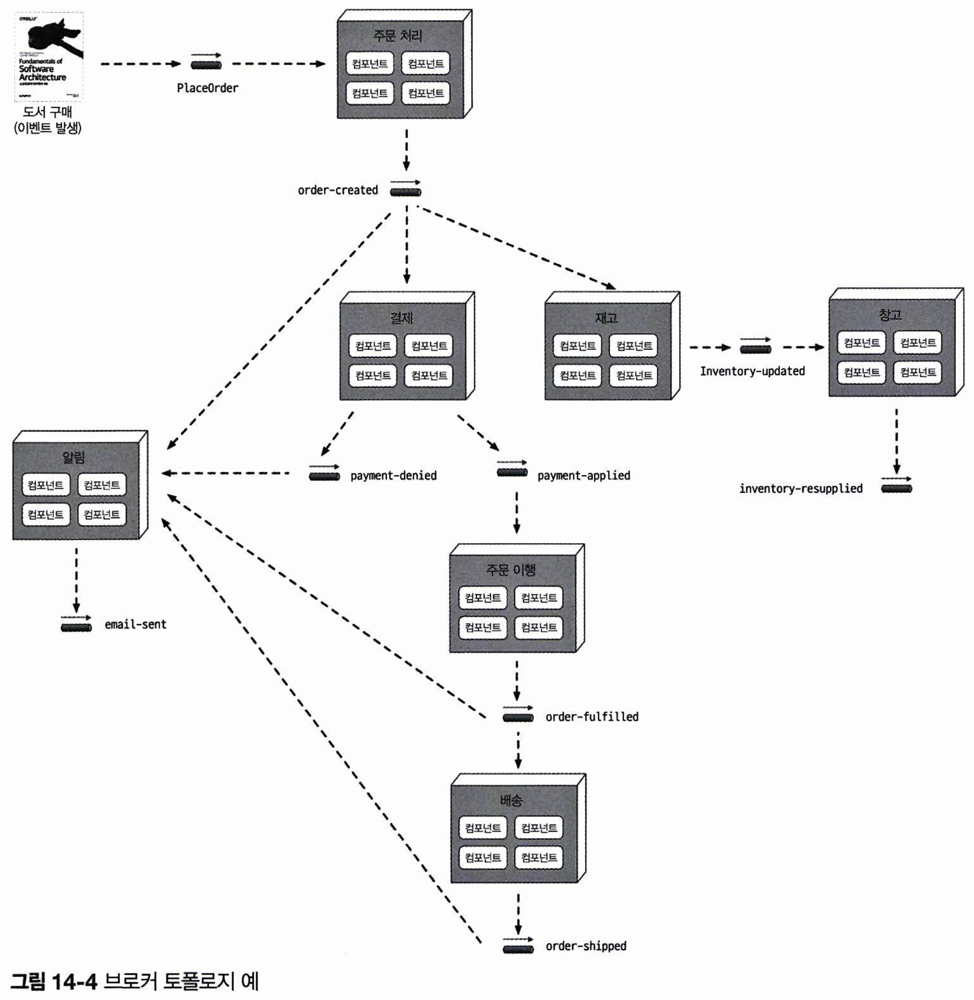

#### 브로커 토폴로지의 특성

이 예제에서 각 이벤트 프로세서는 고도로 분리되어 독립적으로 동작합니다.  
브로커 토폴로지는 릴레이 경주와 유사하며, 이벤트 프로세서가 이벤트를 전달한 후에는 프로세스가 더 이상 해당 이벤트에 관여하지 않고 새로운 이벤트에 반응할 준비를 합니다.  
각 이벤트 프로세서는 가변적인 부하나 백업 조건에 대응할 수 있도록 독립적으로 확장할 수 있습니다.  
프로세서가 느려지거나 실패할 경우, 해당 프로세서가 구독하는 토픽이 병목 지점이 될 수 있습니다.

브로커 토폴로지는 성능, 응답성, 확장성 측면에서 장점이 있지만, 여러 단점들도 존재합니다.  
무엇보다 시작 이벤트와 관련된 전체 워크플로 제어가 불가능하기 때문에, 여러 조건에 의해 유동적으로 전체 처리 과정이 변화합니다.  
어느 시스템 파트에서도 주문 트랜잭션 완료 시점을 알 수 없고, 비즈니스 트랜잭션을 관찰/통제하는 중재자가 없기 때문에 에러 처리도 어렵습니다.  
예를 들어 Payment 이벤트 프로세서가 다운되더라도, 다른 프로세서들이 이를 인지하지 못하고 교착 상태에 빠질 수 있습니다.  
다른 프로세서들은 문제 여부와 상관없이 독립적으로 이벤트를 처리하며 정상 작동을 이어갑니다.

브로커 토폴로지에서는 비즈니스 트랜잭션을 재시작(복구)하는 기능이 지원되지 않습니다.  
시작 이벤트 이후 작업들이 비동기로 진행되기 때문에 시작 이벤트를 다시 넣는 것이 불가능하며, 어떤 컴포넌트도 비즈니스 요청 상태를 알지 못해 어디서부터 트랜잭션을 다시 시작해야 할지 판단할 수 없습니다.

- 장점: 이벤트 프로세서가 디커플링됨, 확장성 높음, 응답성 우수함, 성능 우수함, 내고장성 뛰어남
- 단점: 워크플로 제어, 에러 처리, 복구성, 재시작 능력, 데이터 비일관성

## 14.3 중재자 토폴로지

중재자 토폴로지는 브로커 토폴로지의 단점을 보완합니다.  
시작 이벤트에 대한 워크플로를 관리/제어하는 이벤트 중재자가 전체 구조에서 핵심입니다.  
이 아키텍처는 **시작 이벤트, 이벤트 큐, 이벤트 중재자, 이벤트 채널, 이벤트 프로세서**로 구성됩니다.  
시작 이벤트가 이벤트 큐를 거쳐 중재자로 전달되며, 중재자는 이를 처리하기 위한 처리 이벤트를 생성하여, 점대점 메시징을 통해 각각의 이벤트 채널로 전달합니다.  
각 이벤트 프로세서는 자신의 채널에서 이벤트를 받아 처리한 후, 중재자에게 완료를 알립니다.  
이벤트 프로세서가 다른 프로세서에게 직접 작업 상태를 알리지 않는다는 점이 브로커 토폴로지와 다릅니다.

중재자 토폴로지에서는 여러 중재자가 특정 도메인이나 이벤트 그룹에 따라 분산되어 단일 장애점(single point of failure, SPF)을 줄이고 성능을 향상시킵니다.  
예를 들어, 고객 관련 이벤트(신규 고객 등록, 프로필 업데이트)는 고객 중재자가, 주문 관련 이벤트(장바구니 추가, 체크아웃)는 주문 중재자가 처리합니다.

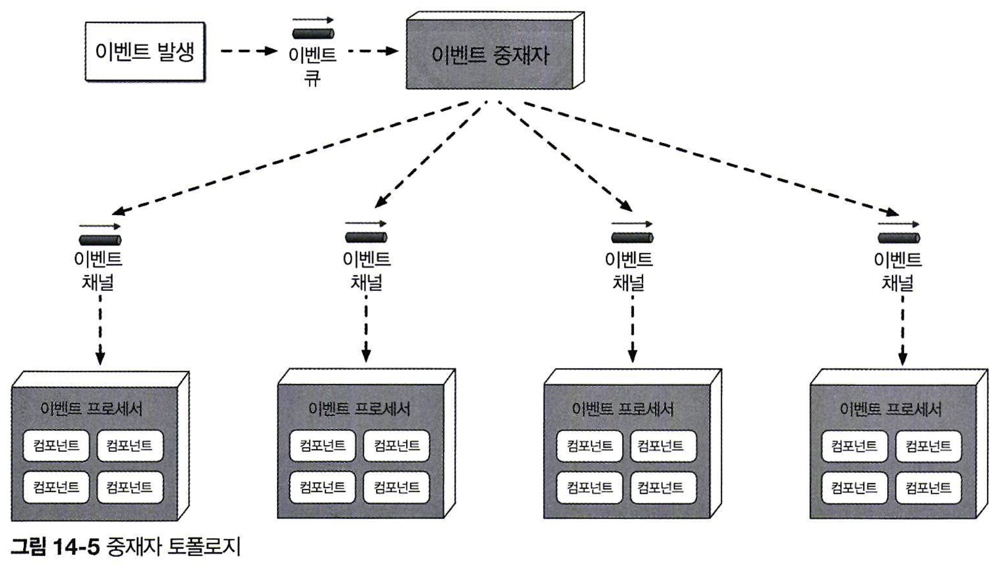

#### 이벤트 중재자의 종류

이벤트 중재자는 처리할 이벤트의 특성과 복잡도에 따라 다양한 방식으로 구현할 수 있습니다.  
간단한 에러 처리와 오케스트레이션에는 Apache Camel, Mule ESB, Spring Integration 같은 중재자를 활용하여, 프로그래밍 코드로 워크플로를 제어할 수 있습니다.

이벤트 워크플로에 복잡한 조건부 처리와 동적 경로가 많은 경우 Apache ODE나 Oracle BPEL Process Manager 같은 중재자가 적합합니다.  
이 중재자는 XML과 유사한 형식의 BPEL(Business Process Execution)을 기반으로 이벤트 처리 단계를 기술하며, 에러 처리, 리다이렉션, 멀티캐스팅 기능을 체계적으로 구현할 수 있습니다.  
BPEL은 복잡하고 동적인 워크플로에는 적합하지만, 사람이 개입하거나 실행 시간이 긴 트랜잭션에는 적합하지 않습니다.  
예를 들어, 주식 거래 진행 중 거래 한도를 초과해 승인이 필요할 때, 이벤트 처리가 잠시 멈추고 승인을 대기해야 할 수 있습니다.  
이런 상황에는 jBPM 같은 BPM(Business Process Management) 엔진이 유용합니다.

적절한 이벤트 중재자를 선택하려면 처리할 이벤트의 종류를 고려해야 합니다.  
예를 들어, 사람이 개입하는 복잡하고 실행 시간이 긴이벤트에 Apache Camel을 사용하면 관리가 어려워집니다.  
마찬가지로 단순한 이벤트 흐름에 BPM 엔진을 사용하면 불필요한 지연이 발생하여 시간과 자원이 낭비될 수 있습니다.

#### 실질적인 구성 방법

실제 아키텍처에서는 단순한 중재자와 복잡한 중재자가 동시에 사용되는 경우가 많습니다.  
이 때 각 이벤트의 복잡도를 단순/어려움/복잡함으로 분류해두고, 우선 모든 이벤트가 단순 중재자(예: Apache Camel, Mule)를 거치도록 구성하는 것이 좋습니다.  
단순 중재자는 이벤트의 복잡도가 낮으면 직접 처리하고, 복잡도가 높을경우 더 복잡한 중재자에게 위임합니다.  
예를 들어, 복잡도가 낮은 경우 Simple Event Mediator가 처리하지만, 복잡한 경우 BPEL이나 BPM 중재자에게 이벤트를 넘깁니다.  
Simple Event Mediator는 이벤트 완료 시점을 파악하거나 전체 워크플로를 다른 중재자에게 위임하는 등의 역할을 합니다.

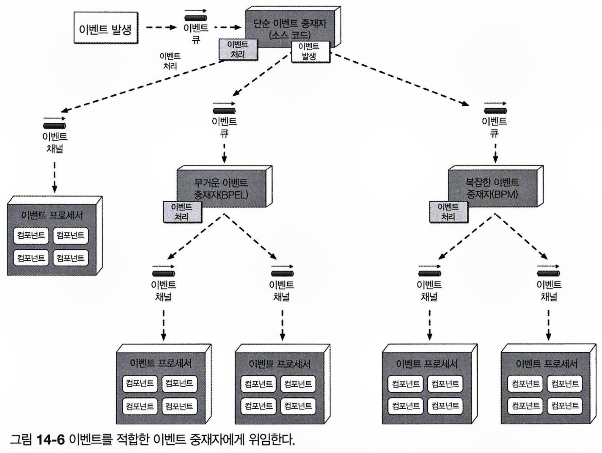

#### 서점 주문 입력 시스템 예제

서점 주문 입력 시스템을 중재자 토폴로지로 전환해봅시다.  
시작 이벤트(PlaceOrder)는 customer-event-queue로 전달되고, Customer 중재자가 이를 받아 단계별로 처리 이벤트를 생성합니다.  
2, 3, 4단계에서는 각 단계의 여러 처리 이벤트가 동시에 발생합니다.  
단, 이는 단계별로 처리되어야 하는데, 예를 들어 4단계(주문 배송)에서 고객에게 배송 준비 완료 알림을 보내기 전에, 3단계(주문 이행)에 포함된 모든 처리 이벤트에 대해서 확인 응답(acknowledgement)을 받아야 합니다.

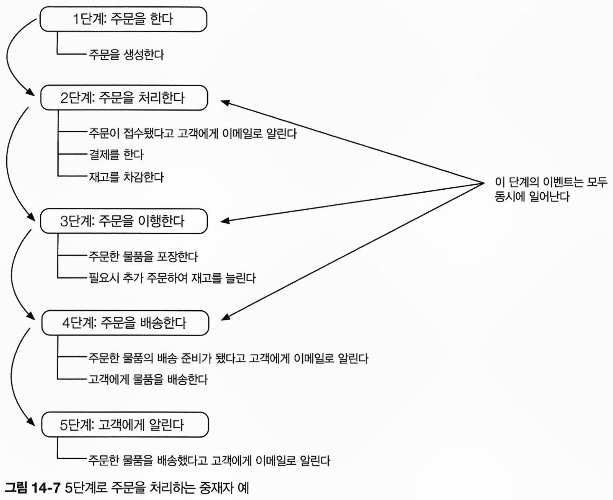

Customer 중재자는 시작 이벤트를 받으면 create-order 처리 이벤트를 생성하여 order-placement-queue로 보냅니다.  
OrderPlacement 이벤트 프로세서는 이를 받아 주문을 생성한 후, 주문 ID와 함께 중재자에게 확인 응답을 보냅니다.  
중재자는 비즈니스 규칙에 따라 주문 ID를 고객에게 즉시 전송하거나 모든 처리 단계가 완료될 때까지 진행을 이어갈 수 있습니다.

Customer 중재자는 1단계가 완료되면 2단계로 넘어가서 email-customer, apply-payment, adjust-inventory 처리 이벤트를 동시에 생성해 각각의 큐로 전송합니다.  
Notification, Payment, Inventory 프로세서는 각자 작업을 완료한 후 중재자에게 응답하는데, 이 때 중재자는 3개의 병렬 프로세스로부터 모두 확인응답을 받을 때까지 대기합니다.  
이 때 어느 한 곳이라도 에러가 발생하면 중재자는 문제 해결을 위한 조치를 할 수 있습니다.

모든 프로세서로부터 확인 응답을 받으면, 중재자는 3단계로 넘어가 fulfill-order와 order-stock 이벤트를 발생시켜 주문을 이행합니다.  
OrderFulfillment, Warehouse 이벤트 프로세서는 두 이벤트를 받아 각자 할 일을 하고, 중재자에게 확인응답을 합니다.  
이 단계가 완료되면 4단계에서 ship-order와 email-customer 이벤트를 생성해 배송과 고객 알림을 처리합니다.  
마지막 5단계에서는 email-customer 이벤트를 다시 한 번 발생시켜서 고객에게 배송 완료를 알리며, 마지막 처리 이벤트가 발생하면 중재자는 시작 이벤트 흐름을 완료로 마킹하고 관련 상태를 삭제합니다.

중재자 토폴로지는 워크플로를 제어할 수 있기 때문에, 이벤트 상태를 유지하면서 에러 처리, 복구, 재시작을 할 수 있습니다.  
예를 들어, 3단계 처리 과정에서 신용카드 문제로 결제가 실패할 경우, 중재자는 워크플로를 중단하고 자체 저장소에 상태를 저장합니다.  
이후에 결제가 완료되면 중단된 단계부터 워크플로를 다시 시작할 수 있습니다.

또한, 두 토폴로지에서 처리 이벤트의 의미와 사용 방법이 본질적으로 다릅니다.  
브로커 토폴로지에서는 처리 이벤트가 단순히 **반응**할 수 있는 이벤트로 사용됩니다.  
처리 이벤트가 발행되면 이벤트 프로세서는 각자 맡은 일을 하고, 다른 이벤트 프로세서는 다시 또 그 액션에 반응하는 식으로 돌아갑니다.  
이와 달리 중재자 토폴로지에서 처리 이벤트는 이미 일어난 사건(incident)가 아니라, 반드시 처리해야 하는 **커맨드**로서 의미를 가집니다.

중재자 토폴로지는 브로커 토폴로지에서 해결할 수 없는 문제를 처리할 수 있지만, 단점도 있습니다.

1. 복잡한 이벤트 흐름에서 동적 처리를 선언적으로 모델링하기 어렵습니다.
   - 하이브리드 모델(중재자 + 브로커)로 복잡한 상황을 처리하기도 합니다.
2. 이벤트 프로세서 확장이 쉽지만, 중재자도 함께 확장해야 하므로 병목 현상이 발생할 수 있습니다.
3. 셋째, 중재자가 이벤트 처리를 제어하여 프로세서 간 커플링이 커집니다.
   - 이로 인해 성능이 브로커 토폴로지보다 떨어질 수 있습니다.

- **장점**: 워크플로 제어, 에러 처리, 복구성, 재시작 능력, 데이터 일관성
- **단점**: 이벤트 프로세서가 커플링됨, 확장성 낮음, 성능 낮음, 내고장성 좋지 않음, 워크플로 모델링 복잡함

브로커 토폴로지와 중재자 토폴로지 중 무엇을 선택할지는 **워크플로 제어와 에러 처리 기능**을 우선할지, **고성능과 확장성**을 우선할지에 따라 달라집니다.  
중재자 토폴로지도 성능과 확장성이 나쁘지 않지만, 브로커 토폴로지만큼은 미치지 못합니다.

## 14.4 비동기 통신

이벤트 기반 아키텍처는 요청/응답 처리와 fire-and-forget 처리 모두에서 비동기 통신을 사용한다는 점이 다른 아키텍처와 차별화됩니다.  
비동기 통신은 시스템 전반의 응답성을 높이는 데 기여합니다.  
예를 들어 웹사이트 댓글 서비스를 운영할 때, 각 댓글에 대해 여러 파싱 엔진을 거치도록 하여 유효성을 평가한다고 합시다.  
이 때 REST 기반의 동기 호출을 사용할 경우, 네트워크 왕복에 100밀리초, 파싱 엔진 처리에 3,000 밀리초가 소모되어 댓글 게시에 3,100밀리초가 걸립니다.  
하지만 비동기 전송을 사용하면, 유저가 댓글을 게시하는 데 네트워크 편도 시간인 25밀리초밖에 걸리지 않습니다.  
물론 내부에서는 전체 로직을 수행하는데 여전히 3,025밀리초가 걸리겠지만, 유저 관점에서는 즉시 처리가 완료된 것처럼 보입니다.

이 예시는 응답성과 성능의 차이를 보여줍니다.  
응답성은 유저에게 처리가 곧 시작될 것임을 알리는 것이고, 성능은 실제 프로세스를 더 빨리 수행하는 것입니다.  
사용자가 정보를 돌려받을 필요가 없는 경우, 기다리게 할 이유가 없으므로 비동기 방식으로 응답성을 개선할 수 있습니다.  
댓글 서비스에서 비동기를 사용한 것은 응답성 향상에 해당하며, 성능 개선이 필요하다면 캐시나 병렬 처리를 통해 텍스트 처리 시간을 줄이는 등의 최적화가 필요했을 것입니다.

다만 동기 호출은 댓글 게시 여부를 확실하게 유저에게 전달하지만, 비동기 호출은 단지 “게시 예정”이라는 응답만 제공합니다.  
예를 들어 댓글에 비속어가 포함되는 등의 문제로 댓글 게시가 거부되었을 때, 이를 유저에게 알릴 방법이 부족합니다.  
이를 해결하기 위해서 회원 가입 유저에게만 댓글을 허용해 문제 발생 시 알림을 보내는 방법 등이 있지만, 더 복잡한 경우에는 에러 처리가 어려워집니다.

## 14.5 에러 처리

리액티브 아키텍처 중 하나인 **워크플로 이벤트 패턴**은 비동기 워크플로의 에러 처리를 해결하는 방법입니다.  
시스템이 응답성을 유지하면서 탄력적으로 에러를 처리할 수 있게 합니다.

워크플로 이벤트 패턴에서는 워크플로 대리자(workflow delegate)를 통해 위임(delegation), 봉쇄(containment), 수리(repair) 작업을 합니다.  
이벤트 프로듀서가 데이터를 비동기로 전송하고, 이벤트 컨슈머가 이를 처리하는 중에 에러가 발생할 경우, 즉시 에러를 워크플로 프로세서에게 위임한 후 이벤트 큐의 다음 메시지로 넘어갑니다.  
이를 통해 컨슈머가 직접 에러를 해결하는 데 시간을 소비하지 않게 되어, 전체 응답성이 유지됩니다.

워크플로 프로세서는 에러가 담긴 메시지를 분석하여 문제가 무엇인지 확인합니다.  
간단한 에러는 직접 수정하고, 복잡한 경우에는 머신 러닝을 통해 데이터의 이상점을 조사해 수정합니다.  
수정된 메시지는 큐로 돌아가며, 이벤트 컨슈머는 이를 새로운 메시지로 간주해 다시 처리합니다.  
워크플로 프로세서가 메시지에서 문제를 파악할 수 없을 경우, 메시지는 담당자가 확인할 수 있는 대시보드 애플리케이션으로 전송됩니다.  
이 경우에는 담당자에 의해 메시지가 수동으로 조치된 후, 다시 큐로 돌아갑니다.

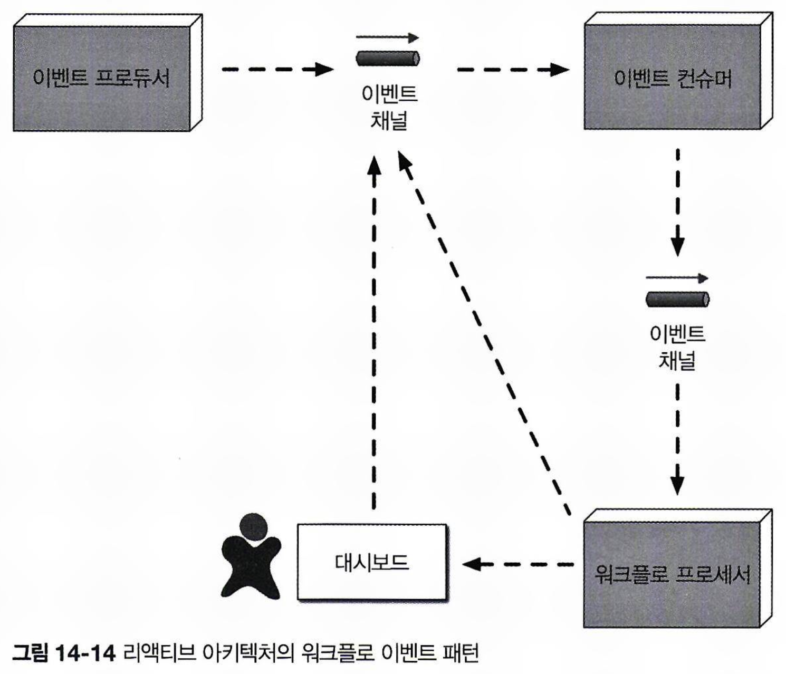

거래 자문가가 대리로 거래 주문을 받아서, 이들을 묶어 일괄 처리한 후, 주식을 매수하기 위해 트레이딩펌의 브로커로 비동기 전송한다고 가정합니다.  
거래 지시는 계약에 따라 다음의 포맷을 가집니다.

```
ACCOUNT(String),SIDE(String),SYMBOL(String),SHARES(Long)
```

이 때 트레이딩펌이 다음과 같은 주문들을 받았다고 합시다.

```
12654A87FR4,BUY,AAPL,1254 87R54E3068U,BUY,AAPL,3122 6R4NB7609JJ,BUY,AAPL,5433
2WE35HF6DHF,BUY,AAPL,8756 SHARES 764980974R2,BUY,AAPL,1211 1533G658HD8,BUY,AAPL,2654
```

이 중 4번째 거래 지시에 SHARES 단어가 포함되어 있어 포맷에 맞지 않습니다.  
트레이딩펌의 거래 처리 서비스에 에러 처리 기능이 없을 경우 다음과 같이 에러가 발생할 것입니다.

```
Exception in thread "main" java.lang.NumberFormatException: For input string: "8756 SHARES"
    at java.lang.NumberFormatException.forInputString (NumberFormatException.java:65)
    at java.lang.Long.parseLong(Long.java:589)
    at java.lang.Long.<init>(Long.java:965)
    at trading.TradePlacement.execute(TradePlacement.java:23)
    at trading.TradePlacement.main(TradePlacement.java:29)
```

일반적인 비동기 요청 구조에서은 에러를 로깅하는 것 외에는 조치할 수 있는게 없지만, 워크플로 이벤트 패턴을 적용하면 프로그래밍 방식으로 에러를 처리할 수 있습니다.  
트레이딩펌이 거래 자문가가 보낸 데이터를 자체적으로 수정할 수는 없으므로, Trade Placement 서비스는 에러가 발생할 때 Trade Placement Error 서비스로 에러 정보를 전송합니다.

```
Trade Placed: 12654A87FR4,BUY,AAPL,1254
Trade Placed: 87R54E3068U,BUY,AAPL,3122
Trade Placed: 6R4NB7609JJ,BUY,AAPL,5433
Error Placing Trade: "2WE35HF6DHF,BUY,AAPL,8756 SHARES"
Sending to trade error processor <— delegate the error fixing and move on Trade Placed: 764980974R2,BUY,AAPL,1211
```

Trade Placement Error 서비스는 **워크플로 대리자로서 에러를 접수**하고, 주수 필드에서 “SHARES”라는 단어를 감지하여 이를 제거합니다.  
이후 수정된 거래 정보를 다시 제출합니다.

```
Received Trade Order Error: 2WE35HF6DHF,BUY,AAPL,8756 SHARES Trade fixed: 2WE35HF6DHF,BUY,AAPL,8756
Resubmitting Trade For Re-Processing
```

이제 정정된 거래 정보가 거래 처리 서비스에서 정상 처리됩니다.

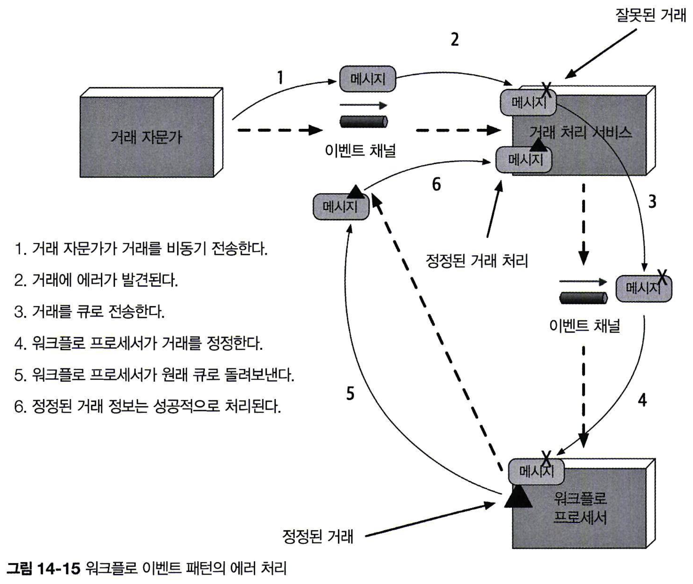

주의할 점은, 워크플로 이벤트 패턴에서 에러 메시지를 조치 후 다시 제출하면 메시지 처리 순서가 변경될 수 있다는 점입니다.  
위 예제에서도 특정 계정의 모든 거래는 순서대로 처리되어야 합니다.(ex 매수 및 매도 순서)  
다만 메시지 순서를 유지하는 것은 복잡한 작업입니다.  
해결 방법 중 하나는 Trade Placement 서비스가 에러가 발생한 계좌 번호를 큐에 보관하고, 해당 계좌의 거래는 나중에 처리할 수 있도록 FIFO 순서로 임시 큐에 저장하는 것입니다.  
에러가 해결되면 Trade Placement 서비스는 큐에서 동일 계정의 거래를 순서대로 처리합니다.

## 14.6 데이터 소실 방지

이벤트 기반 아키텍처에서 데이터 소실은 자주 발생할 수 있습니다.  
비동기 통신에서 데이터 소실은 메시지가 최종 목적지에 도달하지 못하거나 도중에 삭제될 때 발생합니다.  
예를 들어, 이벤트 프로세서 A가 큐에 메시지를 전송하고, 이벤트 프로세서 B가 이를 수신해 데이터베이스에 삽입하는 시나리오를 생각해 봅시다.  
이러한 상황에서 데이터 소실이 발생할 수 있는 세 가지가 주요 지점이 있습니다.

1. **메시지가 큐에 도달하지 못할 때** – 전송 중 브로커 등에서 장애가 발생하면 메시지가 소실될 수 있습니다.
2. **이벤트 프로세서 B가 메시지를 꺼내지 못했을 때** – 큐 관리의 문제로 인해 메시지가 유실될 위험이 있습니다.
3. **이벤트 프로세서 B가 DB 저장에 실패할 때** – DB 연결 오류가 발생하면 데이터가 DB에 삽입되지 않습니다.

1번 문제는 **퍼시스턴트 메시지 큐**를 통해 해결할 수 있습니다.  
퍼시스턴트 메시지 큐는 메시지를 메모리와 물리적 저장소에 동시에 저장해서, 메시지 전달을 보장합니다.  
이렇게 하면 메시지 브로커가 다운되더라도 메시지가 디스크에 저장되어 복구가 가능합니다.  
이와 동시에 브로커가 메시지 저장 확인을 보내기 전까지 프로듀서가 대기하도록 하여 **동기적으로 메시지를 전송**하도록 하면 됩니다.

2번 문제는 “**클라이언트 확인응답 모드(client acknowledge mode)**“를 활용해 해결할 수 있습니다.  
기본적으로 메시지는 큐에서 꺼내는 즉시 삭제되지만, 클라이언트 확인응답 모드는 메시지를 큐에 계속 보관합니다.  
이 때 다른 컨슈머가 해당 메시지를 읽지 못하도록 클라이언트 ID를 부착합니다.  
이로 인해 이벤트 프로세서가 고장 나도 메시지가 큐에 남기 때문에 데이터 소실을 방지할 수 있습니다.

3번 문제는 데이터베이스의 ACID 트랜잭션 커밋을 통해 해결할 수 있습니다.  
데이터베이스에 커밋이 일어나면 데이터가 안전하게 저장되는데, “**최종 참여자 지원(last participant support, LPS)**“을 사용하면 메시지 처리가 완료되어 데이터베이스에 저장된 후에 큐에서 메시지가 삭제되도록 할 수 있습니다.  
이를 통해 이벤트 프로세서 A에서 데이터베이스로 이동하는 도중 메시지 소실이 발생하지 않습니다.

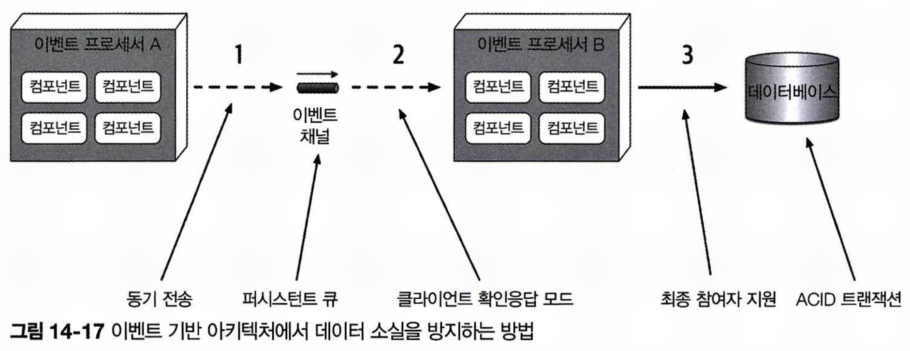

## 14.7 브로드캐스팅

이벤트 기반 아키텍처는 메시지를 여러 구독자에게 브로드캐스트할 수 있습니다.  
프로듀서는 메시지를 어느 이벤트 프로세서가 수신하고 어떤 작업을 수행하는지 알 필요가 없으므로, 브로드캐스트는 이벤트 프로세스를 높은 수준으로 디커플링 합니다.  
브로드캐스팅은 최종 일관성이나 복잡한 이벤트 처리 (complicated event processing, CEP)등 다양한 용도로 활용됩니다.  
예를 들어, 주식 시스템에서는 종가 정보를 브로드캐스트해서 여러 구독자가 이를 필요에 맞게 활용하도록 할 수 있습니다.

## 14.8 요청-응답

이벤트 기반 아키텍처에서도 동기 통신이 필요한 경우가 있습니다.  
예를 들어, 도서 주문 시 주문 ID나 항공편 예약 시 확인 번호가 필요할 때입니다.  
이 경우 **요청-응답 메시징(request-response messaging, 의사 동기 통신 pseudosynchronous communication)** 방식을 사용합니다.  
요청-응답 메시징은 요청 큐와 응답 큐로 구성됩니다.  
처음 요청을 보내면 요청 큐에 비동기로 전송된 후, 메시지 프로듀서는 응답 큐에 응답이 도착하기를 기다리며 차단 대기(blocking wait) 상태가 됩니다.  
이후 메시지 컨슈머가 요청을 처리하고 응답 큐에 결과를 보내면, 이벤트 프로듀서가 이를 수신하게 됩니다.

요청-응답 메시징을 구현하는 주요 기술 중 하나는 **상관 ID(Correlation ID)**를 사용하는 것입니다.  
상관 ID는 응답 메시지에 포함되는 필드로, 보통 원요청 메시지의 ID를 사용합니다.  
이를 통해 각 메시지가 어떤 요청에 대한 응답인지 쉽게 추적할 수 있습니다.

1. 이벤트 프로듀서는 요청 큐에 메시지(메시지 ID: 124)를 보내고, 고유한 메시지 ID를 기록합니다. 이때 CID는 `null`입니다.
2. 이벤트 프로듀서는 메시지 필터(message filter, 또는 메시지 셀렉터)로 응답 큐를 차단 대기합니다.
   - 응답 큐의 현재 메시지:
     - 메시지 ID: 855, 상관 ID: 120
     - 메시지 ID: 856, 상관 ID: 122
   - 요청한 상관 ID(CID: 124)와 일치하는 메시지가 없어 아무 것도 선택되지 않습니다.
3. 이벤트 컨슈머는 요청 메시지(ID: 124)를 받아 요청을 처리합니다.
4. 이벤트 컨슈머는 응답 메시지를 생성하고, 메시지 헤더의 상관 ID(CID)를 원래 메시지 ID(124)로 설정합니다.
5. 이벤트 컨슈머는 새 메시지(ID: 857)를 응답 큐로 보냅니다.
6. 2단계에서 설정된 메시지 셀렉터의 상관 ID(124)와 일치하는 메시지가 도착하므로, 이벤트 프로듀서는 해당 메시지를 수신합니다.

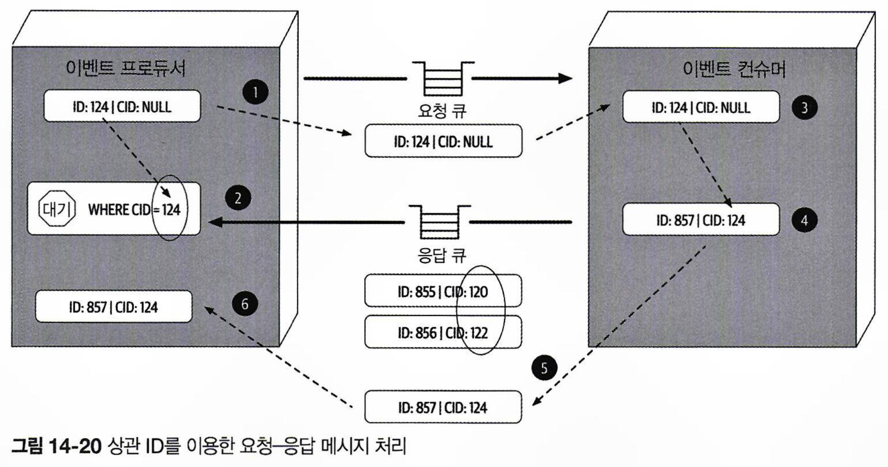

요청-응답 메시징을 구현하는 두 번째 방법은 **임시 큐(temp queue)**를 사용하는 것입니다.  
임시 큐는 지정된 요청에만 사용되며, 요청 시 생성되고 요청 완료 후 삭제됩니다.  
임시 큐는 해당 요청을 보낸 이벤트 프로듀서만 접근할 수 있는 전용 큐이므로, 상관 ID가 필요하지 않습니다.

1. 이벤트 프로듀서는 임시 큐를 생성하고, 메시지의 `reply-to` 헤더(커스텀 헤더)에 임시 큐 이름을 설정하여 요청 큐에 보냅니다.
2. 이벤트 프로듀서는 임시 응답 큐를 차단 대기하며 응답이 도착하기를 기다립니다.
   - 이 큐는 원래 메시지를 보낸 이벤트 프로듀서에게만 속하므로 메시지 셀렉터가 필요하지 않습니다.
3. 이벤트 컨슈머는 메시지를 받아 요청을 처리한 후, `reply-to` 헤더에 설정된 이름을 가진 응답 큐로 응답 메시지를 보냅니다.
4. 이벤트 프로듀서는 응답 메시지를 수신한 후 임시 큐를 삭제합니다.

임시 큐 방식은 기술적으로 단순하지만, 매 요청마다 큐를 생성하고 폐기해야 하는 단점이 있습니다.  
이로 인해 대용량 메시지 처리 시 메시지 브로커의 성능과 응답 속도가 저하될 수 있기 때문에, 일반적으로 상관 ID 방식을 사용하는 것이 권장됩니다..

## 14.9 요청 기반이냐, 이벤트 기반이냐

**요청 기반 모델**은 워크플로의 확정성과 제어가 중요할 때, 예를 들어 고객 프로필 데이터 검색과 같이 체계적인 데이터 처리가 필요할 때 적합합니다.  
반면, **이벤트 기반 모델**은 복잡하고 동적인 처리가 필요하여 고도의 응답성과 확장성이 요구되는 경우에 유리하며, 유연한 액션 단위로 이벤트를 처리하는데 적합합니다.  
이벤트 기반 모델의 장단점은 다음과 같습니다.

- 장점
  - 동적인 유저 콘텐츠에 대해 응답성이 좋음
  - 확장성, 탄력성이 우수함
  - 민첩성과 변화 관리가 우수함
  - 적응성과 확장성이 뛰어남
  - 응답성과 성능이 좋음
  - 실시간 의사 결정이 가능함
  - 상황 인지에 따른 반응성이 좋음
- 단점
  - 최종 일관성만 지원됨
  - 처리 흐름을 제어하기 곤란함
  - 이벤트 흐름의 결과를 예측하기 어려움
  - 테스팅, 디버깅이 어려움

## 14.10 하이브리드 이벤트 기반 아키텍처

이벤트 기반 아키텍처를 다른 스타일과 결합하여 하이브리드 아키텍처로 사용하는 것도 가능합니다.  
대표적으로 **마이크로서비스 아키텍처**와 **공간 기반 아키텍처**가 있으며, **이벤트 기반 마이크로커널 아키텍처**와 **이벤트 기반 파이프라인 아키텍처**도 예시에 포함됩니다.  
다른 아키텍처에 이벤트 기반 아키텍처를 추가하면, **병목을 제거하고 이벤트를 백업하는 배압 지점**(back pressure point)을 마련하는 동시에, **메시징을 통해 유저 응답성을 보장**할 수 있습니다.  
마이크로서비스와 공간 기반 아키텍처는 **데이터 펌프에 메시징을 사용**하여, 메시지 비동기 전송을 통해 서로 다른 프로세서간 데이터베이스를 업데이트합니다.  
두 아키텍처 모두 서비스 간 통신에서 이벤트 기반 아키텍처를 사용하여 프로그래밍 방식의 확장성을 달성합니다.

## 14.11 아키텍처 특성 등급

| 특성      | 별점              |
| --------- | ----------------- |
| 분할 유형 | 기술              |
| 퀀텀 수   | 하나 또는 여러 개 |
| 배포성    | X X X             |
| 탄력성    | X X X             |
| 진화성    | X X X X X         |
| 내고장성  | X X X X X         |
| 모듈성    | X X X X           |
| 전체 비용 | X X X             |
| 성능      | X X X X X         |
| 신뢰성    | X X X             |
| 확장성    | X X X X X         |
| 단순성    | X                 |
| 시험성    | X X               |

이벤트 기반 아키텍처는 **기술 분할 아키텍처**로, 특정 도메인이 여러 이벤트 프로세서로 분산되어, 각 프로세서가 중재자, 큐, 토픽 등을 통해 연결됩니다.  
한 도메인에 변경이 생기면 다수의 이벤트 프로세서, 중재자, 메시징 요소에 영향을 주므로 도메인 분할 아키텍처로 볼 수 없습니다.

각 이벤트 프로세서는 별개의 데이터베이스를 가질 수 있기 때문에 퀀텀 수가 1개 이상 가능합니다.  
모든 통신은 비동기로 이루어지지만, 여러 이벤트 프로세서가 동일한 데이터베이스 인스턴스를 공유하는 경우에는 동일한 퀀텀 내에 포함될 수 있습니다.  
요청-응답 처리의 경우에도 프로세서가 이벤트 컨슈머에게 직접 요청을 받아야 하는 구조라면, 결국 프로세서가 동기적으로 묶여서 동일한 퀀텀이 됩니다.  
예를 들어 한 이벤트 프로세서가 주문 처리를 위해 다른 프로세서에게 요청을 전달하고, 주문 ID를 받을 때까지 기다린다고 가정해봅시다.  
이때 두 번째 이벤트 프로세서가 다운되면 첫 번째 프로세서도 진행할 수 없으므로, 비동기 메시지를 주고받더라도 두 프로세서는 동일한 아키텍처 퀀텀에 속해 동일한 아키텍처 특성을 공유하게 됩니다.

이벤트 기반 아키텍처는 성능, 확장성, 내고장성에서 별점 5개를 받았습니다.  
이벤트 프로세서는 프로그래밍 방식의 로드 밸런싱이 가능해 확장성이 뛰어나며, 요청 부하가 증가할 경우 프로그래밍 방식으로 프로세서를 추가하여 처리할 수 있습니다.  
또한, 최종 일관성 및 최종 처리를 보장하도록 비동기 이벤트 프로세서를 고도로 분리하여 구성하면 내고장성을 실현할 수 있습니다.  
유저 인터페이스와 이벤트 프로세서는 즉각적인 응답이 필요하지 않으며, 다운스트림 프로세서가 없을 때는 Promise와 Future를 통해 나중에 이벤트를 처리할 수 있습니다.

이벤트 기반 아키텍처는 **비결정적이고 동적인 이벤트 흐름으로 인해 단순성과 시험성이 낮습니다**.  
이벤트 기반 모델은 이벤트 프로세서의 반응과 메시지 생성을 예측하기 어렵습니다.  
따라서 이벤트 트리 다이어그램이 복잡해지기 때문에 수백~수천 개의 시나리오를 관리하고 테스트해야 합니다.  
반면, 이벤트 기반 아키텍처는 진화성이 높아 별점 5개를 받았습니다.  
**브로커 토폴로지에서 새로운 기능 추가가 비교적 쉬우며**, 발행된 메시지에 hook을 달아서 데이터를 바로 활용할 수도 있습니다.  
인프라나 기존 프로세서 변경 없이 새로운 기능을 추가할 수 있기 때문에 진화성이 높습니다.
