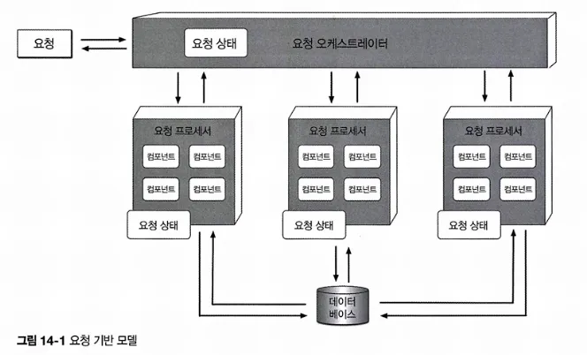
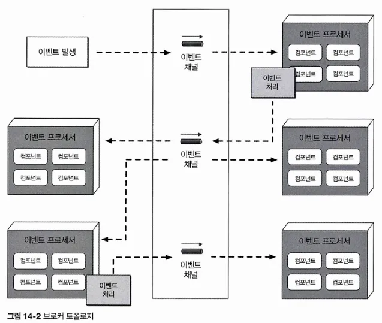
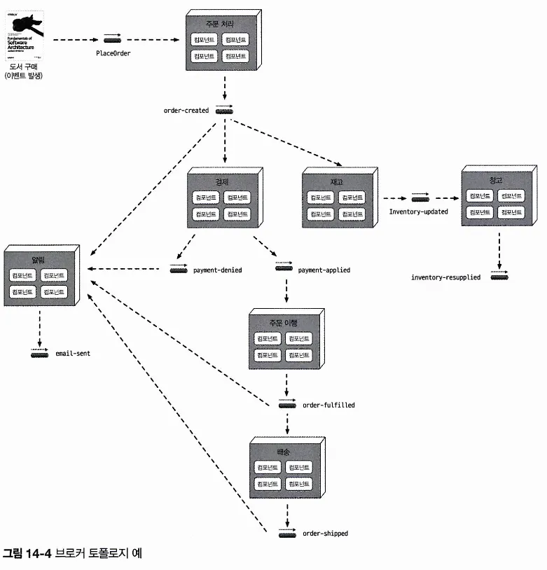
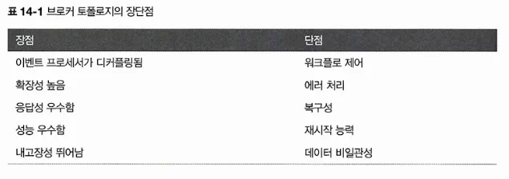
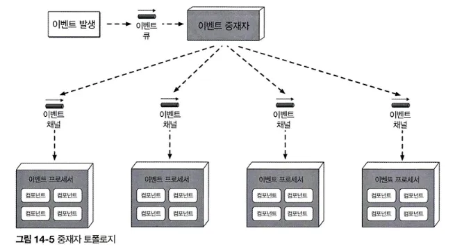

# CHAPTER 14 이벤트 기반 아키텍처 스타일
> 확장성이 뛰어난 고성능 애플리케이션 개발에 널리 쓰이는 비동기 분산 아키텍처 스타일임. 
> 적응성이 아주 좋음. → 소규모 애플리케이션부터 크고 복잡한 애플리케이션까지 두루 사용 가능
>
> 이벤트를 비동기 수신/처리하는 별도의 이벤트 처리 컴포넌트들로 구성되며, 스탠드얼론 아키텍처 스타일로 사용하거나 다른 아키텍처 스타일에 내장할수도 있음. 
> 
> 애플리케이션은 대부분 요청 기반 모델을 따름. 
이 모델에서는 어떤 액션을 수행하도록 시스템에 요청하면 요청 오케스트레이터가 접수함. 
요청 오케스트레이터는 보통 유저 인터페이스지만 API 레이어나 엔터프라이즈 서비스 버스로도 구현할 수 있음.  
이 컴포넌트의 임무는 다양한 요청 프로세서에 확정적으로, 동기적으로 요청을 전달하는 일임. 요청 프로세서는 요청을 받아 데이터베이스에서 정보를 조회/수정하는 등의 작업을 수행하는 식으로 요청을 처리함. 
> 
## 14.1 토폴로지
이벤트 기반 아키텍처의 주요 토폴로지는 중재자 토폴로지와 브로커 토폴로지 임. 

- 주로 중재자 토폴로지는 이벤트 처리 워크플로를 제어해야 할 경우에, 브로커 토폴로지는 신속한 응답과 동적인 이벤트 처리 제어가 필요할 때 각각 사용됨.
- 두 토폴로지의 아키텍처 특성과 구현 전략은 서로 다르기 때문에 주어진 상황에 가장 알맞은 것을 선택하려면 각각의 특징을 정확하게 이해해야 함.
## 14.2 브로커 토폴로지
- 중앙에 이벤트 중재자가 없다는 점에서 중재자 토폴로지와 다름
- 메시지는 (RabbitMQ, ActiveMQ, HornetQ 등의) 경량 메시지 브로커를 통해 브로드캐스팅되는 식으로 이벤트 프로세서 컴포넌트에 분산되어 흘러감
- 이 토폴로지는 비교적 이벤트 처리 흐름이 단순하고 굳이 중앙에서 이벤트를 조정할 필요가 없을 때 유용함
- 네 가지 기본 아키텍처 컴포넌트로 구성됨
    - 시작 이벤트 - 단순한 이벤트든, 복잡한 이벤트든 전체 이벤트 흐름을 개시하는 이벤트를 말함. 이벤트 브로커의 이벤트 채널로 전송되어 처리됨.
    - 이벤트 브로커 - 보통 연합체(도메인 기반으로 클러스터링된 다수의 인스턴스)로 구성되며, 연합된 각 브로커에는 주어진 도메인의 이벤트 흐름에서 사용되는 모든 이벤트 채널이 들어있음.
    - 이벤트 프로세서 - 이벤트를 관리/제어하는 중재자가 브로커 토폴로지에 없으므로 단일 이벤트 프로세서는 이벤트 브로커네서 시작 이벤트를 받자마자 관련된 처리 작업을 마친 뒤 이멘트를 생성하고 시스템의 나머지 부분에 자신이 할 일을 비동기로 알림. 
    다른 이벤트 프로세서는 처리 이벤트를 리스닝하고 있다가 이벤트가 들어오면 그에 맞는 작업을 수행한 뒤 다시 새로운 처리 이벤트를 발행함으로써 자신이 한 일을 모두에게 알림
    최종 이벤트 프로세서가 한 일에 아무도 관심이 없을 때까지 이 과정을 되풀이함.
    - 처리 이벤트 - 필요시 부가적인 처리를 위해 이벤트 브로커에게 비동기 전송됨.

- 다른 이벤트 프로세서의 관심 여부와 무관하게 각 이벤트 프로세서가 자신이 한 일을 모두에게 알리는 게 항상 바람직함.
    
    그래야 나중에 이벤트를 처리하는 과정에서 기능 추가가 필요하게 되더라고 아키텍처를 쉽게 확장할 수 있음. 
    
    ex) 복잡한 이벤트 처리 과정의 일부로 고객에게 작업 내역을 이메일로 발송한다. 
    
    
    
    Notification 이벤트 프로세서는 이메일을 만들어 보낸 다음, 새로운 처리 이벤트를 토픽에 발행함으로써 나머지 시스템에 이 액션을 통보함.
    
    그러나 다른 이벤트 프로세서는 해당 토픽의 이벤트를 수신하지 않으므로 이 메시지는 그냥 사라짐. 
    
    → 아키텍처 확장성의 좋은 사례. 
    
    어차피 무시될 메시지를 보내는 것이 리소스 낭비가 아니냐? 실은 그렇지 않음
    
    만약, 나중에 고객에게 발송된 이메일을 분석하는 새로운 요구사항이 생겼다고 하자. 이메일 정보는 이미 이메일 토픽 안에 들어있으니 따로 인프라를 추가하거나 다른 이벤트 프로세서를 변경하지 않아도 최소한의 작업으로 전체 시스템에 필요한 이메일 분석 이벤트 프로세서를 추가할 수 있음
    
    ex) 어느 서점의 주문 입력 시스템에서 이벤트가 처리되는 흐름
    
    
    
    - 어떤 품목에 대해 주문이 접수되면 OrderPlacement 이벤트 프로세서는 시작 이벤트(PlaceOrder)를 받아 데이터베이스 테이블에 주문을 삽입, 다음 고객에게 주문 ID를 반환함.
        
        → 주문을 생성했음을 order-created 처리 이벤트를 통해 나머지 프로세서에 통보함. order-created 처리 이벤트에 관심 있는 이벤트 프로세서는 Notification, Payment, Inventory 3개. 
        각자 임무 병렬 처리함. 
        
        → order-created 처리 이벤트를 접수한 Notification 이벤트 프로세서는 고객에게 이메일을 보낸 후 또 다른 처리 이벤트(email-sent)를 생성함. 
        지금은 이 이벤트를 리스닝하는 이벤트 프로세서가 없지만, 나중에 다른 이벤트 프로세서가 해당 이벤트를 받아 활용할 수 있는 일종의 걸쇠(hook)를 장치한 것. 아키텍처 확장성을 잘 보여주는 사례
        
        → Inventory 이벤트 프로세서도 order-created 처리 이벤트를 받아 해당 품목의 재고를 차감한 후, inventory-updated 처리 이벤트를 통해 완료한 작업을 알림
        
        → Warehous 이벤트 프로세서는 이 이벤트를 받고 창고 간 재고 상태를 관리하고 재고 부족 시 해당 품목을 재주문함
        
        → Payment 이벤트 프로세서도 order-created 처리 이벤트를 받아 방금 주문한 고객의 신용카드를 결제 처리함. 
        
        → Payment 이벤트 프로세서는 작업을 끝낸 후, 결제가 완료됐음을 나머지 시스템에 알리는 payment-applied 이벤트, 승인 거절됐음을 나머지 시스템에 알리는 payment-denied 이벤트 두가지를 생성함. 
        
        … 이하 생략
        
    
    ⇒ 모든 이벤트 프로세서가 고도로 분리되어 있고 서로 독립적으로 움직임. 
    
    브로커 토폴리지는 릴레이 경주 같다..
    
    이벤트 프로세서는 이벤트 전달 후 더 이상 그 이벤트 처리에는 관여하지 않고 다른 시작 이벤트 또는 처리 이벤트에 반응할 준비를 함. 
    
    또한 각 이벤트 프로세서는 이벤트 처리 도중 가변적인 부하나 백업 조건을 처리하기 위해 서로 독립적으로 확장할 수 있음. 
    
- 단점
    - 시작 이벤트(PlaceOrder)와 연관된 전체 워크플로를 제어할 수 없음 → 다양한 조건에 따라 상황이 매우 유동적이고 어느 시스템 파트도 실제 주문 트랜잭션이 언제 끝났는지 모름.
    - 에러 처리 어려움
        - 에러가 나든 안나든 다른 모든 프로세스는 그냥 알아서 작동됨.
    - 비즈니스 트랜잭션을 재식하는 기능(복구성)도 지원안됨
    
    

## 14.3 중재자 토폴로지
- 브로커 토폴로지의 단점들을 일부 보완함
- 여러 이벤트 프로세서 간의 조정이 필요한 시작 이벤트에 대하여 워크플로를 관리/제어하는 이벤트 중재자가 핵심.
- 컴포넌트 5개로 구성
    - 시작 이벤트
    - 이벤트 큐 - 이벤트 큐를 거쳐 이벤트 중재자로 전달되는 차이점
    - 이벤트 중재자 - 이벤트 처리에 관한 단계 정보만 갖고 있으므로 점대점 메시징으로 각각의 이벤트 채널로 전달되는 처리 이벤트를 생성함.
    - 이벤트 채널
    - 이벤트 프로세서 - 자신의 이벤트 채널에서 이벤트를 받아 처리한 다음 중재자에게 작업을 완료했다고 응답함. 다른 프로세서에게 자신이 한 일을 알리지 않는다는 차이점.

- 대부분 특정 도메인이나 이벤트 그룹과 연관된 중재자가 여럿 존재하므로 토폴로지의 단일 장애점(SPF)을 줄이고 전체 처리량과 성능을 높일 수 있음.
- 이벤트 중재자는 처리하는 이벤트의 특성과 복잡도에 따라 다양한 방법으로 구현할 수 있음.