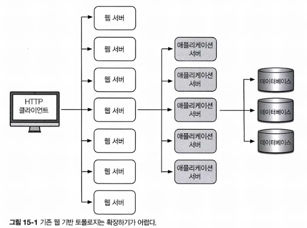
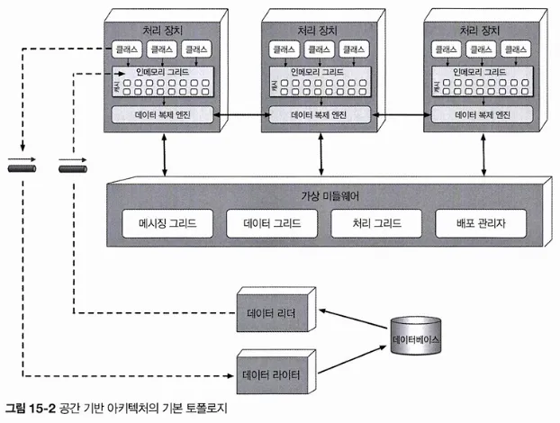
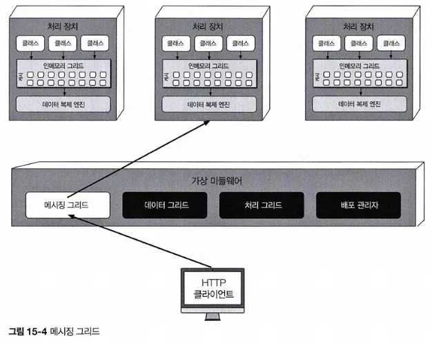
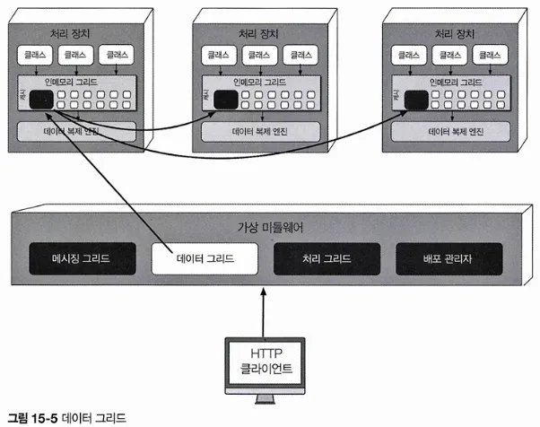
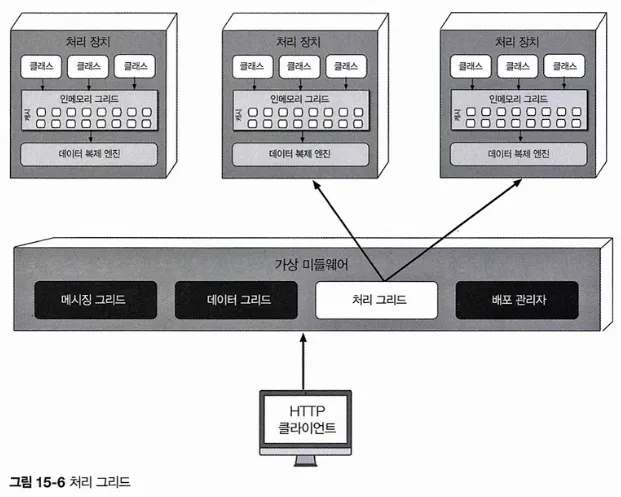
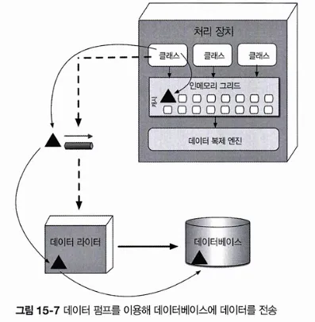
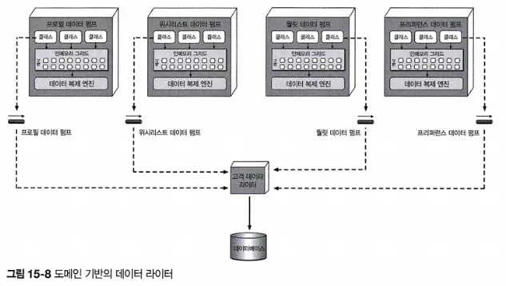
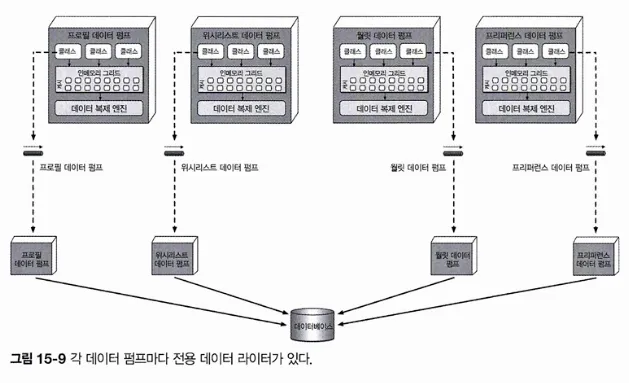
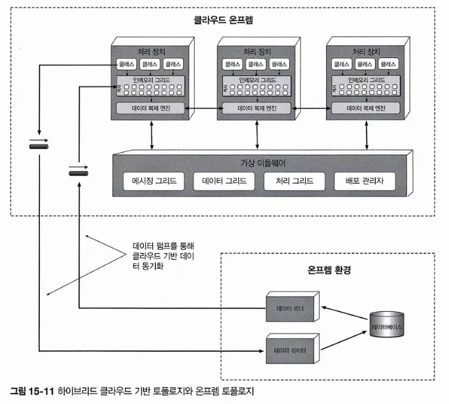

# CHAPTER 15 공간 기반 아키텍처 스타일
> 공간 기반 아키텍처 스타일은 높은 확장성, 탄력성, 동시성 및 이와 관련된 문제를 해결하기 위해 설계된 아키텍처 스타일임.
동시 유저 수가 매우 가변적이라서 예측조차 곤란한 애플리케이션에서도 유용
극단적이고 가변적인 확장성 문제는 데이터베이스를 확장하거나, 확장성이 떨어지는 아키텍처에 맞게 캐시 기술을 적용하는 것보다 아키텍처적으로 해결하는 것이 더 나음
> 
> 
> 

## 15.1 토폴로지
> 공간 기반 아키텍처라는 명칭은 튜플 공간에서 유래됨
튜플 공간은 공유 메모리를 통해 통신하는 다중 병렬 프로세서를 사용하는 기술임.
> 

- 공간 기반 아키텍처는 애플리케이션 코드가 구현된 처리장치, 처리 장치를 관리/조정하는 가상 미들웨어, 업데이트된 데이터를 데이터베이스에 비동기 전송하는 데이터 펌프, 데이터 펌프에서 데이터를 받아 업데이트를 수행하는 데이터 라이터, 처리 장치가 시작되자마자 데이터베이스의 데이터를 읽어 전달하는 데이터 리더 컴포넌트로 구성됨

### 15.1.1 처리 장치

처리 장치는 애플리케이션 로직(또는 로직의 일부분)을 갖고 있음

보통 웹 기반 컴포넌트와 백엔드 비즈니스 로직이 포함되나 애플리케이션 종류마다 내용물은 달라짐

작은 웹 기반 애플리케이션은 단일 처리 장치에 배포할 수 있지만, 대규모 애플리케이션은 기능별로 여러 처리 장치에 나누어 배포해야 함.

### 15.1.2 가상 미들웨어

: 아키텍처 내부에서 데이터 동기화 및 요청 처리의 다양한 부분을 제어하는 인프라를 담당함. 

- 메시징 그리드, 데이터 그리드, 처리 그리드, 배포 관리자 등의 컴포넌트로 구성됨.
    
    유저가 직접 작성하거나 서드파티 제품으로 구매할 수 있음
    
    - 메시징 그리드: 입력 요청과 세션 상태를 관리함
        
        가상 미들웨어에 요청이 유입되면 메시징 그리드는 어느 활성 처리 장치가 요청을 받아 처리할지 결정하여 해당 처리 장치로 요청을 전달함.
        
        - 복잡도는 단순 라운드 로빈 알고리즘부터 러리 장치가 요청 처리 상태를 추적하는 복잡한 알고리즘까지 다양
        - 보통 부하 분산이 가능한 일반 웹 서버로 구현함
            
            
            
    - 데이터 그리드: 이 아키텍처 스타일에서 가장 중요하고 필수적인 컴포넌트
        - 요즘은 데이터 그리드가 거의 대부분 복제 캐시로서 처리 장치에만 구현되어 있지만, 외부 컨트롤러가 필요한 복제 캐시 구현체나 분산 캐시를 사용할 경우, 데이터 그리드는 가상 미들웨어 내부의 데이터 그리드 컴포넌트와 처리 장치 모두에 위치함.
        - 가용한 모든 처리 장치에 요청을 전달할 수 있으므로 각 처리 장치는 자신의 인메모리 데이터 그리드에 정확히 동일한 데이터를 갖고 있어야 함.
        
        
        
    - 처리 그리드: 가상 미들웨어에서 필수 컴포넌트는 아니지만, 다수의 처리 장치가 단일 비즈니스 요청을 처리할 경우 요청 처리를 오케스트레이트하는 일을 함.
        - 종류가 다른 처리 장치 사이에 조정이 필요한 요청이 들어오면 처리 그리드가 두 처리 장치 사이에서 요청을 중재/조정함.
        
        
        
    - 배포 관리자: 부하 조건에 따라 처리 장치 인스턴스를 동적으로 시작/종료하는 컴포넌트
        - 응답 시간, 유저 부하를 계속 모니터링하다가 부하가 증가하면 새로운 처리 장치를 기동하고 반대로 감소하면 기존 처리 장치를 종료함.
        - 애플리케이션에서 다양한 확장성 요구사항을 구현하는 데 꼭 필요한 컴포넌트임
    
    ### 15.1.3 데이터 펌프
    
    : 데이터를 다른 프로세서에 보내 데이터베이스를 업데이트하는 장치임
    
    - 공간 기반 아키텍처에서는 처리 장치가 데이터를 데이터베이스에서 직접 읽고 쓰지 않으므로 데이터 펌프는 반드시 필요함.
    - 항상 비동기로 동작하면서 메모리 캐시와 데이터베이스의 최종 일관성을 실현함.
    - 처리 장치 인스턴스가 요청을 받고 캐시를 업데이트하면 처리 장치가 그 업데이트의 소유자가 되므로 데이터베이스 역시 데이터 펌프를 통해 최종 일관적으로 업데이트되도록 업데이트를 전송해야 함
    
   
    
    - 대개 메시징 기법으로 구현함.
        - 비동기 통신을 지원하고 전달을 보장하며 FIFO (선입 선출) 큐를 통해 메시지 순서도 유지함.
        - 처리 장치와 데이터 라이터를 분리할 수 있기 때문에 데이터 라이터를 사용할 수 없는 경우에도 처리 장치에서 무중단 처리가 가능함
    - 도메인이나 그 서브도메인별로 여러 개를 사용함
    - 계약 데이터와 연관된 액션(추가, 삭제, 수정)을 포함함
        - 계약 포맷은 JSON 스키마, XML 스키마, 객체, 값 기반 메시지 등 다양함

### 15.1.4 데이터 라이터

: 데이터 펌프에서 메시지를 받아 그에 맞게 데이터베이스를 업데이트하는 컴포넌트

- 서비스나 애플리메이션, 데이터 허브로 구현할 수 있음
- 데이터 펌프와 처리 장치의 범위마다 다름
- 도메인 기반의 데이터 라이터는 데이터 펌프 수와 무관하게 특정 도메인의 전체 업데이트를 처리하는 데 필요한 모든 데이터베이스 로직을 갖고 있음
    
    
    
- 처리 장치 클래스마다 자체 전용 데이터 라이터를 두는 경우도 있음
    - 너무 많은 단점이 있지만, 처리 장치, 데이터 펌프, 데이터 라이터가 나란히 정렬되어 확장성, 민첩성은 더 좋음
        
        
        

### 15.1.5 데이터 리더

: 데이터베이스에서 데이터를 읽어 리버스 데이터 펌프를 통해 처리 장치로 실어 나르는 컴포넌트임. 

- 세 가지 경우에만 작동됨
    1. 동일한 이름의 캐시를 가진 모든 처리 장치 인스턴스가 실패하는 경우
    2. 동일한 이름의 캐시 안에서 모든 처리 장치를 재배포하는 경우
    3. 복제 캐시에 들어있지 않은 아카이브 데이터를 조회하는 경우
- 인스턴스가 모조리 다운되면 데이터는 데이터베이스에서 읽어올 수밖에 없음
    
    처리 장치 인스턴스가 하나 둘 살아나기 시작하면서 각 인스턴스는 캐시에서 락을 획득하려고 함. 락을 손에 넣은 첫번째 인스턴스는 임시 캐시 소유자가 되고 한발 늦은 나머지 인스턴스들은 락이 해제될 때까지 마냥 기다림
    
    임시 캐시 소유자가 된 인스턴스는 데이터를 요청하는 큐에 메시지를 보내 캐시를 로드함
    
    데이터 리더가 읽기 요청을 받아 데이터베이스를 쿼리하여 처리 장치에 필요한 데이터를 검색하고 그 결과 데이터를 다른 큐로 보냄
    
    임시 캐시 소유자인 처리 장치는 리버스 데이터 펌프에서 데이터를 받아 캐시를 로드하는데, 이 작업이 모두 끝나면 임시 소유자는 캐시 락을 해제하고 다른 모든 인스턴스가 동기화도미녀 처리를 개시함
    
    
    
- 데이터 라이터처럼 도메인 기반으로 할 수 있지만 특정 처리 장치의 클래스 전용으로 사용하는 게 보통임
- 데이터 라이터와 데이터 리더는 본질적으로 데이터 추상 레이어를 형성함.
    
    두 레이어의 차이점은 처리 장치가 데이터베이스의 테이블 구조를 얼마나 자세히 알고 있는가, 임. 
    
    데이터 액세스 레이어는 처리 장치가 데이터베이스의 하부 데이터 구조와 커플링되어 있으므로 데이터 리더/라이터만 사용해서 간접적으로 데이터베이스에 액세스함.

## 15.2 데이터 충돌
- 이름이 동일한 캐시가 포함된 서비스 인스턴스에 시시각각 업데이트가 일어나는 active/active 상태에서 복제 캐시를 사용하면 복제 레이턴시 때문에 데이터 충돌이 발생할 수 있음
- 데이터 충돌은 한 캐시 인스턴스(캐시 A)에서 데이터 업데이트되어 다른 캐시 인스턴스(캐시 B)에 복제하는 도중에 동일한 데이터가 해당 캐시(캐시 B)에서 업데이트되는 현상을 말함.
    
    결국, 캐시 B의 로컬 업데이트는 캐시 A에서 복제된 옛 데이터 때문에 덮어씌워지고, 반대로 캐시 A에서는 동일한 데이터가 캐시 B에서 발생한 업데이트 때문에 덮어씌워지는 불상사가 일어남. 
    
- 데이터 충돌 발생 빈도는 동일한 캐시를 포함한 처리 장치 인스턴스 수, 캐시 업데이트율, 캐시 크기, 캐시 제품의 복제 레이턴시 등 여러 팩터가 영향을 미침
- 데이터 충동률 계산 공식
    
    $충돌률 = N * UR*UR / S * RL$
    
    - N: 동일한 이름의 캐시를 사용하는 서비스 인스턴스 수
    - UR: 밀리초 당 업데이트율
    - S: 캐시 크기(로우 개수)
    - RL: 캐시 제품의 복제 대기 시간
- 가변적인 복제 레이턴시는 데이터 일관성에 중대한 영향을 미침.
    
    네트워크 유형, 처리 장치 간 물리적 거리 등 다양한 팩터에 좌우되기 때문에 복제 레이턴시 값이 공시되는 경우는 거의 없으니 직접 프로덕션 환경에서 값을 측정해야 함. 
    
- 충돌률을 계산할 때에는 사용량이 가장 많은 시점의 최대 업데이트율에 따라 최소, 정상, 최대 충돌률을 산출하는 것이 바람직함

## 15.3 클라우드 대 온프레미스 구현
공간 기반 아키텍처는 배포 환경 측변에서 독자적인 선택지가 있음

처리 장치, 가상 미들웨어, 데이터 펌프, 데이터 리더/라이터, 데이터베이스 등 전체 토폴로지는 클라우드 기반의 환경이나 온프레미스에 배포할 수 있음. 

하지만 이 두 환경 사이에 어중간하게 배포할 수도 있는데, 이것이 다른 아키텍처 스타일에서는 찾아볼 수 없는 이 아키텍처의 특징임. 

- 물리 데이터베이스와 데이터를 온프레미스에 그대로 둔 상태로, 클라우드 기반의 매니지드 환경에서 처리 장치와 가상 미들웨어를 통해 애플리케이션을 배포하는 하이브리드 클라우드가 가능하다는 것이 이 아키텍처의 강점.
    
    
    
- 이러한 토폴로지는 비동기 데이터 펌프와 이 아키텍처 스타일의 최종 일관성 모델 덕분에 아주 효율적인 클라우드 기반의 데이터 동기화가 가능함. → 트랜잭션은 탄력적인 동적 클라우드 기반의 환경에서 처리하되, 물리적인 데이터 관리, 리포팅, 데이터 분석 데이터는 안전한 로컬 온프레미스 환경에 보관할 수 있음

## 15.4 복제 캐시 대 분산 캐시
