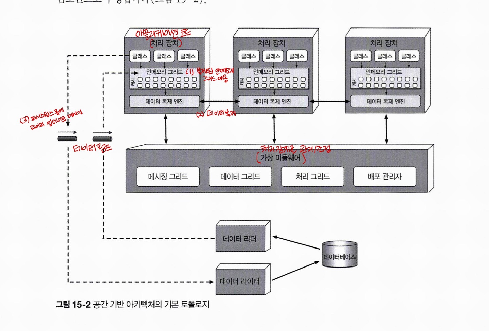
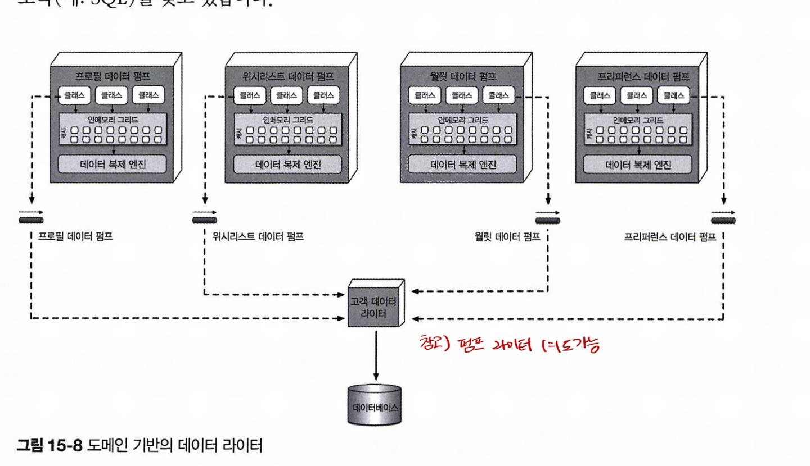
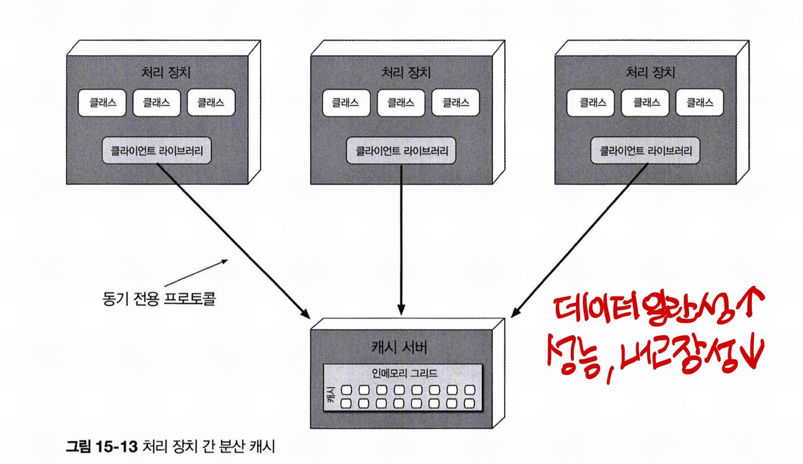
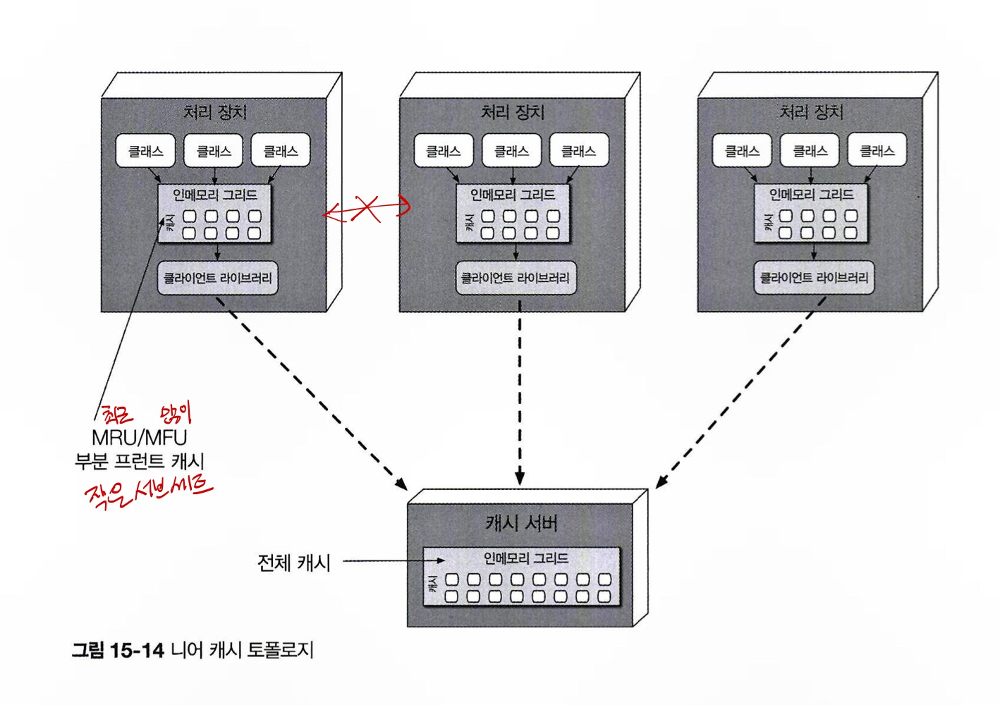
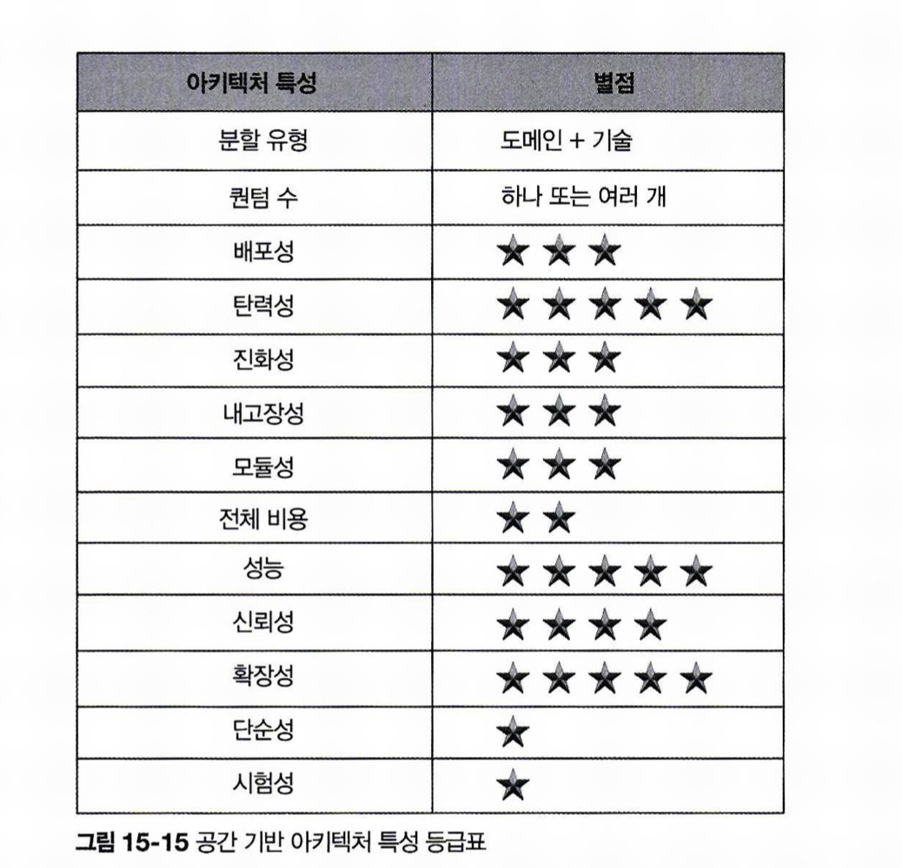

# CHAPTER15 공간 기반 아키텍처 스타일

병목 현상이 나타나기 시작했을 때 웹 서버 확장으로 쉽게 병목을 제거할 수 있지만, 애플리케이션 서버로 병목이 이동하기 쉽습니다.
애플리케이션 서버 확장은 웹 서버보다 훨씬 복잡하고 비용도 많이 드는데, 그렇게 확장해도 다시 데이터베이스 서버가 병목점이 될 가능성이 높습니다.

공간 기반 아키텍처 스타일은 높은 확장성, 탄력성, 동시성 및 이와 관련된 문제를 해결하기 위해 설계된 아키텍처 스타일입니다.

## 15.1 토폴로지

공간 기반 아키텍처라는 명칭은 튜플 공간에서 유래됐습니다. 튜플 공간은 공유 메모리를 통해 통신하는 다중 병렬 프로세서를 사용하는 기술입니다.

(1)시스템에서 동기 제약조건인 중앙 데이터베이스를 없애는 대신, 복제된 인메모리 데이터 그리드를 활용하면 확장성, 탄력성, 성능을 높일 수 있습니다.

(2)애플리케이션 데이터는 메모리에 둔 상태로 모든 활성 처리 장치들이 데이터를 복제합니다.

(3)처리 장치는 데이터를 업데이트할 때 퍼시스턴스 큐에 메시지를 보내는 식으로 비동기 전송합니다.

유저 부하의 증가/감소에 따라 처리 장치는 동적으로 시작/종료할 수 있어 가변적으로 확장할 수 있습니다. 중앙 데이터베이스가 애플리케이션의 표준 트랜잭션 처리에 관여하지 않으므로 데이터베이스 병목 현상이 사라지고 애플리케이션은 거의 무한에 가까운 확장성이 보장됩니다.

### 15.1.1 처리 장치

처리 장치는 애플리케이션 로직을 갖고 있습니다. 애플리케이션 로직 외에도 인메모리 데이터 그리드 및 복제 엔진도 처리 장치에 포함됩니다.

### 15.1.2 가상 미들웨어

가상 미들웨어는 아키처 내부에서 데이터 동기화 및 요청 처리의 다양한 부분을 제어하는 인프라를 담당합니다.

**메시징 그리드**

메시징 그리드는 입력 요청과 세션 상태를 관리합니다. 가상 미들웨어에 요청이 유입되면 메시징 그리드는 어느 활성 처리 장치가 요청을 받아 처리할지 결정하여 해당 처리 장치로 요청을 전달합니다. 이 컴포넌트는 보통 부하 분산이 가능한 일바 웹서버(HA 프록시, 엔진엑스)로 구현합니다.

**데이터 그리드**

데이터 그리드는 이 아키텍처 스타일에서 가장 중요하고 필수적인 컴포넌트입니다. 요즘은 데이터 그리드가 거의 대부분 복제 캐시로서 처리 장치에만 구현되어 있지만, 외부 컨트롤러가 필요한 복제 캐시 구현체나 분산 캐시를 사용할 경우, 데이터 그리드는 가상 미들웨어 내부의 데이터 그리드 컴포넌트와 처리장치 모두에 위치합니다.

동일한 이름의 캐시가 포함된 다른 모든 처리 장치에 변경된 데이터가 복제됩니다. 한 처리 장치가 다른 처리 장치를 원격 호출해서 데이터를 요청하거나(코레오그래피) 처리 그리드를 이용해서 요청을 오케스트레이트하는 방법도 있습니다.

각 처리 장치는 멤버 리스트를 사용해 다른 모든 처리 장치 인스턴스를 인지합니다. 멤버 리스트에는 동일한 이름의 캐시를 사용하는 다른 모든 처리 장치의 IP 주소 및 포트가 들어 있습니다.

**처리 그리드**
처리 그리드는 필수는 아니지만, 다수의 처리 장치가 단일 비즈니스 요청을 처리할 경우 요청 처리를 오케스트레이트하는 일을 합니다. 또 종류가 다른 처리 장치 사이에 조정이 필요한 요청이 들어오면 처리 그리드가 두 처리 장치 사이에서 요청을 중재/조정합니다.

**배포 관리자**
배포 관리자는 부하 조건에 따라 처리 장치 인스턴스를 동적으로 시작/종료하는 컴포넌트입니다. 응답 시간, 유저 부하를 계속 모니터링 하다가 부하가 증가하면 새로운 처리 장치를 기동하고 반대로 감소하면 기존 처리 장치를 종료합니다.

### 15.1.3 데이터 펌프

데이터 펌프는 데이터를 다른 프로세서에 보내 데이터베이스를 업데이트하는 장치입니다. 항상 비동기로 동작하면서 캐시와 데이터베이스의 최종 일관성을 실현합니다.

대부분의 경우 데이터 펌프는 도메인이나 그 서브도메인별로 여러 개를 사용합니다.

데이터 펌프는 계약 데이터와 연관된 액션(추가, 삭제, 수정)을 포함합니다. 계약 포맷은 다양합니다. 업데이트 데이터는 보통 새 데이터 값만 보관합니다. 고객이 전화 번호를 변경할 경우, 고객 ID, 데이터 업데이트 액션, 그리고 새 전화 번호만 전송됩니다.

### 15.1.4 데이터 라이터

데이터 라이터는 데이터 펌프에서 메시지를 받아 그에 맞게 데이터베이스를 업데이트하는 컴포넌트입니다.

도메인 기반의 데이터 라이터는 데이터 펌프 수와 무관하게 특정 도메인의 전체 업데이트를 처리하는 데 필요한 모든 데이터베이스 로직을 갖고 있습니다. 예제 이미지에서 데이터 라이터는 4개의 데이터 펌프를 모두 리스닝하며, 데이터베이스에 있는 고객 관련 테이블 레코드를 업데이트 하는 로직(예: SQL)을 갖고 있습니다.

### 15.1.5 데이터 리더

데이터 리더는 데이터베이스에서 데이터를 읽어 리버스 데이터 펌프를 통해 처리 장치로 실어 나르는 컴포넌트입니다. 데이터 리더는 세 가지 경우에만 작동됩니다. 첫째, 동일한 이름의 캐시를 가진 모든 처리 장치 인스턴스가 실패하는 경우, 둘째, 동일한 이름의 캐시 안에서 모든 처리 장치를 재배포하는 경우, 셋째, 복제 캐시가 들어있지 않은 아카이브 데이터를 조회하는 경우입니다.

장애가 나서 다 다운된 경우, 다시 살아난 인스턴스(처리 장치)가 캐시에 데이터 요청 -> 락 -> 데이터 요청 -> 리버스 데이터 펌프에서 캐시 로드 -> 락 해제

데이터 리더/라이터는 본질적으로 데이터 추상 레이어를 형성합니다. 하부 데이터베이스의 스키마 구조와 분리되어 있어서 데이터베이스 증분변경이 가능합니다.

## 15.2 데이터 충돌

이름이 동일한 캐시가 포함된 서비스 인스턴스에 시시각각 업데이트가 일어나는 active/active 상태에서 복제 캐시를 사용하면 복제 레이턴시 때문에 데이터 충돌이 발생할 수 있습니다.

데이터 충동률=N(동일한 이름의 캐시를 사용하는 서비스 인스턴스 수) * UR^2(밀리초 당 업데이트율) / S(캐시 크기) * RL(캐시 제품의 복제 대기 시간)

(충돌률을 실제로 계산하는 부분은 생략)

대부분의 시스템은 오래 꾸준히 업데이트를 하지 않기 때문에 사용량이 가장 많은 시점의 최대 업데이트율에 따라 최소, 정상, 최대 충돌률을 산출하는 것이 바람직합니다.

## 15.3 클라우드 대 온프레미스 구현

처리 장치, 가상 미들웨어, 데이터 펌프, 데이터 리더/라이터, 데이터베이스 등 전체 토폴로지는 클라우드 기반의 환경이나 온프레미스에 배포할 수 있습니다. 이 두 환경 사이에 어중간하게 배포할 수도 있 는데, 이것이 다른 아키텍처 스타일에서는 찾아볼 수 없는 이 아키텍처의 특징입니다.

데이터 트랜잭션은 탄력적인 동적 클라우드 기반의 환경에서 처리하되, 물리적인 데이터 관리, 리포팅, 데이터 분석 데이터는 안전한 로컬 온프레미스 환경에 보관할 수 있습니다.

## 15.4 복제 캐시 대 분산 캐시

복제 캐시를 사용할 경우 여태 그림에 나왔다시피 각 처리 장치는 이름이 동일한 캐시를 사용하는 모든 처리 장치 간에 동기화되는 자체 인메모리 데이터 그리드를 갖고 있습니다.

복제 캐시는 공간 기반 아키텍처의 표준 캐시 모델이지만, 데이터량이 엄청나게 많거나 캐시 데이터가 너무 빈번하게 업데이트 되는 등 복제 캐시를 사용할 수 없는 경우도 있습니다. 실제로 내부 메모리 캐시가 100MB를 초과하면 각 처리 장치마다 메모리를 점유하기 때문에 탄력성, 확장성에 문제가 발생할 수 있습니다. 일반적으로 처리 장치는 가상 머신에 배포되는데, 각 가상 머신마다 할당된 메모리만큼만 내부 캐시 용도로 쓸 수 있으므로 처리량에 압박을 받는 상황에서는 처리 장치 인스턴스 수를 제한할 수 밖에 없습니다. 신속하게 업데이트가 이루어져야 하는 경우, 데이터 그리드가 미처 이 속도를 따라잡지 못할 수도 있습니다. 이 때 분산 캐시가 도움이 됩니다.

## 15.5 니어 캐시

니어 캐시(준 캐시)는 분산 캐시와 인메모리 데이터 그리드를 접합한 일종의 하이브리드 캐시 모델입니다. 이 모델에서 분산 캐시는 풀 백킹 캐시, 각 처리 장치에 포함된 인메모리 데이터 그리드는 프런트 캐시라고 합니다.

성능과 일관성이 결여되므로 니어 캐시 모델을 권장하지 않음.

## 15.6 구현 예시

유저 수나 요청량이 갑자기 폭증하는 애플리케이션이나 만 명이 넘는 동시 유저를 처리해야 하는 종류의 앱에 적합함.

### 15.6.1 콘서트 티켓 판매 시스템

좌석 선호도와 상관없이 티켓 수량은 정해져있습니다. 엄청난 요청 수를 감당하려면 좌석 가능 여부가 가능한 한 신속하게, 지속적으로 업데이트돼야 합니다. 시스템이 계속 중앙 디비에 요청하면 머지않아 작동이 멎게될 가능성이 높습니다.

공간 기반 아키텍처에서는 유저 수가 치솟으면 배포 관리자가 대량 요청을 감당할 수 있도록 처리 장치를 기동합니다. 

### 15.6.2 온라인 경매 시스템

### 15.7 아키텍처 특성 등급

탄력성, 확장성, 성능의 끝판왕! 단순성과 시험성과의 트레이드오프가 있음. 스트레스테스트도 힘들고, 비용도 많이 듦