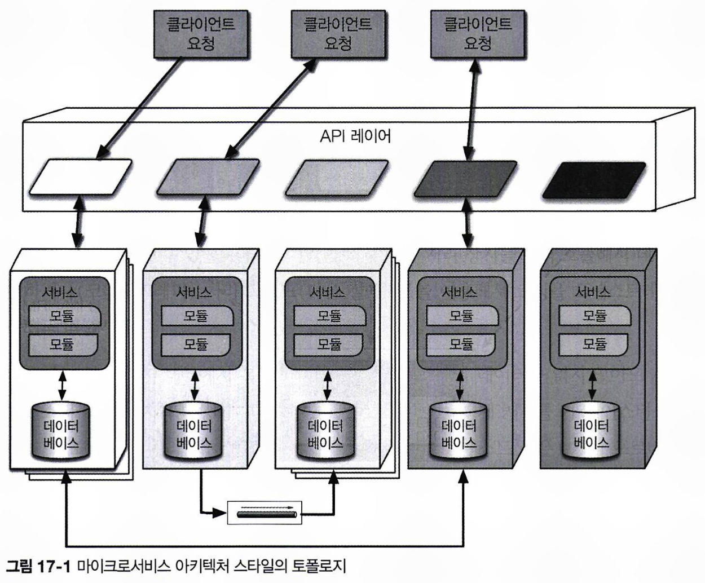
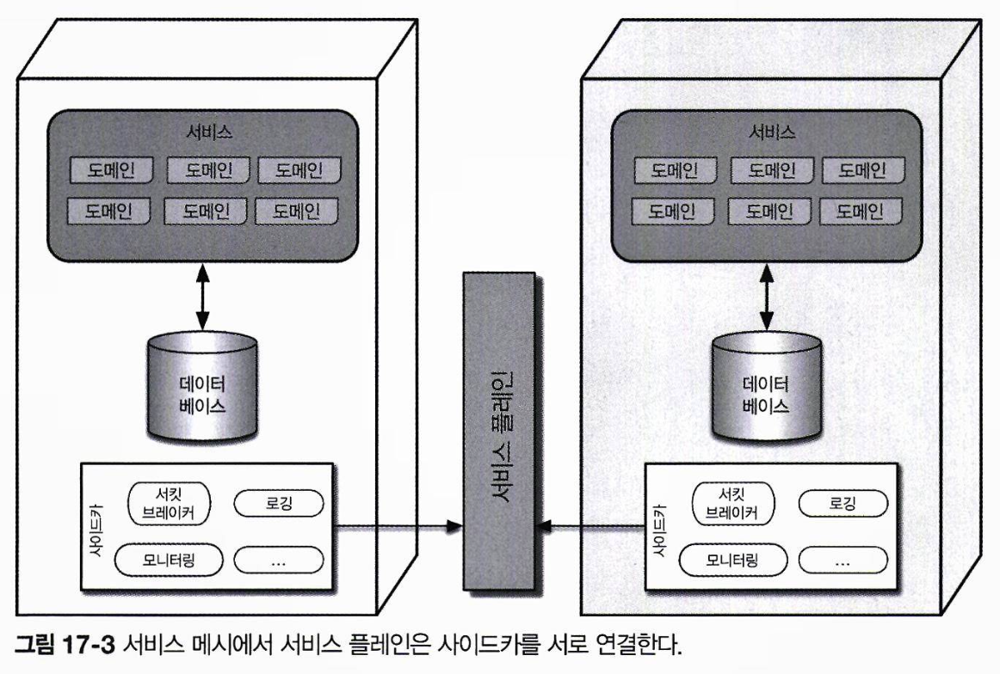
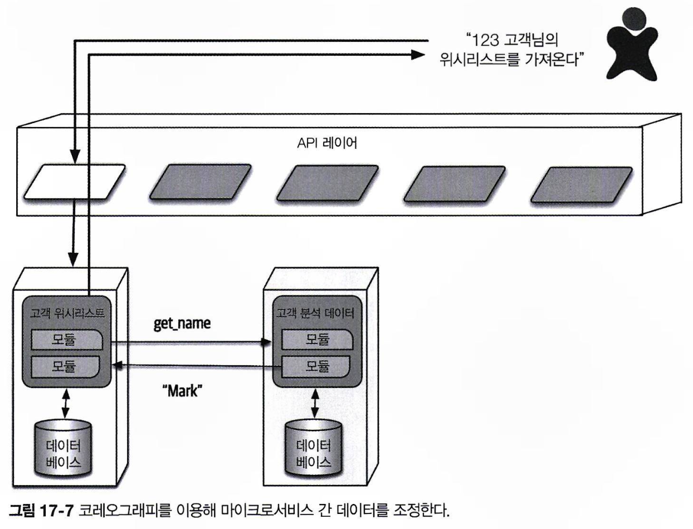
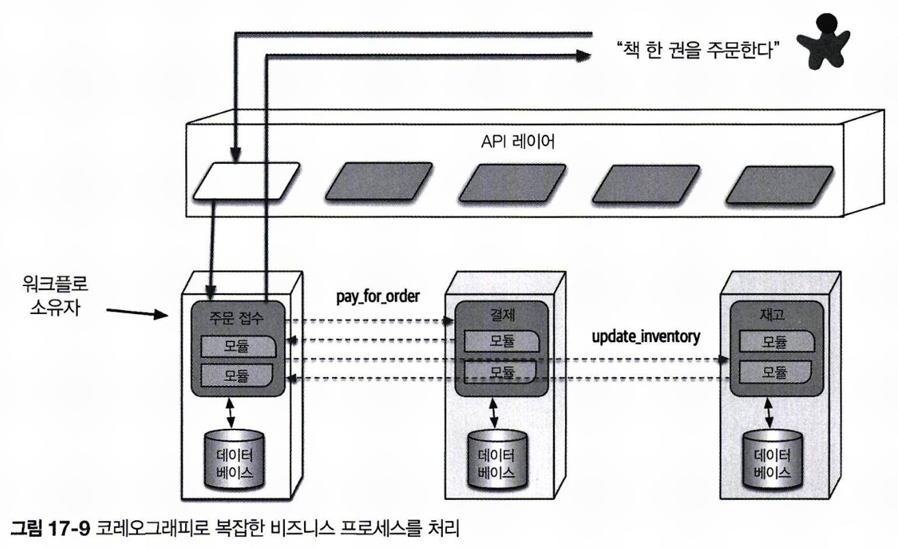
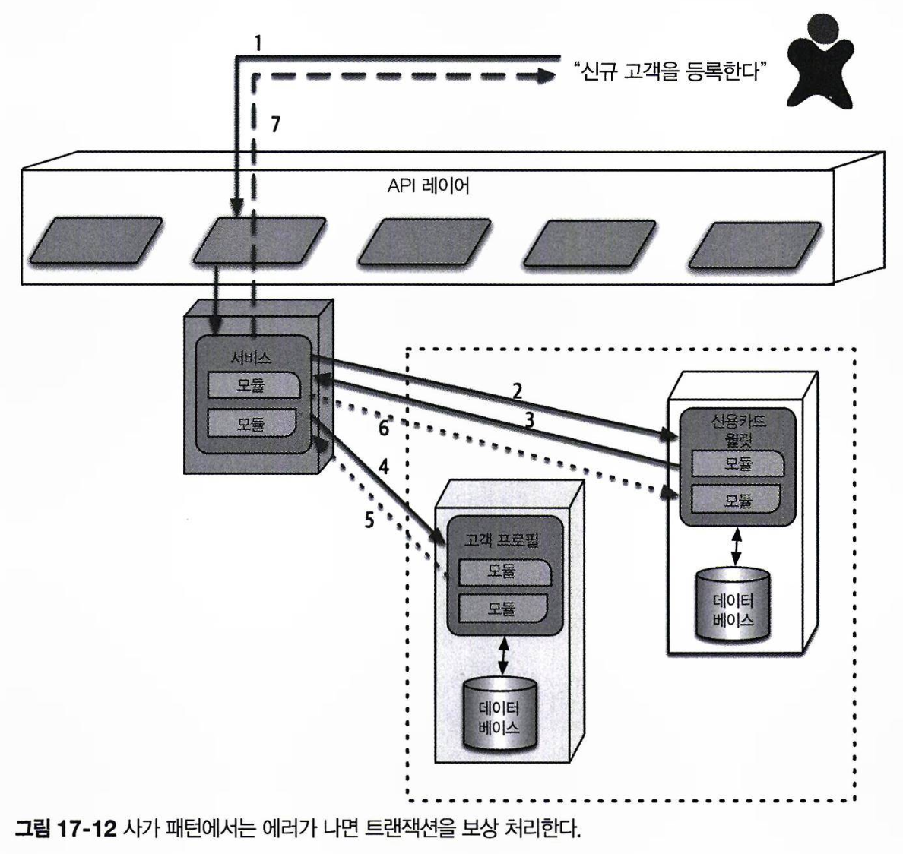

# 마이크로서비스 아키텍처 스타일

## 17.1 역사

대부분의 아키텍처 스타일은 반복되는 패턴을 발견한 아키텍트의 이름을 따서 명명되며, 소프트웨어 개발 환경의 변화 속에서 자연스럽게 공통의 결정에 이르게 된 경우가 많습니다.  
하지만 이와 달리 마이크로서비스 아키텍처는 마틴 파울러와 제임스 루이스의 블로그 게시글에서 시작하여, 초기부터 이름이 붙여졌습니다.  
그들의 글은 마이크로서비스의 철학과 개념을 이해하는 데 큰 도움이 되었습니다.

마이크로서비스는 도메인 주도 설계(DDD)의 영향을 많이 받았으며, 특히 디커플링을 강조하는 경계 콘텍스트 개념이 결정적인 역할을 했습니다.  
소프트웨어의 각 도메인은 코드와 데이터베이스 스키마에 속한 여러 엔티티와 행위를 포함합니다.  
전통적인 모놀리식 아키텍처에서는 도메인들이 공통 클래스를 통해서 단일한 데이터베이스에 접근했습니다.  
이와 달리 마이크로서비스에서는 각 경계 콘텍스트가 독립적으로 코드와 데이터 스키마를 정의하고, 외부와의 커플링을 최소화했습니다.

소프트웨어 아키텍처에서 재사용은 유익하지만, 이를 위해 서로를 상속하고 조합하다 보면 커플링이 발생합니다.  
디커플링이 중요한 목표일 경우, 중복을 허용해 재사용을 줄이는 것이 더 적합합니다.  
마이크로서비스의 핵심 목표는 경계 콘텍스트를 물리적으로 구현하여, 도메인 간 고도의 디커플링을 이루는 것입니다.

## 17.2 토폴로지

각 마이크로서비스는 단일 목적만을 가지므로, 서비스 규모가 서비스 지향 아키텍처보다 작습니다.  
각 서비스는 독립적으로 작동하는 데 필요한 데이터베이스와 기타 종속 컴포넌트를 자체적으로 완비하고 있습니다.

## 17.3 분산

마이크로서비스는 분산 아키텍처입니다.  
각 서비스는 자체 프로세스로 실행되며, 각 프로세스의 실행 환경은 물리적 컴퓨터에서 격리된 가상 머신과 컨테이너로 발전했습니다.  
각 서비스를 자체 프로세스로 분리하면 공유 리소스 등으로 인한 문제들이 자연스럽게 해결됩니다.  
과거에는 도메인마다 인프라를 구축하는 것이 비현실적이었으나, 현재는 클라우드 리소스와 컨테이너 기술의 발전으로 도메인 및 운영 레벨에서 디커플링을 구현할 수 있게 되었습니다.

마이크로서비스는 분산 아키텍처이기 때문에 네트워크 호출과 보안 검증으로 인해 성능이 저하될 수 있습니다.  
또한 트랜잭션이 서비스 경계를 넘지 않도록 유의해야 합니다.  
따라서 서비스를 어느 정도로 세분화 할지에 대해서 심사숙고 해야 하며, 서비스 세분화가 마이크로서비스 아키텍처의 성공의 핵심입니다.

## 17.4 경계 콘텍스트

마이크로서비스의 핵심 철학은 경계 콘텍스트 개념입니다.  
각 서비스는 도메인이나 워크플로를 모델링하여, 애플리케이션에 필요한 모든 요소(클래스, 컴포넌트, 데이터베이스 스키마 등)를 포함합니다.  
마이크로서비스는 요소를 공유해서 커플링을 만드는 것보다는, 중복하더라도 커플링을 제거하는 것을 선호합니다.  
각 마이크로서비스는 특정 도메인이나 서브도메인을 나타내도록 구성되어, 전체 아키텍처는 도메인 주도 설계의 논리적 개념을 물리적으로 구현한 형태가 됩니다.

### 17.4.1 세분도

과도하게 서비스를 세분화할 경우, 작은 로직 추가를 위해서도 서비스 간 통신 링크의 재구축이 필요해지는 문제가 발생할 수 있습니다.  
‘마이크로서비스’라는 용어는 서비스 지향 아키텍처의 ‘거대 서비스’에 대비해 작은 서비스를 의미하려고 만들어진 것입니다.  
서비스를 지나치게 세분화하는 것은 적절하지 않습니다.  
서비스 경계는 도메인이나 워크플로를 캡처하는 것이 목표이며, 어느 정도의 경계가 적절한지는 시스템과 비즈니스 프로세스마다 달라질 수 있습니다.  
좋은 서비스 설계는 반복적인 시도를 통해 이루어지며, 처음부터 완벽한 설계를 기대하기보다는 다양한 옵션을 적용하며 개선해 나가야 합니다.

#### 목적

마이크로서비스 아키텍처의 핵심은 각 서비스가 도메인에 따라 기능적으로 응집되는 것입니다.  
각 마이크로 서비스는 전체 애플리케이션 내에서 하나의 핵심 기능을 제공하는 데 집중해야 합니다.

#### 트랜잭션

여러 엔티티가 관여하게 되는 트랜잭션은 서비스 경계로 사용될 수 있습니다.  
분산 아키텍처에서는 트랜잭션 문제를 방지하도록 설계하는 것이 중요합니다.

#### 코레오그래피

서비스 간 광범위한 통신이 필요한 시스템인 경우, 통신 오버헤드를 줄이기 위해 서비스들을 더 큰 단위로 통합할 수 있습니다.

### 17.4.2 데이터 격리

마이크로서비스는 경계 콘텍스트를 기반으로 데이터를 격리하며, 공유 스키마나 데이터베이스로 인한 커플링을 최대한 배제합니다.  
데이터 격리는 서비스 세분도 설계 시 중요한 요소이며, 단순히 데이터베이스 엔티티를 기준으로 모델링하지는 않아야 합니다.(엔티티 함정 피하기)

마이크로서비스 아키텍처에서는 단일 데이터베이스를 단일한 진실 공급원으로 사용하지 않고, 아키텍처 전반에 데이터를 분산시키는 식으로 설계해야 합니다.  
이를 위해 도메인별로 진실 공급원을 식별하거나, 데이터베이스 복제나 캐시 기술을 활용하는 등 구체적인 방안을 마련해야 합니다.  
데이터를 격리하는 것은 복잡한 작업이지만, 각 서비스가 독립적으로 적합한 데이터베이스와 도구를 선택할 수 있어 유연성이 높아진다는 이점이 있습니다.  
팀 간에 간섭 없이 필요에 따라 데이터베이스나 의존성을 변경할 수 있다는 점도 큰 장점입니다.

## 17.5 API 레이어

마이크로서비스 다이어그램에서는 여러 시스템 컨슈머 간에 API 레이어(유저 인터페이스, 시스템 간 호출)가 자주 등장합니다.  
이 때 API 레이어는 프록시를 이용하여 통신을 간접화하거나, 네이밍 서비스와 연결되어 필요한 작업을 수행하는 등, 유용하게 활용될 수 있습니다.  
다만 API 레이어는 중재자나 오케스트레이션 도구로 사용하지 말아야 하며, 비즈니스 로직은 경계 콘텍스트 내부에서 처리해야 합니다.

## 17.6 운영 재사용

마이크로서비스는 운영 관심사(모니터링, 로깅, 회로 차단기 등)와 도메인 로직을 분리합니다.  
운영 관심사의 경우 여러 마이크로서비스에서 공통되는데, 공통 요소를 효과적으로 관리하려면 사이드카 패턴을 활용하는 것이 유리합니다.  
사이드카 패턴에서는 각 서비스에 공통 운영 관심사를 처리하는 컴포넌트를 두는 식으로 운영합니다.  
모니터링 도구 업그레이드 같은 작업이 필요해지면 공유 인프라팀이 사이드카를 업데이트하는 식으로 처리합니다.  
이를 통해 공통 기능을 개별 팀에 맡기는 대신, 표준화된 방식으로 처리하여 업그레이드 및 관리가 용이해집니다.

추가로 서비스 메시(Service Mesh)를 구축하면, 각 서비스들에 포함된 공통 사이드카를 일원화하여 제어할 수 있습니다.  
서비스 메시에서 각 사이드카는 서비스 플레인과 연결되어, 모든 마이크로서비스에 대해 일관된 운영 인터페이스를 제공합니다.  
각 서비스는 메시 내에서 하나의 노드로 작동하며, 개발자는 서비스 메시를 전체 서비스를 관리하는 콘솔로 사용합니다.  
이를 통해 모니터링, 로깅 등 운영에 관련된 공통 관심사를 글로벌하게 제어할 수 있습니다.

또한 마이크로서비스 아키텍처의 탄력성과 확장성을 개선하기 위해 서비스 디스커버리(service discovery)를 사용할 수 있습니다.  
모든 요청이 서비스 디스커버리를 거치도록 설정하여 요청 수와 빈도를 모니터링하고, 필요 시 서비스 인스턴스를 확장하도록 설계할 수 있습니다.  
일반적으로 서비스 디스커버리는 서비스 메시 안의 API 레이어로 배포되어, 모든 마이크로 서비스의 일부로 포함됩니다.

## 17.7 프런트엔드

마이크로서비스는 디커플링을 선호하기 때문에, 유저 인터페이스(UI)와 백엔드를 분리하는 것을 이상적으로 여깁니다.  
초기에는 UI를 경계 콘텍스트 일부로 포함하려 했으나, 현실적인 제약으로 인해 이를 달성하기 어려웠습니다.  
결과적으로 마이크로서비스 아키텍처에서 UI는 주로 두 가지 스타일로 구현됩니다.

- **모놀리식 프론트엔드**: 아키텍처 내에 단일 유저 인터페이스를 두고, API 레이어를 통해 요청을 각 마이크로 서비스에 전달합니다.
  - 데스크톱, 모바일, 웹 애플리케이션 형태로 구현될 수 있으며, 최근에는 주로 자바스크립트 웹 프레임워크를 활용한 웹 애플리케이션으로 구현됩니다.
- **마이크로 프런트엔드**: 백엔드 서비스에 맞춰 유저 인터페이스를 컴포넌트로 세분화하고 격리하며, 전체 프런트엔드는 컴포넌트들을 조합해 관리합니다.
  - 유저 인터페이스까지 서비스 경계로 분리하여, 도메인을 단일 팀 내부에서 통합적으로 운영할 수 있습니다.

## 17.8 통신

마이크로서비스 구축 시 어떤 통신 방식을 선택하는지는 서비스 디커플링에 중요한 지점입니다.  
크게는 동기와 비동기 중에서 결정해야 하는데, 마이크로서비스 아키텍처는 일반적으로 프로토콜 인지 기반의 이종 간 상호 운용성(protocol-aware heterogeneous interoperability)을 활용합니다.

#### 프로토콜 인지 (protocol-aware)

마이크로서비스에서는 디커플링을 위해 중앙 통합 허브 없이 운영하기 때문에, 각 서비스는 다른 서비스를 호출할 방법과 프로토콜을 알아야 합니다.  
REST, 메시지 큐 등 호출 방식을 표준화하여 서비스 간 통신을 효율적으로 관리할 수 있습니다.

#### 이종 (heterogeneous)

마이크로 서비스 아키텍처에서는 폴리글랏 환경이 완벽히 지원되어, 각 서비스가 서로 다른 기술 스택을 사용하여 구현될 수 있습니다.

#### 상호 운용성 (interoperability)

마이크로서비스는 네트워크를 통해 서로 호출하며 협력합니다.

비동기 통신은 주로 이벤트 기반 아키텍처를 기반으로 하여 이벤트와 메시지를 사용하며, 하며, 코레오그래피 패턴과 오케스트레이션 패턴으로 나타납니다.

### 17.8.1 코레오그래피와 오케스트레이션

코레오그래피는 브로커 이벤트 기반 아키텍처와 동일한 통신 스타일로, 중앙 중재자를 두지 않습니다.  
마이크로서비스 아키텍트는 디커플링을 추구하므로, 도메인/아키텍처 동형성(domain/architecture isomorphism) 관점에서 마이크로서비스의 형상은 커플링을 최소화하는 브로커 이벤트 기반 아키텍처를 닮았습니다.

코레오그래피에서 각 서비스는 중앙 중재자 없이 자신의 필요에 따라 다른 서비스를 호출합니다.  
아래 예시에서는 유저가 요청한 위시 리스트 상세 정보를 제공하기 위해 CustomerWishList와 CustomerDemographics 서비스를 조합하여 데이터를 반환해야 합니다.  
아래와 같이 처음 요청을 받은 서비스가 다른 서비스를 호출하여 정보를 종합하게 됩니다.

코레오그래피 아키텍처를 사용하면 에러 처리와 조정 같은 공통 문제가 더 복잡해지는 단점이 있습니다.  
워크플로가 복잡해질수록 이 문제는 더 두드러집니다.
워크플로 소유저는 자신의 도메인의 책임과 함께 여러 서비스를 조정하는 중재자 역할도 함께 수행해야 하며(프런트 컨트롤러 패턴), 이로 인해 서비스의 복잡도가 증가합니다.

복잡한 비즈니스 프로세스는 오케스트레이션 방식을 사용하는게 더 나을 수 있습니다.  
중재자가 비즈니스 워크플로의 복잡한 처리와 조정을 전담하여, 서비스 간 커플링이 발생하긴 하지만 다른 서비스에의 영향은 최소화 됩니다.  
**도메인과 워크플로는 본질적으로 커플링되는 경우가 많다는 것을 감안**하고, 도메인과 아키텍처를 균형 있게 반영하여 선택을 내려야 합니다.

### 17.8.2 트랜잭션과 사가

마이크로서비스 아키텍처에서는 여러 서비스에 걸친 트랜잭션을 어떻게 조정하는지가 중요한 문제입니다.  
특히 분산 애플리케이션에서는 데이터베이스도 동일한 수준으로 디커플링 해야 하기 때문에, 원자성 문제가 함께 대두됩니다.  
서비스 경계를 넘나드는 트랜잭션은 마이크로서비스의 디커플링 원칙에 어긋납니다.  
따라서 **여러 서비스에 트랜잭션을 적용하는 대신, 컴포넌트 세분도를 조정해야 합니다**.

다만 예외적으로, 서비스 경계가 분명히 구분되었지만 서로 다른 아키텍처 특성을 가진 두 서비스를 한 트랜잭션으로 묶어야 할 때가 있습니다.  
이런 경우에는 **트랜잭션 오케스트레이션을 처리하는 패턴을 사용**하며, 이를 위해 상당한 트레이드오프를 감수해야 합니다.

대표적으로 **사가 패턴**은 **중재자가 여러 서비스 호출을 조정하며 트랜잭션을 관리**합니다.  
중재자는 각 트랜잭션 단계를 순차적으로 호출하고 성공/실패 여부를 기록하며, 전체 단계 성공 시 데이터와 데이터베이스를 동기화합니다.  
중간에 한 단계라도 실패하면, **중재자가 성공한 이전 단계들에 undo 요청을 보내 작업을 원상태로 복구**하는 **보상 트랜잭션 프레임워크(compensating transaction framework)** 로 구성됩니다.  
그러나 해당 프레임워크를 사용하면 보류된 상태에 대한 조정을 위해 추가 요청이 발생하여 설계가 복잡해지며, 네트워크 트래픽도 증가합니다.  
이러한 이유 때문에 가능하면 서비스 간 트랜잭션은 피하고, 정말로 필요한 일부의 부분에만 사가 패턴을 곁들이는 식으로 구성해야 한다.

## 17.9 아키텍처 특성 등급

| 아키텍처 특성 | 별점              |
| ------------- | ----------------- |
| 분할 유형     | 도메인            |
| 퀀텀 수       | 하나 또는 여러 개 |
| 배포성        | X X X X           |
| 탄력성        | X X X X X         |
| 진화성        | X X X X X         |
| 내고장성      | X X X X           |
| 모듈성        | X X X X X         |
| 전체 비용     | X                 |
| 성능          | X X               |
| 신뢰성        | X X X X           |
| 확장성        | X X X X X         |
| 단순성        | X                 |
| 시험성        | X X X X           |

- 마이크로서비스 아키텍처는 자동화 배포, 시험성 등 현대 엔지니어링 프랙티스를 훌륭히 지원합니다.
- 분산 아키텍처 특성 상, 서비스 간 통신을 과용하면 내고장성과 신뢰성이 위협받을 수 있습니다.
  - 서비스 디스커버리를 기반으로 한 확장을 통해 문제를 해결합니다.
  - 독립적이고 단일 목적의 서비스로 구성하여 기본적으로 내고장성이 높습니다.
- 이 아키텍처의 핵심은 **확장성, 탄력성, 진화성**으로, 고도의 디커플링과 자동화된 운영 통합을 통해 급변하는 비즈니스 요구 사항을 효과적으로 지원합니다.
  - 작은 배포 단위로 시스템이 구성되어, 빠른 변화에도 유연하게 대응할 수 있습니다.
- 마이크로서비스는 잦은 네트워크 호출로 인해 성능 오버헤드가 발생할 수 있고, 네트워크 보안 체크의 부담도 커질 수 있습니다.
  - 데이터 캐시와 복제 기술을 활용하며, 과도한 네트워크 호출을 줄일 수 있습니다.
  - 커플링이 적을 수록 통신 속도를 높이고 병목을 줄기 때문에, 오케스트레이션보다 코레오그래피를 선호합니다.
