# CHAPTER 17 마이크로서비스 아키텍처 스타일
> 최근 아주 평판 좋은 아키텍처 스타일
## 17.1 역사
- 마이크로서비스는 사용 초기부터 이름이 붙어졌고 14년 3월 마틴 파울러와 제임스 루이스가 쓴 ‘Microservices’라는 유명한 블로그 게시글 덕분에 널리 퍼지게 되었음.
- 마이크로서비스는 소프트웨어 프로젝트의 논리적 설계 프로세스를 강조한 도메인 주도 설계 사상의 영향을 많이 받음. 특히, 디커플링 스타일을 나타낸 경계 콘테스트 개념은 마이크로서비스에 결정적인 영향을 미침.
- 마이크로서비스의 주요 목표는 경계 콘테스트의 논리적 개념을 물리적으로 모델링하는 고도의 디커플링임.
## 17.2 토폴로지
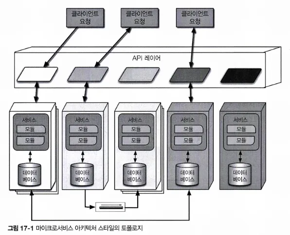

마이크로서비스는 단일 목적만 가지기 때문에 오케스트레이션 기반의 서비스 지향 아키텍처와 같은 다른 분산 아키텍처보다 서비스 규모가 훨씬 작음.

실제로 각 서비스에는 데이터베이스 및 기타 종속적인 컴포넌트 등 서비스가 독립적으로 작동되는 데 필요한 모든 것들이 준비되어 있음.

## 17.3 분산
- 마이크로서비스는 분산 아키텍처를 형성함.
- 서비스는 자체 프로세스로 실행되며, 원래 물리적인 컴퓨터를 의미했지만 이제는 가상 머신과 컨테이너로 빠르게 진화함.
- 서비스를 이 정도로 디커플링하면 애플리케이션을 호스트하는 육중한 멀티테넌트 인프라 아키텍처에서 자주 발생하는 문제들을 간단히 해결할 수 있음
    - 예) 애플리케이션 서버를 이용해 다수의 애플리케이션을 관리할 때에도 네트워크 대역폭, 메모리, 디스크 공간 등 여러 가지 혜택을 운영 측면에서 재사용할 수 있음.
        
        그러나 지원해야할 애플리케이션이 계속 늘어나면 결국 일부 리소스는 공유 인프라의 제약을 받을 수밖에 없음. 
        
        또 공유 애플리케이션 간의 잘못된 분리도 문제가 되는 경우가 있음. 
        
        → 각 서비스를 자체 프로세스로 분리하면 모두 자연스롭게 해소됨. 
        
- 마이크로서비스의 분산 속성 탓에 성능은 다소 부정적임.
    
    네트워크 호출은 메서드 호출보다 오래 걸리고 엔드포인트마다 보안 검증 절차를 거치면 그만큼 처리 시간이 소요되므로 시스템을 설계하는 아키텍트는 서비스 세분도에 대해 심사숙고해야 함.
    
- 숙련된 아키텍트라면 개발자가 서비스 경계를 넘나드는 트랜잭션을 사용하지 않도록 권고해야 함.
- 이 아키텍처는 서비스를 얼마나 세분화할 것인가를 잘 결정하는 것이 성공의 관건

## 17.4 경계 콘텍스트
- 마이크로서비스의 근본 철학은 경계 콘텍스트 개념임
    
    서비스마다 도메인이나 워크플로를 모델링하는 개념
    
- 클래스, 기타 부속 컴포넌트, 데이터베이스 스키마 등 애플리케이션 작동에 필요한 모든 것들이 각 서비스에 들어감.
    
    이러한 사고 방식은 아키텍트의 결정에 지대한 영향을 미침
    
    예) 모놀리스 사고 방식으로 Address 같은 공통 클래스를 다른 애플리케이션 파트의 개발자가 공유하는 것이 당연하지만, 마이크로서비스는 커플링을 가급적 삼가므로 이 아키텍처 스타일을 구축하는 아키텍트는 커플링보다는 차라리 중복이 낫다고 생각함. 
    
- 마이크로서비스는 도메인 분할 아키텍처의 개념을 극도로 우려낸 결과물임.
- 각각의 마이크로서비스는 어느 한 도메인이나 그 서브도메인을 나타냄. 여러 면에서 마이크로서비스는 도메인 주도 설계의 논리적인 개념을 물리적으로 구현한 것.

### 17.4.1 세분도

> ‘마이크로서비스’라는 용어는 명칭이지, 명세가 아니다. - 마틴 파울러 -
> 

서비스 경계는 도메인이나 워크플로를 캡처하는 것이 목표임. 

어느 애플리케이션에서 당연하게 여겨지는 경계가 다른 시스템 파트에서는 너무 단위가 클 수도 있고, 어떤 비즈니스 프로세스는 다른 비즈니스 프로세스보다 더 단단히 커플링되어 있을지 모름. 

아키텍트가 적절한 경계를 찾는 데 도움이 될 만한 몇 가지 가이드라인 이다. 

**목적**

- 가장 확실한 경계는 바로 이 아키텍처 스타일의 본래 의도인 도메인임.
- 각 마이크로서비스가 기능적으로 매우 응집되어 있고 전체 애플리케이션을 대표하여 하나의 핵심 기능을 제공하는 것이 가장 이상적인 모습임.

**트랜잭션**

- 여러 엔티티가 함께 개입하여 작동되는 트랜잭션은 아키텍트에게 좋은 서비스 경계 후보임.
- 분산 아키텍처에서 트랜잭션은 문제가 될 소지가 있으므로 그런 문제를 방지할 수 있도록 설계하는 것이 바람직함

**코레오그래피**

- 도메인 격리는 아주 잘 되어 있지만 서로 광범위한 통신을 해야 제대로 작동되는 서비스 세트를 구축할 경우, 아키텍트는 통신 오버헤드를 줄이기 위해 더 큰 서비스로 다시 뭉치는 것을 고려해야 할 수도 있음.

좋은 서비스 설계안을 도출하는 유일한 방법은 이터레이션임. 

처음 한 번 시도로는 완벽한 세분도, 데이터 종속성, 통신 스타일을 찾아내기 어렵지만, 여러 가지 옵션을 반복해서 적용해보면 좋을 방향으로 설계를 다듬어갈 수 있음

### 17.4.2 데이터 격리

- 마이크로서비스는 경계 콘텍스트 개념에 따라 데이터를 격리해야 함.
    
    대부분의 다른 아키텍처는 데이터를 단일 데이터베이스에 저장하지만, 마이크로서비스 아키텍처는 통합 지점으로 사용되는 공유 스키마, 데이터베이스 등 모든 종류의 커플링을 없애려고 함. 
    
- 데이터 격리는 아키텍트가 서비스 세분도를 살필 때 반드시 고려해야 할 팩터임.
    
    아키텍트는 엔티티 함정에 유의하여 서비스를 단순히 데이터베이스에 있는 엔티티와 비슷하게 모델링해서는 안됨.
    
- 어떻게 하면 아키텍처 전체에 데이터를 분산시킬 수 있을지 결정해야 함. 도메인을 어떤 팩트에 대한 진실 공급원으로 식별하여 그 값을 가져올 수 있게 잘 조정하든지, 아니면 데이터베이스 복제나 캐시 기술로 정보를 분산시키든지, 구체적인 방안이 필요함.
- 긍정적인 부분도 있음
    - 여러 팀이 단일 데이터베이스의 속박에서 벗어나게 되어 각 서비스마다 단가, 스토리지 종류, 그 밖의 여러 요소들을 저울질하여 가장 적합한 도구를 선택할 수 있음.
    - 고도로 분리된 시스템에서 다른 팀에 영향을 끼치지 않고 그때그때 상황에 맞게 더 적합한 데이터베이스를 선택할 수 있고 구현체 세부에 얽매이지 않는 것도 이점임.
## 17.5 API 레이어
마이크로서비스 다이어그램을 보면 대부분 필수는 아니지만 여러 시스템 컨슈머 사이에 API 레이어가 있음. 

API 레이어는 프록시를 경유하여 간접화하거나 네이밍 서비스 같은 운영 장치에 물려서 유용한 작업을 수행하기 좋은 위치에 있기 때문에 이 아키텍처에서 많이 쓰임. 

API 레이어를 중재자나 오케스트레이션 도구로 사용하지 말아야 함. 

모든 비즈니스 로직은 경계 콘테스트 내부에서 일어나야 하며, 오케스트레이션 등의 다른 로직을 중재자에 넣는 것은 규칙 위반임. 

중재자는 기술 분할된 아키텍처에서 사용하지만, 마이크로서비스는 확실히 도메인에 따라 분할됨.
## 17.6 운영 재사용
마이크로서비스가 커플링보다 복제를 선호함. 그러면 모니터링, 로깅, 회로 차단기 등의 운영 관심사와 같이 실제로 커플링이 더 유리한 아키텍처 부분은 어떻게 처리해야 할까? 

도메인이든 운영이든 가급적 많은 기능을 재사용하는 것이 좋음. 

마이크로서비스 아키텍트는 이 두 가지 관심사를 분리하고자 함. 

마이크로서비스에 공통적인 요소가 있고 그 유사성을 활용하면 더 유리한 부분이 있음을 알게 됨. 

예) 서비스 팀마다 자체 모니터링 체제를 구축하도록 허용하면 팀별로 알아서 잘하리라 장담할 수 있을까요? 

또 업그레이드 같은 문제는 어떻게 처리할까요? 

모니터링 도구를 새 버전으로 업그레이드하는 작업을 각 팀별 책임으로 부과해야 할까요? 

그리고 그 작업은 얼마나 오래 걸릴까요?

→ 해결 방법: **사이드카 패턴**

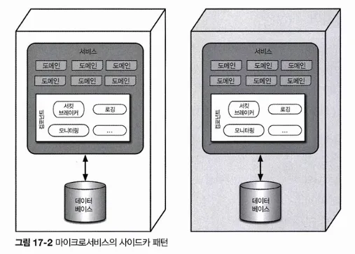

- 공통 운영 관심사를 각 서비스마다 별도의 컴포넌트에 두고, 해당 팀이나 공유 인프라팀이 소유할 수 있도록 함.
- 사이드카 컴포넌트는 팀이 서로 커플링되면 더 유리한 모든 운영 관심사를 도맡아 처리함. → 가령 모니터링 도구를 업그레이드할 때가 되면 공유 인프라팀이 사이드카를 업데이트하는 방식으로 각 마이크로서비스는 신기능을 받아 사용할 수 있음
- 각 서비스에는 공통 사이드카가 포함돼 있으므로 서비스 메시(service mesh)를 구축하면 로깅, 모니터링 등의 관심사를 아키텍처 전체적으로 일원화하여 제어할 수 있음.
    
    공통 사이드카 컴포넌트는 모든 마이크로서비스에 대해 일관된 운영 인터페이스를 제공함. 
    

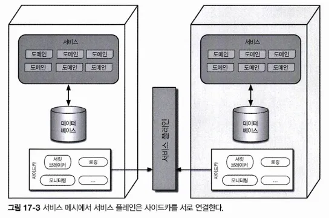

- 각 사이드카는 서비스 플레인에 연결되어 자신의 서비스에 일관된 인터페이스를 제공함.

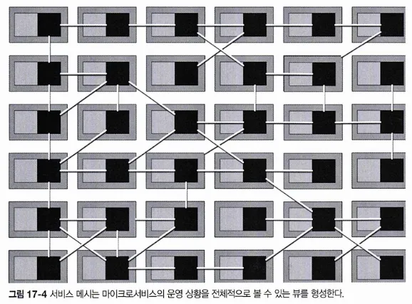

- 서비스 메시 자체는 개발자가 서비스를 전체적으로 액세스할 수 있는 콘솔 역할을 함.
- 전체 메시에서 각 서비스는 하나의 노드임.
- 서비스 메시는 각 팀이 모니터링 레벨, 로깅, 그 밖의 공통 운영 관심사 등 운영과 커플링된 부분을 글로벌하게 제어하는 콘솔임.
- 아키텍트는 마이크로서비스 아키텍처에 탄력성을 부여하는 수단으로 서비스 디스커버리를 사용함.
    
    ← 어느 하나의 서비스를 직접 호출하는 게 아니라, 모든 요청이 서비스 디스커버리 도구를 거치도록 하면 요청 수와 빈도를 모니터링할 수 있고 필요시 서비스 인스턴스를 늘려 확장성/탄력성을 줄 수 있음. 
    
    보통 서비스 메시 안에 서비스 디스커버리를 포함시켜 모든 마이크로서비스의 일부로 만드는 경우가 많음. 
    
    서비스 디스커버리는 대새 API 레이어가 호스트하므로 유저 인터페이스나 다른 호출부 시스템이 모두 한곳을 통해 일관되고 탄력 있게 서비스를 발견/생성할 수 있음.
## 17.7 프런트엔드
마이크로서비스 아키텍처의 유저 인터페이스는 보통 두 가지 스타일로 나타남

1. **모놀리식 프런트엔드**
    
    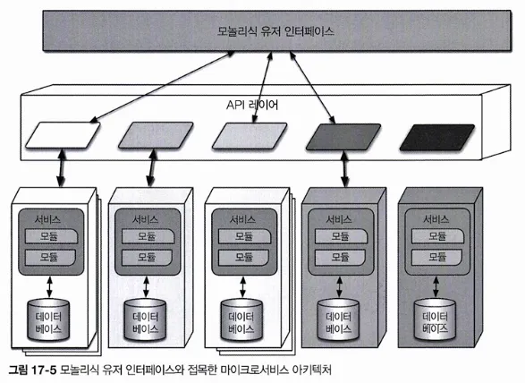
    
    - 유저 요청을 처리하기 위해 단일 유저 인터페이스가 API 레이어를 통해 호출하는 모놀리식 프런트엔드임.
    - 리치 데스크톱, 모바일, 웹 애플리케이션의 형태로 구현
    - 예) 자바스크립트 웹 프레임워크를 응용한 단일 유저 인터페이스로 개발하는 웹 애플리케이션이 대세인 것 같음
    1. **마이크로프런트엔드**
        
        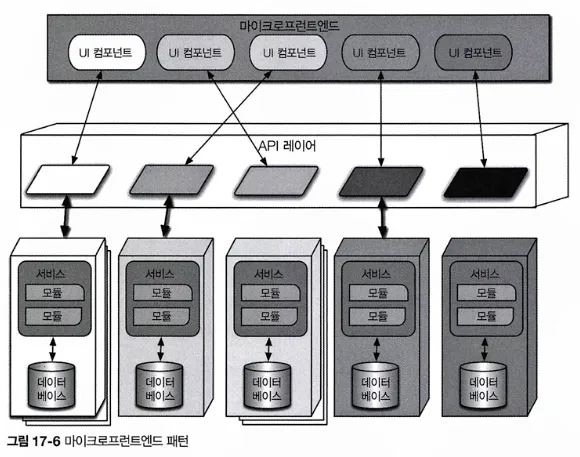
        
    - 유저 인터페이스 레벨의 컴포넌트를 백엔드 서비스로 활용하여 유저 인터페이스를 동기적인 수준으로 세분화하고 격리함.
    - 각 서비스는 자기 서비스에 해당하는 유저 인터페이스를 내보내고, 프런트엔드는 그렇게 내보내진 유저 인터페이스 컴포넌트를 조정함.
        
        ⇒ 유저 인터페이스에서 백엔드 서비스에 이르기까지 서비스 경계를 분리함으로써 전체 도메인을 단일 팀 내부에 통합시키는 것
        
    - 예) 개발자가 리액트 같은 컴포넌트 기반 웹 프레임워크를 사용하거나, 이 패턴을 지원하는 여러 오픈 소스 프레임워크 중 하나를 선택하는 등의 다양한 방법으로 구현할 수 있음
## 17.8 통신
아키텍트는 동기로 할지, 비동기로 할지, 근본적인 통신 방식을 결정해야 함. 

- 동기 통신은 호출부가 수신부의 응답을 기다림.

일반적으로 마이크로서비스 아키텍처는 ‘프로토콜 인지 이종 간 상호 운용성’을 활용함.

- **프로토콜 인지**
    
    ; 마이크로서비스는 운영 커플링을 방지하고자 중앙 통합 허브를 갖고 있지 않기 때문에 각 서비스는 다른 서비스를 호출하는 방법을 알고 있어야 함. 
    
    즉, 서비스는 다른 서비스를 호출할 때 어떤 프로토콜을 사용할지 알아야 함. 
    
    아키텍트는 여러 서비스가 상대방을 호출하는 방식을 표준화 함. 
    
- **이종**
    
    : 서비스마다 사용하는 플랫폼이 저마다 다른 폴리글랏 환경을 완벽하게 지원한다는 뜻
    
    ; 마이크로서비스는 분산 아키텍처라서 각 서비스마다 구현 기술 스택이 상이할 수 있음
    
    > 강화된 이종성
    단일 기술 스택으로 표준화를 고집하는 여느 엔터프라이즈 거버넌스 정책과는 정반대임. 마이크로서비스 세계의 목표는 복잡다기한 생태계를 만드는 것이 아니라 문제의 범위를 최대한 좁혀 올바른 확장 기술을 선택하는 것임. 
    모든 서비스가 대용량 관계형 데이터베이스를 필요로 하는 것은 아닌데 소규모 팀까지 무리하게 표준을 일괄 적용하면 이득은 거의 없고 속도만 더뎌질것임. 
    고도의 디커플링을 추가하는 것이 마이크로서비스의 근본 사상임
    > 
- **상호 운용성**
    
    : 여러 서비스가 서로 호출한다는 뜻
    

- 비동기 통신은 이벤트와 메시지를 주로 사용하며 내부적으로 이벤트 기반 아키텍처를 활용함.
- 브로커 패턴과 중재자 패턴은 마이크로서비스에서 각각 코레오그래피 패턴과 오케스트레이션 패턴으로 나타남

### 17.8.1 코레오그래피와 오케스트레이션

코레오그래피는 브로커 이벤트 기반의 아키텍처와 통신 스타일이 동일함. 

즉, 이 아키텍처는 중앙의 중재자가 따로 없고 경계 콘텍스트 철학에 충실함. → 서비스 간에 분리된 이벤트를 구현하는 것이 자연스럽다고 생각함. 

- 도메인/아키텍처 동형성은 특정한 문제에 어떤 아키텍처 스타일이 얼마나 적합한지 평가할 때 아키텍트가 잘 살펴보아야 할 핵심 특성임.
    
    아키텍처의 형상이 특정 아키텍처 스타일에 어떻게 매핑되는지 기술함. 
    
- 마이크로서비스 아키텍트는 디커플링을 추구하므로 마이크로서비스의 형상은 브로커 이벤트 기반 아키텍처를 닮았고 이 두 패턴은 서로 공생 관계임.
- 코레오그래피에서 각 서비스는 중앙 중재자 없이 자신의 필요에 따라 서비스를 호출함.
    
    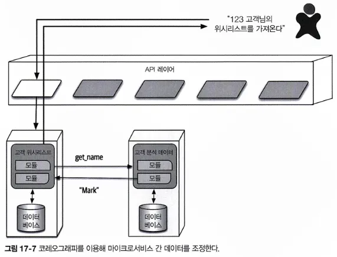
    
    - 유저는 유저 위시 리스트의 상세 정보를 요청함.
    - 필요한 정보가 전부 다 CustomerWishList 서비스에 있는 건 아니어서 CustomerDemographics 서비스를 호출해 모자란 정보를 보충한 결과를 유저에게 반환함.
- 서비스 지향 아키텍처처럼 전역 중재자를 따로 두지 않으므로 여러 서비스를 조정해야 할 경우에는 스스로 로컬 중재자를 만들 수 있음.
    
    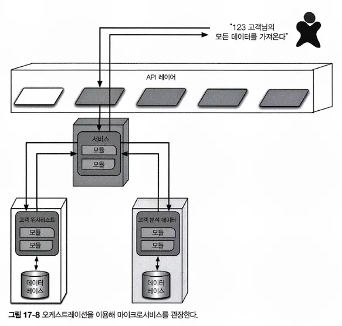
    
    - 개발자는 주어진 고객의 전체 정보를 조회하는 호출을 조정하는, 이 일만 담당하는 서비스를 만듬.
    - 유저가 중재자를 호출하면 이 중재자는 다른 서비스를 호출함.
- 소프트웨어 아키텍처 제1법칙에 따라 어느 솔루션이든 완벽한 정답은 없고 각각 일장일단이 있음
- 코레오그래피 아키텍트는 최대한 디커플링한다는 아키텍처 스타일의 철학을 고집함으로써 가장 많은 이점을 이끌어내려고 하지만, 에러 처리, 조정 같은 공통적인 문제는 코레오그래피 환경에서 훨씬 더 복잡해짐.
    
    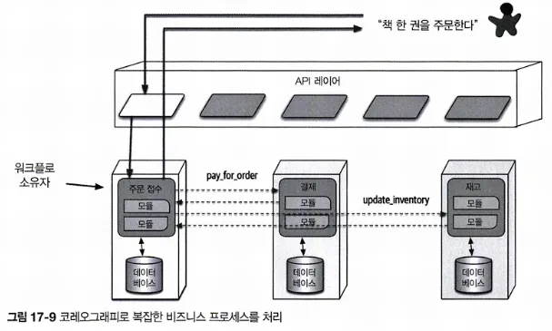
    
    - 처음 호출된 서비스는 자신의 다른 도메인 책임과 더불어 여러 타 서비스를 전체적으로 조정하는 중재자 역할도 함.
    - 이런 패턴을 프런트 컨트롤러 패턴이라고 함.
    - 어떤 한 서비스가 명목상 더 복잡한 중재자 노릇을 하는 셈인데, 이 패턴은 서비스 복잡도가 증가하는 단점이 있음.
    
    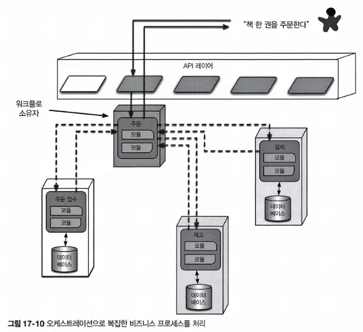
    
    - 비스지스 워크플로에 필요한 복잡한 처리를 담당하면서 조정 역할도 수행하는 중재자를 두면 서비스 간 커플링은 발생하지만 어느 한 서비스가 조정 작업을 전담하므로 다른 서비스는 거의 영향을 받지 않음.
    - 사실, 도메인/워크플로는 내재적으로 커플링되는 경우가 많음.
    - 아키텍트가 할 일은, 도메인과 아키텍처 두 마리 토끼를 모두 쫓는 방향으로 커플링을 가장 잘 나타낼 수 있는 방법을 찾아내는 것임.

### 17.8.2 트랜잭션과 사가

- 서비스 경계를 넘나드는 트랜잭션은 그 자체로 마이크로서비스 아키텍처의 핵심 디커플링 원칙에 위배됨. (그리고 가장 나쁜 형태의 동적 커네이선스, 값 커네이선스를 유발함)
- 트랜잭션 경계는 서비스 세분도를 가늠할 수 있는 일반적인 지표 중 하나임.
- Tip. 마이크로서비스에 트랜잭션을 걸지 마세요. 대신 세분도를 바로잡으세요!
- 두 서비스가 서로 완전히 다른 아키텍처 특성을 필요로 하고 서비스 경계는 분명히 구분되어 있지만 여전히 한 트랜잭션으로 묶어야할 때도 있는 예외 경우에는 적지 앟은 트레이드오프를 감수하고 트랜잭션 오케스트레이션을 처리하는 패턴이 잇음
- 사가 패턴
    
    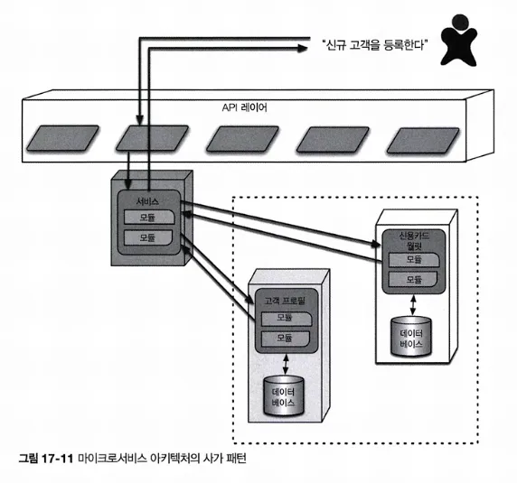
    
    - 서비스는 여러 서비스 호출에 대해 중재자 노릇을 하면서 트랜잭션을 조정함.
    - 중재자는 트랜잭션을 구성하는 파트를 하나씩 호출하여 성공/실패 여부를 기록하고 그 결과에 따라 흐름을 조정함.
    - 어느 한 파트라도 실패하면 중재자는 전체 트랜잭션 파트가 모두 성공하지 못하게 해야 함.
        
        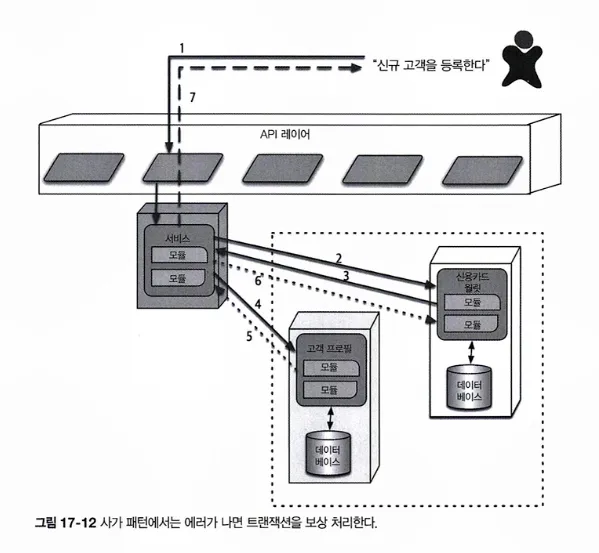
        
    - 트랜잭션의 첫 번째 파트는 성공했지만 두 번째 파트가 실패한 경우, 중재자는 지금까지 성공한 모든 트랜잭션 파트에게 과거에 처리했던 내용을 undo 하라는 요청을 보냄.
        
        이런 종류의 트랜잭션 조정을 보상 트랜잭션 프레임워크라고 함. 
        
    - 이 패턴은 전체가 다 성공했다고 중재자가 알릴 때까지 중재자로부터 받은 각 요청을 보류 상태로 두는 식으로 구현함.
        
        하지만 여기에 비동기 요청이 끼어들고, 특히 보류된 트랜잭션 상태에 따라 새로운 요청이 등장하면서 설계가 무척 복잡해짐. 
        
        또 네트워크 레벨에서도 조장 트래픽이 꽤 많이 발생함. 
        
    - 트랜잭션 작업마다 do/undo 로직을 개발하는 식으로 보상 트랜잭션 프레임워크를 구현할 수도 있음.
        
        이렇게 하면 트랜잭션 수행 중 조정은 덜 필요하지만, undo 작업은 do 작업보다 엄청나게 복잡해져 설계, 구현, 디버깅 작업량 역시 2배 이상 증가할 것임. 
        
    - Tip. 여러 서비스에 트랜잭션을 걸어야 하는 경우도 있음. 하지만 아키텍처 전반적으로 트랜잭션이 남용된다면 뭔가 단단히 잘못된 것임!

## 17.9 아키텍처 특성 등급
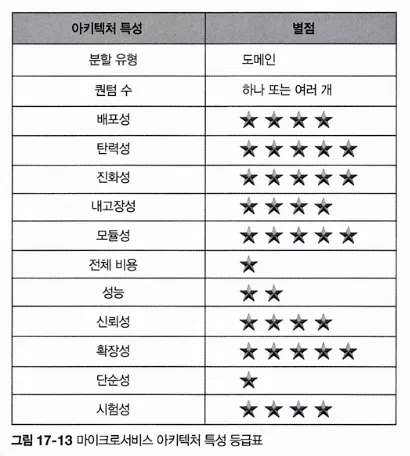

- 확장성, 탄력성, 진화성
    - 지금까지 개발된 가장 확장성이 우수한 시스템 중에 이 아키텍처 스타일을 활용해서 성공을 거둔 사례가 많음
    - 자동화 및 운영과의 지능적인 통합에 많이 의존하므로 개발자가 아키텍처에 탄력성을 줄 수 있음
    - 고도의 디커플링을 선호하기 때문에 아키텍처 레벨에서도 요즘처럼 점진적으로 변화하는 비즈니스 프랙티스를 훌륭하게 지원함.
- 성능 문제가 불거질 때?
    - 작업을 완료하기 위해 잦은 네트워크 호출을 해야 하므로 성능 오버헤드가 높고, 엔드 포인트마다 신원 및 접근 권한을 확인하는 보안 체크도 해야 함.
    - 과도한 네트워크 호출을 줄이고 성능을 개선하기 위해 데이터 캐시, 데이터 복제 등의 기술을 많이 사용함.
    - 커플링이 적을수록 통신 속도가 증가하고 병목이 줄기 때문에 오케스트레이션보다는 코레오그래피를 더 많이 사용하는 편.
- 각 서비스의 경계와 도메인이 일치해야 함.
## 17.10 더 읽을거리
- 샘 뉴먼유 Newman의 마이크로서비스 아키텍처 구축(한빛미디어, 201 7 )
- 마크 리처즈Mark Rfciwds 의 Microservices vs. Service-Oriented Architecture(O’reilly, 2016)
- 마크 리처즈M* Richards 의 Microservices Anti Patterns and PitfallS(O’reilly, 2016)®