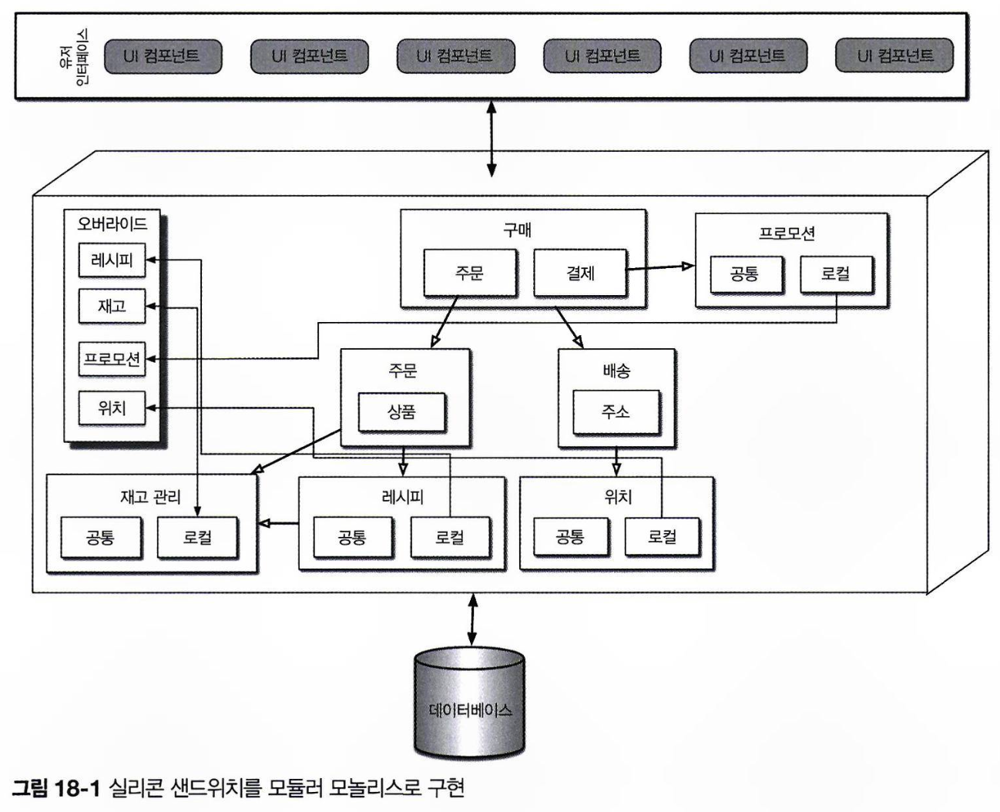
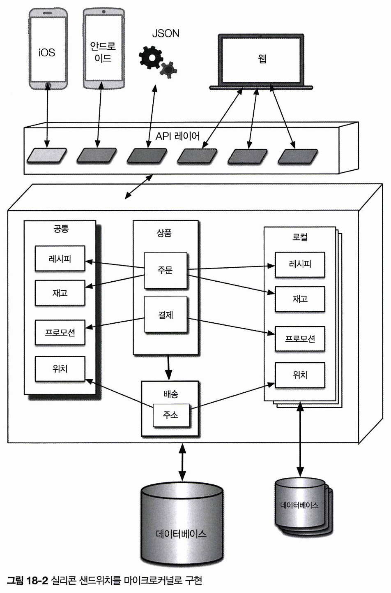
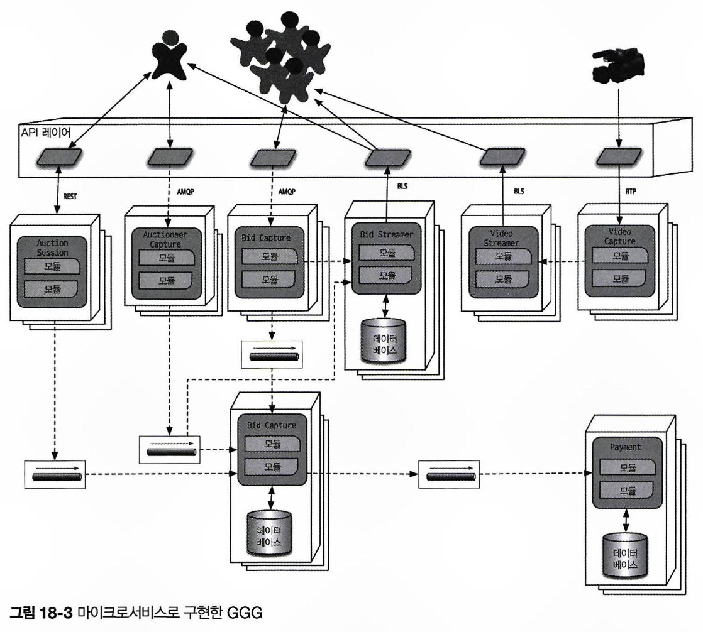
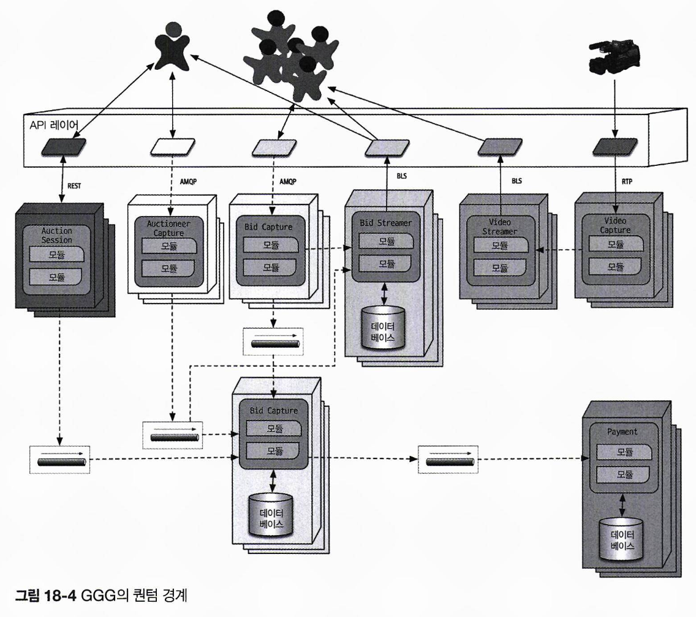

#  최적의 아키텍처 스타일 선정

최적의 아키텍처 스타일은 상황에 따라 달라지며, 단일한 정답은 없습니다.  
조직의 내부 요인, 소프트웨어의 목적, 아키텍처 특성, 도메인 요구, 전략적 목표 등을 종합적으로 분석하고, 트레이드오프를 고려하여 결정해야 합니다.

## 18.1 아키텍처 ‘유행’은 계속 변한다.

- **과거를 돌아보다**: 새로운 아키텍처 스타일은 과거 경험과 그로 인한 교훈을 기반으로 발전합니다.  
- **생태계의 변화**: 소프트웨어 개발 생태계는 끊임없이 변화합니다. 변화는 무질서하게 나타나 예측이 어렵습니다.
- **새로운 기능**: 새로운 기능의 출현은 도구 교체를 넘어서 새로운 패러다임으로의 전환을 가져올 수 있습니다. 예를 들어, 도커 같은 컨테이너 기술은 소프트웨어 개발에 혁신을 일으키며 IT 업계에 큰 변화를 가져왔습니다. 따라서 새로운 도구의 등장과 게임 체인저가 될 수 있는 패러다임의 변화를 주의 깊게 살펴야 합니다.
- **가속**: 소프트웨어 생태계는 끊임없이 변화하며, 그 속도도 점점 빨라지고 있습니다. 새로운 도구는 새로운 엔지니어링 프랙티스를 만들어내고, 이는 다시 설계와 기능의 변화를 촉진합니다.
- **도메인 변경**: 비즈니스의 진화와 합병은 소프트웨어 개발 도메인에도 끊임없는 변화를 가져옵니다.
- **외부 요인**: 소프트웨어 개발과 관련된 주변 요인이 조직 변화에 영향을 미칩니다. 예를 들어 라이선스 비용이 변화하여 기존 도구를 대체해야 할 수 있습니다.

## 18.2 결정 기준

- **도메인**: 도메인의 주요한 요소를 파악해야 합니다.  
- **구조에 영향을 미치는 아키텍처 특성**: 도메인 및 외부 요인을 지원하기 위해 필요한 아키텍처 특성을 명확히 정의해야 합니다.
- **데이터 아키텍처**: 아키텍트와 DBA는 데이터베이스와 스키마 등 데이터 관련 문제에 협력해야 합니다. 데이터 설계가 아키텍처에 미치는 영향을 사전에 파악해야 합니다.
- **조직 문제**: 외부 요인도 설계에 큰 영향을 미칩니다. 예를 들어, 클라우드 벤더의 높은 이용료가 설계를 제한하거나, 회사의 인수 합병 계획으로 인해 개방형 솔루션과 통합 아키텍처를 우선시해야 하는 상황이 발생할 수 있습니다.
- **프로세스, 팀, 운영 문제에 관한 지식**: 다양한 프로젝트 요인들이 아키텍처 설계에 영향을 미칩니다. 예를 들어, 애자일 성숙도가 낮은 조직에서 애자일 기반 아키텍처 스타일을 도입하면 초기부터 어려움을 겪을 수 있습니다.
- **도메인/아키텍처 동형성**: 
  - 아키텍처의 토폴로지가 특정 문제 영역과 잘 맞는 경우가 있습니다. 
    - 마이크로커널 아키텍처는 플러그인 형태의 커스터마이징이 가능해 맞춤성이 필요한 시스템에 적합합니다.
    - 공간 기반 아키텍처는 개별 연산이 많은 게놈 분석 시스템에 이상적으로 적용됩니다.
  - 문제 영역과 아키텍처 스타일이 맞지 않을 경우 설계에 어려움이 발생합니다. 
    - 모놀리식 구조는 확장성이 필요한 시스템에 적합하지 않으며, 분산 아키텍처는 커플링이 높은 문제 영역에 적합하지 않습니다. 
    - 멀티페이지 보험 웹 애플리케이션은각 페이지가 이전 페이지의 콘텍스트에 따라 작동하는 시스템이기 때문에, 커플링이 높아 분산 아키텍처보다 서비스 기반 아키텍처가 더 적합합니다.

지금까지 열거한 모든 사항을 종합하여 다음과 같은 결정을 내려야 합니다.

* **모놀리스냐 분산이냐**: 아키텍처 퀀텀 개념을 기반으로 분석했을 때, 시스템이 **단일 특성으로 충분하다면 모놀리식 아키텍처**가 적합하며, **파트별로 다른 특성이 필요하다면 분산 아키텍처**가 더 적합합니다.
* **데이터를 어디에 둘 것인가**: 분산 아키텍처에서는 서비스별로 데이터 저장 방식을 결정해야 합니다. 이를 위해 전체 데이터 흐름과 아키텍처의 구조 및 행위를 충분히 고려해야 하며, 최적의 설계를 위해 반복적으로 설계를 해야 합니다.
* **서비스 간 통신은 동기, 비동기 중 어떤 스타일로 할 것인가**: 
  * 동기 통신은 간단하지만 확장성과 안정성에 부정적 영향을 줄 수 있습니다. 
  * 비동기 통신은 성능과 확장성에서 우수하지만 데이터 동기화, 교착 상태, 경합 조건, 디버깅 문제 등의 단점이 있습니다. 
  * 동기 통신을 기본으로 하되, 필요한 경우 비동기 통신을 병행하는 것이 적합합니다.

## 18.3 모놀리스 사례 연구: 실리콘 샌드위치

실리콘 샌드위치 카타는 단일 퀀텀으로 구현해도 충분하며, 적은 예산과 단순한 애플리케이션 특성상 모놀리식 아키텍처가 적합합니다.  
이번 장에서는 **도메인 분할된 컴포넌트**와 **기술 분할된 컴포넌트** 두 가지 설계 방식을 고려하며, 각 설계의 트레이드오프를 비교 분석합니다.

### 18.3.1 모듈러 모놀리스

모듈러 모놀리스는 단일 퀀텀으로 배포되는 도메인 중심 시스템으로, 단일 관계형 데이터베이스와 단일 웹 기반 유저 인터페이스를 사용해 총 비용을 절감합니다.  

충분한 리소스가 있다면 도메인 컴포넌트 별로 데이터베이스 자산을 분리해, 추후 필요 시 분산 아키텍처로 쉽게 마이그레이션할 수 있도록 하면 좋습니다.  

### 18.3.2 마이크로커널

실리콘 샌드위치는 맞춤성에 대한 요구도 있기 때문에, 마이크로커널 아키텍처를 채택할 수 있습니다. 

코어 시스템은 도메인 컴포넌트와 단일 관계형 데이터베이스로 구성되며, 도메인과 데이터를 신중히 동기화하면 향후 분산 아키텍처로의 마이그레이션도 가능합니다.  
플러그인 간에는 커플링이 방지되어, 각 플러그인이 독립적으로 데이터를 유지할 수 있습니다.

**Backends for Frontends(BFF)** 패턴을 활용해 API 레이어를 마이크로커널 어댑터로 사용하는 것도 가능합니다.  
백엔드는 일반 정보를 제공하고, **BFF 어댑터는 이를 각 프런트엔드 장치에 적합한 포맷으로 변환**합니다.  
예를 들어 iOS용 BFF는 백엔드 데이터를 가져와 iOS 네이티브 애플리케이션 요구에 맞게 데이터 포맷, 페이지네이션 등을 변환합니다.  
이를 통해 마이크로커널 스타일의 유연한 유저 인터페이스를 제공하며, 다른 장치로도 확장해서 지원이 가능합니다.

실리콘 샌드위치 서비스는 큰 성능이나 탄력성을 요하지 않으므로 통신 방식은 동기식으로도 충분합니다.

## 18.4 분산 아키텍처 사례 연구: GGG

GGG 카타는 아키텍처적으로 다양한 특성을 요구하는 점에서 흥미롭습니다.  
입찰자와 경매인 같은 역할에 따라 요구 사항이 달라져서, 각 부분마다 가용성, 확장성 등 상이한 특성이 필요합니다.  

GGG 카타는 거대한 규모, 탄력성, 성능 등 까다로운 운영 아키텍처 특성을 요구합니다.  
아키텍처 내부까지 고도의 커스터마이징이 가능한 패턴이 필요하며, 후보로는 이벤트 기반 아키텍처와 마이크로서비스가 있습니다.  
이 중 마이크로서비스는 다양한 운영 아키텍처 특성을 더 잘 지원합니다.  

마이크로서비스에서 성능 요구 성능을 달성하기 위해 아키텍처의 약점을 보완해야 합니다.  
예를 들어, **오케스트레이션의 과도한 사용**이나 **데이터의 지나친 분리** 같은 성능 저하 요인을 해결해야 합니다.

다음은 GGG의 세 가지 고유한 유저 인터페이스입니다

- **입찰자**: 온라인 경매에 참가한 다수의 사용자
- **경매인**: 경매 당 한 사람
- **스트리머**: 입찰자에게 동영상 및 입찰 스트리밍을 담당하는 서비스, 읽기 전용 스트림

GGG 아키텍처 설계에 등장하는 서비스들은 다음과 같습니다.

- **BidCapture**: 온라인 입찰자의 입찰을 캡처하여 BidTracker로 비동기 전송합니다. 온라인 입찰의 관문 역할을 수행합니다.
- **Bidstreamer**: 온라인 입찰자에게 입찰 정보를스트리밍하며,  고성능 읽기 전용 스트림을 사용합니다.
- **BidTracker**: Auctioneercapture와 BidCapture 양쪽에서 입찰을 추적하여, 두 정보 스트림을 하나로 합쳐 실시간에 가깝게 입찰을 정렬합니다. 
  - 두 인바운드 커넥션은 비동기로 동작하기 때문에, 메시지 큐를 버퍼로 사용하여 서로 다른 속도의 메시지 흐름을 처리할 수 있습니다.
- **AuctioneerCapture**: 경매인을 위한 입찰 캡처 서비스로, 퀀텀 분석 결과에 따라 아키텍처 특성이 완전히 다른 BidCapture와 분리
- **AuctionSession**: 각 경매의 워크플로를 관리
- **Payment**: AuctionSession 종료 및 경매 완료 시, 결제 정보를 처리하는 서드파티 결제 서비스
- **VideoCapture**: 라이브 경매의 비디오 스트림을 캡처
- **VideoStreamer**: 경매 동영상을 온라인 입찰자에게 스트리밍

위 아키텍처에서는 서비스의 운영 특성을 고려해 메시지 큐를 통한 비동기 통신을 선택할 수 있습니다.  
많은 경매가 동시에 종료되고 결제 서비스가 500밀리초마다 새 결제 정보를 처리해야 하는 상황에서는, 동기 통신을 선택할 경우 타임아웃 및 안정성 문제가 초래될 수 있습니다.  

최종 설계는 각 서비스에 대응되는 Payment, Auctioneer, Bidder, Bidder Streams, BidTracker의 5개 퀀텀으로 구성됩니다.  
컴포넌트 설계 단계에서 퀀텀 분석 기법을 활용하면 서비스, 데이터, 통신 경계를 효과적으로 식별할 수 있습니다.  
각 퀀텀의 인스턴스들은 컨테이너 스택으로 구성됩니다.

