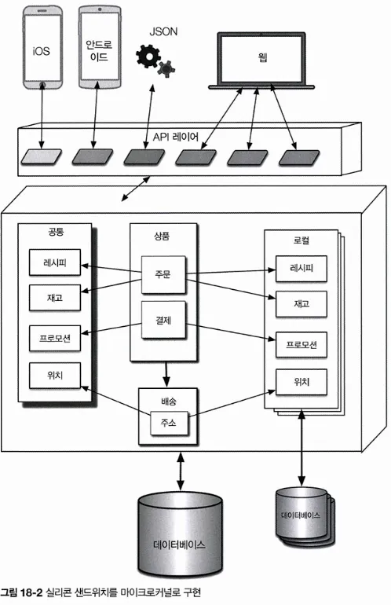
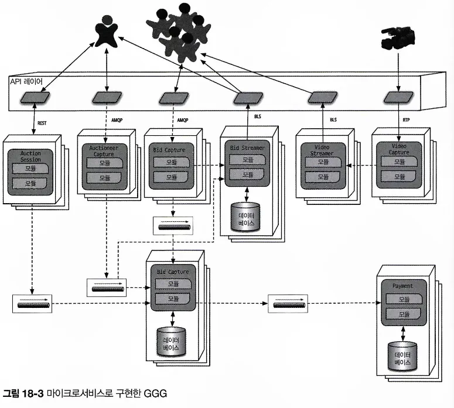

# CHAPTER 18 최적의 아키텍처 스타일 선정
> 최적의 아키텍처 스타일? 상황에 따라 다름!
> 적합한 아키텍처 스타일을 선택하려면 어떻게 해야 하는지, 몇 가지 일반적인 조언을 주는 장

## 18.1 아키텍처 ‘유행’은 계속 변한다
사람들이 좋아하는 아키텍처 스타일은 여러 가지 팩터들로 인해 그때그때 계속 변함

**과거를 돌아보다**

새로운 아키텍처 설계는 과거 아키텍처 스타일에서 발견된 결함이 반영된 경우가 많음. 

예를 들어, 예전에 코드 재사용을 강점으로 내세운 아키텍처를 구축했을 때 그 단점을 경험한 아키텍트는 코드 재사용에 함축된 의미를 진지하게 고민할 것

**생태계의 변화**

끈임없는 변화는 소프트웨어 개발 생태계의 바람직한 특성. 시간에 따라 불변인 것은 하나도 없다. 

생태계의 변화는 매우 무질서해서 어떤 종류의 변화가 닥칠지 예측조차 힘듬

**새로운 기능**

새로운 기능이 출현하면 아키텍처는 단순히 어떤 도구를 다른 도구로 대체하는 정도가 아닌, 완전히 새로운 패러다임으로 전환될 수 있음. 

생태계가 지속적인 변화하면서 새로운 도구와 기능들 역시 수시로 등장함. 

아키텍트는 새로운 도구는 물론 새로운 패러다임 역시 예의주시해야 함. 모든 신기능이 전체 개발 세계를 뒤흔들 정도로 거창하진 않겠지만, 작은 변화라도 아키텍트의 목표와 정확히 부합하는 변경일 수도 있음

**가속**

생태계는 끊임없이 변할 뿐만 아니라 그 변화의 속도도 계속 빨라짐

**도메인 변경**

비즈니스가 계속 진화하고 타 회사와 합병되면서 개발자가 소프트웨어를 개발하는 도메인 역시 도통 가만히 있는 밥이 없음. 

**기술 변화**

기술이 진화할수록 조직은 최소한 그 변화의 흐름의 일부라도 따라잡으려고 함. 

**외부 팩터**

소프트웨어 개발과 연관된 많은 주변 요인들이 조직의 변화를 가져오는 경우도 있음

예를 들어, 아키텍트와 개발자 모두 완벽하게 만족하는 도구가 있는데 라이선스 비용이 너무 비싼 까닭에 어쩔 수 없이 다른 도구를 알아봐야 하는 경우

현재 유형하는 아키텍처 관점에서 조직이 어느 위치에 있든 아키텍트는 업계 동향을 잘 파악해서 유행을 따르고 예외를 두어야 하는 경우를 현명하게 잘 결정해야 함.

## 18.2 결정 기준
아키텍트는 아키텍처 스타일을 선택할 때 도메인 설계 구조의 원인이 될 만한 모든 요소를 종합적으로 고려해야 함. 

기본적으로 주어진 도메인, 그리고 시스템을 성공적으로 구축하는 데 필요한 다른 모든 구조적 요소들을 설계함. 

**도메인**

도메인에서 중요한 여러 가지 양상, 특히 어느 부분이 운영 아키텍처 특성에 영향을 미치는지 파악해야 함. 

아키텍트가 꼭 해당 분야의 전문가일 필요는 없지만, 자신이 설계하는 도메인에서 중요한 파트에 대해서 최소한의 지식은 갖고 있어야 함. 

**구조에 영향을 미치는 아키텍처 특성**

아키텍트는 도메인과 다른 외부 요소를 지원하는 데 필요한 아키텍처 특성을 정확하게 밝혀 내야 함.

**데이터 아키텍처**

아키텍트와 DBA는 서로 머리를 맞대고 데이터베이스, 스키마 등 데이터에 관한 문제를 의논해야 함. 

신규 시스템이 이전에 또는 현재 사용 중인 데이터 아키텍처와 상호작용할 경우, 아키텍트는 반드시 데이터 설계가 아키텍처 설계에 미치는 영향도를 미리 파악해야 함

**조직 문제**

갖가지 외부 팩터들도 설계에 영향을 줌

예를 들어, 특정 클라우드 벤더사의 이용료가 이상적인 설계를 가로막는 장애물이 되거나, 회사가 인수 합병에 참여할 계획을 수립하여 개방형 솔루션과 통합 아키텍처에 무게를 둘 수밖에 없는 경우 등

**프로세스, 팀, 운영 문제에 관한 지식**

소프트웨어 개발 프로세스, 운영팀과의 소통, QA 프로세스 등 프로젝트와 관련된 다양한 팩터들도 아키텍처 설계에 영향을 끼침

**도메인/아키텍처 동형성**

아키텍처의 토폴로지와 잘 맞는 문제 영역이 있음. 

예) 마이크로커널 아키텍처 스타일은 아키텍처적으로 플러그인 형태의 커스터마이징이 가능하므로 맞춤성이 필요한 시스템과 완벽하게 잘 어울림. 

무수히 많은 개별 연산이 필요한 게놈 분석 시스템은 무수히 많은 개별 프로세서를 제공하는 공간 기반 아키텍처가 안성맞춤임. 

반대로, 문제 영역과 아키텍처 스타일이 불협화음이 나는 경우도 있음

예) 규모가 큰 모놀리식 구조로는 확장성이 우수한 시스템을 설계하기가 어려움. 

의미적으로 커플링된 곳이 도처에 널려 있는 문제 영역도 고도로 분리된 분산 아키텍처와 안 맞음

---

아키텍트는 위의 모든 사항을 종합하여 다음의 결정을 내려야 함. 

**모놀리스냐 분산이냐**

아키텍트는 아키텍처 퀀텀 개념을 이용하여 단일 아키텍처 특성만으로도 설계에 부족함이 없는지(모놀리스가 적합), 아니면 시스템 파트별로 상이한 아키텍처 특성이 필요한지(분산 아키텍처가 적합) 판단해야 함. 

**데이터를 어디에 둘 것인가?**

워크플로를 구축하기 전에 전체 아키텍처의 데이터 흐름에 대해 충분히 숙고해야 함. 

구조와 행위를 모두 고려하여 최적의 조합을 찾아내기 위해 설계를 무한반복하는 것도 두려워해선 안됨. 

**서비스 간 통신은 동기, 비동기 중 어떤 스타일로 할 것인가?**

동기 통신 - 대부분 더 간편하긴 하지만 확장성, 안정성, 그 밖의 다른 아키텍처 특성에 부정적인 영향을 미칠 수 있음

비동기 통신 - 성능, 확장성 측면에서 우월하나, 데이터 동기화, 데드락(교착상태), 경합 조건, 디버깅 등 골칫거리가 많음

가급적 설계, 구현, 디버깅 문제가 비교적 적은 동기 통신을 기본으로 하되, 필요한 경우에 비동기 통신을 함께 사용하는 것이 좋음. 

---

이러한 설계 과정을 거친 결과물은, 

아키텍트가 선택한 아키텍처 스타일이 반영된 아키텍처 토폴리지, 설계 부문의 아키텍처 결정 기록, 아키텍처 피트니스 함수로 나타남.

## 18.3 모놀리스 사례 연구: 실리콘 샌드위치
아키텍처 특성을 조사한 후 

단일 퀀텀으로 구현해도 충분하다 결정.

적은 예산으로도 구축 가능한 단순 애플리케이션이므로 모놀리스의 단순함이 더 어울리는 것 같음

하지만, 도메인 분할된 컴포넌트와 기술 분할된 컴포넌트, 두 가지 상이한 컴포넌트로 설계함

두 가지 설계를 비교해보면서 각각의 트레이드오프를 살펴보자. 

### 18.3.1 모듈러 모놀리스

: 단일 퀀텀으로 배포된 단일 데이터베이스 기반의 도메인 중심 시스템임. 

- 총 비용을 줄이기 위해 단일 웹 기반 유저 인터페이스로 구현한 단일 관계형 데이터베이스 기반의 모놀리스.
- 아키텍트가 식별한 각 도메인이 그림에서 컴포넌트로 표시되어 있음
- 시간과 리소스가 넉넉하다면 도메인 컴포넌트 단위로 테이블과 기타 데이터베이스 자산을 분리하고 나중에 요구사항이 발생하면 분산 아키텍처로 쉽게 마이그레이션될 수 있도록 설계해야 함.
- 아키텍처 스타일 자체는 원래 커스터마이징을 할 수 없기 때문에 아키텍트는 원하는 기능을 도메인 설계의 일부로 달여? 넣어야 함.
    - 개발자가 개별적으로 커스터마이징한 결과물을 업로드할 수 있도록 오버라이드 엔드포인트를 설계함.
    - 각 도메인 컴포넌트가 커스터마이징 가능한 각각의 특성을 오버라이드 컴포넌트를 통해 참조할 수 있게 설계해야 완벽한 피트니스 함수가 만들어짐.

### 18.3.2 마이크로커널

식별된 아키텍처 특성 중 하나가 맞춤성이었음

도메인/아키텍처 동형성을 검토 후 다음과 같은 마이크로커널 형태로 구현할 수도 있음.

- 코어 시스템은 도메인 컴포넌트와 단일 관계형 데이터베이스로 구성
- 이전 설계와 마찬가지고, 도메인과 데이터를 신중하게 동기화하면 향후 분산 아키텍처로 코어를 마이그레이션할 수 있음.
- 커스터마이징은 각각 하나의 플러그인, 단일 플러그인 세트 내부의 공통 플러그인들, 일련의 로컬 플러그인 형태로 나타남.
- 어느 플러그인도 다른 것들과 커플링될 일은 없으므로 각 플러그인은 따로 떨어져 자신의 데이터를 유지할 수 있음.
- 프런트엔드를 위한 백엔드(BFF) 패턴을 응용해서 API 레이어를 마이크로커널 어댑터로 사용하는 독특한 설계 방법도 있음
    - 일반적인 정보는 백엔드가 제공하고 BFF 어댑터는 이 정보를 프런트엔드 장치에 적합한 포맷으로 바꾸는 것.
    - BFF 어댑터를 만들면 마이크로커널 스타일만의 풍부한 유저 인터페이스가 가능하고 향후 다른 장치들까지 확장 지원이 가능함.

## 18.4 분산 아키텍처 사례 연구: GGG
이 아키텍처는 아키텍처의 여러 부분마다 상이한 아키텍처 특성을 필요로 함. 

예) 가용성, 확장성 같은 아키텍처 특성이 입찰자와 경매인 등의 역할마다 다름

또 GGG는 어느 정도의 규모, 탄력성, 성능, 그 밖의 까다로운 운영 아키텍처 특성이 요구사항에 명시되어 잇음. 

→ 아키텍트는 아키텍처 내부의 세부적인 수준까지 고도의 커스터마이징이 가능한 패턴을 선택해야 함. 

대부분의 아키텍처 특성을 충족하는 후보 분산 아키텍처로 저수준의 **이벤트 기반** 또는 **마이크로서비스**가 있는데, 이 중 마이크로서비스는 다양항 운영 아키텍처 특성을 보다 잘 지원함. 

순수한 이벤트 기반 아키텍처는 대부분 운영 아키텍처 특성에 따라 나누지 않고 통신 스타일, 즉 오케스트레이션 방식이냐 코레어그래피 방식이냐에 따라 구분됨. 

아키텍트는 성능 요건을 수용하도록 설계함으로써 아키텍처 곳곳의 약점을 보완할 수 있음. 

예) 마이크로서비스는 원래 속성상 높은 수준의 확장성을 제공하지만, 

아키텍트는 오케스트레이션을 너무 많이 사용하거나, 과도하게 데이터를 분리하는 등 성능에 영향을 미치는 갖가지 문제들을 해결해야 함. 

- 식별된 각각의 컴포넌트는 아키텍처의 서비스가 되어 컴포넌트와 서비스 세분도가 꼭 맞음.
- GGG의 세 가지 고유한 유저 인터페이스
    - 입찰자 - 온라인 경매에 참가한 수많은 입찰자
    - 경매인 - 경매 당 한 사람
    - 스트리머 - 입찰자에게 동영상 및 입찰 스트리밍을 담당하는 서비스. 읽기 전용 스트림
- 서비스들
    - BidCapture - 온라인 입찰자의 입찰을 캡처해서 BidTracker로 비동기 전송함. 온라인 입찰의 관문 역할을 할 뿐 퍼시스턴스 로직은 없는 서비스.
    - BidStreamer - 온라인 입찰자에게 입찰 정보를 고성능 읽기 전용 스트림으로 스트리밍함.
    - BidTracker - AuctioneerCapture, BidCapture 양쪽에서 입찰을 추적함. 서로 다른 두 정보 스트림을 하나로 합하여 가능한 한 실시간에 가깝게 입찰을 정렬하는 컴포넌트.
    - AuctioneerCapture - 경매인을 위해 입찰을 캡처함. 아키텍처 특성이 완전히 달라서 BidCapture와 AuctioneerCapture 로 분리함
    - AuctionSession - 각 경매의 워크플로를 관리
    - Payment - AuctionSession이 경과하여 경매가 완료된 후 결제 정보를 처리하는 서드파티 결제 서비스
    - VideoCapture - 라이브 경매의 비디오 스트림을 캡처
    - Video Streamer - 경매 동영상을 온라인 입찰자에게 스트리밍함.

→ 아키텍트는 이 아키텍처에서 동기 통신 스타일과 비동기 통신 스타일을 주의 깊게 식별함

비동기 통신을 선택한 것은 주로 서비스마다 상이한 운영 아키텍처 특성을 감안한 결과

예) 결제 서비스가 새 결제 정보를 500밀리초마다 하나씩 처리 가능하고 아주 많은 경매가 동시에 종료되는 일이 흔한 상황에서 서비스 간에 동기 통신을 하면 타임아웃과 여러 가지 안정성 문제가 발생할 수 있음. → 메시지 큐를 사용하여 취약성이 드러난 아키텍처의 주요 파트에 안정성을 확보할 수 있음

최종 분석 결과, 5개 퀀텀으로 설계 마무리됨. 

- 각 서비스에 대응되는 Payment, Auctioneer, Bidder, Bidder Streams, BidTracker 퀀텀을 포함함
- 아키텍트는 컴포넌트 설계 단계부터 퀀텀 분석 기법을 활용하여 서비스, 데이터, 통신 경계를 보다 쉽게 식별할 수 있음

→ 최선의 설계 아님. 적어도 트레이드오프가 가장 나쁜 것 중에서 제일 나은 설계이다..