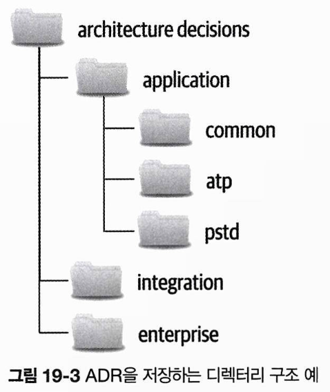
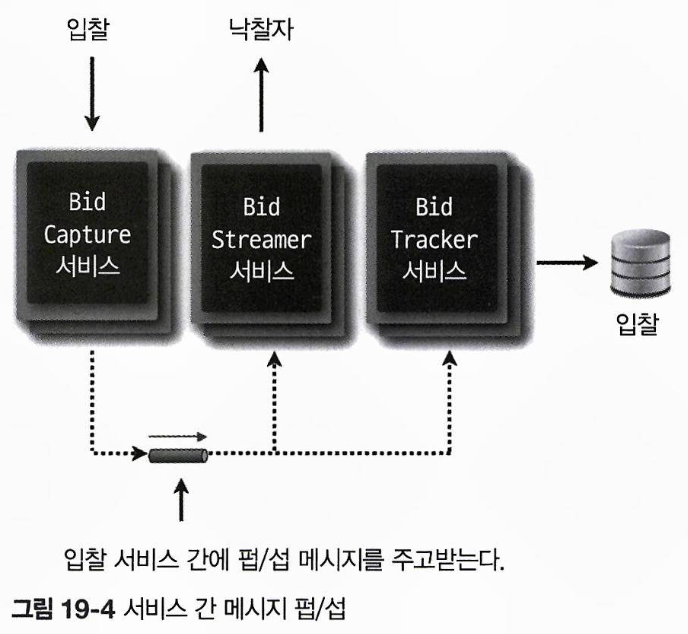

# 아키텍처 결정

아키텍트의 핵심 역할은 **아키텍처 결정을 내리는 것**입니다.  
아키텍처 결정에는 시스템 구조뿐만 아니라, 아키텍처 특성에 영향을 미치는 다양한 기술 결정을 포함합니다.  
아키텍트는 정보를 수집하고, 결정을 정당화 및 문서화한 뒤, 이해관계자와 효과적으로 소통해야 합니다.

## 19.1 아키텍처 결정 안티패턴

아키텍처 결정에서 주로 발생하는 대표적인 안티패턴으로는 ‘**네 패를 먼저 보여주지마**’, ‘**무한반복 회의**’, **‘이메일 기반 아키텍처’**가 있으며, 이들은 서로 연계되어 누적되는 경향이 있습니다.

### 19.1.1 ‘네 패를 먼저 보여주지마’ 안티패턴

이 안티패턴은 잘못된 선택을 두려워해 결정을 회피하거나 미루는 현상을 말합니다.  
이를 극복하는 방법은 두 가지입니다.

1. **중요한 결정을 내리기 전, 책임질 수 있는 마지막 순간까지 기다리기**: 충분한 정보를 수집해 결정을 검증하고 정당화하되, 지나치게 시간을 끌지 않아야 합니다.
2. **개발팀과 지속적 협력**: 아키텍트가 결정한 내용을 의도한 대로 추진하며, 개발팀의 도움을 받아 문제 발생 시 신속히 대응할 수 있도록 합니다.

예를 들어 개발 과정에서 일부 서비스의 확장성 요건으로 인해 메모리 사용량이 예상보다 많아지면, 아키텍트는 개발팀과 협력하여 아키텍처를 조정해야 합니다.

### 19.1.2 ‘무한반복 회의’ 안티패턴

이 안티패턴은 어떤 결정을 왜 했는지 알지 못한 채, 회의만 계속 반복하는 상황을 의미합니다.  
이는 아키텍트가 자신의 결정을 정당화하지 못할 때 발생하며, 방지를 위해서는 결정의 기술적, 비즈니스적 근거를 명확히 제시해야 합니다.  
예를 들어, 모놀리식 애플리케이션을 개별 서비스로 분리하는 아키텍처 리팩터링은 기술적으로 자원 사용과 관리 효율성을 높이는 동시에, 비즈니스적으로도 신기능 출시를 앞당기고 개발 비용을 절감할 수 있다는 점을 명확히 설명할 수 있어야 합니다.  
아키텍처 결정을 정당화하려면 비즈니스 가치를 제시하는 것이 중요합니다.  
일반적인 요소로는 비용, 출시 시기, 유저 만족도, 전략적 포지셔닝 등을 꼽을 수 있으며, 이들 중 이해관계자에게 무엇이 중요한지 고려해야 합니다.

### 19.1.3 ‘이메일 기반 아키텍처’ 안티패턴

이 안티패턴은 소통 수단으로 이메일을 사용하고, 결정 사항을 체계적으로 문서화하지 않은 탓에, 아키텍처 결정을 제대로 전달하지 못해 사람들이 결정을 놓쳐버리는 상황을 의미합니다.  
이를 방지하려면 단일 기록 시스템에 아키텍처 결정의 세부 정보를 보관해야 합니다.  
이를 통해 기록의 일관성을 유지하고, 결정의 변경 사항을 효과적으로 전달할 수 있습니다.
또한 아키텍처 결정은 관련자에게만 통지하고, 이메일에는 결정의 맥락만 언급하며, 세부 정보는 링크로 제공해야 합니다.

## 19.2 아키텍처적으로 중요한

다소 기술적인 내용이더라도, 그것이 아키텍처 특성을 직접 지원하기 위해 선택된 기술이라면 이는 아키텍처 결정으로 간주할 수 있습니다.  
아키텍처 결정의 본질은 아키텍처적으로 중요한(architecturally significant) 것들이어야 한다는 것입니다.  
이는 **구조, 비기능적 특성, 의존성, 인터페이스, 구현 기술에 영향을 미치는 결정**이라고 정의할 수 있습니다.

- **구조 (Structure)**
  - 아키텍처의 패턴이나 스타일에 영향을 미치는 결정들.
  - 예: 여러 마이크로서비스 간 데이터를 공유하기로 한 결정 -> 서비스 경계 콘텍스트와 애플리케이션 구조에 영향을 미침.
- **비기능 특성 (Nonfunctional Characteristic)**
  - 개발 및 유지보수 중인 시스템에서 중요한 아키텍처 특성.
  - 예: 성능이 중요한 특성이고 기술 선택이 성능에 영향을 미칠 경우, 이는 아키텍처 결정이 됨.
- **의존성 (Dependency)**
  - 시스템 내부의 컴포넌트 또는 서비스 간 커플링 지점.
  - 확장성, 모듈성, 민첩성, 시험성, 안정성 등에 영향을 미침.
- **인터페이스 (Interface)**
  - 서비스와 컴포넌트에 접근하고 조정하는 수단.
  - 예: 계약 버저닝, 버전 구식화 등의 계약 정의 내용
- **구현 기술 (Implementation Technique)**
  - 플랫폼, 프레임워크, 도구, 프로세스와 관련된 결정.

## 19.3 아키텍처 결정 레코드

아키텍처 결정을 효과적으로 문서화하기 위해 **아키텍처 결정 레코드(ADR)** 가 사용됩니다.  
ADR은 보통 한두 페이지 분량의 짧은 텍스트 파일로, 아스키독(AsciiDoc), 마크다운(Markdown), 또는 위키 페이지 템플릿 포맷으로 작성됩니다.

### 19.3.1 기본구조

ADR(아키텍처 결정 레코드)의 기본 구조는 다음 5개 섹션으로 구성됩니다: **제목(Title), 상태(Status), 콘텍스트(Context), 결정(Decision), 결과(Consequences)**.  
여기에 **컴플라이언스(Compliance), 노트(Notes)** 섹션을 추가할 수 있습니다.  
필요에 따라 섹션을 확장하거나 대안 분석 결과를 기록하는 **대안(Alternatives)** 섹션을 추가할 수 있습니다.

#### 제목

ADR의 제목은 일련 번호와 함께 아키텍처 결정을 간결한 문구로 표현합니다.  
예를 들어, “42. 주문 서비스와 결제 서비스 간의 비동기 메시징 사용”과 같이 짧고 명료하게 작성합니다.

#### 상태

ADR의 **상태(Status)**는 다음 세 가지로 표시됩니다:

1. **제안됨(Proposed)**: 상위 의사 결정권자의 승인이 필요한 상태.
   - 제안됨 상태의 ADR은 수락됨 상태가 될 때까지 계속 수정됩니다.
2. **수락됨(Accepted)**: 결정이 승인되어 구현 준비가 된 상태.
3. **대체됨(Superseded)**: 이전에 수락된 결정이 번복되어 다른 ADR에 의해 대체된 상태.
   - 제안됨 상태의 ADR은 대체되지 않습니다.

대체됨 상태는 어떤 결정이 내려졌고, 당시 왜 그런 결정을 했는지, 새로운 결정은 무엇이고, 왜 변경을 하게 됐는지 등에 관한 이력을 관리합니다.  
어떤 ADR이 대체되면 그 ADR을 대체한 결정이 병기되며, 반대로 ADR을 대체한 결정에는 자신이 대체한 ADR이 병기됩니다.  
이와 같이 기록하면 과거 결정의 변경 사유와 새로운 결정의 배경을 명확히 알 수 있어, 불필요한 혼란을 방지할 수 있습니다.

```
ADR 42. 주문 서비스와 결제 서비스 간의 비동기 메시징 사용
상태: 68로 대체됨

ADR 68. 주문 서비스와 결제 서비스 간의 REST 사용
상태: 수락됨, 42를 대체함
```

ADR의 상태 섹션에는 아키텍처 결정이 승인되기 위한 기준과 절차를 명확히 하여, 상사나 다른 유관자들과 승인 절차를 논의하도록 돕습니다.  
이를 위한 주요 주제는 비용, 전체 팀 영향도, 보안입니다.

- **비용**:
  - 소프트웨어 구매, 라이선스, 추가 하드웨어, 구현 공수 등이 포함됩니다.
  - 공수의 경우 예상 소요 시간과 FTE(full-time equivalency)를 기준으로 계산하며, PO나 PM이 이를 파악하고 있습니다.
  - 비용이 정해진 한도를 초과하면, ADR의 상태를 제안으로 설정하고 다른 승인자의 승인을 기다려야 합니다.
- **전체 팀 영향도 및 보안**:
  - 아키텍처 결정이 다른 팀, 시스템, 보안에 영향을 미칠 경우, 상위 협의체의 승인이 필요합니다.

예를 들어 **“1천만 원 초과 비용은 아키텍처 검토 위원회 승인 필요”**와 같은 지출 한도를 설정하고 이를 문서화하면, ADR 승인 기준이 명확해져서 아키텍트 스스로 승인 가능한 결정과 그렇지 않은 결정을 구별할 수 있습니다.

#### 콘텍스트

ADR 콘텍스트 섹션은 결정의 배경이 되는 불가항력적인 요소를 설명하고, 다른 대안들에 대해서 논의하는 부분입니다.  
각 대안에 대한 상세한 분석이 필요한 경우, 대안 분석 섹션을 추가해 세부 내용을 기록합니다.

콘텍스트 섹션을 통해 아키텍처를 간결하고 효과적으로 문서화할 수 있으며, 특정 아키텍처 영역을 명확히 기술해야 합니다.
예를 들어 다음과 같이 시나리오와 대안을 포함해 아키텍처를 설명하는 간결한 문장으로 구성할 수 있습니다.

```
주문의 총 결제 금액을 주문 서비스가 처리하려면 결제 서비스에 정보를 전달해야 하며, 이는 REST 또는 비동기 메시징으로 수행할 수 있다.
```

#### 결정

결정 섹션에는 아키텍처 결정과 그 이유를 명확히 기술합니다.  
결정에는 수동적 어조 대신 긍정적이고 단호한 어조로 작성해야 설득력이 높아지고, 의견 표현을 넘어 실제 결정으로 전달됩니다.

- 비권장: “비동기 메시징이 최선의 선택이라고 생각합니다.”
- 권장: “서비스 간에는 비동기 메시징을 사용할 것입니다.”

**결정 섹션의 강점**은 **'어떻게(How)'보다 '왜(Why)'**에 중점을 두는 데 있습니다.  
작동 원리는 콘텍스트 다이어그램으로 추측할 수 있지만, 결정 이유는 그렇지 않습니다.  
**결정 이유**와 **배경**을 명확히 알면, 문제의 맥락을 이해하고, 실수를 예방하기 위해 리팩터링을 하는 것도 사능합니다.

구글은 과거 두 서비스 간 통신 수단으로 gRPC를 선택했지만, 이유를 명확히 기록하지 않아 문제가 발생했습니다.  
시간이 지나 다른 아키텍트가 이 결정을 무시하고 메시징 방식으로 리팩터링을 진행했으나, 레이턴시 급증과 타임아웃 문제가 발생했습니다.  
gRPC 선택 이유가 레이턴시 최소화였음을 알았다면, 불필요한 리팩터링을 피할 수 있었을 것입니다.

#### 결과

결과(Consequences) 섹션은 **아키텍처 결정의 전체적인 영향도를 기술**하는 중요한 부분입니다.  
이 섹션에서 결정의 장점과 단점을 구체적으로 기술하여, 아키텍처 결정이 어떤 영향을 미치는지를 다시 검토할 수 있습니다.
또한 비용이나 다른 아키텍처 특성과 관련된 트레이드오프 분석 결과를 문서화할 수도 있습니다.  
예를 들어, 비동기 메시징 방식을 사용해 리뷰 게시 요청의 응답 시간을 크게 개선(3,100ms → 25ms)했다고 합시다.  
비동기 요청은 복잡한 에러 처리 문제를 동반할 수 있지만, 응답성 향상과 비즈니스 가치를 고려한 결과임을 트레이드 오프 분석 결과로 명시할 수 있습니다.  
이와 같이 트레이드오프와 결정 과정을 문서화하여, 잠재적인 이슈를 예방하고 아키텍처 전반의 맥락을 명확히 할 수 있습니다.

#### 컴플라이언스

컴플라이언스 섹션은 표준은 아니지만 추가하기를 권장합니다.  
이 섹션에는 **아키텍처 결정을 컴플라이언스 관점에서 어떻게 측정하고 관리할지** 작성합니다.  
컴플라이언스 체크를 수동으로 할지 또는 피트니스 함수를 통해 자동화할지를 결정해야 하며, 자동화를 선택한다면 피트니스 함수 작성 방법과 코드베이스 변경이 필요한지를 기록해야 합니다.  
수행할 테스트, 테스트의 위치, 그리고 테스트 실행 시기 및 방법을 함께 정의합니다.

예를 들어, 전통적인 n-티어 아키텍처에서 공유 기능은 공유 서비스 레이어에 분리하여 구현하기로 결정했다고 가정합니다.  
이 결정은 Java ArchUnit이나 .NET NetArchTest를 활용해 자동으로 측정 및 관리할 수 있습니다.  
아래와 같이 피트니스 함수를 정의하고, @SharedService 애너테이션을 모든 공유 클래스에 적용하여 컴플라이언스 체크를 자동화할 수 있습니다.

```java
@Test
public void shared_services_should_reside_in_services_layer() {
    classes()
        .that()
        .areAnnotatedWith(SharedService.class)
        .should()
        .resideInAPackage("..services..")
        .because("비즈니스 레이어에서 비즈니스 객체가 사용하는 " +
                 "모든 공유 객체는 공유 서비스 레이어에 두고 " +
                 "공유 기능을 분리하여 구현한다.")
        .check(myClasses);
}
```

#### 노트

다양한 메타데이터(원저자, 승인일, 승인자, 대체일, 최종 수정일, 수정자, 최종 수정 내역)로 구성된 노트 섹션을 추가하는 것이 권장됩니다.  
ADR을 버전 관리 시스템에 저장할 때, 해당 시스템에 저장되지 않는 부가적인 메타 정보를 이곳에서 보완할 수 있습니다.

### 19.3.2 ADR 저장

아키텍처 결정들은 개별 파일이나 위키 페이지 형태로 관리되어야 합니다.  
많은 아키텍트들이 ADR을 Git 리포지터리에 저장하지만, 대규모 조직에서는 다음과 같은 문제를 고려해야 합니다:

1. 일부 사용자는 Git 리포지터리에 접근할 수 없습니다.
2. 통합 아키텍처나 공통 결정과 같이, Git 리포지터리 외부의 콘텍스트를 포함한 ADR을 Git에 저장하는 것이 적절하지 않습니다.

따라서, 위키 또는 문서 렌더링 소프트웨어와 같이 쉽게 접근할 수 있는 공유 파일 서버에 저장하는 것이 좋습니다.

디렉터리 구조는 다음과 같이 구성할 수 있습니다.:

1. application: 애플리케이션 콘텍스트의 아키텍처 결정을 포함하며, 다음의 서브디렉터리를 포함합니다.
   - common: 모든 애플리케이션에 공통적으로 적용되는 결정 (예: 특정 애너테이션 사용 규칙).
   - 특정 애플리케이션 디렉터리 (예: atp, pstd): 특정 애플리케이션에만 적용되는 아키텍처 결정
2. integration: 애플리케이션, 시스템, 서비스 간 통신과 관련된 아키텍처 결정
3. enterprise: 전사적으로 영향을 미치는 아키텍처 결정
   - ex) 모든 데이터베이스 액세스는 데이터베이스를 소유한 시스템만 가능하다.



ADR을 위키에 저장하면, 디렉터리 구조가 그대로 네비게이션 랜딩 페이지로 활용됩니다.  
각 디렉터리(application, integration, enterprise)는 하나의 랜딩 페이지가 되고, ADR은 개별 위키 페이지로 표시됩니다.

### 19.3.3 ADR로 문서화

ADR은 소프트웨어 아키텍처를 효과적으로 문서화하는 도구입니다.  
콘텍스트 섹션은 아키텍처 결정이 필요한 시스템의 영역과 결정의 대안을 기술하며, 결정 섹션은 결정 이유를 명확히 설명합니다.  
또한, 결과 섹션에서는 확장성과 성능 간 트레이드오프 같은 추가적인 배경을 기술합니다.  
이러한 정보들이 모여 아키텍처 문서화의 완성도를 높입니다.

### 19.3.4 ADR로 표준화

ADR 표준화는 일하는 방식을 통제하지 않는 선에서 표준을 제시할 수 있습니다.  
콘텍스트 섹션은 표준을 강제해야 하는 상황을 설명하고, 결정 섹션은 해당 표준을 우선시해야 하는 이유를 명확히 기술해 개발자가 이를 납득하고 따르게 합니다.  
또한, 결과 섹션은 표준의 타당성과 결과를 스스로 검증할 수 있게 하여, 필요시 표준을 재고하거나 변경할 수 있게 합니다.

### 19.3.5 예시

경매 시스템 구축 예제에서는, 해당 시스템에서 필요로 하는 다양한 아키텍처 결정이 언급됩니다.  
주요 결정에는 이벤트 기반 마이크로서비스 사용, 입찰자와 경매인 UI 분리, 실시간 전송 프로토콜(RTP) 활용, 단일 레이어 구조, 메시지 발행/구독 방식 채택 등이 포함됩니다.  
이와 같은 각 결정들의 이유은 명확히 문서화 되어야 합니다.

다음은 BidCapture, Bidstreamer, BidTracker 서비스 간의 메시지 발행/구독 시스템에 대한 결정 사례입니다.



```
ADR 76. 입찰 서비스 간 펍/섭 메시징

콘텍스트

BidCapture 서비스는 온라인 입찰차 또는 경매인을 통한 라이브 입찰자로부터 입찰을 받아 BidStreamer 서비스, BidTracker 서비스에 전달해야 한다.
입찰은 비동기 점대점(p2p), 비동기 pub/sub, 온라인 경매 API를 통한 REST 방식으로 전달할 수 있다.

결정

BidCapture, Bidstreamer, BidTracker 세 서비스는 비동기 펍/섭 메시지를 주고받기로 결정할 예정이다. BidStreamer 서비스는 BidCapture 서비스가 받은 순서 그대로 입찰을 수신해야 한다.
메시징과 큐는 스트림의 입찰 순서를 자동으로 보장한다.
비동기 펍/섭 메시징을 사용하면 입찰 프로세스의 성능이 개선되고 입찰 정보를 확장할 수 있다.

결과

메시징 큐의 고가용성이 필요하고 클러스터 구성을 해야 할 것이다.
내부 입찰 이벤트는 API 레이어에서 수행되는 보안 체크를 우회할 것이다.
업데이트: 2020년 4월 14일 ARB 회의에서 검토한 결과, ARB는 위와 같은 트레이드오프를 수용하기로 판단했으며, 세 서비스 간 입찰 이벤트에 추가적으로 보안 체크는 필요하지 않다고 결론지었다.

컴플라이언스

주기적으로 수동 코드 검사 및 설계 리뷰를 실시하여 BidCapture, BidStreamer, BidTracker 세 서비스 간에 비동기 펍/섭 메시징이 제대로 이뤄지고 있는지 확인할 예정이다.
```
