# 아키텍처 리스크 분석

아키텍처는 항상 리스크를 내포하며, 리스크 분석을 통해 내부 결함을 파악하고 리스크를 줄이는 작업이 필요합니다.  
본 장에서는 리스크 스토밍(Risk Storming)을 활용하여 리스크를 도출, 평가, 식별하는 방법과 프랙티스를 다룹니다.

## 20.1 리스크 매트릭스

아키텍처 리스크 평가 시, 리스크를 낮음/중간/높음으로 분류해야 하는데, 이 과정은 주관적일 수 있습니다.  
이 때 리스크 매트릭스를 활용하면, 주관성을 줄이고 특정 아키텍처 영역에서 리스크를 효과적으로 찾아낼 수 있습니다.

아키텍처 리스크 매트릭스는 **리스크 영향도**와 **발생 가능성**의 두 차원을 기반으로 리스크를 평가하며, 낮음(1), 중간(2), 높음(3) 등급으로 분류됩니다.  
**각 등급의 숫자를 곱해 리스크를 정량화**하며, 1-2는 낮은 리스크(밝은 회색), 3-4는 중간 리스크(중간 회색), 6-9는 높은 리스크(짙은 회색)로 표시됩니다.

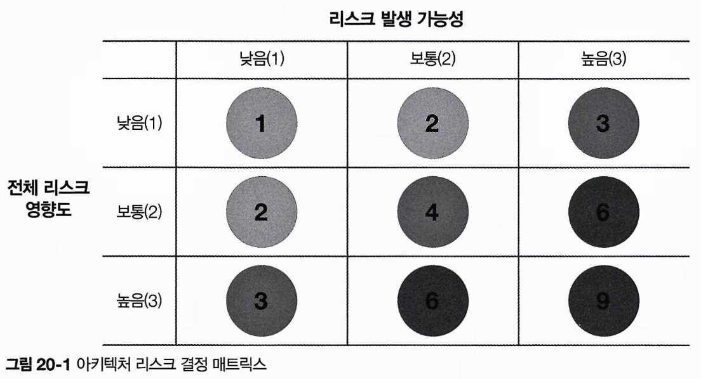

## 20.2 리스크 평가

리스크 평가는 전체 아키텍처의 리스크를 리스크 매트릭스를 기반으로 유의미한 평가 기준에 따라 정리한 리포트입니다.  
리스크 평가는 애플리케이션의 서비스나 도메인 영역에 기반한 평가 기준을 포함합니다.

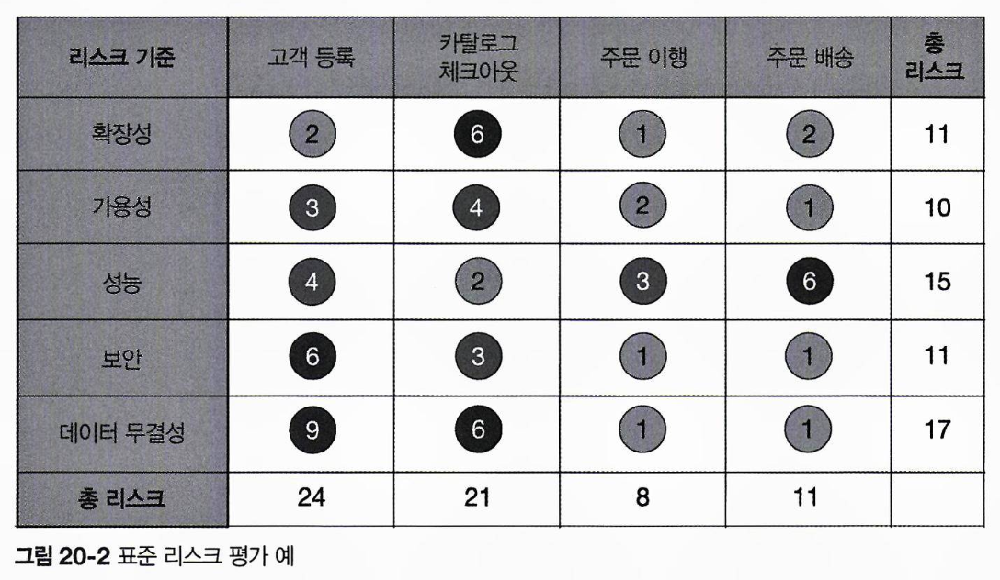

리스크 매트릭스를 활용하면 평가 기준별로, 서비스 또는 도메인 영역별로 누적 리스크를 계산할 수 있습니다.  
위 예제에서는 데이터 무결성의 누적 리스크는 17점으로 가장 높고, 가용성은 10점으로 가장 낮습니다.  
도메인 영역에서는 고객 등록이 24점으로 가장 높은 리스크를 가지며, 주문 이행은 8점으로 가장 낮습니다.  
이와 같이 각 영역별 수치를 상대적으로 비교하여, 특정 리스크 범주나 도메인 영역에서의 리스크가 개선 또는 악화 되었는지를 알 수 있습니다.

위 예제에서는 모든 리스크 분석 결과를 담았지만, 효과적인 메시지 전달을 위해서는 일부 결과로 필터링하는게 좋습니다.  
예를 들어, 리스크가 높은 시스템 영역만 발표하면 다음처럼 SNR(신호대잡음비, signal-to-noise-ratio)이 개선되어 시스템 상태가 명확하게 드러납니다.

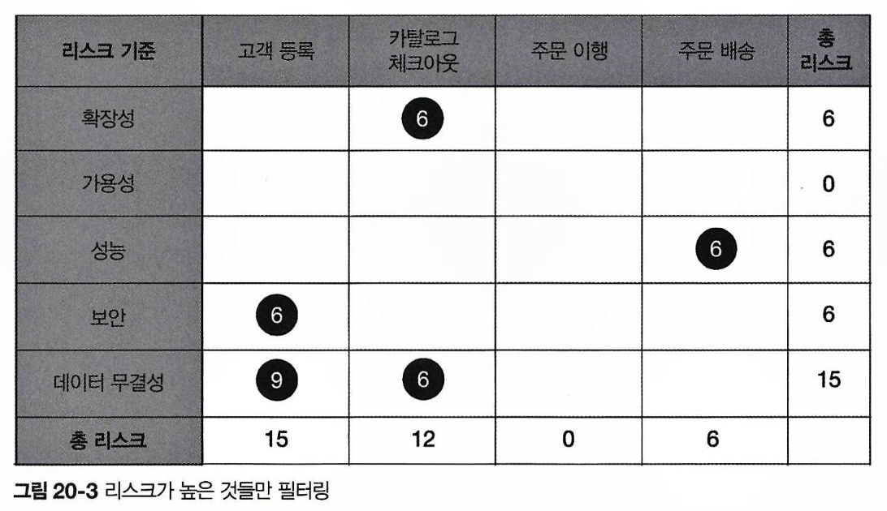

지금까지 살펴본 리스크 평가는 특정 시점의 리스크 상태를 보여주는 스냅샷의 일종으로, 리스크의 방향성을 알려주지는 않습니다.  
리스크 방향성을 표시할 때는 플러스(+), 마이너스(-) 기호를 사용하면 좋습니다.  
예를 들어, 다음 예제에서는 고객 등록의 성능은 리스크 등급이 중간(4)이나, 마이너스 부호로 점점 상황이 악화되고 있음을 나타냅니다.  
반면, 카탈로그 체크아웃의 확장성은 등급이 높고(6) 플러스 부호로 개선 중임을 보여줍니다.  
부호가 없으면 리스크가 안정적이고, 개선 또는 악화되지 않았다는 뜻입니다.

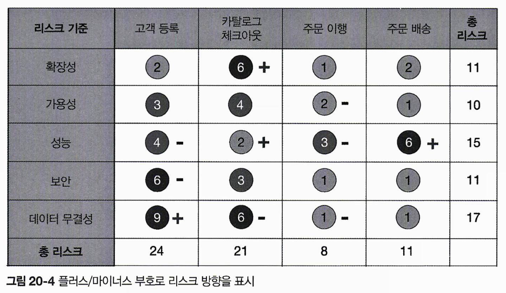

다만 플러스/마이너스 부호가 헷갈리는 경우를 대비해, 리스크 등급 번호와 화살표를 함께 표기할 수도 있습니다.  
다음과 같이 화살표로 방향을 명확히 표시하면 따로 범례가 필요 없으며, 화살표에 색깔(빨간색: 악화, 초록색: 개선)을 추가하면 리스크의 방향성을 더욱 직관적으로 전달할 수 있습니다.

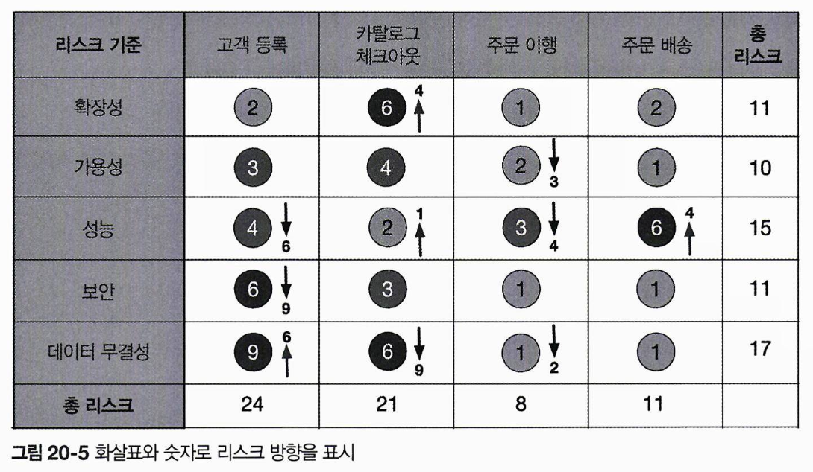

## 20.3 리스크 스토밍

리스크 스토밍은 여러 관계자가 모여 특정 범위 내 아키텍처 리스크를 찾아내는 협력적인 활동입니다.  
일반적인 리스크 영역에는 **검증되지 않은 기술, 성능, 확장성, 가용성, 데이터 소실, 단일 장애 지점, 보안** 등이 포함됩니다.  
이 활동에는 아키텍트뿐 아니라 개발자, 기술 책임자가 함께 참여하면, 구현 관점에서도 리스크를 검토할 수 있습니다.

리스크 스토밍은 개별 파트와 협력 파트로 이루어지며, 두 활동이 함께 진행되어야 효과적인 리스크 스토밍이 가능합니다.

- **개별 파트**:
  - 참가자들이 독립적으로 리스크 매트릭스를 활용해 각자 아키텍처 영역에 리스크를 할당합니다.
  - 다른 사람의 영향 없이 집중할 수 있습니다.
- **협력 파트**:
  - 모든 참가자가 모여 리스크 영역에 대한 공감을 형성하고, 리스크를 줄이기 위한 방안을 논의합니다.

리스크 스토밍에서는 아키텍처 다이어그램을 사용합니다.  
전체 리스크 평가에는 종합적인 아키텍처 다이어그램을 활용하고, 특정 영역에 대한 평가에는 해당 영역의 아키텍처 다이어그램을 활용합니다.  
리스크 스토밍을 주관하는 아키텍트는 다이어그램을 최신 상태로 유지하며, 모든 참가자들이 이를 확인할 수 있도록 관리해야 합니다.

다음의 다이어그램은 AWS ELB가 웹 서버(Nginx)와 연결되고, 최종적으로 각 EC2 인스턴스에서 실행되는 애플리케이션 서비스에 요청을 전달합니다.  
애플리케이션 서비스는 MySQL, 레디스 캐시, 몽고DB를 호출하여 로깅 작업을 수행하며, 푸시 확장 서버도 호출됩니다.  
푸시 확장 서버는 다시 MySQL, 레디스 캐시, 몽고DB의 로깅 기능과 연계됩니다.

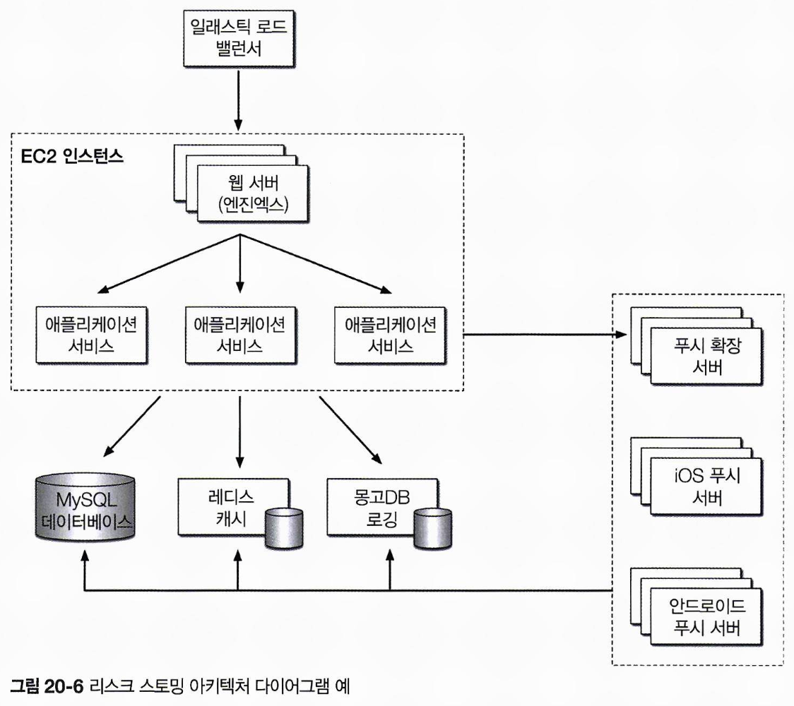

리스크 스토밍은 다음의 세 가지 활동으로 구성됩니다.  
식별은 개별적으로, 합의와 완화는 협력적으로 진행됩니다.

1. 식별(Identification): 개별적이고 비협력적으로 진행되며, 각자가 리스크를 파악합니다.
2. 합의(Consensus): 모든 참가자가 모여 협력적으로 리스크에 대한 공감대를 형성합니다.
3. 완화(Mitigation): 협력적으로 리스크를 줄이기 위한 방안을 논의하고 실행합니다.

### 20.3.1 식별

식별 활동은 참여자가 개별적으로 아키텍처 내 리스크 영역을 파악하는 과정으로, 다음 단계를 거칩니다:

1. **초대장 발송**: 리스크 스토밍을 주관하는 아키텍트가 참가자들에게 초대장을 보내며, 초대장에는 아키텍처 다이어그램, 분석 대상 리스크 영역, 협력 파트 일정 및 장소가 포함됩니다.
2. **리스크 분석**: 참가자는 리스크 매트릭스를 활용해 아키텍처를 분석하고, 리스크를 낮음(1-2), 중간(3-4), 높음(6-9)으로 분류합니다.
3. **포스트잇 작성**: 리스크 매트릭스에서 식별한 리스크 번호를 색상별 포스트잇(초록: 낮음, 노랑: 중간, 빨강: 높음)에 기재합니다.

리스크 스토밍은 보통 한 가지 부문(예: 성능)만 분석하지만, 필요에 따라 여러 부문(예: 성능, 확장성, 데이터 소실)을 동시에 분석할 수도 있습니다.  
예를 들어, 세 참가자가 중앙 데이터베이스에서 리스크 높음(6)을 식별했더라도, 한 명은 가용성 리스크, 나머지 두 명은 성능 리스크를 발견할 수 있습니다.  
이 경우, 참가자들은 포스트잇에 리스크 번호와 함께 부문명을 병기하여 구분하고, 각 부문을 별도로 논의해야 합니다.

### 20.3.2 합의

합의 활동은 참가자들이 아키텍처 내 리스크에 대해 공감대를 형성하는 협력적인 과정입니다.  
아키텍처 다이어그램을 대형 스크린에 표시한 상태에서, 참가자들은 각자가 발견한 리스크를 다이어그램에 배치합니다.  
이를 통해 리스크 영역에 대한 시각적 합의가 이루어집니다.

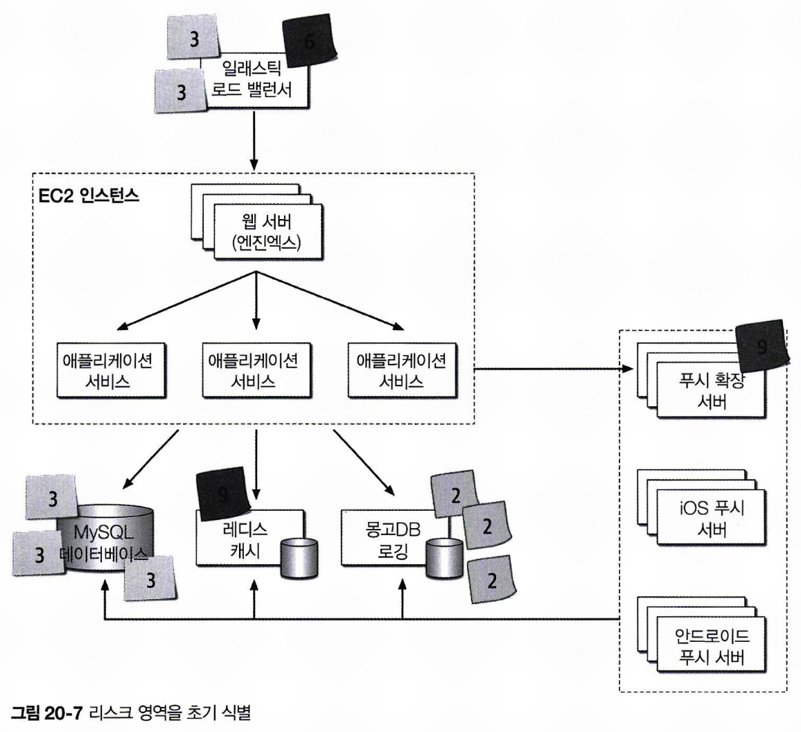

리스크 배치가 끝나면 협력 파트가 시작됩니다.  
이 과정의 목표는 참가자들이 한 팀이 되어 리스크 영역을 분석하고, 해당 영역이 실제 리스크인지 합의하는 것입니다.  
위 예제에서는 다양한 아키텍처 리스크 영역이 식별되었습니다.

1. 일래스틱 로드 밸런서:
   - 리스크 중간(3): 2명
   - 리스크 높음(6): 1명
2. 푸시 확장 서버:
   - 리스크 높음(9): 1명
3. MySQL 데이터베이스:
   - 리스크 중간(3): 3명
4. 레디스 캐시:
   - 리스크 높음(9): 1명
5. 몽고DB 로깅:
   - 리스크 낮음(2): 3명
6. 기타 아키텍처 영역:
   - 리스크 없음

3번(MySQL 데이터베이스)과 5번(몽고DB 로깅)은 세 참가자가 모두 리스크 레벨과 당위성에 동의했으므로 추가 논의가 필요 없습니다.  
반면, 1번(일래스틱 로드 밸런서)은 의견 차이가 있어 논의가 필요하며, 2번(푸시 확장 서버)과 4번(레디스 캐시)은 한 명만 리스크로 식별했으므로 합의를 통해 검토해야 합니다.

1번 일래스틱 로드 밸런서의 리스크에 대해, 두 참가자는 리스크 중간(3)으로, 한 참가자는 리스크 높음(6)으로 식별했습니다.  
리스크 높음으로 평가한 참가자는 **장애 발생 시 전체 시스템에 영향을 미친다**고 설명했으며, 이는 사실로 인정되었습니다.  
그러나 다른 두 참가자는 **그런 상황이 거의 발생하지 않을 것**이라 주장했고, **논의 끝에 세 번째 참가자는 리스크 레벨을 중간(3)으로 낮추기로 동의**했습니다.

2번 푸시 확장 서버에 대해, 한 참가자는 리스크 높음(9)으로 식별했으나, 다른 두 참가자는 리스크가 없다고 보았습니다.  
리스크를 식별한 참가자는 **과거 부하가 큰 상황에서 푸시 확장 서버가 지속적으로 다운되는 문제를 목격한 경험**을 공유했습니다.  
이러한 논의를 통해 다른 참가자들도 미처 알지 못했던 리스크를 파악하게 되었으며, 이는 리스크 스토밍의 핵심 가치인 **협력과 정보 공유**의 중요성을 보여줍니다.

4번 레디스 캐시에 대해서 한 참가자는 리스크 높음(9)으로 식별했지만, 다른 두 참가자는 리스크가 없다고 판단했습니다.  
이유를 묻자, **해당 참가자는 레디스 캐시가 무엇인지 모른다**고 답했습니다.  
리스크 스토밍에서 검증되지 않았거나 알려지지 않은 기술은 가장 높은 리스크 등급(9)을 매기게 됩니다.  
개발자가 리스크 스토밍에 참여하면 아키텍처에 대한 이해를 높이고, 아키텍트는 팀원의 기술적 공백이 리스크 요인임을 인지할 수 있습니다.

합의 활동은 모든 참가자가 식별된 리스크 영역에 의견을 함께 할 때까지 반복됩니다.  
다음과 같이 최종 결과가 도출되면 다음 활동으로 넘어갑니다.

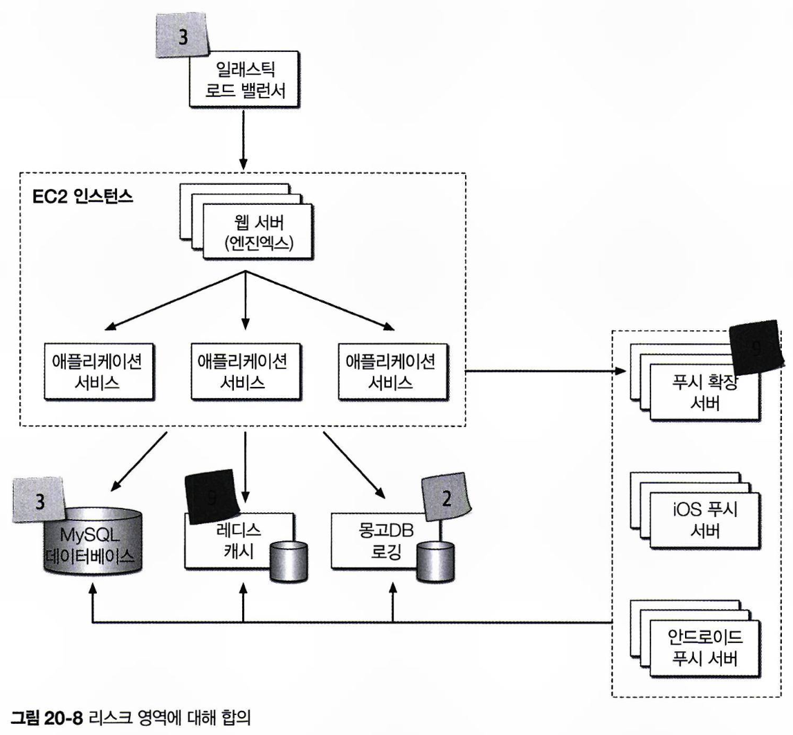

### 20.3.3 완화

참가자들은 합의 과정에서 식별된 리스크를 줄이거나 제거하는 방법을 모색하며, 필요에 따라 아키텍처의 일부 영역을 개선하거나 변경합니다.  
필요에 따라 아키텍처 전반을 변경해야 할 수도 있지만, 간단한 리팩터링(예: 배압 큐 추가)으로 해결 가능할 수도 있습니다.  
이 때 아키텍처 변경이 비용 대비 가치가 있는지 판단하게 되고, 필요하다면 비즈니스 이해관계자들을 설득해야 합니다.  
예를 들어, 리스크 스토밍을 통해 가용성 측면에서 중앙 데이터베이스의 리스크가 중간(4)으로 식별됐다고 합시다.
중앙 데이터베이스의 리스크를 줄이기 위해 클러스터링 및 물리적 분리를 제안했으나, $20,000의 비용이 부담되어 거절될 수 있습니다.  
이에 대해 클러스터링은 포기하고 데이터베이스를 두 파트로 분리만 하는 방안으로 합의하여, $8,000의 비용으로 리스크를 완화하게 됩니다.  
리스크 스토밍 기법을 사용해서 리스크를 잘 정리해두면 이해관계자 간 협상에 효과적으로 사용할 수 있습니다.

## 20.4 애자일 스토리 리스크 분석

리스크 스토밍은 아키텍처뿐만 아니라 소프트웨어 개발 전반에도 활용 가능합니다.  
예를 들어, 애자일 이터레이션에서 유저 스토리를 완료하는데 존재하는 리스크를 평가할 수 있습니다.  
리스크 매트릭스를 활용해 이터레이션에서 스토리가 완료되지 않았을 때의 영향도와 스토리가 완료되지 않을 가능성을 분석하고, 리스크가 높은 스토리를 우선 추적 및 처리할 수 있습니다.

## 20.5 리스크 스토밍 예시

환자들의 건강 상태에 대해 간호사가 조언을 해주는 콜 센터 시스템의 요구사항이 다음과 같다고 합시다.

1. **진단 엔진 사용**
   - 질문을 받으면 간호사나 환자에게 의료 문제를 안내하는 서드파티 진단 엔진을 사용한다.
2. **서비스 방식**
   - 환자는 콜 센터에 전화를 걸어 간호사와 통화하거나, 셀프 서비스 웹사이트를 통해 진단 엔진에 직접 액세스할 수 있다.
3. **동시 지원 규모**
   - 전국적으로 250명의 간호사와 수십만 명의 셀프 서비스 환자를 동시에 지원해야 한다.
4. **의무 기록 열람**
   - 간호사는 환자의 의무 기록을 열람할 수 있지만, 환자는 자신의 의무 기록을 볼 수 없다.
5. **법률 준수**
   - **미국 의료 정보 이동 및 책임법**(HIPAA)에 따라, 의무 기록은 간호사 외의 누구도 의무 기록을 열람할 수 없어야 한다.
6. **데이터 요청 처리**
   - 전염병과 독감 유행 시즌에 데이터 요청이 급증해도, 시스템이 이를 감당할 수 있어야 한다.
7. **간호사 연결**
   - 간호사 프로필(예: 외국어 가능)에 따라 통화가 연결되어야 한다.
8. **진단 엔진 성능**
   - 서드파티 진단 엔진은 초당 약 500개의 요청을 처리할 수 있어야 한다.

해당 서비스에 대해서 다음과 같이 아키텍처를 구성할 수 있습니다.

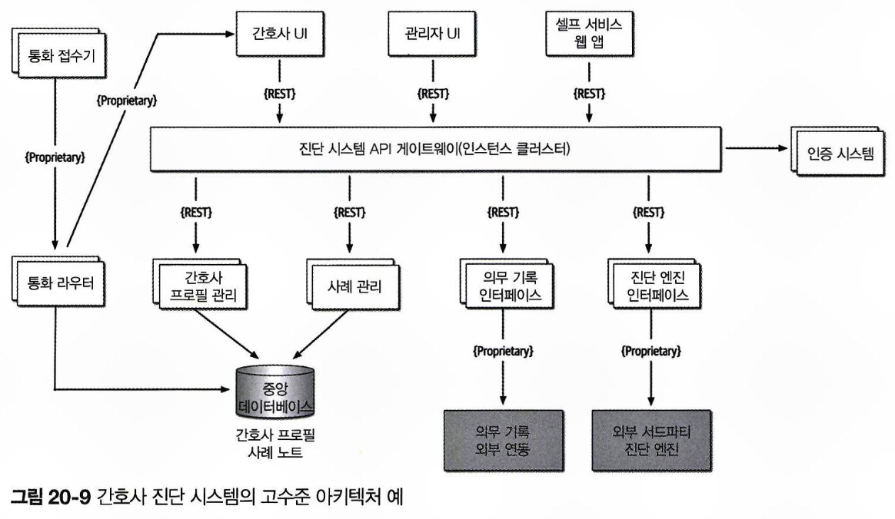

먼저 아키텍처에는 총 3개의 웹 기반 유저 인터페이스가 존재합니다.

- 셀프 서비스 인터페이스: 환자용.
- 간호사 인터페이스: 전화를 받는 간호사용.
- 관리 인터페이스: 간호사 프로필과 시스템 설정값을 관리.

콜 센터는 크게 두 부분으로 구성됩니다.

- 통화 접수기: 걸려온 전화를 받음.
- 통화 라우터: 중앙 데이터베이스에서 간호사 프로필을 조회 후, 적절한 간호사에게 통화 연결.

진단 시스템 API 게이트웨이는 이 아키텍처의 핵심으로, 요청을 보안 체크한 후 적절한 백엔드 서비스로 전달합니다.  
전체 시스템은 **사례 관리, 간호사 프로필 관리, 의무 기록 인터페이스, 외부 진단 엔진** 4개 주요 서비스로 구성되며, 외부 시스템 및 콜센터 연결용 전용 프로토콜을 제외한 모든 통신은 REST를 사용합니다.

아키텍트는 리스크 평가를 위해 요구사항과 다이어그램을 재검토하여, 가용성, 탄력성, 보안 측면에서 리스크 수준을 파악하려 합니다.  
리스크를 확인한 후 이를 줄이기 위한 아키텍처 개선 방안을 고민할 계획입니다.

### 20.5.1 가용성

아키텍트는 1차 리스크 스토밍 세션에서 시스템 성공을 위해 가용성을 최우선으로 검토했습니다.  
참가자들은 협력을 통해 리스크 매트릭스를 작성하고, 가용성과 관련된 주요 리스크 영역을 도출했습니다.

- 중앙 데이터베이스:
  - 영향도: 높음 (3)
  - 가능성: 중간 (2)
  - 리스크 수준: 높음 (6)
- 진단 엔진 7 요소:
  - 영향도: 높음 (3)
  - 가능성: 알 수 없음 (2)
  - 리스크 수준: 높음 (9)
- 의무 기록 가용성:
  - 시스템 실행에 필수 컴포넌트가 아님
  - 리스크 수준: 낮음 (2)
- 기타 시스템 파트
  - 각 서비스 : 여러 인스턴스로 구성
  - API 게이트웨이: 클러스터링 처리
  - 가용성 측면에서 리스크 없음

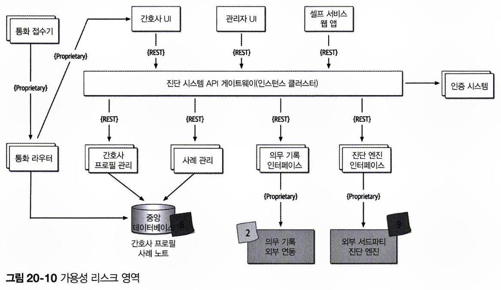

참가자들은 데이터베이스가 다운되면 간호사는 수기로 사례 기록을 작성할 수 있지만, 통화 라우터는 작동하지 않을 것이라는 점에 동의했습니다.  
이를 완화하기 위해 **데이터베이스를 두 개로 분리**하기로 했습니다: 간호사 프로필 정보용 클러스터형 데이터베이스, 사례 기록용 단일 인스턴스 데이터베이스.  
이 변경으로 **데이터베이스 가용성 우려가 해소되고, 사례 기록은 관리자만 볼 수 있어 보안도 강화**되었습니다.  
통화 라우터에 캐시를 도입하는 방법도 고려했으나, 통화 라우터의 구현 코드가 서드파티 제품일 가능성이 높으므로, 데이터베이스 액세스 방식을 채택했습니다.

외부 시스템(진단 엔진, 의무 기록 시스템)은 제어가 어려워 가용성 관리에 리스크가 큽니다.  
이를 완화하기 위해 각 시스템의 SLA(서비스 수준 계약)나 SLO(서비스 수준 목표)를 확인하는 것이 권장됩니다.  
진단 엔진은 SLA로 99.99% 가용성(연간 다운타임 52.60분)을, 의무 기록 시스템은 99.9% 가용성(연간 다운타임 8.77시간)을 보장하며, 이는 상대적으로 리스크가 낮은 수준으로 평가됩니다.

이후 변경된 아키텍처 다이어그램에서는 데이터베이스를 두 개로 분리하고, SLA를 다이어그램에 명시해 리스크를 줄였습니다.

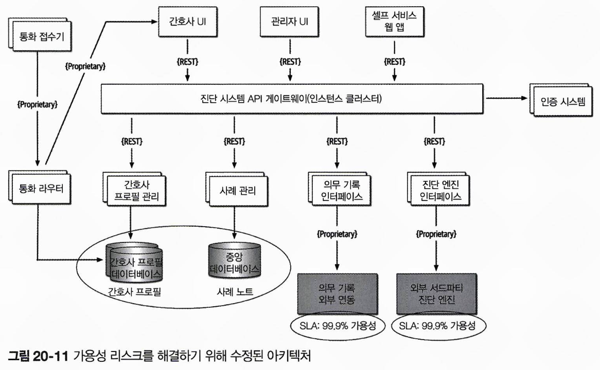

### 20.5.2 탄력성

2차 리스크 스토밍에서는 탄력성, 특히 **사용자 부하 급증에 따른 가변 확장성**을 논의했습니다.  
독감 시즌에 **셀프 서비스 파트를 통해 진단 엔진에 많은 액세스가 몰려서, 진단 인터페이스의 부하가 크게 증가**할 가능성이 제기되었습니다.  
참가자들은 **진단 엔진 인터페이스를 리스크 높음(9)으로 만장일치로 식별**했습니다.  
초당 500개 요청 처리 능력으로는 예상되는 부하를 감당하기 어렵다고 판단했으며, REST 프로토콜을 사용하는 경우 문제가 더욱 심각해질 것으로 보았습니다.

참가자들은 다음과 같은 방안을 검토했습니다.

- **API 게이트웨이와 진단 엔진 인터페이스 사이에 비동기 큐 배치**: 둘 사이의 호출을 완충하는 것이 가능하지만, 대기 시간 증가와 타임아웃 가능성이 있습니다.
- **앰뷸런스 패턴을 적용하여, 셀프 서비스보다 간호사 요청에 더 높은 우선순위를 부여**: 메시지 채널 2개를 필요로 하고, 대기 시간 문제는 여전히 해결되지 않습니다.
- **발병 관련 진단 질문을 캐시**: 진단 엔진 인터페이스에 도달하는 호출을 줄일 수 있어서, 리스크를 효과적으로 완화할 수 있습니다.

논의 결과, 새로운 아키텍처에서는 **간호사용과 셀프 서비스 환자용으로 나뉜 2개의 큐 채널**이 도입되고, **특정 질병 및 독감 관련 요청을 처리하는 질병 진단 캐시 서버**가 새로 도입되었습니다.  
이 구조는 진단 엔진 호출의 병목을 제거하여, 수만 개의 요청을 동시에 처리할 수 있습니다.

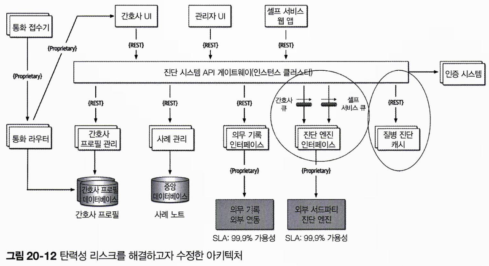

### 20.5.3 보안

아키텍트는 시스템의 또 다른 중요한 특성인 보안을 논의하기 위해 최종 세션을 열기로 했습니다.  
특히, HIPAA 규제 요구사항에 따라 **의무 기록은 간호사만 열람 가능하도록 안전하게 관리**해야 합니다.  
이 요구사항은 API 게이트웨이의 인증 및 인가 문제로 한정되지 않을 수 있습니다.

진단 시스템 API 게이트웨이의 보안에 대한 리스크 스토밍 결과, 관리 직원이나 셀프 서비스 환자가 의무 기록을 열람할 리스크가 다음과 같이 평가되었습니다.

- 진단 시스템 API 게이트웨이:
  - 가능성: 중간(2)
  - 영향도: 높음(3)
  - 리스크 수준: 높음(6)

각 API 호출에 대해 보안 체크가 이루어지긴 하지만, 모든 요청이 동일한 API 게이트웨이를 통과하기 때문에 가능성이 중간으로 판단되었습니다.  
참가자들은 API 게이트웨이를 사용자 유형 별로 관리자, 셀프 서비스/진단, 간호사용으로 분리하면, 관리자 또는 셀프 서비스 웹 인터페이스의 호출이 의무 기록 시스템에 접근하는 것을 막을 수 있다고 의견을 모았습니다.  
아키텍트는 이를 반영한 최종 아키텍처를 완성했습니다.

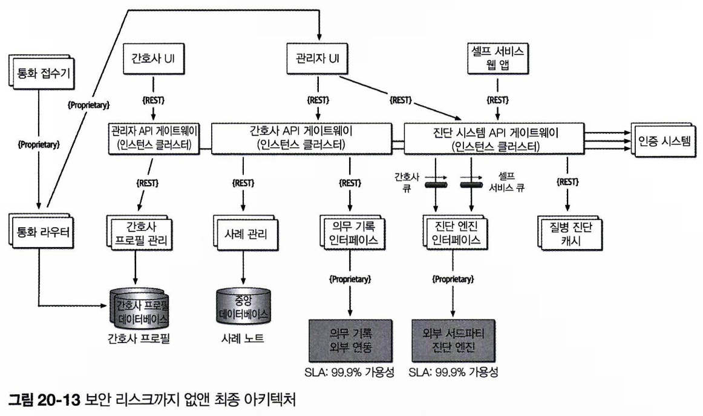

리스크 스토밍을 통해 가용성, 탄력성, 보안 문제를 해결하는 데 있어 의미 있는 진전이 이루어졌습니다.  
잘 보이지 않는 리스크 영역을 다른 아키텍트, 개발자, 주요 이해관계자들과 협력하여 효과적으로 식별할 수 있었습니다.

리스크 스토밍은 시스템이 운영되는 동안 지속적으로 반복해야 합니다.  
리스크 스토밍의 빈도는 변경 주기, 아키텍처 리팩터링, 점진적 개발 등 다양한 요인에 따라 달라지며, 일반적으로 주요 기능 추가 후, 또는 매 이터레이션 종료 시수행할 수 있습니다.
