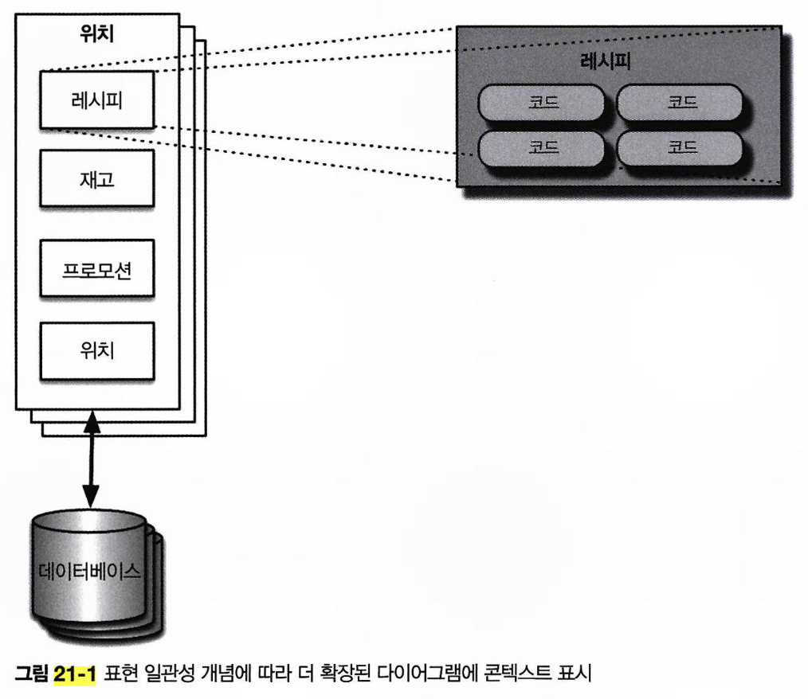
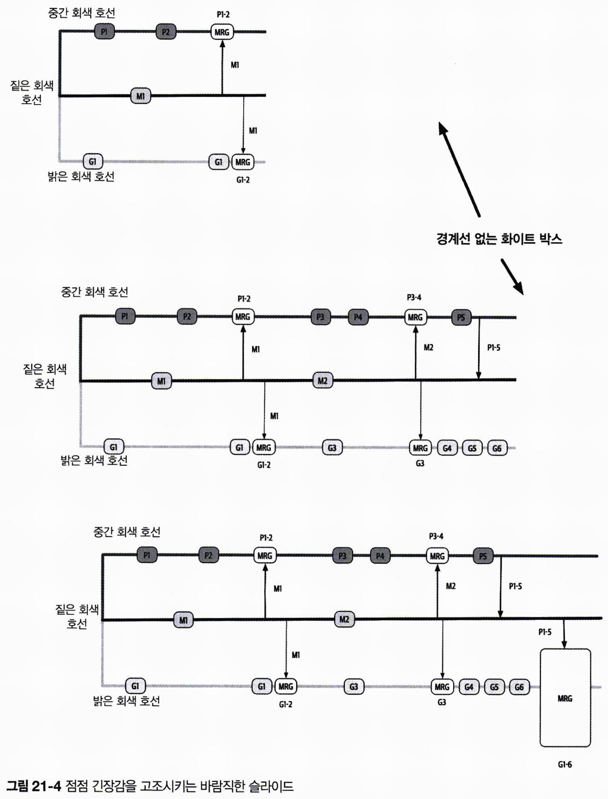

# 아키텍처 도식화 및 프레젠테이션

아키텍트로서 성공하려면 효과적인 의사 소통이 중요하며, 아키텍처 도식화와 프레젠테이션은 이를 위한 핵심 소프트 스킬입니다.  
이 두 스킬은 서로 다른 매체를 사용하지만, 아키텍처 비전의 중요한 부분을 시각적으로 표현한다는 공통점을 가집니다.

아키텍처를 시각적으로 기술할 때는 **전체 아키텍처의 관점에서 시작하여, 개별 파트를 상세히 설명**해야 합니다.  
각 파트가 전체 아키텍처에서 어떤 위치에 있는지 명확히 알려주지 않으면 청중이 혼란스러울 수 있습니다.  
**표현 일관성**이란 다이어그램이나 프레젠테이션에서 **특정 파트에 대한 뷰를 보여주기 전에, 전체 아키텍처에서 파트 간의 관계를 설명**하는 것을 의미합니다.  
표현 일관성을 잘 지키면, 청중이 현재 표시된 내용의 범위를 쉽게 이해하고 혼동하지 않을 수 있습니다.  
예를 들어, 실리콘 샌드위치 카타에서 플러그인의 상호 연관성을 자세히 설명하려고 할 때, **전체 토폴로지를 표시한 뒤, 플러그인 구조를 하나씩 살펴보면서 이들 간의 관계를 설명**할 수 있습니다.

## 21.1 도식화

아키텍처 토폴로지를 통해 아키텍트와 개발자 간 공통 이해를 형성할 수 있기 때문에, 다이어그램을 작성하는 것은 아키텍트의 중요한 기술입니다.

### 21.1.1 도구

아키텍트는 강력한 다이어그램 도구를 선택하여 학습하는 것이 중요합니다.  
다만 설계 초기에는 정확도가 낮은 아티팩트부터 시작하는 것이 좋습니다.  
초반부터 다이어그램 작성에 많은 시간을 투자할수록, 그 결과물에 집착하게 됩니다.  
가능한 절차를 간소화하고. 적시에 아티팩트를 제작하는 것이 더 중요합니다.

일반적으로는 화이트보드 보다 **태블릿과 프로젝터**가 더 선호됩니다.  
태블릿은 제한 없는 캔버스를 제공하여, 팀 작업에 필요한 그림을 자유롭게 추가할 수 있습니다.  
또한 다양한 시나리오를 복사 붙여넣기 하면서 실험할 수 있으며, 결과물을 깔끔하게 캡처할 수 있습니다.

다이어그램 도구는 다양한 플랫폼에서 제공되며, 다음과 같은 필수 기능을 갖추고 있는지 확인하는 것이 중요합니다.

- **레이어**:
  - 항목을 논리적으로 나누고, 숨김/표시를 조정하여 세부 정보를 간단히 관리할 수 있습니다.
  - 프레젠테이션 준비 시, 단계별로 그림을 그려서 시각적 자료로 사용 할 수 있습니다.
- **스텐실/템플릿**:
  - 스텐실(stencil)은 자주 사용되는 시각적 컴포넌트를 조합하여 라이브러리화할 수 있는 도구입니다.
  - 공통적인 패턴이나 아티팩트를 스텐실로 구축하면, 조직 내 아키텍처 다이어그램을 일관되게 작성하고 빠르게 생성할 수 있습니다.
- **마그넷**
  - 마그넷은 도형 간 선을 쉽게 연결하도록 돕는 기능으로, 자동 정렬과 시각적 효과를 지원합니다.
  - 일부 도구는 마그넷 추가 및 커스터마이징을 통해, 더욱 유연하게 도형을 연결할 수 있습니다.

다이어그램 도구는 이러한 보조 기능 외에도, 선, 색상, 그 밖의 시각적인 아티팩트를 지원해야 하며, 다양한 포맷으로 내보내기도 가능해야 합니다.

### 21.1.2 도식화 표준: UML, C4, ArchiMate

#### UML

통합 모델링 언어(UML)는 한때 널리 사용되었으나, 현재는 UML 클래스와 시퀀스 다이어그램을 제외한 다른 UML 다이어그램은 거의 쓰이지 않습니다.

#### C4

C4는 UML을 현대적인 방식으로 개선한 다이어그램 기법입니다.  
C4에서 ‘C’ 4개는 다음을 의미합니다.

- **Context**: 유저 역할, 외부 의존성 등 시스템의 전체 컨텍스트
- **Container**: 아키텍처 내부의 물리적 배포 경계로, 운영자와 아키텍트의 공통 관심사
- **Component**: 시스템의 컴포넌트 뷰.
- **Class**: UML과 동일한 스타일의 클래스 다이어그램을 사용

C4 모델은 전사적 수준에서 도식화 표준으로 적합하지만, 모든 설계 요구를 충족하기에는 한계가 있습니다.  
모놀리식 아키텍처에는 적합할 수 있지만, 마이크로서비스 같은 분산 아키텍처에는 적합하지 않습니다.

#### 아키메이트

**비즈니스 도메인 중심으로 아키텍처를 기술, 분석, 시각화**하는 오픈 소스 엔터프라이즈 아키텍처 모델링 언어입니다.  
경량 모델링 언어를 제공하며, 단순함을 강점으로 가집니다.

### 21.1.3 도식화 지침

다음은 기술 다이어그램 작성 시 참고할 수 있는 일반적인 가이드라인 입니다.

- **제목**
  - 청중이 쉽게 이해할 수 있도록 **다이어그램의 모든 요소에 제목**을 붙입니다.
  - **제목은 관련 항목에 고정**하고, 회전이나 이펙트를 활용하여 공간을 효율적으로 사용합니다.
- **선**
  - 선은 적절히 굵게 하여 가독성을 높입니다.
  - **정보의 흐름을 나타낼 때는 화살표**로 트래픽 방향을 표시합니다.
  - **화살표 머리의 모양은 종류별로 의미가 다를 수 있으므로 일관성 있게 사용**해야 합니다.
  - **동기 통신은 실선, 비동기 통신은 점선**으로 나타냅니다.
- **셰이프**
  - 소프트웨어 업계 전체에서 통용되는 표준 셰이프는 없기 때문에, 아키텍트는 자신의 표준 셰이프 세트를 만들어 필요시 조직 전체에 전파하여 사용하도록 합니다.
  - 일반적으로 배포 가능한 아티팩트는 3차원 상자로, 컨테이너는 직사각형으로 표현합니다.
- **레이블**
  - 다이어그램의 각 항목에 레이블을 붙입니다.
  - 청중이 모호하게 느낄 수 있는 항목에는 반드시 레이블을 추가합니다.
- **색상**
  - 색상을 활용하여 서로 다른 상태를 명확히 나타내고, 아티팩트를 구분하기 쉽습니다.
  - ex) 서로 다른 마이크로서비스의 인스턴스를 색상으로 구별
- **키**
  - 셰이프가 모호할 경우, **다이어그램에 키를 추가해 각 셰이프의 의미를 명확히** 합니다.

## 21.2 프레젠테이션

아키텍트는 PowerPoint나 Keynote 같은 프레젠테이션 도구를 효과적으로 활용하는 능력이 필요합니다.  
문서와 프레젠테이션에는 시간 조작이라는 근본적인 차이가 있다는 점에 주목할 필요가 있습니다.  
프레젠테이션에서 발표자는 아이디어 전개의 속도를 스스로 조절할 수 있지만, 문서는 독자가 속도를 조절합니다.  
시간을 효과적으로 관리해야 프레젠테이션에서 성공할 수 있습니다.

### 21.2.1 시간 조작

프레젠테이션 도구는 **전환(transition)**과 **애니메이션(animation)**을 통해 슬라이드의 시간을 조작합니다.

- **전환**: 한 슬라이드에서 다른 슬라이드로 이동합니다.
- **애니메이션**: 슬라이드 내 요소에 움직임을 부여합니다. 나타내기, 사라지기, 이동, 크기 조정 등 다양한 동적 효과를 포함합니다.

한 슬라이드를 과도하게 채우지 말고, **아이디어를 여러 슬라이드로 나누어 표현**하고, **전환과 애니메이션을 활용해 자연스럽게 연결**하는 것이 중요합니다.  
`디졸브`와 같은 전환 효과를 활용하면 슬라이드 경계를 감추며 스토리를 전달할 수 있고, 주제 전환 시에는 `도어`, `큐브` 같은 전환 효과로 새로운 주제를 시각적으로 알릴 수 있습니다.

### 21.2.2 점진적 빌드

**총알투성이 시체(Bullet-Riddled Corpse)**라는 안티패턴은 **텍스트로 가득 찬 슬라이드를 청중에게 보여주고 발표자가 이를 읽는 방식의 프레젠테이션**을 말합니다.  
청중은 이미 슬라이드를 읽고, 발표자의 느린 설명을 수동적으로 듣게 되어, 지루함을 느낄 수밖에 없습니다.  
발표자는 **구두(언어)**, **시각** 두 가지 정보 채널을 통해 슬라이드를 점진적으로 빌드하여, **필요한 정보만 단계적으로 제시**해야 합니다.

예를 들어 기능 브랜칭을 주제로 프레젠테이션을 만들 때, 브랜치를 오래 유지하면 부정적인 결과를 초래한다는 메시지를 전달하려고 합니다.  
이 때 전체 슬라이드를 즉시 보여주면, 청중이 결말을 예상하게 되고, 발표자가 설명할 때까지 이를 기다려야 합니다.
그 대신, 흰색 상자로 일부 그림을 가린 후 점진적 빌드와 빌드 아웃 애니메이션을 활용해 일부분만 순차적으로 보여주면, 청중에게 기대감과 긴장감을 줄 수 있습니다.  
이를 통해 발표를 더욱 흥미롭고 매력적으로 만들 수 있습니다.

### 21.2.3 인포덱스 VS 프레젠테이션

프레젠테이션을 청중에게 직접 보여주지 않고, 이메일로 전달해 각자가 읽도록 하는 방식도 있습니다.  
`인포덱스`는 **프레젠테이션 도구를 데스크탑 출판 도구처럼 활용해 정보를 시각적으로 요약**해줍니다.

인포덱스와 프레젠테이션의 주요 차이점에는 **콘텐츠의 종합성**과 **전환/애니메이션 효과**에 있습니다.  
인포덱스는 독자가 잡지 기사처럼 훑어보는 자료로, 시간 요소 없이 모든 정보를 포함시켜서 구성합니다.  
반면, 프레젠테이션은 슬라이드에 일부 정보만 담고 나머지는 발표자가 직접 설명하기 때문에, 전달 방식이 구두 발표에 의존합니다.

### 21.2.4 슬라이드는 절반의 스토리

주요 논점을 강조하려다 과도한 자료를 슬라이드에 넣는 경우가 많습니다.  
**발표자는 슬라이드와 구두 설명이라는 두 가지 정보 채널을 전략적으로 활용해 메시지의 효과를 극대화**해야 합니다.  
`불가시성 전략`은 이러한 접근법의 좋은 사례입니다.

### 21.2.5 불가시성

**불가시성(Invisibility)** 은 발표자에게만 청중의 주목이 집중되도록 **슬라이드에 빈 검정 화면을 삽입**하는 전략입니다.  
핵심 요점을 전달할 때 이 방법을 활용하면, 청중의 관심을 자연스럽게 발표자에게 집중시킬 수 있습니다.
