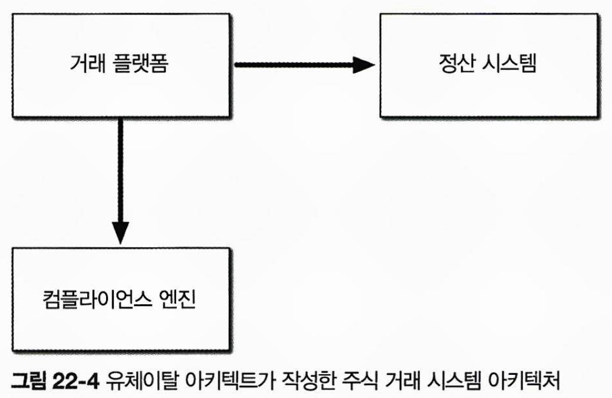
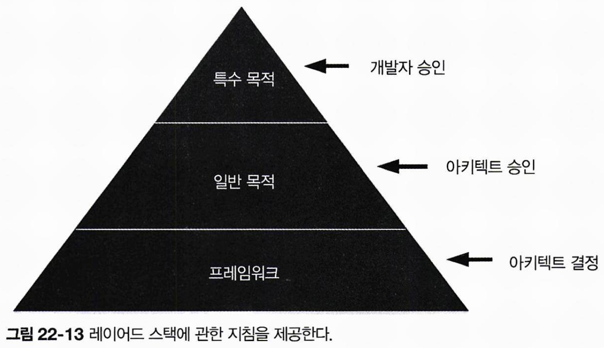

# 개발팀을 효율적으로

아키텍트는 기술 아키텍처를 정립하고 결정할 뿐만 아니라, **개발팀이 이를 올바르게 구현하도록 지원**해야 합니다.  
폐쇄적인 환경에서 독단적으로 아키텍처을 작업할 경우 개발팀이 구현 과정에서 어려움을 겪게 됩니다.  
이번 장에는 개발팀을 생산적으로 만들기 위한 기본적인 테크닉을 다룹니다.

## 22.1 팀 경계

개발팀이 아키텍트와 아키텍처로부터 멀어지면, **시스템의 제약 조건에 대한 이해와 경험 부족**으로 인해 아키텍처를 제대로 구현하지 못하는 경우가 많습니다.  
아키텍트는 개발팀이 **아키텍처 구현과 관련된 제약조건과 틀**을 통해 개발팀과 소통합니다.  
이 경계가 너무 빡빡하거나 느슨해지면 개발팀의 아키텍처 구현 능력에 부정적인 영향을 미칠 수 있습니다.  
아키텍트가 제약조건을 과도하게 설정하면, 개발자는 필요한 도구와 라이브러리를 활용하지 못해 효과적으로 시스템을 구현할 수 없습니다.  
반대로 제약이 너무 느슨하거나 아예 없는 경우, 중요한 아키텍처 결정을 개발팀이 떠맡아야 하고, 명확한 지침이 없어 비생산적이게 됩니다.

아키텍트는 팀이 올바른 도구와 라이브러리를 통해 아키텍처를 잘 구현할 수 있도록, 적절한 지침과 제약조건을 제공해야 합니다.

## 22.2 아키텍트 성향

아키텍트는 3가지 유형을 보이며, `내 맘대로 아키텍트`는 빡빡한 경계, `유체이탈 아키텍트`는 느슨한 경계, `유능한 아키텍트`는 적합한 경계를 설정하는 특징이 있습니다.

### 22.2.1 내 맘대로 아키텍트

`내 맘대로 아키텍트(Control Freak Architect)` 는 **소프트웨어 개발의 세부 사항까지 지나치게 통제**하려는 경향이 있습니다.  
이들은 오픈 소스나 서드파티 라이브러리 사용을 제한하고, 명명 규칙, 클래스 설계, 메서드 길이 등을 엄격히 제한하며, 심지어 의사코드까지 제시하는 등 과도한 간섭을 합니다.  
이러한 통제는 개발자들이 아키텍트에 대한 존중을 잃게 만듭니다.
특히 개발자에서 아키텍트로 전향한 경우, 개발자 역할에 익숙해 컴포넌트 설계와 구현에까지 관여하고 싶어지기 쉽습니다.  
그러나 구현 방안을 결정하는 건 개발자의 역할임을 명심해야 합니다.
아키텍트는 시스템의 컴포넌트 별 핵심 기능과 컴포넌트간 상호작용을 정의하는 선에서 역할을 다 해야 합니다.

### 22.2.2 유체이탈 아키텍트

유체이탈 아키텍트는 코딩 경험이 부족하거나 세부 구현 사항에 무관심한 아키텍트로, 아키텍처 초안만 완성한 뒤 개발팀과 소통 없이 다른 프로젝트로 떠납니다.
유체이탈 아키텍트는 기술이나 비즈니스 측면에서 팀을 리드하거나 가이드하기 어렵습니다.  
아키텍트는 다이어그램과 설계를 주로 다루게 되는데, 아키텍트의 경험과 소통이 부족하면 다이어그램이 실제로 실행 가능한지 확인하기 어렵습니다.

예를 들어 주식 거래 시스템 같은 복잡한 솔루션을 설계할 때, 다음과 같이 지나치게 고수준의 다이어그램만 작성하면 세부 구현에 대한 구체성이 부족하게 되어, 개발에 실질적인 도움이 되지 않는다는 한계가 있습니다.

또한 유체이탈 아키텍트는 개발팀과의 소통과 역할 분담에 소홀하여, 개발팀이 아키텍트의 일을 대신하게 만듭니다.  
이로 인해 프로젝트 진척과 생산성이 떨어지고, 시스템 작동 방식을 이해하는데 혼란이 발생합니다.  
개발팀은 아키텍트의 기술적 지원, 가이드, 그리고 기술·비즈니스 관련 문의에 대한 답변을 필요로 합니다.

다음은 유체이탈 아키텍트의 징후들입니다.

- 비즈니스 영역, 비즈니스 문제, 기술을 온전히 이해하지 못한다.
- 소프트웨어 개발 실무 경력이 부족하다.
- 아키텍처 솔루션 구현에 함축된 의미를 전혀 신경 쓰지 않는다.

### 22.2.3 유능한 아키텍트

유능한 소프트웨어 아키텍트는 개발팀에 **명확한 제약조건과 경계를 설정**하고, **협력을 독려**하며 **적절한 가이드를 제공**합니다.  
또한, **팀이 필요한 도구와 기술을 갖췄는지 확인**하고, **장애 요소를 제거해 목표 달성을 지원**합니다.  
개발팀과 긴밀히 협력하며 존경을 얻는 리더십은 하나의 예술이라 할 수 있습니다.

## 22.3 얼마나 제어해야 하나?

유능한 소프트웨어 아키텍트는 개발팀을 적절히 제어할 줄 알아야 합니다.  
이는 다음의 다섯 가지 핵심 팩터에 따라 달라지며, 해당 팩터들은 아키텍트가 한 번에 관리할 수 있는 팀이나 프로젝트의 범위를 결정합니다.

- **팀원 간 친밀도**
  - 팀원들이 서로 얼마나 잘 알고 있는지, 이전에 함께 프로젝트를 진행한 경험이 있는지
  - 팀원 간 친밀도가 높을수록, 이미 자율적으로 조직화되기 시작하므로 제어가 덜 필요.
  - 친밀도가 낮을수록 협업 촉진과 파벌 방지를 위해 더 많은 제어가 필요.
- **팀 규모**
  - 팀에 몇 명의 개발자가 있는가?
    - **작은 팀**: 4명 이하
    - **큰 팀**: 12명 이상
  - 팀 규모가 클수록 제어가 더 많이 필요.
  - 팀 규모가 작을수록 제어가 덜 필요.
- **전체적인 경험**
  - 팀원 중 시니어/주니어 개발자의 비율은 어느 정도이고, 기술 및 비즈니스 영역에 대한 팀원들의 숙련도는 어느 정도인가?
  - **주니어 개발자가 많은 팀**: 제어와 멘토링이 더 필요.
  - **시니어 개발자가 많은 팀**: 제어가 덜 필요하며, 아키텍트는 멘토보다 조정자(facilitator) 역할에 집중.
- **프로젝트 복잡도**
  - 프로젝트의 복잡성은 얼마나 높은가?
  - **복잡한 프로젝트**: 아키텍트가 팀에 더 많이 관여하고 더 많은 제어 필요.
  - **단순한 프로젝트**: 별도의 많은 제어 없이 진행 가능.
- **프로젝트 기간**
  - 프로젝트의 기간은 얼마나 되는가? - **짧은 프로젝트**: 2개월, **보통 프로젝트**: 6개월, **긴 프로젝트**: 2년 이상
  - **긴 프로젝트**: 더 많은 제어가 필요.
  - **짧은 프로젝트**: 제어가 덜 필요.

단기 프로젝트(예: 2개월)는 일정이 빠듯해서 개발팀은 이미 압박을 느껴 효율적으로 작업하기 때문에, 아키텍트가 지나치게 개입하면 오히려 방해가 될 수 있습니다.  
반대로 장기 프로젝트(예: 2년)는 초기 단계에서 긴박감이 적어, 개발자들이 느긋해질 가능성이 있으므로, 아키텍트가 프로젝트를 적시에 진행시키기 위해 더 많은 제어와 관리가 필요합니다.

프로젝트 초기에 팩터들을 기반으로 제어 수준을 결정한 뒤, 프로젝트 진행에 따라 제어 수준도 점진적으로 조정해야 합니다.  
이를 위해 각 팩터에 20점 단위로 값을 매겨 평가하고, 최종 결과가 음수(-) 이면 제어를 덜 해야 함, 양수(+) 이면 제어를 더 해야 함을 나타내는 것으로 정의할 수 있습니다.  
프로젝트 진행 중 지속적으로 지표를 분석해, 적절한 제어 수준을 유지하는 것이 중요합니다.

예를 들어 프로젝트 시나리오에서 각 팩터를 평가한 결과, 각 팩터마다 점수(+20, -20)가 부여되었고, 최종적으로 누적 점수가 -60점으로 나타났습니다.  
이는 아키텍트가 개발팀의 업무를 가급적 방해하지 않고, 자율적으로 진행하도록 하는 것이 바람직함을 의미합니다.  
이 경우 유능한 소프트웨어 아키텍트라면, 초기에는 조정자 역할을 수행하며, 팀원들의 업무에 깊이 개입하지 않습니다.  
그 대신 질문에 답변하고, 프로젝트가 정상적으로 진행되는지 확인하면서, 숙련된 팀원들이 각자의 전문성을 발휘해 소프트웨어 개발을 신속히 진행할 수 있도록 지원합니다.

| 팩터            | 평가 기준     | 평점 |
| --------------- | ------------- | ---- |
| 팀원 간 친밀도  | 신규 팀원들   | +20  |
| 팀 규모         | 작음 (4명)    | -20  |
| 전체적인 경험도 | 모두 유경험자 | -20  |
| 프로젝트 복잡도 | 비교적 단순함 | -20  |
| 프로젝트 기간   | 2개월         | -20  |
| **총합**        |               | -60  |

이와 달리 이번 시나리오에서는 팀 규모가 크고(12명), 팀원들은 친밀하지만 대부분 주니어 개발자로 구성되어 있습니다.  
프로젝트는 6개월 동안 진행되며, 복잡도는 꽤 복잡한 수준입니다.  
누적 점수는 -20점으로 계산되었으며, 이에 따라 아키텍트는 팀 업무에 일정 부분 관여하여 멘토와 코치 역할을 수행하는 것이 더 효과적이라는 결론이 도출됩니다.

| 팩터            | 평가 기준         | 평점 |
| --------------- | ----------------- | ---- |
| 팀원 간 친밀도  | 서로 잘 아는 사이 | -20  |
| 팀 규모         | 큼 (12명)         | +20  |
| 전체적인 경험도 | 대부분 주니어급   | +20  |
| 프로젝트 복잡도 | 아주 복잡함       | +20  |
| 프로젝트 기간   | 6개월             | -20  |
| **누적 점수**   |                   | -20  |

## 22.4 팀의 이상 징후

팀 규모는 아키텍트의 제어 수준에 영향을 미치는 중요한 요인입니다.  
팀이 클수록 더 많은 제어가 필요하며, 작을수록 제어가 줄어듭니다.  
**효율적인 개발팀의 규모**는 다음 세 가지 요인에 의해 결정됩니다:

- 프로세스 손실
- 다원적 무지
- 책임 확산

#### 프로세스 손실

**프로세스 손실(Process Loss)**은 프로젝트에 인력을 더 많이 투입할수록 프로젝트 완료 시간이 길어지는 현상을 의미합니다.  
팀의 **그룹 잠재력(Group Potential)**은 팀원들의 집합적 노력으로 정의되지만, **실제 생산성은 이 잠재력에 미치지 못하며**, 이 차이가 바로 프로세스 손실입니다.

아키텍트는 팀을 관찰하여 프로세스 손실을 식별하고, 이를 통해 적절한 팀 규모를 결정해야 합니다.  
예를 들어, 코드 커밋 과정에서 **병합 충돌**이 자주 발생하면, 이는 팀원들이 동일한 코드 작업을 하며 발이 엉키고 있다는 신호입니다.  
이를 방지하려면 **팀 내에서 병렬 작업이 가능한 부분을 찾아 각자 다른 영역에서 작업**할 수 있도록 해야 합니다.  
팀원이 새로 합류했는데도 병렬 작업 흐름에 기여할 여지가 없다면, 신규 인력이 프로젝트에 부정적 영향을 미칠 수 있음을 설명해야 합니다.

#### 다원적 무지

팀 규모가 너무 커지면 **다원적 무지(Pluralistic Ignorance)** 현상이 발생할 수 있습니다.  
이는 **팀원들이 개인적으로 반대 의견을 가지고 있지만, 뻔한 것을 놓치고 있다고 비난받을까 두려워 마지못해 동의**하는 상황을 말합니다.

예를 들어, 큰 팀에서 대부분의 팀원이 두 원격 서비스가 메시징으로 통신해야 한다고 생각하지만, 한 팀원은 보안 방화벽 문제로 비현실적이라고 판단합니다.  
그러나 비난받을까 두려워 의견을 말하지 않고 동의하게 되고, 결국 메시징이 불가능하다는 사실이 나중에 밝혀져 개발을 다시 하게 됩니다.  
팀 규모가 작았다면 초기 단계에서 문제를 지적하고 대안을 논의하기 더 수월했을 것입니다.

아키텍트는 회의나 토론에서 참가자의 표정과 몸짓을 관찰하여, **다원적 무지가 발생할 조짐이 보이면 조정자로 나서야** 합니다.  
중간중간 논의된 해결책에 대해 팀원들에게 의견을 묻고, 그들이 발언할 때 지지해줌으로써 **자유롭게 의견을 낼 수 있는 분위기를 조성**합니다.

#### 책임 확산

적절한 팀 규모를 결정하는 세 번째 요인은 **책임 확산**입니다.  
의사소통이 어려워지고, 팀원들 간에 누가 어떤 업무를 담당하는지 혼란스러워진다면, 이는 팀이 너무 커졌다는 신호입니다.

## 22.5 체크리스트 활용

체크리스트는 문제를 해결하고 업무를 철저히 준비하는 데 효과적인 도구입니다.  
다만 소프트웨어 개발의 모든 작업에 체크리스트가 필요하지는 않습니다.  
개발팀의 효율성을 높이기 위해서는 **체크리스트를 활용해야 할 상황과 그렇지 않을 상황을 명확히 구분**하는 것이 중요합니다.

체크리스트에는 잇따라 실행되는 종속적인 작업이나, 간단하고 빈번하게 실행되는 프로세스는 포함되지 않아야 합니다.  
예를 들어 아래의 데이터베이스 체크리스트에는 `폼작성 및 전달` 같은 종속적인 작업들이 포함되어 있고, `생성된 테이블 확인` 처럼 간단한 작업도 포함되어 있습니다.

- [ ] 데이터베이스 컬럼 필드명과 타입을 결정한다
- [ ] 데이터베이스 테이블 요청 폼을 작성한다
- [ ] 새 데이터베이스 테이블의 퍼미션을 얻는다
- [ ] 데이터베이스 그룹에 요청 폼을 전달한다
- [ ] 생성된 테이블을 확인한다

체크리스트는 단순히 작업 단계를 나열하는 것이 아니라, 중요한 확인 사항을 효율적으로 관리하는 데 초점을 맞춰야 합니다.
순서나 종속 작업이 없으며, 에러가 발생하기 쉽거나 누락되기 쉬운 작업들을 포함해야 합니다.  
이 때, 너무 복잡하거나 방대한 체크리스트는 개발자들이 활용하지 않을 가능성이 높기 때문에, 모든 것을 체크리스트로 만들려 하지 않아야 합니다.

경험 상 가장 효과적인 체크리스트 3가지는 다음과 같습니다.

1. 개발자 코드 완료 체크리스트
2. 단위/기능 테스트 체크리스트
3. 소프트웨어 릴리스 체크리스트

### 22.5.1 개발자 코드 완성도 체크리스트

`개발자 코드 완성도 체크리스트`는 개발자가 코드 작업을 ‘완료’했음을 판단하는 도구이며, 다음 내용이 포함됩니다:

- 자동화 도구에 포함되지 않은 코딩 및 포매팅 표준
- 자주 간과되는 항목(예: 로그에 숨겨진 오류)
- 프로젝트별 표준
- 팀의 특별 지침이나 절차

예시는 다음과 같습니다.

- [ ] 코드를 깨끗이 정리하고 포매팅한다.
- [ ] 커스텀 소스 검증 도구를 실행한다.
- [ ] 모든 업데이트에 감사 로그가 기록됐는지 확인한다.
- [ ] 예외가 묻혀버리는 코드가 없는지 검사한다.
- [ ] 하드코딩된 값이 있는지 체크해서 상수로 바꾼다.
- [ ] 블릭 메서드만 `setFailure()`를 호출하는지 확인한다.
- [ ] 서비스 API 클래스에 `@ServiceEntrypoint`를 붙인다.

체크리스트는 코드 정리와 포매팅, 예외 처리 확인 같은 기본적이고 명확한 항목을 포함합니다.  
기본적인 작업도 종종 놓치는 경우가 있기 때문에, 당연히 해야 할 일도 체크리스트로 관리하는 것이 중요합니다.

2, 3, 6, 7번 항목은 프로젝트에 특정한 태스크로, 체크리스트에 포함하기 적합하지만, 체크 작업을 자동화하거나 플러그인 기반 유효성 검증기로 대체하여 체크리스트의 분량을 줄이는 것이 좋습니다.  
예를 들어, setFailure() 호출을 체크하는 것은 IDE에서 자동화가 가능합니다.

### 22.5.2 단위

`단위/기능 테스트 체크리스트`는 엣지 케이스와 같이 개발자가 놓치기 쉬운 테스트와, QA팀이 발견한 테스트 이슈 등 모든 종류의 테스트를 포괄합니다.  
이 체크리스트의 목표는 가능한 완전한 코드를 보장하여, 프로덕션 배포가 가능한 상태로 만드는 것입니다.

체크리스트에는 다음 항목들이 포함됩니다:

- 텍스트 필드의 특수 문자와 숫자 필드 확인
- 최솟값/최댓값 범위 검증
- 드물고 극단적인 테스트 케이스 확인
- 누락된 필드 처리 확인

자동화 테스트로 확인 가능한 항목은 체크리스트에서 제거해야 합니다.  
예를 들어, 주식 거래 앱에서 매입 주식 수의 마이너스 여부를 테스트하는 로직이 테스트 스위트에 포함되어 있다면, 해당 항목은 체크리스트에서 제외합니다.

단위/기능 테스트 체크리스트는 개발자가 수행해야 하는 단위 테스트의 방법과 범위를 명확히 합니다.  
체크리스트를 통해 테스트 시나리오가 소프트웨어 개발 프로세스에 포함되었는지 확인할 수 있어, 테스트팀은 체크리스트에 없는 비즈니스 시나리오에 집중할 수 있습니다.

### 22.5.3 소프트웨어 릴리스 체크리스트

소프트웨어 릴리스는 개발 라이프 사이클에서 에러가 발생하기 가장 쉬운 단계입니다.  
체크리스트 작성을 통해 빌드 및 배포 실패를 방지하고 출시 관련 리스크를 줄일 수 있습니다.  
릴리스 체크리스트는 배포 중 발생하는 에러와 이슈를 해결하며 지속적으로 업데이트되므로, 변화가 많이 발생합니다.

체크리스트에는 일반적으로 다음 내용이 포함됩니다:

- 서버 또는 외부 구성 서버의 설정 변경
- 프로젝트에 추가된 서드파티 라이브러리(JAR, DLL 등) 확인
- 데이터베이스 업데이트 및 마이그레이션 스크립트 점검

## 22.6 지침 제시

소프트웨어 설계 원칙을 명확히 전달하는 것은 팀의 성공에 중요한 요소입니다.  
아키텍트는 애플리케이션에서 사용 가능한 서드파티 라이브러리에 대한 지침을 제공하여, 개발팀이 사용 가능한 라이브러리와 금지된 라이브러리를 명확히 구분하도록 도와야 합니다.  
다음의 두 질문을 통해 지침을 제시할 수 있습니다.

1. 제안하신 라이브러리와 기존 시스템의 내부 기능 사이에 중첩돠는 부분이 있나요?
2. 제안하신 라이브러리를 반드시 사용해야 하는 당위성은 무엇인가요?

첫번째 질문은 개발자가 기존 라이브러리나 기능으로도 충족이 가능한지를 검토하도록 유도하여, 프로젝트에서 기능 중복 문제를 예방합니다.  
두번째 질문은 새 라이브러리 도입의 기술적 및 비즈니스적 타당성을 모두 검토하도록 요구하여, 비즈니스적 정당화의 중요성을 인식시킵니다.

개발팀이 **결정 가능한 사항과 불가능한 사항을 시각적으로 설명**하면 설계 원칙을 효과적으로 전달할 수 있습니다.  
다음 예시는 레이어드 스택 구조를 시각화하여, 서드파티 라이브러리의 각 범주에 무엇이 포함되는지, 개발자가 무엇을 할 수 있고 무엇을 할 수 없는지를 보여줍니다.

모든 서드파티 라이브러리는 다음 세 가지 범주로 분류할 수 있습니다.

- **특수한 목적의 라이브러리**
  - `PDF 렌더링`, `바코드 스캐닝`과 같이 커스텀 로직을 작성할 필요가 없는 특수 목적의 라이브러리
  - 아키텍트의 조언을 구할 필요 없이, 개발자 스스로 판단 가능
- **일반적인 목적의 라이브러리**
  - 프로그래밍 언어를 감싼 일반 목적의 라이브러리 (Apache Commons, Guava)
  - 개발자가 분석 후 결정하더라도, 아키텍트의 승인이 필요합니다.
- **프레임워크**
  - 애플리케이션의 전체 레이어나 구조를 형성하는 라이브러리 (Hibernate, Spring)
  - 아키텍트가 전적으로 선택하고 책임집니다.

## 22.7 마치며

일부는 팀을 효율적으로 굴러가게 하는 일을 PM이나 개발 관리자에게 전적으로 맡기려 하지만, 이는 부적절합니다.  
아키텍트는 기술적 리더 역할뿐만 아니라, 아키텍처 구현을 위해 팀과 긴밀히 협력하며 팀 내 역학 관계를 관리해야 합니다.
