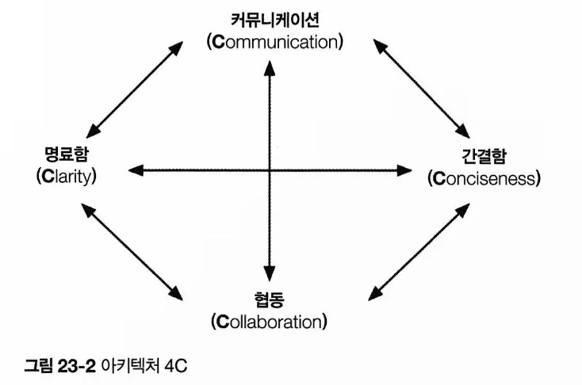

# CHAPTER 23 협상과 리더십 스킬
> 협상과 리더십은 습득하기 어려운 스킬. 협성, 리더십 스킬을 얻기 위한 출발점을 제시한다.
## 23.1 협상과 조정
이 능력이 중요한 이유?

소프트웨어 아키텍트가 내리는 거의 모든 결정이 곳곳에서 거친 도전과 반대에 부딪히기 때문. 

협상은 소프트웨어 아키텍트가 지녀야할 가장 중요한 스킬 중 하나임.

유능한 소프트웨어 아키텍트는 사내 정치를 이해하고 강력한 협상 및 조정 능력을 발휘하며, 모든 이해관계자들이 동의하는 해법을 찾는 과정에서 맞닥뜨리는 숱한 의견 차이를 극복할 것임. 

### 23.1.1 비즈니스 이해관계자들과의 협상

이해관계자들과 협상하는 과정에서 아키텍트가 참고해두면 좋은 몇 가지 중요한 협상 기술

**TIP1**. 상황을 더 잘 이해하기 위해 문법과 유행어를 사용하세요. 

**TIP2**. 협상에 돌입하기 전, 가능한 한 많은 정보를 수집하세요. 

파이브나인스 예제

**TIP3**. 다른 모든 것이 실패하면 비용과 시간으로 설명하세요. 

최후의 협상 카드

**TIP4**. ‘분할 및 정복’ 규칙을 활용해서 요구사항 또는 필우 조건을 검증하세요. 

### 23.1.2 다른 아키텍트들과의 협상

**TIP1**. 증명은 언제나 논쟁을 이긴다는 사실을 명심하세요.

**TIP2**. 지나치게 논쟁을 벌이려고 하거나 협상 과정에서 개인적인 감정을 드러내지 마세요. 간결 명료한 추론에 차분한 리더십을 더하면 반드시 협상에서 승리할 것입니다.

### 23.1.3 개발자들과의 협상

유능한 소프트웨어 아키텍트는 아키텍트라는 직책을 내세워 개발자에게 할 일을 지시하기보다 외려 그들과 협력하여 존경심을 이끌어냄. 그래야 개발팀에 어떤 요청을 하더라도 논쟁을 하면서 얼굴 붉힐 일이 없음. 

개발팀과 협력할 때 그들 대부분은 아키텍처와 단절된 느낌을 받기 때문에 아키텍트가 내리는 결정에 소외감을 가짐. → 상아탑 아키텍처 안티패턴의 전형적인 사례임. 

상아탐 아키텍트는 높은 곳에서 지시만 내릴 뿐 개발자의 의견이나 우려에도 아랑곳하지 않고 그들이 해야 할 일들을 통보함. 

→ 이런 상황을 해결하는 한 가지 좋은 협상 기술: **언제나 정당성을 제공하는 것**

**TIP1**. 개발자가 아키텍처 결정을 수용해서 어떤 작업을 하도록 설득할 때에는 ‘고압적으로 지시’하지 말고 왜 그 일을 해야 하는지 정당성을 제공하세요.

no “~해야 합니다”, “~하지 않으면 안 됩니다”

개발자와 협상을 하면서 그들이 동의하지 않는 설계나 아키텍처 결정을 받아들이게 만드는 또 다른 효과적인 협상 기술: 개발자 **스스로 해결책을 찾도록 유도하는 것.** 

**TIP2**. 개발자가 아키텍트의 결정에 동의하지 않을 경우 그들 스스로 해결책을 찾도록 유도하세요.

아키텍트가 개발팀의 존경을 받고 더 나은 솔루션을 얻어내는 것이야말로 진정한 협업임.

## 23.2 소프트웨어 아키텍트는 리더다
소프트웨어 아키텍트는 개발팀을 이끌고 아키텍처를 구현하는 리더임. 

유능한 소프트웨어 아키텍트가 되는 50% 정도는 효과적인 대인 관계 스킬, 조정 능력, 리더십에 있음. 

### 23.2.1 아키텍처 4C

- 근원적 복잡성 (우리에겐 어려운 문제가 있다)
- 우발적 복잡성(우리가 문제를 어렵게 만들었다)
    - 만들어내는건 아키텍트로서 무능한 리더임을 입증하는 것
    - 방지하는 가장 좋은 방법: 아키텍처 4C

### 23.2.2 실용적으로 행동하되 비전을 가져라

이는 말보다 실천이 쉽지 않아 매우 높은 수준의 성숙도와 꾸준한 연습을 필요로 함. 

> **비전을 가진다**
상상력이나 지혜를 발휘하여 미래를 떠올리거나 계획한다.
> 

즉, 어떤 문제를 전략적 사고 방식으로 접근한다는 뜻. → 아키텍트가 마땅히 해야할 일

아키텍처는 미래를 계획하고 아키텍처의 활력을 오랫동안 유지하는 것. 

but, 아키텍트가 너무 이론적으로만 계획/설계한 탓에 이해하기도 어렵고 구현하기는 더더욱 어려운 솔루션이 되는 경우가 비일비재함

> **실용적이다**
이론적으로만 생각하지 않고 실제에 근거한 방식으로 분별 있게, 현실적으로 일처리한다.
> 

비전을 가져야하지만, 현실적인 솔루션을 적용해야 함. 

다음과 같은 요소와 제약조건을 모두 고려한다는 뜻

- 예산 제약 등의 비용 요소
- 시간 제약 등의 시간 요소
- 개발팀의 스킬 세트 및 수준
- 아키텍처 결정에 관한 트레이드오프와 의미
- 제안된 아키텍처 설계 또는 솔루션의 기술적인 한계

유능한 소프트웨어 아키텍트는 문제 해결 과정에서 끊임없이 상상력과 지혜를 발휘하면서도 실용적인 부분과의 적절한 균형점을 찾으려 노력함. 

### 23.2.3 모범을 보여 팀을 리드하라

존경심을 자아내고 팀을 이끌어 가는 것이 인간 관계 기술임. 

no “당신이 해야 할 일은~”, “당신은 ~을 해야 합니다” → 자기 의견을 개발자에게 강요하는 것. 협업 자체를 중단시켜버림

→ “~를 고려해보신 적 있나요?”, “~는 어떨까요?”

함께 솔루션을 만들어가는 협업 대화. 

아키텍트와 개발팀의 상호 존중 및 건전한 관계를 형성하는 또 다른 기본 기술

: 대화, 협상 중에 항상 그 사람의 이름을 부르는 것. 
사람들은 대화 중에 자신의 이름을 듣는 걸 좋아하고 그렇게 자기 이름을 불러준 사람에게 더 친밀감을 느낌. 

처음 만난 사람이나 가끔 보는 사람을 만나면 항상 악수를 하고 눈을 맞춰라. 중요한 대인 관계 기술임. 

소프트웨어 아키텍트는 리더, 조정자, 협상가로서 각계각층 사람들 간에 존재하는 경계를 지키는 일에도 신경 써야함. 무조건 포옹은 좋지 않음. 악수만 하세요. 

다른사람이 원하지 않을 만한 일을 하게 만들려면 요청을 부탁으로 바꾸는 것이 최선임. 

비기술적인 상황에서도 난관에 빠진 모습을 보면 적극적으로 개입해서 도움을 주거나 지침을 제공할 수 있음. 

리더로서 존경심을 얻고 팀을 이끄는 주동자가 되는 또 다른 기술은 정기적인 ‘**브라운 백 미팅**’임. 특정한 기술 또는 테크닉에 대해 함께 논의하는 시간을 갖는 것.

## 23.3 개발팀과의 융합
아키텍트의 캘린더는 대부분 갖가지 회의들로 가득함. 

언제 개발팀과 만나 협의하고, 안내하고 멘토링하고, 갖가지 질문이나 이슈에 답변을 할까? 

- 유능한 소프트웨어 아키텍트로서 성공하는 핵심 포인트 중 하나는 개발팀에 더 많은 시간을 할애하라는 것. 회의를 제어해야함.

아키텍트가 참여하는 회의는 요청받은 회의/요청하는 회의 두가지로 나뉨

- 유능한 소프트웨어 아키텍트는 회의에 초대를 받으면 언제나 회의 주최자에게 회의가 필요한 이유를 묻음. → 꼭 참석해야 할 회의와 그냥 넘어가도 될 회의를 구별할 수 있음
- 회의 참여를 결정하기 전에 의제를 알려달라고 요청하는 것. 의제를 보고 참석 여부를 판단할 수 있음.

가능한 한 회의 때문에 시간을 낭비하지 말고 개발팀과 함께 작업하는 시간을 더 많이 가지세요. 

**TIP**. 회의 전에 미리 의제를 요청해서 아키텍트가 그 회의에 정말 참석해야 하는지 여부를 판단하세요. 

- 개발팀과 순조롭게 작업하면서 그들의 존경을 얻는 또 다른 효과적인 기술은, 개발자가 배석한 회의에서 개발팀의 입장을 적극 대변하는 것임.
    
    기술 리드와 아키텍트 모두 회의 참석을 요청 받는 경우, 기술 리드는 회의에 참석시키지 말고 그 자리를 대신해라. 
    

- 아키텍트가 회의 참석을 요청할 때도 있지만 이런 회의는 가급적 줄이는 게 좋음. 회의를 소집할 때는 항상 의제를 정하고 거기에 집중해라. 

또 개발자의 흐름을 잘 살펴서 회의 때문에 공연히 방해가 되지 않게 주의해라. 

(흐름: 개발자가 자신의 뇌를 100% 가동시킨 곳. 개발에 풀로 집중하는 시간 피해라)

- 개발팀과 나란히 앉기.
    
    아키텍트가 팀에서 꼭 필요한 사람으로서 개발자의 문의 사항이나 이슈가 발생하면 언제든지 자신을 활용하라는 암시를 주는것. 
    
    어쩔 수 없이 다른 공간에 있어야하는 경우에는 계속 걸어 다니면서 개발자의 눈에 자주 띄도록 노력하는게 좋음.

## 23.4 마치며
협상 및 리더십 팁은 소프트웨어 아키텍트가 개발팀과 그 밖의 이해관계자들과 더 나은 협력 관계를 구축하는 데 큰 도움이 될것.

유능한 소프트에어 아키텍트가 되려면 반드시 갖추어야 할 필수 기술이자, 효과적인 리더가 되는 첫 여정을 시작하기에 좋은 팀임.